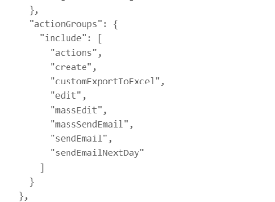
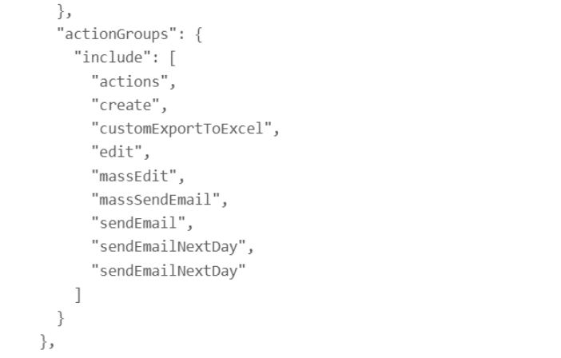

# 2.0.18

* [cxbox/demo 2.0.18 git](https://github.com/CX-Box/cxbox-demo/tree/v.2.0.18), [release notes](https://github.com/CX-Box/cxbox-demo/releases/tag/v.2.0.18)

* [cxbox/core 4.0.0-M23 git](https://github.com/CX-Box/cxbox/tree/cxbox-4.0.0-M23), [release notes](https://github.com/CX-Box/cxbox/releases/tag/cxbox-4.0.0-M23), [maven](https://central.sonatype.com/artifact/org.cxbox/cxbox-starter-parent/4.0.0-M23)

* [cxbox-ui/core 2.8.0 git](https://github.com/CX-Box/cxbox-ui/tree/2.8.0), [release notes](https://github.com/CX-Box/cxbox-ui/releases/tag/2.8.0), [npm](https://www.npmjs.com/package/@cxbox-ui/core/v/2.8.0)

* [cxbox/code-samples 2.0.18 git](https://github.com/CX-Box/cxbox-code-samples/tree/v.2.0.18), [release notes](https://github.com/CX-Box/cxbox-code-samples/releases/tag/v.2.0.18)  

## **Key updates  2026**

### CXBOX ([Demo](http://demo.cxbox.org))  

#### Fixed: Duplicate Actions in Debug Panel
<!-- CXBOX-1256 -->  
This issue occurred when the same action (button) was assigned to multiple roles that belong to a single user. 

When the `widgetActionGroupsEnabled` = false and responsibilities are loaded from the standardized `RESPONSIBILITIES_ACTION.csv` file via Liquibase,
duplicate action buttons could appear in the Debug panel.

=== "After"
    
=== "Before" 
    

#### Other Changes
see [cxbox-demo changelog](https://github.com/CX-Box/cxbox-demo/releases/tag/v.2.0.18)

### CXBOX ([Core Ui](https://github.com/CX-Box/cxbox-ui/releases/tag/2.8.0))  
We have released a new 2.8.0 CORE UI version.  
 

#### Other Changes
See [cxbox-ui 2.8.0 changelog](https://github.com/CX-Box/cxbox-ui/releases/tag/2.8.0).

### CXBOX 4.0.0-M23 ([Core](https://github.com/CX-Box/cxbox/tree/cxbox-4.0.0-M23))

We have released a new 4.0.0-M23 CORE version.
#### Added:  
#### Other Changes
See [cxbox 4.0.0-M23 changelog](https://github.com/CX-Box/cxbox/releases/tag/cxbox-4.0.0-M23).

### CXBOX [documentation](https://doc.cxbox.org/)
#### Added:  
<!-- CXBOX-1212 -->    