# 2.0.18

* [cxbox/demo 2.0.18 git](https://github.com/CX-Box/cxbox-demo/tree/v.2.0.18), [release notes](https://github.com/CX-Box/cxbox-demo/releases/tag/v.2.0.18)

* [cxbox/core 4.0.0-M24 git](https://github.com/CX-Box/cxbox/tree/cxbox-4.0.0-M24), [release notes](https://github.com/CX-Box/cxbox/releases/tag/cxbox-4.0.0-M24), [maven](https://central.sonatype.com/artifact/org.cxbox/cxbox-starter-parent/4.0.0-M24)

* [cxbox-ui/core 2.8.1 git](https://github.com/CX-Box/cxbox-ui/tree/2.8.1), [release notes](https://github.com/CX-Box/cxbox-ui/releases/tag/2.8.1), [npm](https://www.npmjs.com/package/@cxbox-ui/core/v/2.8.1)

* [cxbox/code-samples 2.0.18 git](https://github.com/CX-Box/cxbox-code-samples/tree/v.2.0.18), [release notes](https://github.com/CX-Box/cxbox-code-samples/releases/tag/v.2.0.18)  

## **Key updates March-May 2026**

### CXBOX ([Demo](https://demo.cxbox.org)) 

#### Added: richText - NEW field type!  
<!-- CXBOX-1286 -->  
We have introduced a new richText field type with support for advanced text formatting. The field supports headings, font color, font styles (bold, italic, underline, strikethrough), and more.  
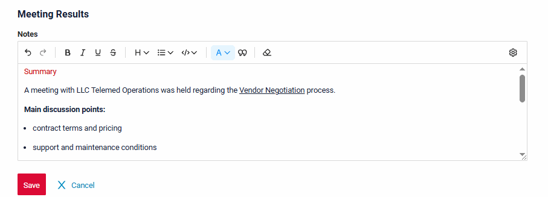  

The richText field also supports switching between WYSIWYG <-> Markdown modes.  
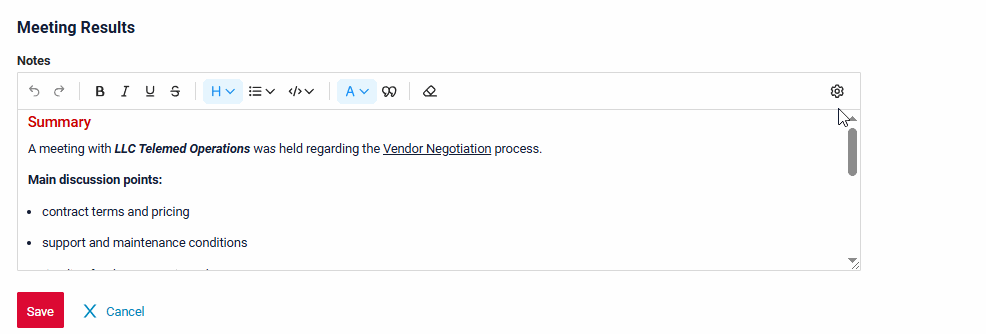

For technical details and limitations, see the [Core](/new/version2018/#added-richtext-new-field-type_1) section below.  

!!! info
    A detailed article on richText will be available soon in our official documentation – stay tuned!  

#### Added: single-click signing and encryption with CryptoPro (QES)    
<!-- CXBOX-970 -->  
Users can now sign and encrypt documents in CXBox in a single click using locally installed CryptoPro. This removes the need to manually download files, sign them in CryptoPro, upload signatures back to CXBox, and click Save.  

The examples below compare the signing process with and without CryptoPro integration enabled:  
=== "With integration (1 click)"  
    === "Signature"  
        <video controls width="800">
        <source src="/new/v2.0.18/WithSign.mp4" type="video/mp4">
        </video>  
    === "Signature verification"  
        <video controls width="800">
        <source src="/new/v2.0.18/WithSignVerification.mp4" type="video/mp4">
        </video>
=== "Without integration (multiple manual steps)"  
    === "Signature"  
        <video controls width="800">
        <source src="/new/v2.0.18/WithoutSign.mp4" type="video/mp4">
        </video>
    === "Signature verification"  
        <video controls width="800">
        <source src="/new/v2.0.18/WithoutSignVerification.mp4" type="video/mp4">
        </video>

!!! info  
    The signing process uses the same locally installed CryptoPro software in both cases. The integration only automates CryptoPro invocation via the browser plugin, so both CryptoPro software and the browser plugin must be installed locally. For more information, see [Signing and encrypting](/features/sign/sign).  

#### Added: localization support
<!-- CXBOX-1248 --> 
We have added localization support for UI elements, dictionaries, and enums.

The system supports localization for:

* Static Text
* Data Localization

For more information see [Localization](/features/locale/locale)

=== "French"
    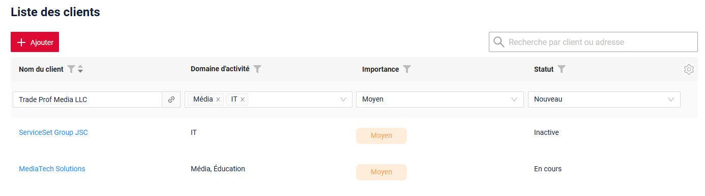
=== "English"
    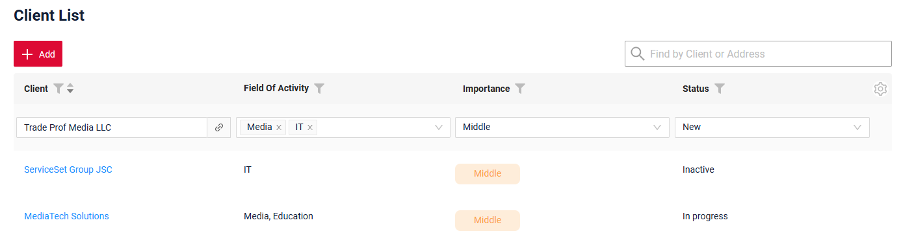  

#### Added: RelationGraph widget - display support for cyclic data
<!-- CXBOX-1249 -->  
We have added support for displaying cyclic relations in the RelationGraph widget, including both directional and non-directional cycles.  

* **Directional cycles** - arrows form a loop and return to the staring node.  

* **Non-directional cycles** - connections exist between nodes, but arrows do not form a loop.  

=== "Directional Cycle"
    === "After"  
        Now, the widget supports cyclic relations in the data and does not switch to table mode.
        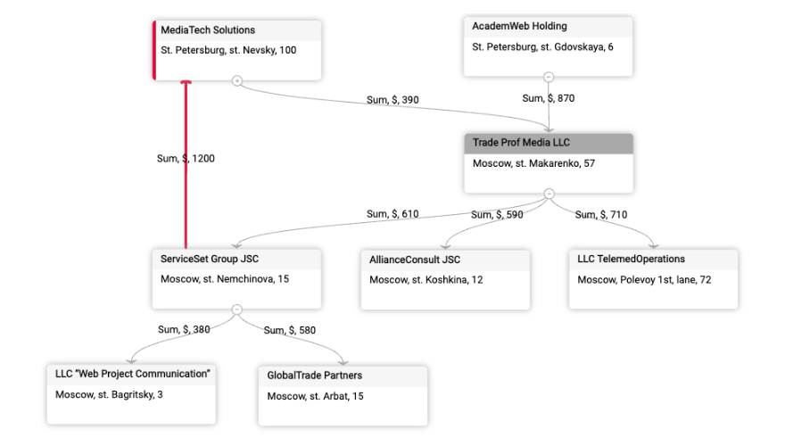
    === "Before"  
        The widget did not support cyclic relations in the data and used to switch to table mode.  
        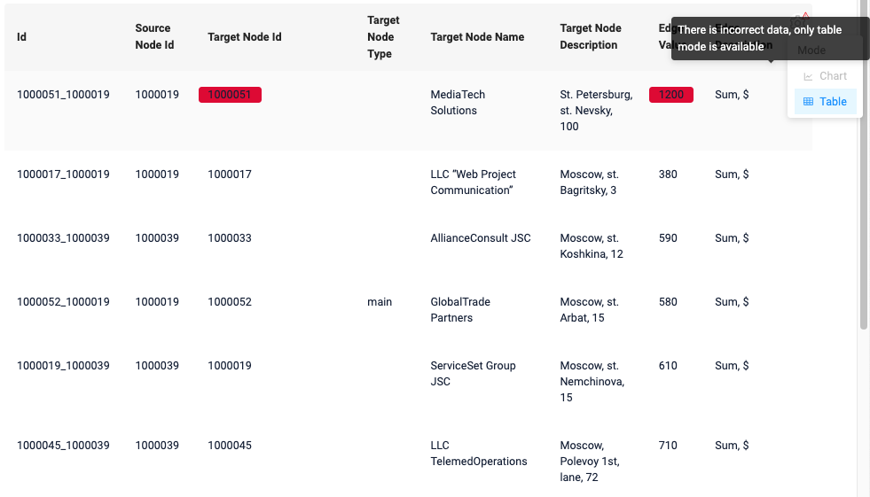  
=== "Non-directional Cycle"
    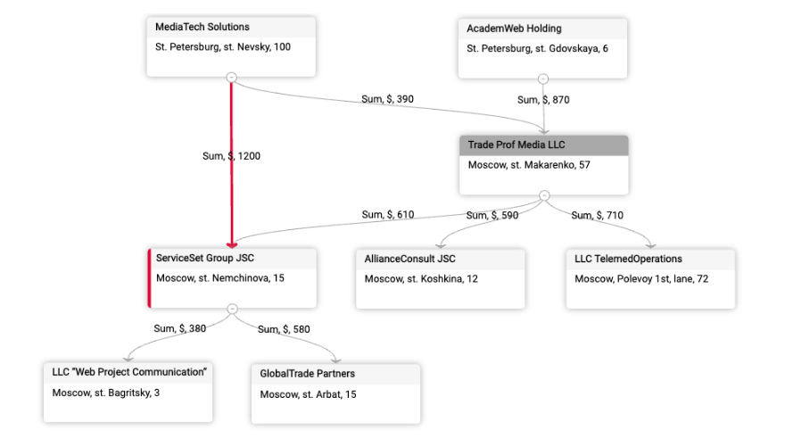  

!!! info
    As mentioned in the previous release, cyclic data structures are still not recommended because the graph may not display as expected in some cases.  

#### Added: browser navigation warnings  
<!-- CXBOX-1164 -->
We have added support for warning messages when navigating with browser Back/Forward buttons to help prevent accidental data loss while working with the application.  
When using these buttons, the browser may restore an outdated page state, which can lead to loss of unsaved changes. For more information, see [Browser navigation buttons](https://doc.cxbox.org/navigation/browsernavigationbuttons/browsernavigationbuttons/).  

Now, if a user has interacted with the application, the system can display a warning before leaving the page. The warning text can also be customized.  

This behavior is controlled by the global setting. By default, the setting is set to false.  

For technical configuration details, see the [Core](/new/version2018/#added-browser-navigation-warnings_1) section below.  
=== "false (default)"  
    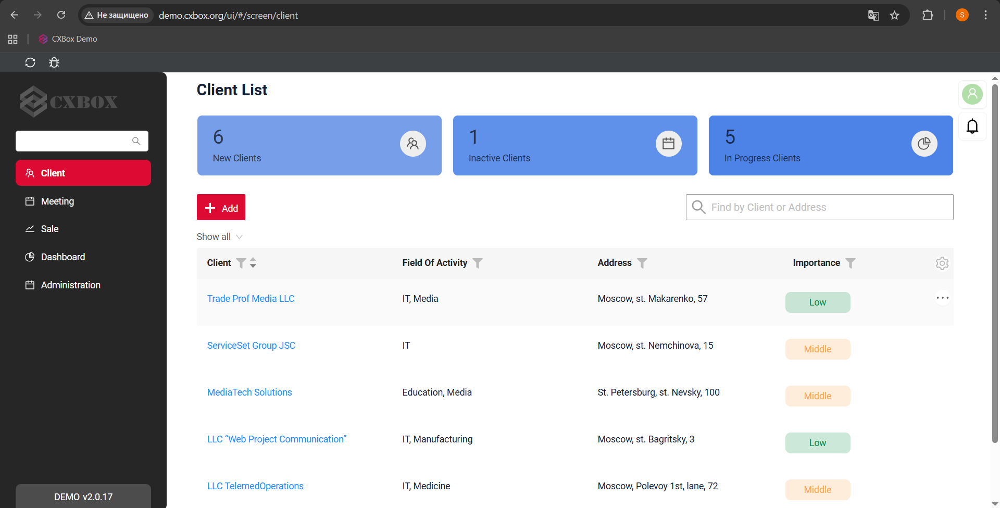
=== "true"
    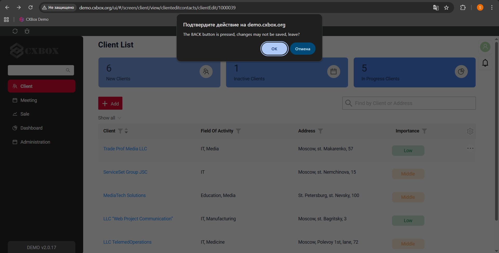  

!!! info 
    1. The warning is not shown when navigating back to the browser starting page. 
    2. Warnings are not displayed for the browser Refresh button. Refreshing the page while working with the application is not recommended.  

#### Fixed: user label - improved text wrapping  
<!-- CXBOX-1276 -->
We have improved the display of user names by adding word wrapping for long values. If the name does not fit within the label, it now wraps correctly and is fully visible.  
=== "After" 
    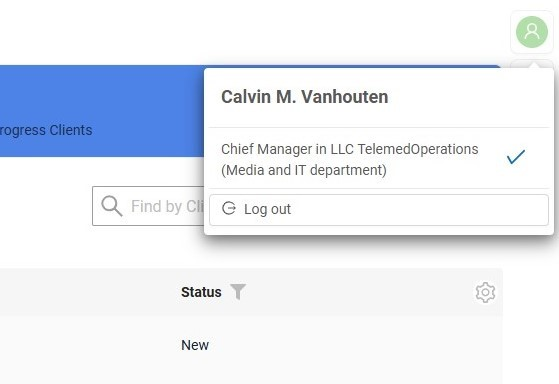
=== "Before"  
    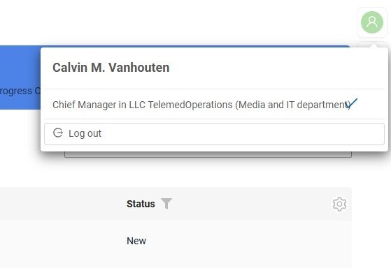  

#### Fixed: fileUpload field -  improved file preview display for Info widget  
<!-- CXBOX-1288 -->
We have updated [fileUpload](https://doc.cxbox.org/widget/fields/field/fileUpload/fileUpload/) preview logic for [Info](https://doc.cxbox.org/widget/type/info/info/) widget. Files are now correctly opened in preview mode directly from the widget.  

=== "After"  
    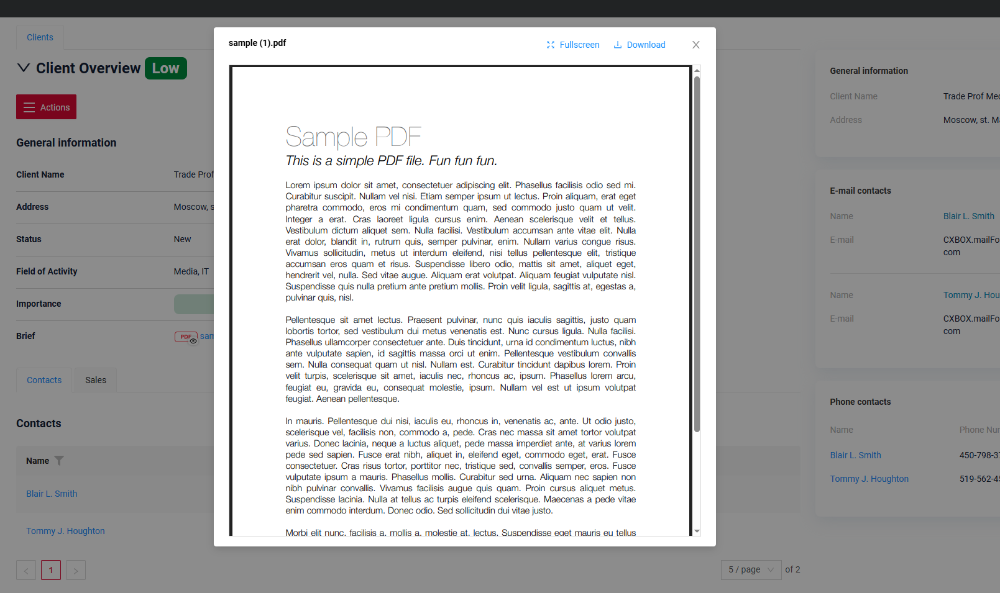
=== "Before"  
    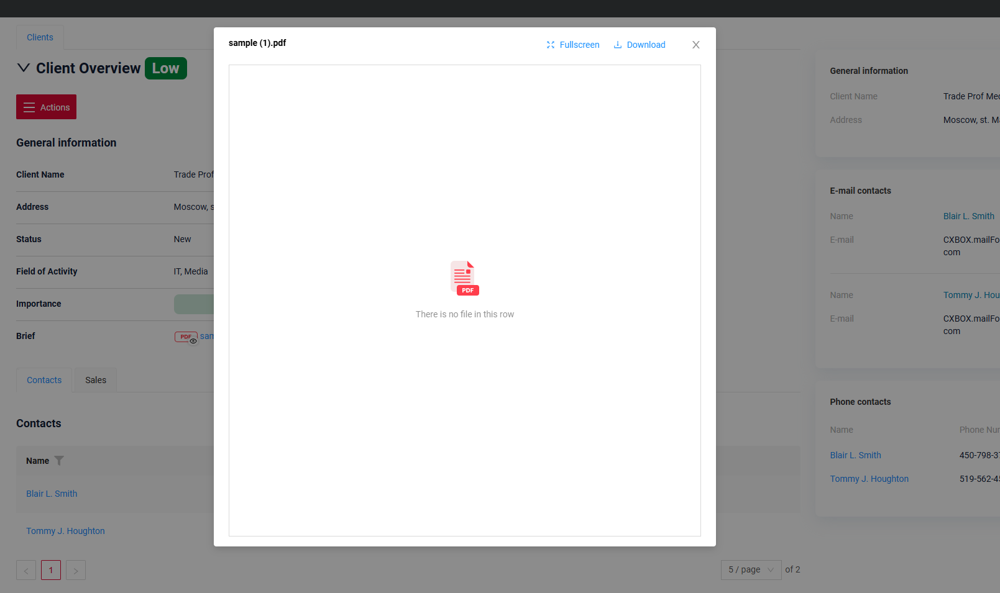  

#### Other Changes
see [cxbox-demo changelog](https://github.com/CX-Box/cxbox-demo/releases/tag/v.2.0.18)

### CXBOX ([Core Ui](https://github.com/CX-Box/cxbox-ui/releases/tag/2.8.1))  
We have released a new 2.8.1 CORE UI version.  

#### Added: keycloak-js replaced with oidc-client-ts
<!-- CXBOX-1223 --> 
The keycloak-js library has been replaced with oidc-client-ts to provide support for various OpenID Connect (OIDC) implementations.
Unlike keycloak-js, which is focused solely on Keycloak, oidc-client-ts offers a universal integration approach for OIDC-compatible providers, including Keycloak.

#### Added: null handling for multivalue forceActive fields 
<!-- CXBOX-1261 --> 
Added null handling for multivalue fields when the value of the `forceActive` field changes(/row-meta,/data).

Previously, the frontend correctly handled multivalue fields only when the backend returned an array in the response. Now, for AnySource entities, you can also return `null`.

=== "null"
    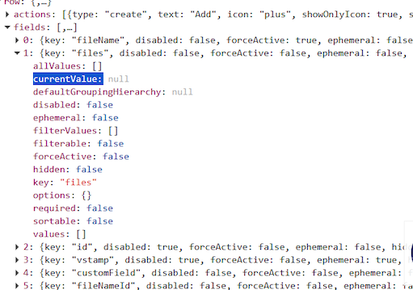
=== "[]"
    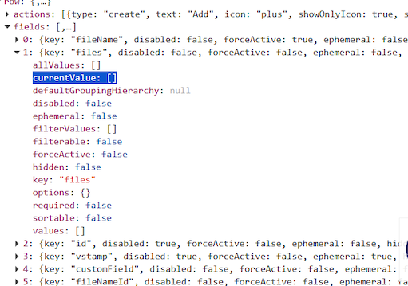

#### Other Changes
See [cxbox-ui 2.8.1 changelog](https://github.com/CX-Box/cxbox-ui/releases/tag/2.8.1).

### CXBOX 4.0.0-M24 ([Core](https://github.com/CX-Box/cxbox/tree/cxbox-4.0.0-M24))
We have released a new 4.0.0-M24 CORE version.  
#### Added: richText - NEW field type!  
<!-- CXBOX-1286 -->
We have added support for the new richText field type. The field supports formatted content in both WYSIWYG and Markdown modes. 
!!! warning  
    The maximum supported content size for richText field is **8,000 characters**.  

For feature overview and usage examples, see the [Demo](/new/version2018/#added-richtext-new-field-type) section above.  

#### Added: browser navigation warnings  
We have added a new global setting `browserNavigationWarnEnabled` to control browser navigation warnings.  
1) true - browser Back/Forward navigation is intercepted and a warning message is shown  
2) false (default) - browser navigation works as usual  

The warning text is configurable on the frontend.  
For feature overview, see the [Demo](/new/version2018/#added-browser-navigation-warnings) section above.  

#### Fixed: restored Oracle support
<!-- CXBOX-730 --> 
Oracle support has been restored.  

We renamed the fields to support Oracle:

* ADDITIONAL_FIELDS.VIEW → ADDITIONAL_FIELDS.VIEW_NAME
* USER_ROLE.MAIN → USER_ROLE.MAIN_FLG
* RESPONSIBILITIES_ACTION.VIEW → USER_ROLE.VIEW_NAME 

#### Fixed: duplicate actions in Debug Panel
<!-- CXBOX-1256 -->
In the debug panel, duplicate action buttons were displayed when `widgetActionGroupsEnabled` was set to `false` and responsibilities were loaded from the standardized `RESPONSIBILITIES_ACTION.csv` file via Liquibase. This issue occurred when the same action (button) was assigned to multiple roles belonging to a single user.

=== "After"
    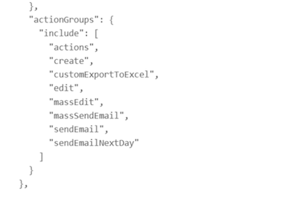
=== "Before"
    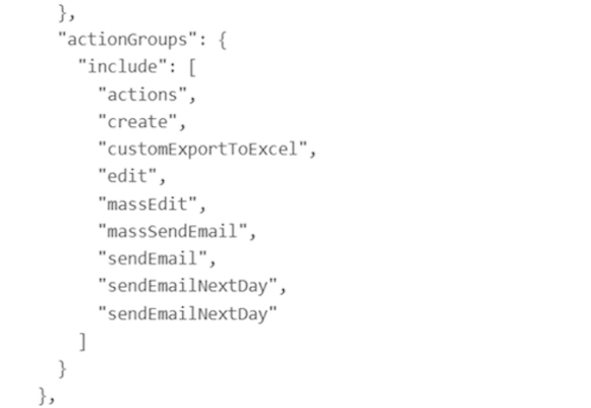

#### Fixed: API response for parent BC with hidden fields  
<!-- CXBOX-1242 --> 
We have improved API response handling for parent BC without visible fields.  

Previously, if no fields from the parent BC were added to widgets on the screen, the required data was not included in the API response. Now, the system correctly returns the data even when the parent BC has no visible fields.  

We added `includeIdWhenNoFieldsInWidgetsOnBc`(true by default).  

=== "After"
    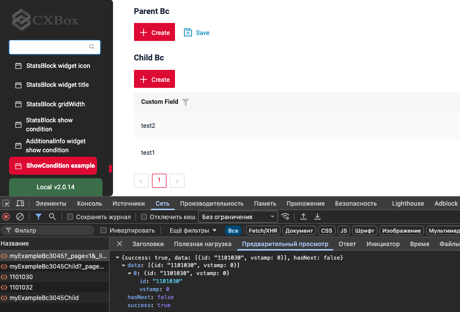
=== "Before"
    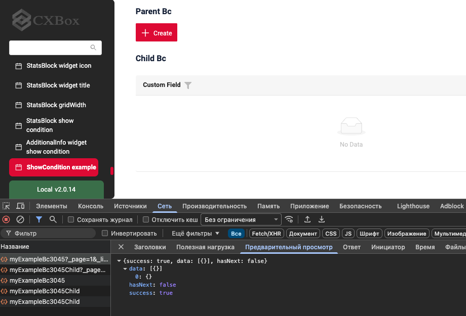

#### Fixed: uniqueness check when saving a filter name  
<!-- CXBOX-1268 --> 
We have improved validation for user filter names to prevent duplicate names when saving filters.  

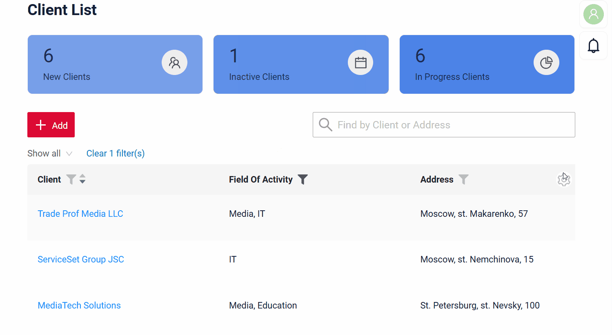  

#### Other Changes
See [cxbox 4.0.0-M24 changelog](https://github.com/CX-Box/cxbox/releases/tag/cxbox-4.0.0-M24).

### CXBOX [documentation](https://doc.cxbox.org/)  

#### Added: Localization description  
<!-- CXBOX-1248 -->  
We have provided a description on [localization](https://doc.cxbox.org/features/locale/locale/).  

#### Added: Signing and encrypting  
<!-- CXBOX-1294 -->  
We have provided a guide on how to set up support for signing and encrypting documents with CryptoPro software. See [Signing and encrypting](https://doc.cxbox.org/features/sign/sign/). 