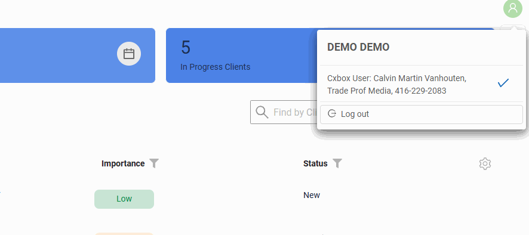
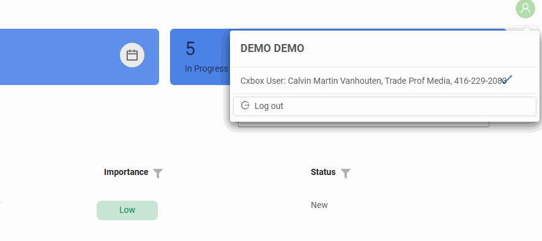
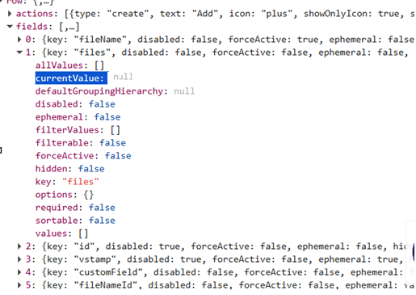
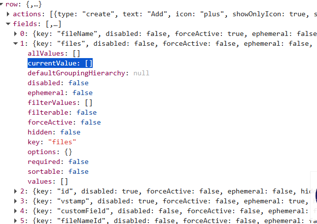
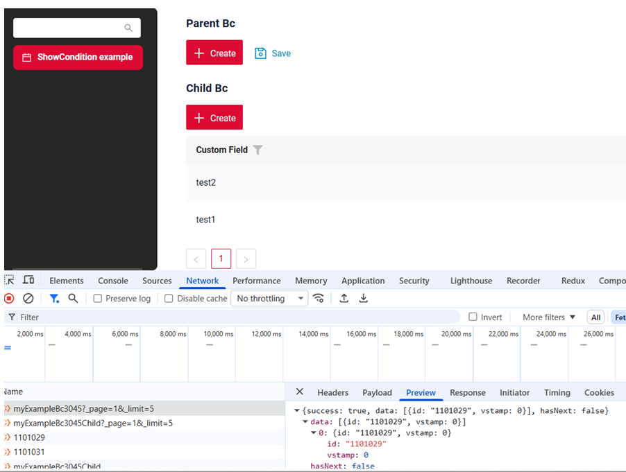
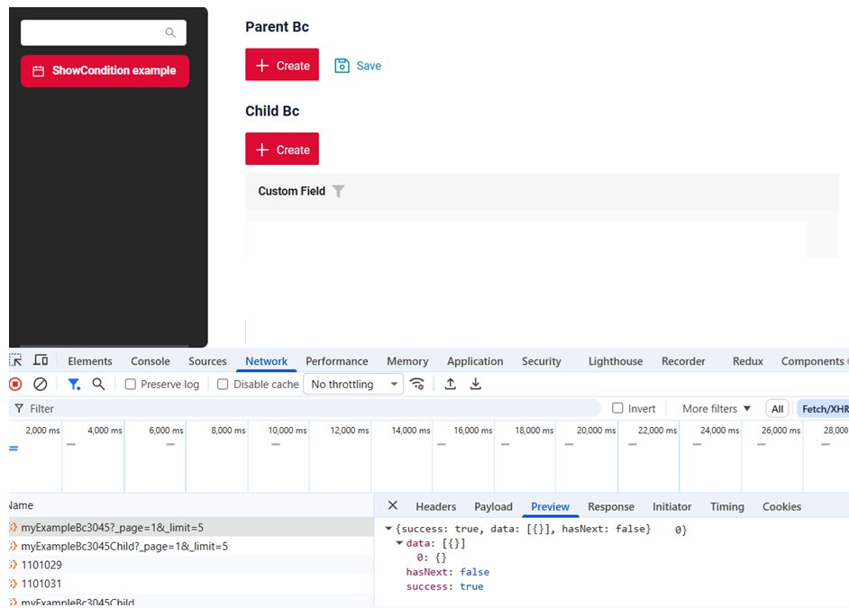
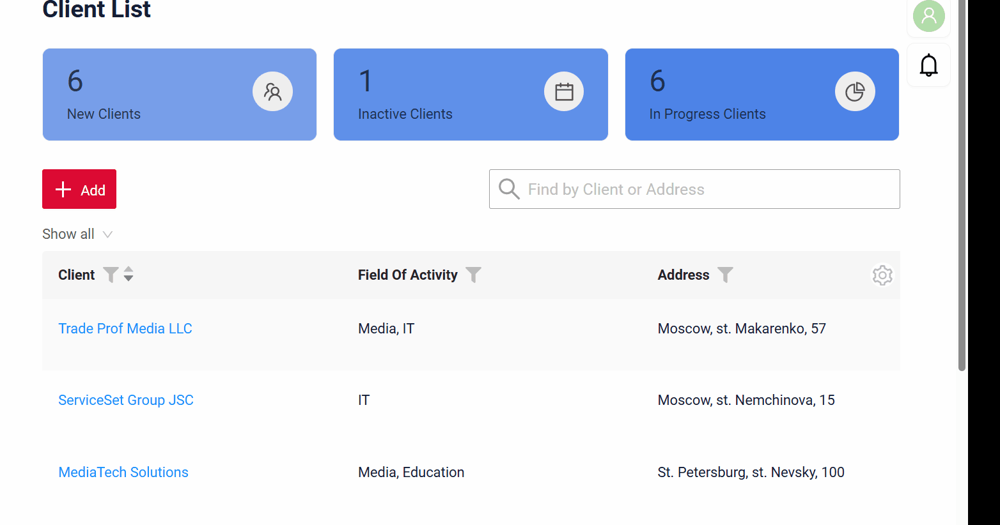

# 2.0.18

* [cxbox/demo 2.0.18 git](https://github.com/CX-Box/cxbox-demo/tree/v.2.0.18), [release notes](https://github.com/CX-Box/cxbox-demo/releases/tag/v.2.0.18)

* [cxbox/core 4.0.0-M23 git](https://github.com/CX-Box/cxbox/tree/cxbox-4.0.0-M23), [release notes](https://github.com/CX-Box/cxbox/releases/tag/cxbox-4.0.0-M23), [maven](https://central.sonatype.com/artifact/org.cxbox/cxbox-starter-parent/4.0.0-M23)

* [cxbox-ui/core 2.8.0 git](https://github.com/CX-Box/cxbox-ui/tree/2.8.0), [release notes](https://github.com/CX-Box/cxbox-ui/releases/tag/2.8.0), [npm](https://www.npmjs.com/package/@cxbox-ui/core/v/2.8.0)

* [cxbox/code-samples 2.0.18 git](https://github.com/CX-Box/cxbox-code-samples/tree/v.2.0.18), [release notes](https://github.com/CX-Box/cxbox-code-samples/releases/tag/v.2.0.18)  

## **Key updates March-May 2026**

### CXBOX ([Demo](http://demo.cxbox.org))  

#### Added: richText - NEW field type!  
<!-- CXBOX-1286 -->  
We have introduced a new richText field type with support for advanced text formatting. The field supports headings, font color, font styles (bold, italic, underline, strikethrough), and more.  

The richText field also supports switching between WYSIWYG <-> Markdown modes.  

For technical details and limitations, see the [Core](https://doc.cxbox.org/new/version2018/#added-richtext-new-field-type_1) section below.  

!!! info
    A detailed article on richText will be available soon in our official documentation – stay tuned!  

#### Added: Added localization
<!-- CXBOX-1248 --> 
Added localization works in the system and how to add translations for UI elements, dictionaries, and enums.

The system supports localization for:

* Static Text
* Data Localization

[see more](/features/locale/locale)

=== "French"
    
=== "English"
      

#### Added: RelationGraph widget - improved display for cyclic data
<!-- CXBOX-1249 -->  
We have enhanced the RelationGraph widget to better support complex relation structures, including cyclic connections between nodes. Scenarios that were previously limited or not recommended are now correctly supported in graph view.  

**Non-directional cycles case**:  
Full display support for non-directional cycles (nodes are connected with each other, but arrows do not form a closed loop).  
=== "After"  
    
=== "Before"

**Directional cycles case**:  
Full support for directional cycles (arrows form a closed loop and return to the starting node). Now, the widget supports cyclic relations in the data and does not switch to table mode.  
=== "After"
    
=== "Before"
     

#### Added: browser navigation warnings  
We have added support for warning messages when navigating with browser Back/Forward buttons. If a user has unsaved changes or interacted with the application, the system can display a warning before leaving the page. The warning text can also be customized.  

This behavior is controlled by the global setting. By default, the setting is set to false.  

For technical configuration details, see the [Core](https://doc.cxbox.org/new/version2018/#added-browser-navigation-warnings_1) section below.  
=== "false (default)"  
    
=== "true"
      

!!! info 
    1. The warning is not shown when navigating back to the browser starting page. 
    2. Warnings are not displayed on page refresh due to [CXBox behavior](https://doc.cxbox.org/navigation/browsernavigationbuttons/browsernavigationbuttons/?h=browser+navigation+buttons). 

#### Fixed: user label - improved text wrapping  
We have improved the display of user names by adding word wrapping for long values. If the name does not fit within the label, it now wraps correctly and is fully visible.  
=== "After" 
    
=== "Before"  
      

#### Fixed: fileUpload field -  improved file preview display for Info widget  
We have updated [fileUpload](https://doc.cxbox.org/widget/fields/field/fileUpload/fileUpload/) preview logic for [Info](https://doc.cxbox.org/widget/type/info/info/) widget. Files are now correctly opened in preview mode directly from the widget.  

=== "After"  
    
=== "Before"  
      

#### Other Changes
see [cxbox-demo changelog](https://github.com/CX-Box/cxbox-demo/releases/tag/v.2.0.18)

### CXBOX ([Core Ui](https://github.com/CX-Box/cxbox-ui/releases/tag/2.8.0))  
We have released a new 2.8.0 CORE UI version.  

#### Added: keycloak-js has been replaced with oidc-client-ts
<!-- CXBOX-1223 --> 
The keycloak-js library has been replaced with oidc-client-ts to provide support for various OpenID Connect (OIDC) implementations.
Unlike keycloak-js, which is focused solely on Keycloak, oidc-client-ts offers a universal integration approach for OIDC-compatible providers, including Keycloak.

#### Fixed: Added null handling for multivalue forceActive fields 
<!-- CXBOX-1261 --> 
Added null handling for multivalue fields when the value of the `forceActive` field changes(/row-meta,/data).

Previously, the frontend correctly handled multivalue fields only when the backend returned an array in the response. Now, for AnySource entities, you can also return `null`.

=== "null"
    
=== "[]"
    

#### Other Changes
See [cxbox-ui 2.8.0 changelog](https://github.com/CX-Box/cxbox-ui/releases/tag/2.8.0).

### CXBOX 4.0.0-M23 ([Core](https://github.com/CX-Box/cxbox/tree/cxbox-4.0.0-M23))
We have released a new 4.0.0-M23 CORE version.  
#### Added: richText - NEW field type!  
<!-- CXBOX-1286 -->
We have added support for the new richText field type. The field supports formatted content in both WYSIWYG and Markdown modes. 
!!! warning  
    The maximum supported content size for richText field is **8,000 characters**.  

For feature overview and usage examples, see the [Demo](https://doc.cxbox.org/new/version2018/#added-richtext-new-field-type) section above.  

#### Added: browser navigation warnings  
We have added a new global setting `browserNavigationWarnEnabled` to control browser navigation warnings.  
1) true - browser Back/Forward navigation is intercepted and a warning message is shown  
2) false (default) - browser navigation works as usual  

The warning text is configurable on the frontend.  
For feature overview, see the [Demo](https://doc.cxbox.org/new/version2018/#added-browser-navigation-warnings) section above.  

#### Fixed: We have restored Oracle support
<!-- CXBOX-730 --> 
Oracle support has been restored.  

#### Fixed: Duplicate Actions in Debug Panel
<!-- CXBOX-1256 -->  
This issue occurred when the same action (button) was assigned to multiple roles that belong to a single user.

When the `widgetActionGroupsEnabled` = false and responsibilities are loaded from the standardized `RESPONSIBILITIES_ACTION.csv` file via Liquibase,
duplicate action buttons could appear in the Debug panel.

=== "After"
    
=== "Before"
    

#### Fixed: Added to the API response  when no fields of BC
<!-- CXBOX-1242 --> 
Fixed when the BC has no visible fields but acts as a parent BC.

We added includeIdWhenNoFieldsInWidgetsOnBc(default true).

Determines whether the  id field should be 
automatically added to the API response  when no fields of the Business Component (BC) are 
added to widgets on the screen  during the initial load. 

=== "After"
    
=== "Before"
    

#### Fixed: Uniqueness check when saving a filter name  
<!-- CXBOX-1268 --> 
We have improved validation for user filter names to prevent duplicate names when saving filters.  

  

#### Other Changes
See [cxbox 4.0.0-M23 changelog](https://github.com/CX-Box/cxbox/releases/tag/cxbox-4.0.0-M23).

### CXBOX [documentation](https://doc.cxbox.org/)  

#### Added: Localization description  
<!-- CXBOX-1248 -->  
We have provided a description on [localization](https://doc.cxbox.org/features/locale/locale/).  

#### Added: New Year theme 
<!-- CXBOX-1212 -->  
We have added a guide on how to add a snowy effect on the side menu in the application. See [New Year theme](https://doc.cxbox.org/features/happynewyear/happynewyear/).  

#### Added: Signing and encrypting  
<!-- CXBOX-1294 -->  
We have provided a guide on how to set up support for signing and encrypting documents with CryptoPro software. See [Signing and encrypting](https://doc.cxbox.org/features/sign/sign/). 