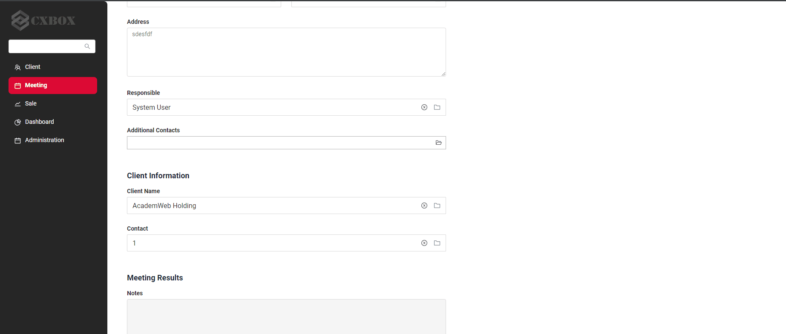
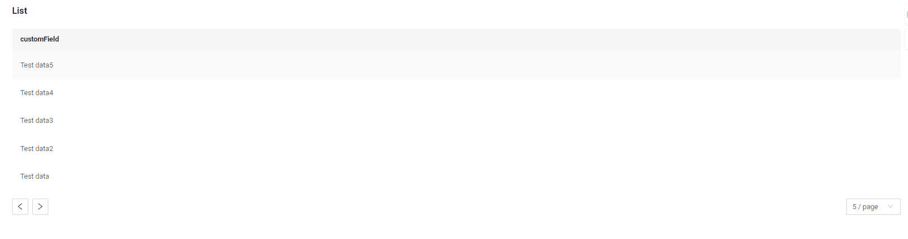

# v2.0.1

* [cxbox/demo 2.0.2 git](https://github.com/CX-Box/cxbox-demo/tree/v.2.0.2), [release notes](https://github.com/CX-Box/cxbox-demo/releases/tag/v.2.0.2)

* [cxbox/core 4.0.0-M4 git](https://github.com/CX-Box/cxbox/tree/cxbox-4.0.0-M4), [release notes](https://github.com/CX-Box/cxbox/releases/tag/cxbox-4.0.0-M4), [maven](https://central.sonatype.com/artifact/org.cxbox/cxbox-starter-parent)

* [cxbox-ui/core 2.0.0 git](https://github.com/CX-Box/cxbox-ui/tree/2.0.0), [release notes](https://github.com/CX-Box/cxbox-ui/releases/tag/2.0.0), [npm](https://www.npmjs.com/package/@cxbox-ui/core)

## **Key updates July 2024** 
### CXBOX ([Demo](https://github.com/CX-Box/cxbox-demo), [Code Samples](https://github.com/CX-Box/cxbox-code-samples))
####  Creating a Line in the PickList Popup

We have added the ability to create a line directly within the picklist popup when clicking "Add" on the sheet.
####  Add new pagination modes
The navigation arrows and limit settings block are removed if the number of records is less than the limit.
Pagination modes:

1) nextAndPreviousWithHasNext [:material-play-circle: Live Sample]({{ external_links.code_samples }}/ui/#/screen/myexample3860){:target="_blank"} ·

   Next button availability logic:

   * If hasNext (from /data) is true, Next button is available.
   * If hasNext (from /data) is false, Next button is disabled.

2) nextAndPreviousSmart   [:material-play-circle: Live Sample]({{ external_links.code_samples }}/ui/#/screen/myexample3861){:target="_blank"} ·

 

   Next button availability logic:
   If the number of records received from /data is less than _limit, Next button is disabled.

   Disadvantages of this mode:

   * If the number of records is a multiple of _limit, a single jump to a page with no records will occur, since it is impossible to determine whether this is the last page.
   * If the number of records is a multiple of _limit, a request for the next page will be sent even if it does not exist. If this request returns an error, it should be handled with a try {} catch {} block.

3) Default nextAndPreviousWithCount 
   The functionality remains the same.
#### Other Changes
see [cxbox-demo changelog](https://github.com/CX-Box/cxbox-demo/releases/tag/v.2.0.2)

see [cxbox-code-samples changelog](https://github.com/CX-Box/cxbox-code-samples/releases/tag/v2.0.2)

### <a id="CXBOXUI">CXBOX</a> ([Core Ui](https://github.com/CX-Box/cxbox-ui))
#### Fixed saving settings 
Fixed the issue with saving settings when adding an option to the meta: add.fields.
### <a id="CXBOXCORE">CXBOX 4.0.0-M4</a>  ([Core](https://github.com/CX-Box/cxbox))
#### Heap dump export
Fix heap dump export with actuator
#### Added an explicit Qualifier
Fixed conflict between mappers (cxboxObjectMapper and businessComponentMapper)
#### Other Changes
see [cxbox changelog](https://github.com/CX-Box/cxbox/releases/tag/cxbox-4.0.0-M4)
