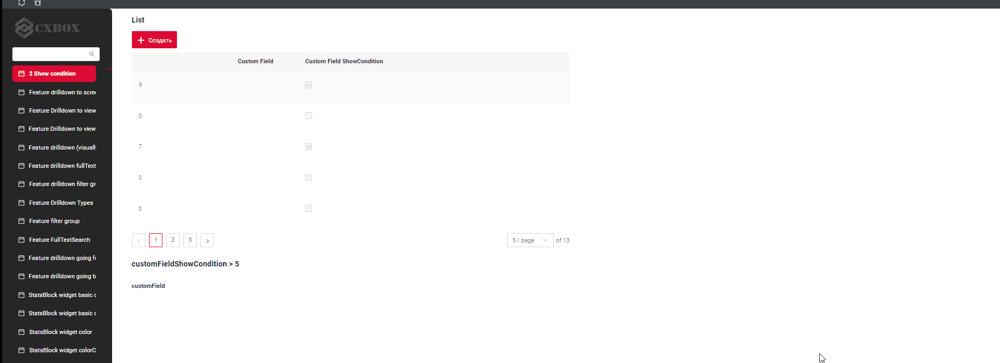
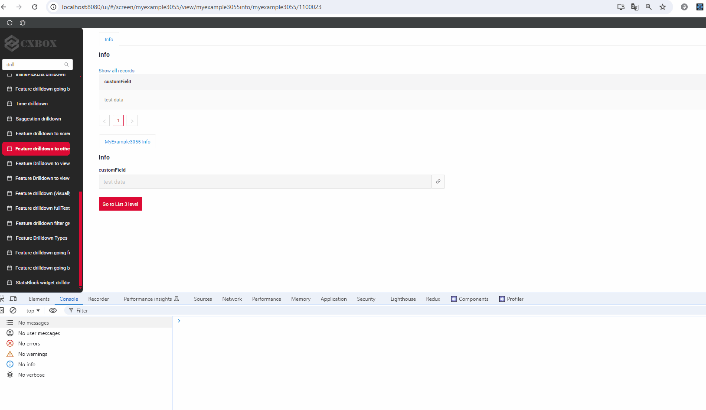
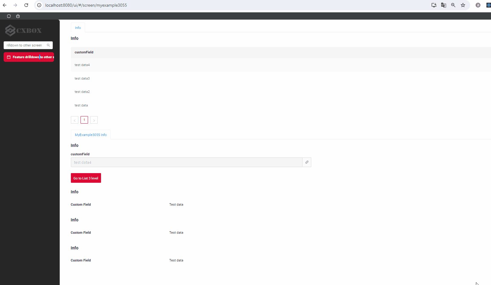
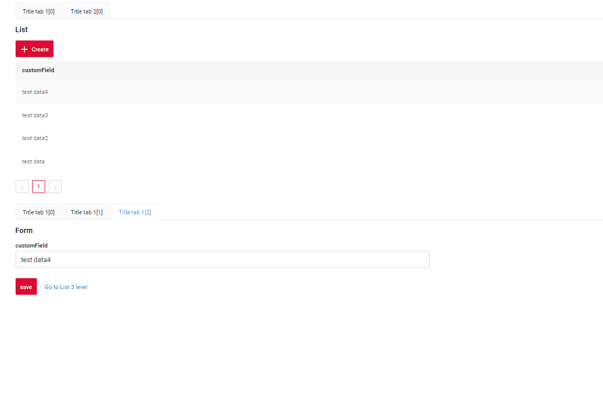

# v2.0.3

* [cxbox/demo 2.0.3 git](https://github.com/CX-Box/cxbox-demo/tree/v.2.0.3), [release notes](https://github.com/CX-Box/cxbox-demo/releases/tag/v.2.0.3)

* [cxbox/core 4.0.0-M4 git](https://github.com/CX-Box/cxbox/tree/cxbox-4.0.0-M4), [release notes](https://github.com/CX-Box/cxbox/releases/tag/cxbox-4.0.0-M4), [maven](https://central.sonatype.com/artifact/org.cxbox/cxbox-starter-parent)

* [cxbox-ui/core 2.0.0 git](https://github.com/CX-Box/cxbox-ui/tree/2.0.0), [release notes](https://github.com/CX-Box/cxbox-ui/releases/tag/2.0.0), [npm](https://www.npmjs.com/package/@cxbox-ui/core)

## **Key updates August 2024** 
### CXBOX ([Demo](https://github.com/CX-Box/cxbox-demo))
#### Front. Dependencies have been changed
* axios:   1.6.0
* rc-select: 14.11.0
* @types/lodash.debounce: 4.0.9

#### Add SIEM integration example

Added an example demonstrating how to log `CrudmaAction` along with the associated data.
####  Fixed errors for showCondition.

Resolved an error that occurred when two widgets were present on the screen in one BC with showCondition, where one widget was hidden and the other was visible
#### Fixed errors encountered during drilldown transitions.
1)  Fixed an error that occurred after switching between tabs when navigating to a screen via a link from another screen, where both the source and destination links had different BC.

2) Resolved an error that occurred when navigating between screens via a link, where the source and target screens contained multiple widget sets based on different BCs.

#### Added the ability to switch to a hidden view within tabs.

Added the ability to switch to a hidden view within tabs.

#### Other Changes
see [cxbox-demo changelog](https://github.com/CX-Box/cxbox-demo/releases/tag/v.2.0.3)
 