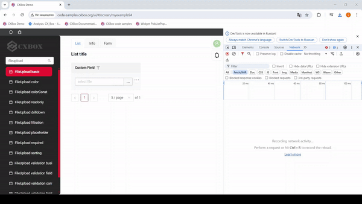
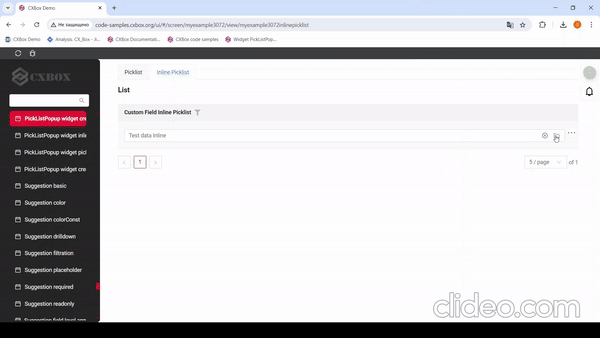
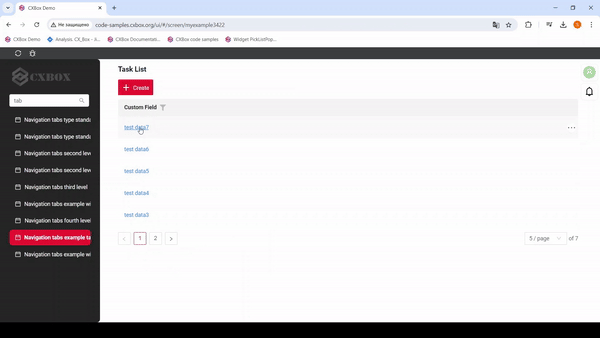
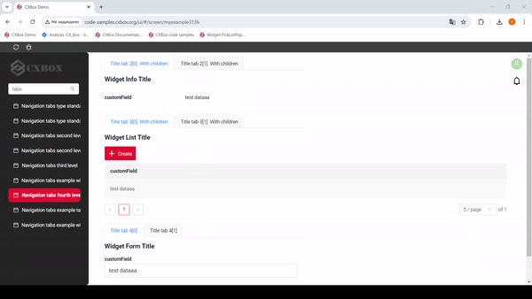
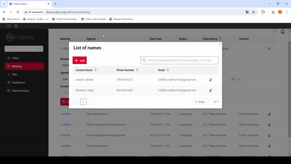

# v2.0.4

* [cxbox/demo 2.0.4 git](https://github.com/CX-Box/cxbox-demo/tree/v.2.0.4), [release notes](https://github.com/CX-Box/cxbox-demo/releases/tag/v.2.0.4)

* [cxbox/core 4.0.0-M6 git](https://github.com/CX-Box/cxbox/tree/cxbox-4.0.0-M6), [release notes](https://github.com/CX-Box/cxbox/releases/tag/cxbox-4.0.0-M6), [maven](https://central.sonatype.com/artifact/org.cxbox/cxbox-starter-parent)

* [cxbox-ui/core 2.0.0 git](https://github.com/CX-Box/cxbox-ui/tree/2.0.0), [release notes](https://github.com/CX-Box/cxbox-ui/releases/tag/2.0.0), [npm](https://www.npmjs.com/package/@cxbox-ui/core)


## **Key updates August 2024**
### <a id="CXBOXCORE">CXBOX 4.0.0-M6</a>  ([Core](https://github.com/CX-Box/cxbox))
#### LOV sorting in filter and edit dropdowns by display_order
* removed: FieldsMeta 
```java
setAllFilterValuesByLovTypeOrdered(final FieldsMeta<?> fields,
     final DtoField<?, ?> field,
     final IDictionaryType type)
```
it duplicates setAllFilterValuesByLovType and has NPE problem, when display_order is null
* removed: FieldsMeta class method
```java
setAllFilterValuesByLovType(final FieldsMeta<?> fields,
                           final DtoField<?, ?> field,
                           final IDictionaryType type,
                           final Comparator<SimpleDictionary> comparator)
```
it has wrong private modifier, wrong input argument fields (it is class field)
* removed: FieldsMeta class method setDictionaryTypeWithAllValuesOrdered - it was declared in wrong class (correct cass is RowDependentFieldsMeta). Also it duplicates setDictionaryTypeWithAllValues and has NPE problem, when display_order is null
* removed: FieldsMeta class method setDictionaryTypeWithAllValues - it was declared in wrong class (correct cass is RowDependentFieldsMeta). Also, it has wrong private modifier, wrong input argument fields (it is class field)
   ---correct realization---
* fixed: LOV dictionary loader :
   NOW: sorting items by display_order, then by key (display_order can be null)
   WAS: sorting items by display_order (display_order could not be null)
* added new method: at FieldsMeta 
```java 
setAllFilterValuesByLovType(
        final DtoField<?, ?> field,
        @NonNull final IDictionaryType type,
        @NonNull final Comparator<SimpleDictionary> comparator)
```

* added new method: at RowDependentFieldsMeta class
```java 
setDictionaryTypeWithAllValues(
        final DtoField<?, ?> field,
        @NonNull final String type,
        @NonNull final Comparator<SimpleDictionary> comparator)
```
#### Creation of new record directly in Popup (picklist, inlinePicklist and so on)
* BcStateAware now cleans cache only for exact bc (for user session), when terminal action request completed (instead of whole cache for user session)
* AbstractAnySourceResponseService and AbstractResponseService now have new method protected <P extends DataResponseDTO, F> F getParentField(DtoField<P, F> dtoField, BusinessComponent bc) to simply get Parent bc DTO field values.
  Usage example: getParentField(<PARENT_DTO>_.<parent_field>, bc);
* Added support of creation new records directly in popups (picklist and so on). AbstractAnySourceResponseService and AbstractResponseService can be used for this popups services with the only restriction -- one must use new method (see 2) ) instead of repository.findById(bc.getParentIdAsLong()) to get parent values if needed.
#### Other Changes
see [cxbox changelog](https://github.com/CX-Box/cxbox/releases/tag/cxbox-4.0.0-M6)

### CXBOX ([Demo](https://github.com/CX-Box/cxbox-demo))
#### New version core
New version core  CXBOX 4.0.0-M6

#### Upload authorization 


File upload is now available only for authorized users. An authorization token is passed while uploading a single file or multiple files. Otherwise, file upload option will not be available. The same logic is applicable to file preview and file download processes. 
#### Creating a Line in the InlinePickList Popup 



We have extended the possibility of creating a new line to inlinePickList.

#### Tab functionality 

We fixed the functionality of tabs:

1) Resolved an error that occurred when navigating between screens via a link to a related entity on the same screen



2) We fixed the work of third-level tabs



#### Added fulltextsearch option in pop-up (pickListPopup and inlinePickList)



A search bar has been added.When the user types in the full text search input area, then widget filters the rows that match the search query (search criteria is configurable and will usually check if at least one column has corresponding value). This feature makes it easier for users to quickly find the information they are looking for within a List widget.

[Fulltextsearch](https://doc.cxbox.org/features/element/filtration/fulltextsearch/fulltextsearch/) 

#### Fixed default display hidden view of the first level 

We have added a restriction for displaying hidden views in navigation. Now, if a hidden view is specified in the metadata, it will not be displayed when the screen is opened.
For the application to work correctly, the following rule must be observed: at each navigation level (aggregate or single), there must be at least one visible view. 

#### Other Changes
see [cxbox-demo changelog](https://github.com/CX-Box/cxbox-demo/releases/tag/v.2.0.4)
 