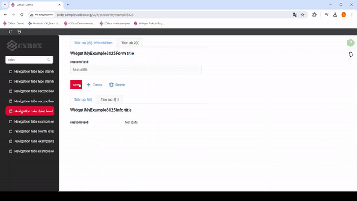
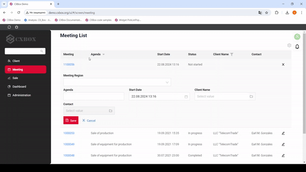

# v2.0.4

## **Key updates August 2024**

### Upload authorization 

File upload is now available only for authorized users. An authorization token is passed while uploading a single file or multiple files. Otherwise, file upload option will not be available. The same logic is applicable to file preview and file download processes. 

### Creating a Line in the InlinePickList Popup 

We have extended the possibility of creating a new line to inlinePickList. 

### Tab functionality 
We have enhanced the functionality of tabs: 

#### Changed getting context for tabs 
We have simplified the process of getting context for tabs. Now, with each click on tab, the `bcPath` is taken from `state.router`. 

#### Added tab standard view navigation 

We have added support for a new "type" field from backend.
If we receive no value from backend, the default value is `standard`. Otherwise, an error will be displayed in the console: "*Navigation with type ${navigationType} not implemented*". This will allow adding new navigation types in the future without changing the current code. 

#### Modified tab level display 

We have fixed the rendering of third-level tabs when using fourth-level tabs.

#### Added parent tab highlight 

We have added highlighting for parent tabs when selecting a child tab. 

### Added fulltextsearch option in pop-up (pickListPopup and inlinePickList)

A search bar has been added that searches the entered value across specific columns. 

### Bug Fixes 

#### Fixed autosave for PickList 

We have fixed a bug with saving the parent entity when creating a new child entity from pickListPopup. 

Now, when adding a new entity from a Popup, all changes made to the parent widget will undergo intermediate saving. 

#### Fixed default display hidden view of the first level 

We have added a restriction for displaying hidden views in navigation. Now, if a hidden view is specified in the metadata, it will not be displayed when the screen is opened. 
For the application to work correctly, the following rule must be observed: at each navigation level (aggregate or single), there must be at least one visible view. 
Otherwise, the system will display the error: "*Each tab navigation level must have at least one element: 'single view' (view without hidden = failse flag) or 'aggregate view' (title, child pair)*". 