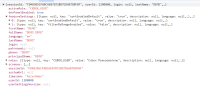
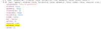

# 2.0.5

* [cxbox/demo 2.0.5 git](https://github.com/CX-Box/cxbox-demo/tree/v2.0.5), [release notes](https://github.com/CX-Box/cxbox-demo/releases/tag/v2.0.5)

* [cxbox/core 4.0.0-M7 git](https://github.com/CX-Box/cxbox/tree/cxbox-4.0.0-M7), [release notes](https://github.com/CX-Box/cxbox/releases/tag/cxbox-4.0.0-M7), [maven](https://central.sonatype.com/artifact/org.cxbox/cxbox-starter-parent/4.0.0-M7)

* [cxbox-ui/core 2.0.1 git](https://github.com/CX-Box/cxbox-ui/tree/2.0.1), [release notes](https://github.com/CX-Box/cxbox-ui/releases/tag/2.0.1), [npm](https://www.npmjs.com/package/@cxbox-ui/core/v/2.0.1)

* [Platform Tools 1.7.6](https://plugins.jetbrains.com/plugin/19523-platform-tools/versions/stable)
## **Key updates September 2024**

### <a id="CXBOXUI">CXBOX</a> ([Core Ui](https://github.com/CX-Box/cxbox-ui))
#### Redesign of saving context for tabs
If the view change was triggered by switching tabs:
1. Pagination, data, and rowMeta will remain unchanged. Data will only be requested if it hasn’t been loaded yet or if the parent bc cursor has changed. There will no longer be a re-request of data for all bc.
2. When fetching data for the parent bc, an additional check will remove outdated data for child bookmakers from the store.
3. The frequency of bcChangeCursors calls has been reduced.


### CXBOX ([Demo](https://github.com/CX-Box/cxbox-demo))
#### New version core
New version core  CXBOX 4.0.0-M7

#### Fixed User Roles
Fixed the display of multiple roles and the ability to switch between them.


#### Fixed Content-Disposition Header Handling
We have fixed the handling of the `Content-Disposition` header to ensure correct file display during preview.  
*Changes made:*
Frontend: The correct `Content-Disposition` header is now passed.  
Backend: Updated the `cxbox` controller to handle the `inline` parameter.  
The header is set as follows:
- `Content-Disposition`: `inline` when `preview=true`.
- `Content-Disposition`: `attachment` when `preview=false` or by default.

*The Result:*   
For file preview requests, the header will be `inline`.  
For file downloads or when the parameter is missing, the header will be `attachment`.


#### Added text customization in PreAction.Confirm for buttons and title
We have added the ability to set custom text for confirmation title and buttons.


#### Updated the logic of text colorization width
We have updated the text colorization logic. Now, if the string exceeds 100 pixels in length, the highlight dynamically adjusts to the string length, preventing the text from overflowing beyond the highlighted area.


#### Fixed fields' alignment in the multi-column form widget
We have resolved the alignment issue with fields in the multi-column form widget. Previously, the fields were not aligning correctly due to incorrect attribute application. The fields are now properly aligned across columns, and the issue with fields merging together has also been fixed.


#### Fixed the display of grouping columns in Grouping Hierarchy (list widget mode)
We have added a condition to ensure that hidden fields in hierarchical mode are properly displayed in list widget mode.


<!-- 
#### Fixed auto-save functionality for switching between tabs and parent-child widgets
We have fixed auto-save functionality for switching between parent and child widgets, as well as between tabs.  
Previously,  changes were lost when switching between views in the same bc without a prompt. Now, auto-saving works correctly:
1. Without the defaultSave parameter: A prompt message appears asking to save changes when bc or view is changed.
2. With the defaultSave parameter: Changes are saved automatically without a prompt message.
3. Mandatory fields: If not filled, auto-saving is blocked until required fields are completed.
 -->

###  <a id="CXBOXCORE">CXBOX 4.0.0-M7</a>  ([Core](https://github.com/CX-Box/cxbox))
#### Added SuperBuilder to BaseEntity  
The `@SuperBuilder` annotation was added to the `BaseEntity` and `AbstractEntity` classes. This change was made to align these classes with the DTO classes, where this annotation had already been introduced.

#### Added the setHidden,setNotHidden, hidden method  
We standardized the behavior of the `hidden` method to align with how the `required` method works.
   **Before:**  
    ```java
    fields.get(MyDTO_.fullName).setHidden(false);  
    ```  
   **Now:**  
    ```java
    fields.setHidden(MyDTO_.fullName);
    ```  

The old methods are marked as `deprecated`.  

  

#### Flush and setWithFirstLevelCache return the entity  

The logic of the save method for creating and updating entities has been changed.
Instead of using the method `flush(bc)`, a simpler version without parameters `flush()` is now used. This allows for inlining the result in the return statement, and the method automatically determines whether to perform an update or create operation.  

   **Critical changes:**  
If the class implements the `AnySourceBaseDAO` interface, the return type must be changed from void to the entity type, so that the method can return the object after `flush()` is executed.  

   **Before:**  
    ```java
    this.getBaseDao().flush(bc);
    ```  
   **After:**  
    ```
    this.getBaseDao().flush();
    ```

This simplifies the code and allows the method to be directly inlined in the `return`, while still automatically determining the type of operation (create or update).

#### Added the setCurrentValue generics method   

The `setCurrentValue` methods in DTOs have been updated to use generics, improving type checking and ensuring that passed values conform to expected types, which helps prevent type-related errors.  

**Changes:**  
   *Before:*  
    ```java
    fields.get(final DtoField<? super T, ?> field).setCurrentValue(Object object);
    ```

   *After:*  
    ```java
    fields.setCurrentValue(final DtoField<? super T, E> field, E value);
    ```  
#### Other Changes
see [cxbox changelog](https://github.com/CX-Box/cxbox/releases/tag/cxbox-4.0.0-M7)

###  CXBOX [plugin](https://plugins.jetbrains.com/plugin/19523-platform-tools)
We've updated the plugin to version 1.7.6.
#### Added Inspection for Correct `@SearchParameter` Values in DTO
We have implemented an inspection feature to ensure that `@SearchParameter` annotations in DTOs have correct values.  
Inspection  `SearchParameterAnnotationInspection` checks fields annotated with `@SearchParameter(name = "name")`. Validates that a field with the name from `name` exists in the corresponding Entity (name derived from DTO name).

#### Fix for filtering fields of Type Hint
The `SearchParameter` annotation was added to `Hint` fields in the DTO, enabling proper filtering functionality.

<!-- 
####  Added inspection for widget references
1. Added references in `.widget.json` for `option.create.widget` and `option.edit.widget` to the `name` field, enabling autocomplete, navigation to usages, definition, and rename refactoring.  
   1.1 Error inspection added, reporting if the reference points to nothing, with the message: "Incorrect value. Use autocomplete to provide correct one."  
   1.2 Warning inspection added if the widget doesn't have the Form type.
2. Implemented references for `confirmWithCustomWidget` method arguments to widgets in `.widget.json`, with the same autocomplete, navigation, and refactoring functionality.  
   2.1 Error and warning inspections added for invalid widget types and missing references.
3. Introduced the `@WidgetName` annotation in the core, which checks the widget type via the `typePostfix` parameter to ensure the correct type is used.
4. Expanded coverage of inspections and autocompletion for methods where arguments are annotated with `@WidgetName`.

####  The WidgetName annotation has been added  

   *What was fixed:*  
- Now, when switching tabs, data, pagination, and rowMeta are no longer reset. Data is only reloaded if it wasn’t loaded previously or if the parent bc’s cursor changed.  
- Added a check that removes outdated data for child bcs when updating parent bc data.  
- Reduced the number of bcChangeCursors calls to optimize cursor changes and reduce unnecessary data updates.  

   *Loading optimization:*  
- Now, if a tab is switched, the system only loads missing data instead of resetting and reloading everything.  

These changes have significantly improved system performance, reduced unnecessary requests, and fixed bugs related to data and metadata loading.
####  Added the ability to disable sorting for a field  

The ability to control sorting of table fields has been introduced, allowing sorting to be enabled or disabled on a per-field basis. This update affects both frontend and backend.  

**Frontend Updates:**  
1. New Flag `sortEnabledDefault` added to `application.yml`. It sets the default sorting behavior for the entire application.  
   1.1 If `sortEnabledDefault = false` or `null` (default):    
       - Sorting is disabled for fields unless `sortable=true` is set for the field.  
       - If the field is `sortable=true`, the sorting icon is displayed, and users can add, modify, or remove sorting.  
       - If the field is sortable=false or null, the sorting icon is hidden and sorting is not available.    
   1.2 Default Sorting:    
        Fields can have default sorting set through `BC_PROPERTIES.csv`, which will be visible regardless of the `sortable` setting.  
   1.3 Sorting by Multiple Fields:  
        - Sorting by multiple fields is possible, but sorting by multiple `sortable` fields cannot be set via the UI.  
        - `Non-sortable` fields do not change sorting in response to user actions.  
2. Sorting Logic Changes:  
   2.1 Sorting by multiple fields includes a visual distinction between sorting icons for sortable and non-sortable fields.  
   2.2 Sortable fields reset sorting when sorting on other fields is changed.  
   2.3 Non-sortable fields do not allow changes or removal of sorting.  
 

**Backend Updates:**  
1. Method `fields.enableSort(...)`added for managing field sortability.  
2. Demo Setup: Set `sortEnabledDefault = false` and apply `fields.enableSort(...)` to fields where sorting should work correctly.

  

  
 
####  Added Dictionary Value Sorting to RowDependentFieldsMeta  

Sorting functionality for dictionary values has been added to the `RowDependentFieldsMeta` class. Previously, sorting was implemented only for filters in other classes.  
**Changes:**  
1. Removed Methods:  
   1.1 `setAllFilterValuesByLovTypeOrdered` and `setAllFilterValuesByLovType` from the `FieldsMeta` class have been removed due to duplication of existing methods and issues with handling `null` values.  
   1.2 `setDictionaryTypeWithAllValuesOrdered` and `setDictionaryTypeWithAllValues` have also been removed from the `FieldsMeta` class due to incorrect placement and function duplication.  
2. Fixed Methods:  
   `LOV dictionary loader` now sorts items by `display_order`, then by key. Previously, sorting was only by `display_order`.  
3. Added Methods and JavaDoc:  
   3.1 New method in `FieldsMeta`:  
   ```
   public final void setAllFilterValuesByLovType(
   final DtoField<?, ?> field,
   @NonNull final IDictionaryType type,
   @NonNull final Comparator<SimpleDictionary> comparator);
   ```
    Sorting of filter dropdown values is now performed using the provided comparator.  
   3.2 New method in `RowDependentFieldsMeta`:
   ```
   public final void setAllFilterValuesByLovType(
   final DtoField<?, ?> field,
   @NonNull final IDictionaryType type,
   @NonNull final Comparator<SimpleDictionary> comparator);
   ```  
   This method is added to sort field edit values using a comparator.  

    3.3 JavaDic added and updated:  
   JavaDoc for `setAllFilterValuesByLovType` and `setDictionaryTypeWithAllValues` has been added, describing that values are sorted by `display_order` first, then by key. JavaDoc also notes that sorting rows in List widgets always ignores `display_order` and is done by `lov.key` lexicographically.  
 -->
 