# 2.0.5

* [cxbox/demo 2.0.5 git](https://github.com/CX-Box/cxbox-demo/tree/v2.0.5), [release notes](https://github.com/CX-Box/cxbox-demo/releases/tag/v2.0.5)

* [cxbox/core 4.0.0-M8 git](https://github.com/CX-Box/cxbox/tree/cxbox-4.0.0-M8), [release notes](https://github.com/CX-Box/cxbox/releases/tag/cxbox-4.0.0-M8), [maven](https://central.sonatype.com/artifact/org.cxbox/cxbox-starter-parent/4.0.0-M8)

* [cxbox-ui/core 2.2.0 git](https://github.com/CX-Box/cxbox-ui/tree/2.2.0), [release notes](https://github.com/CX-Box/cxbox-ui/releases/tag/2.2.0), [npm](https://www.npmjs.com/package/@cxbox-ui/core/v/2.2.0)

## **Key updates September 2024**

### CXBOX ([Core Ui](https://github.com/CX-Box/cxbox-ui))
#### Redesign of saving context for tabs
If the view change was triggered by switching tabs:
1. Pagination, data, and rowMeta will remain unchanged. Data will only be requested if it hasn’t been loaded yet or if the parent bc cursor has changed. There will no longer be a re-request of data for all bc.
2. When fetching data for the parent bc, an additional check will remove outdated data for child bookmakers from the store.
3. The frequency of bcChangeCursors calls has been reduced.

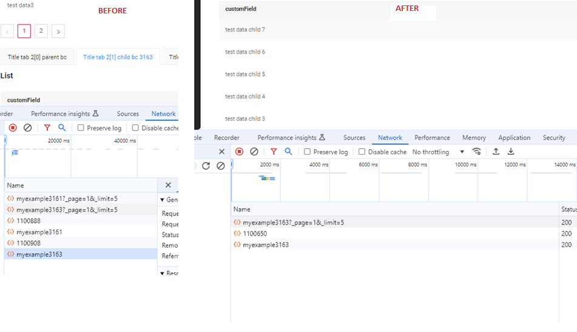

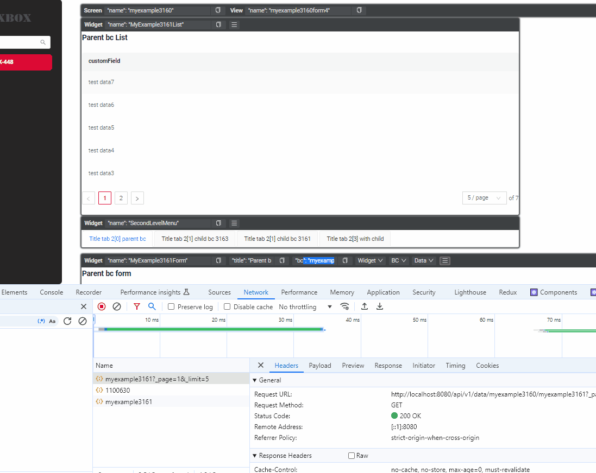

### CXBOX ([Demo](https://github.com/CX-Box/cxbox-demo))
#### New version core
New version core  CXBOX 4.0.0-M7

#### Fixed User Roles
Fixed the display of multiple roles and the ability to switch between them.

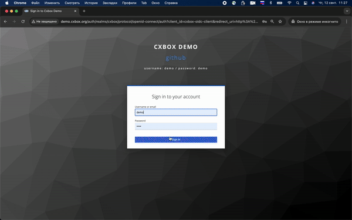

#### Fixed Content-Disposition Header Handling
We have fixed the handling of the `Content-Disposition` header to ensure correct file display during preview.  
    *Changes made:*   
Frontend: The correct `Content-Disposition` header is now passed.  
Backend: Updated the `cxbox` controller to handle the `inline` parameter.     
The header is set as follows:  
- `Content-Disposition`: `inline` when `preview=true`.  
- `Content-Disposition`: `attachment` when `preview=false` or by default.    
   *The Result:*   
For file preview requests, the header will be `inline`.  
For file downloads or when the parameter is missing, the header will be `attachment`.

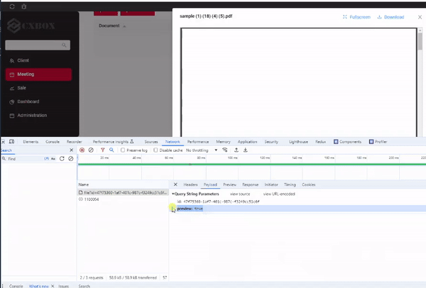

#### Added text customization in PreAction.Confirm for buttons and title
We have added the ability to set custom text for confirmation title and buttons.

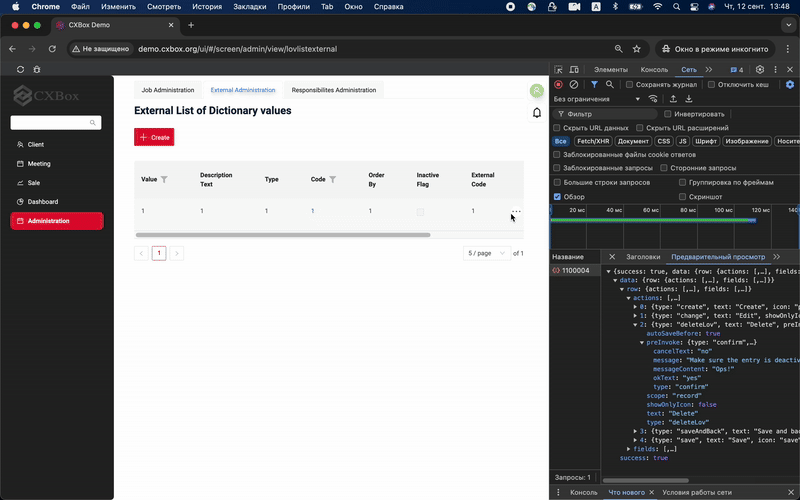

#### Updated the logic of text colorization width
We have updated the text colorization logic. Now, if the string exceeds 100 pixels in length, the highlight dynamically adjusts to the string length, preventing the text from overflowing beyond the highlighted area.

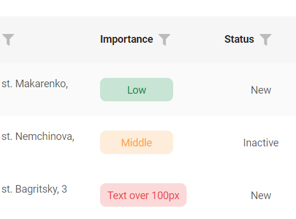

#### Fixed fields' alignment in the multi-column form widget
We have resolved the alignment issue with fields in the multi-column form widget. The fields are now properly aligned across columns.

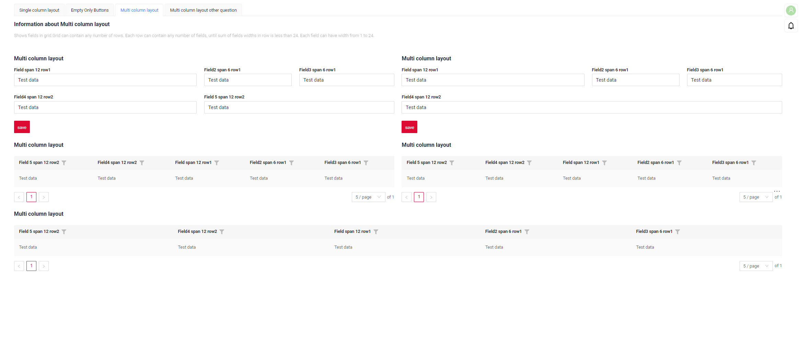

#### Fixed the display of grouping columns in Grouping Hierarchy (list widget mode)
We have added a condition to ensure that hidden fields in hierarchical mode are properly displayed in list widget mode.

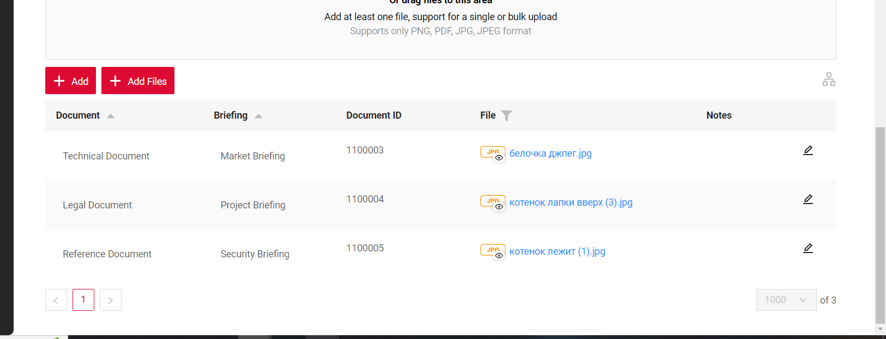

###  CXBOX 4.0.0-M7  ([Core](https://github.com/CX-Box/cxbox))
#### Added SuperBuilder to BaseEntity  
The `@SuperBuilder` annotation was added to the `BaseEntity` and `AbstractEntity` classes. This change was made to align these classes with the DTO classes, where this annotation had already been introduced.

#### Added the setHidden,setNotHidden, hidden method  
We standardized the behavior of the `hidden` method to align with how the `required` method works.  
   **Before:**  
    ```java
    fields.get(MyDTO_.fullName).setHidden(false);  
    ```  
   **Now:**  
    ```java
    fields.setHidden(MyDTO_.fullName);
    ```  

The old methods are marked as `deprecated`.  

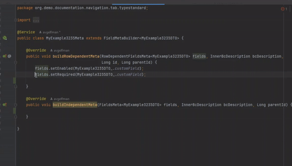  

#### Flush and setWithFirstLevelCache return the entity  

The logic of the save method for creating and updating entities has been changed.
Instead of using the method `flush(bc)`, a simpler version without parameters `flush()` is now used. This allows for inlining the result in the return statement, and the method automatically determines whether to perform an update or create operation.  

   **Critical changes:**  
If the class implements the `AnySourceBaseDAO` interface, the return type must be changed from void to the entity type, so that the method can return the object after `flush()` is executed.  

   **Before:**  
    ```java
    this.getBaseDao().flush(bc);
    ```  
   **After:**  
    ```java
    this.getBaseDao().flush();
    ```

This simplifies the code and allows the method to be directly inlined in the `return`, while still automatically determining the type of operation (create or update).

#### Added the setCurrentValue generics method   

The `setCurrentValue` methods in DTOs have been updated to use generics, improving type checking and ensuring that passed values conform to expected types, which helps prevent type-related errors.  

**Changes:**  
   *Before:*  
    ```java
    fields.get(final DtoField<? super T, ?> field).setCurrentValue(Object object);
    ```

   *After:*  
    ```java
    fields.setCurrentValue(final DtoField<? super T, E> field, E value);
    ```  

####  Added the ability to disable sorting for a field

The ability to control sorting of table fields has been introduced, allowing sorting to be enabled or disabled on a per-field basis.  

!!! info 
    By default, `sortEnabledDefault` parameter is set to `false`. If you want sorting to be enabled across the entire project, you need to set `sortEnabledDefault = true` in the `MetaConfigurationProperties`.   

*Changes:*  
    1. Field-Level Sorting Control: the sorting behavior can be managed for each field independently. You can enable sorting on specific fields using the `fields.enableSort()` method on the backend. If a field is set as sortable=true, the sorting icon will appear, allowing users to add or change sorting. If sortable=false, the icon will either be hidden or inactive.  
    2. Default Sorting: fields with default sorting remain active, even if not sortable. Users can view it but cannot modify it unless the field is sortable.  
    3. Multi-Field Sorting:  
        - Multiple fields can be sorted via default settings, but in the UI, sorting can only be applied to one sortable field.  
        - Sorting icons for sortable and non-sortable fields are visually distinct.

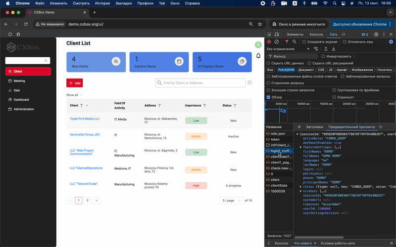

#### Added lambda based action builder api

Using old api users common mistake was to forget .add() method and lose action without any compiler or runtime exception. Also, bad actions visual separation was another common problem. New lambda based api solves both this problems:

**Changes:**  
*Before:*
```java
	@Override
public Actions<DashboardFilterDTO> getActions() {

	return Actions.<DashboardFilterDTO>builder()
			.action("filter", "Apply Filters")
			.invoker((bc, dto) -> new ActionResultDTO<>())
			.available(bc -> true).withAutoSaveBefore()
			.add()
			.build();
}
```

*After:*
```java
@Override
public Actions<DashboardFilterDTO> getActions() {
	return Actions.<DashboardFilterDTO>builder()
			.action(act -> act
					.action("filter", "Apply Filters")
					.invoker((bc, dto) -> new ActionResultDTO<>())
					.available(bc -> true).withAutoSaveBefore()
			)
			.build();
}
```

#### Other Changes
see [cxbox changelog](https://github.com/CX-Box/cxbox/releases/tag/cxbox-4.0.0-M8)

###  CXBOX [plugin](https://plugins.jetbrains.com/plugin/19523-platform-tools)
We've updated the plugin to version 1.7.6.
#### Added Inspection for Correct `@SearchParameter` Values in DTO
We have implemented an inspection feature to ensure that `@SearchParameter` annotations in DTOs have correct values.  
Inspection  `SearchParameterAnnotationInspection` checks fields annotated with `@SearchParameter(name = "name")`. Validates that a field with the name from `name` exists in the corresponding Entity (name derived from DTO name).

#### Fix for filtering fields of Type Hint
The `SearchParameter` annotation was added to `Hint` fields in the DTO, enabling proper filtering functionality.  

####  Added inspection for widget references
1. Reference and inspection for `option.create.widget` and `option.edit.widget`  
   1.1 Added references in `.widget.json` for `option.create.widget` and `option.edit.widget` to the `name` field, enabling autocomplete, navigation to usages, definition, and rename refactoring.  
   1.2 Error and warning inspections added for invalid widget types and missing references.  
  
2. Reference and inspection for `confirmWithCustomWidget`  
   2.1 Implemented references for `confirmWithCustomWidget` method arguments to widgets in `.widget.json`, with the same autocomplete, navigation, and refactoring functionality.  
   2.2 Error and warning inspections added for invalid widget types and missing references.
     
3. Introduced the `@WidgetName` annotation in the core, which checks the widget type via the `typePostfix` parameter to ensure the correct type is used.  
4. Expanded coverage of inspections and autocompletion for methods where arguments are annotated with `@WidgetName`.  
  

### CXBOX [documentation](https://doc.cxbox.org/)
#### Added description tabs

Added a description of tab functionality and detailed instructions for creating and organizing different levels of tabs on the screen.

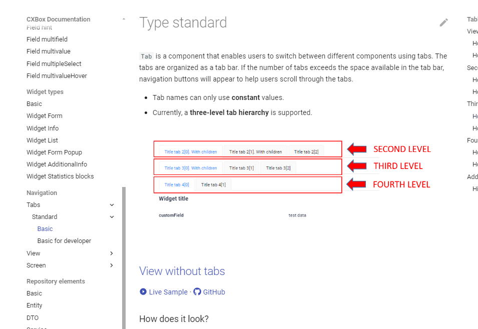

[Basic](https://doc.cxbox.org/navigation/tabs/standard/basic/tab/)  
[Basic for developer](https://doc.cxbox.org/navigation/tabs/standard/basicdevelop/tabfordevelop/)


 