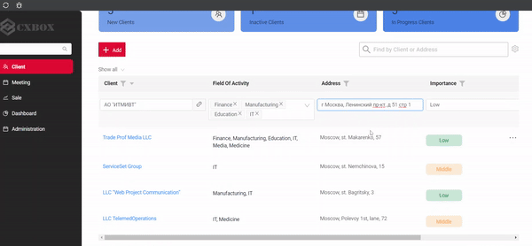
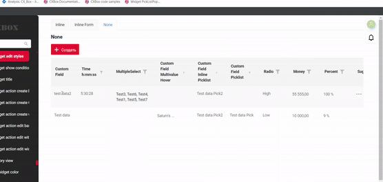
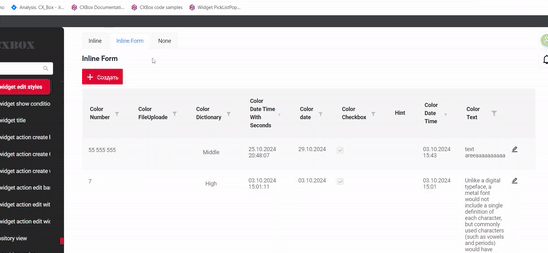

# 2.0.6

* [cxbox/demo 2.0.6 git](https://github.com/CX-Box/cxbox-demo/tree/v.2.0.6), [release notes](https://github.com/CX-Box/cxbox-demo/releases/tag/v.2.0.6)  

* [cxbox-ui/core 2.3.0 git](https://github.com/CX-Box/cxbox-ui/tree/2.3.0), [release notes](https://github.com/CX-Box/cxbox-ui/releases/tag/2.3.0), [npm](https://www.npmjs.com/package/@cxbox-ui/core/v/2.3.0)  

## **Key updates September, October 2024**  
### <a id="CXBOXUI">CXBOX</a> ([Core Ui](https://github.com/CX-Box/cxbox-ui))
#### Changed the editing row format  
1. **Single-Click Row Editing.** Rows now enter edit mode on a single click (previously, a double-click was required).  
**All Fields Editable.** When a row enters edit mode, all editable fields in the row are simultaneously placed in edit mode. Previously, only one field could be edited at a time.  

  

2. **Custom Row Highlighting.**  We’ve added the ability to customize row highlight colors for different states, such as hover and active, directly from the frontend.  

3. **New `style` Attribute.** A new style attribute has been added to the edit and create options in the metadata.  
Supported values are:  
   • `inline`: the row enters inline editing mode.  
   • `inlineForm`: opens an additional widget for editing the row.  
   •  *NEW!* `none`: the row remains in readOnly mode. This is recommended for rows with non-editable fields, ensuring they don’t switch to edit mode on click.  

The specified style will take precedence over the presence of a widget name. It means that if you declare a widget name and any value of `style` attribute apart from `inlineForm`, the declared `style` value will be applied and the widget will not open.  

### CXBOX ([Demo](https://github.com/CX-Box/cxbox-demo))
#### New version Core UI
We've updated Core UI to version 2.3.0.
#### New version keycloak
We've updated keycloak from version 12.0.3 to version 12.0.4.
#### Other Changes
see [cxbox-demo changelog](https://github.com/CX-Box/cxbox-demo/releases/tag/v.2.0.6)
  
