# 2.0.7

* [cxbox/demo 2.0.7 git](https://github.com/CX-Box/cxbox-demo/tree/v.2.0.7), [release notes](https://github.com/CX-Box/cxbox-demo/releases/tag/v.2.0.7)

* [cxbox/core 4.0.0-M10 git](https://github.com/CX-Box/cxbox/tree/cxbox-4.0.0-M10), [release notes](https://github.com/CX-Box/cxbox/releases/tag/cxbox-4.0.0-M10), [maven](https://central.sonatype.com/artifact/org.cxbox/cxbox-starter-parent/4.0.0-M10)

* [cxbox-ui/core 2.4.0 git](https://github.com/CX-Box/cxbox-ui/tree/2.4.0), [release notes](https://github.com/CX-Box/cxbox-ui/releases/tag/2.4.0), [npm](https://www.npmjs.com/package/@cxbox-ui/core/v/2.4.0)  

* [cxbox/code-samples 2.0.7 git](https://github.com/CX-Box/cxbox-code-samples/tree/v.2.0.7), [release notes](https://github.com/CX-Box/cxbox-code-samples/releases/tag/v.2.0.7)

## **Key updates October 2024**  

### CXBOX ([Demo](http://demo.cxbox.org))  

#### Changed: Grouping Hierarchy widget - compact look

Hierarchies now expanded in a more compact way. If grouping fields are empty or contain a single item, the hierarchy displays as expanded by default, reducing unnecessary clicks.  

=== "After"  
    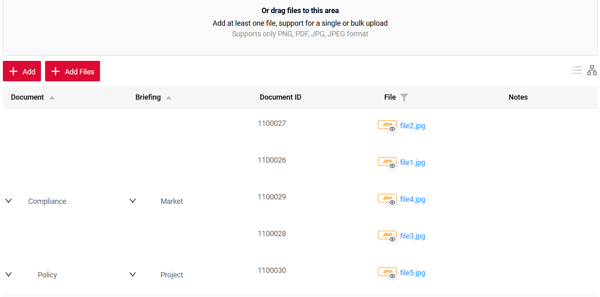

=== "Before"
    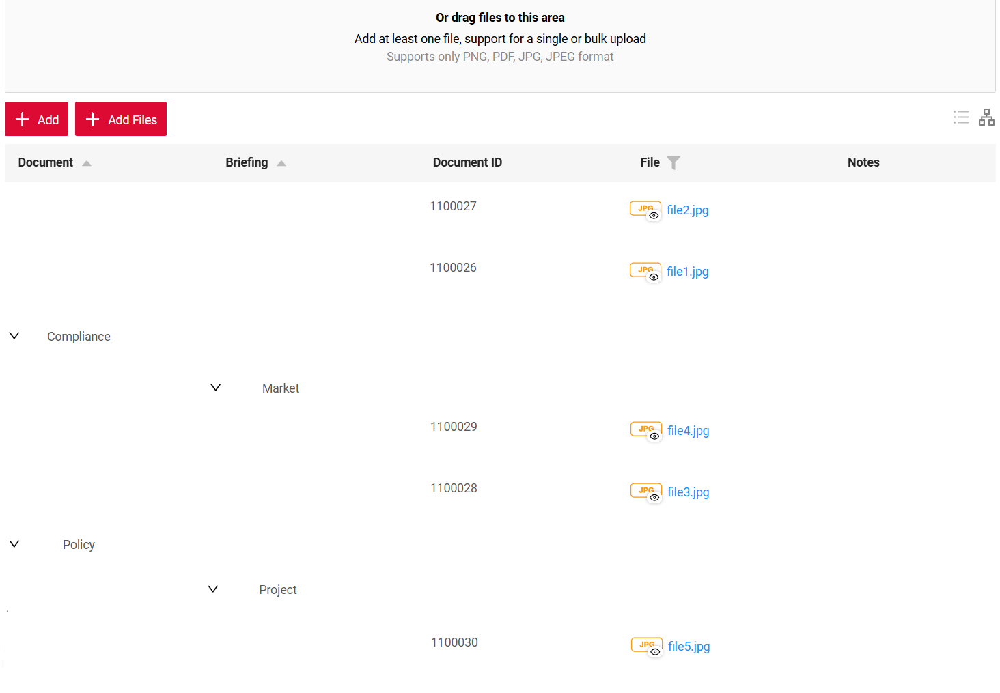 

#### Added: Grouping Hierarchy widget - default hierarchy
You can now (optionally) provide default hierarchy structure, that will be displayed even, when widget has no data

=== "After: with Default Hierarchy"  
    
=== "Before: no Default Hierarchy"
    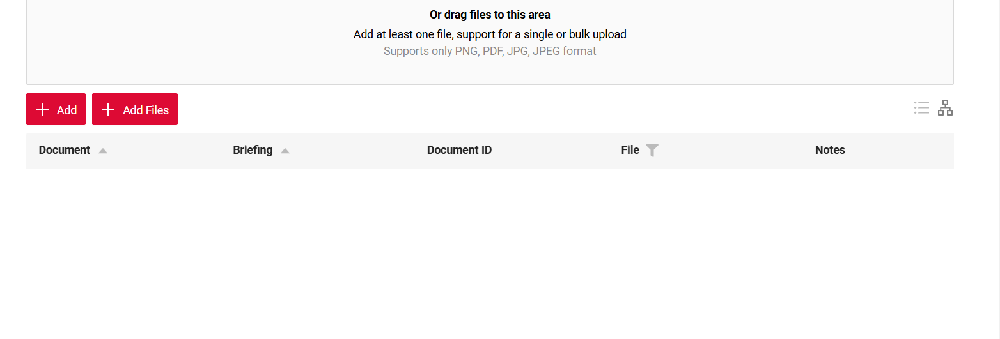

If data is provided from backend, frontend merges it with the default hierarchy. Default hierarchy and all data from backend are guarantied to be shown

=== "After: default hierarchy and data from backend"  
    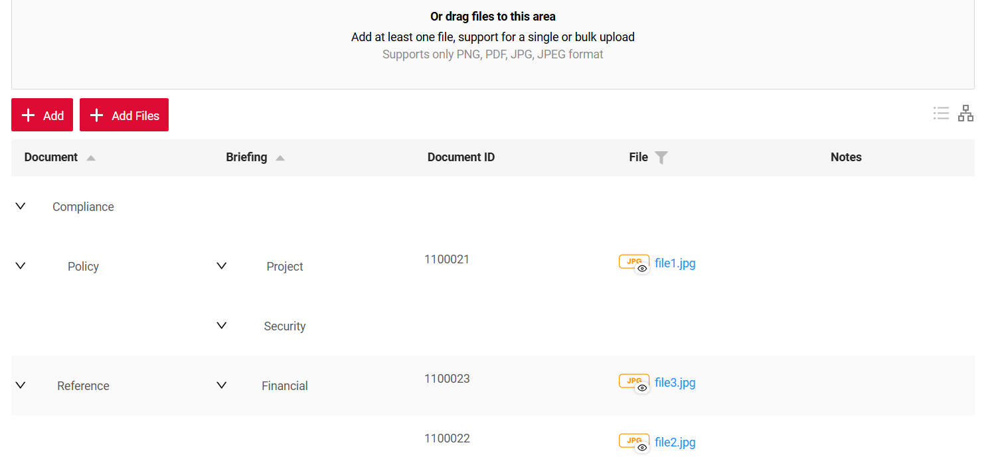
=== "Before: just data from backend"
    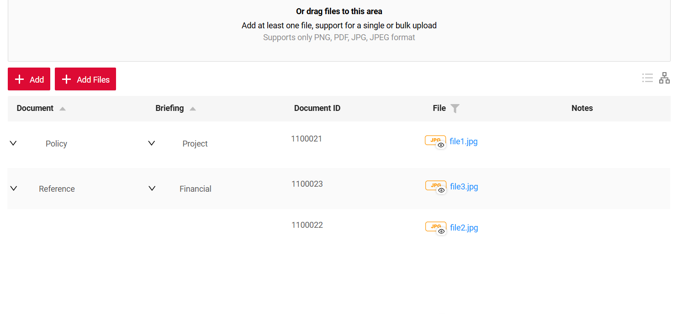


#### Added: Info widget - field title mode

We have updated the info widget display options for both single-column and multi-column layouts. You can now set `titleMode` to
`left` or `top` in the settings. The default is `left` for backward compatibility

=== "Title Left (default)"  
    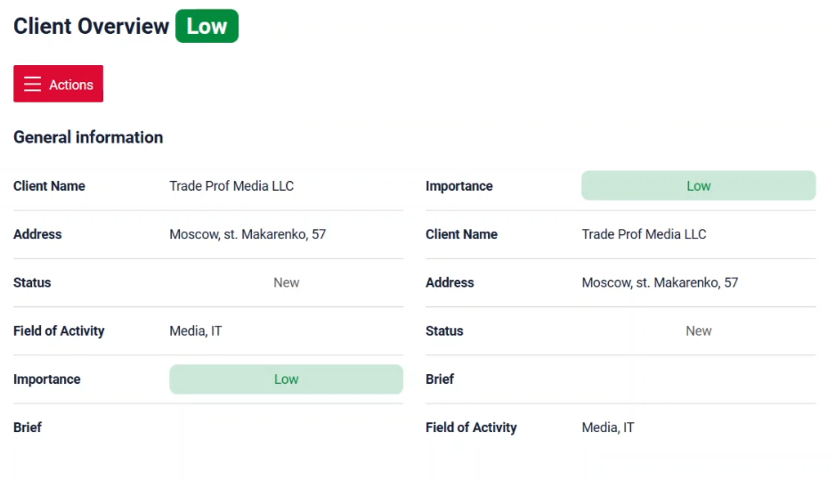
=== "Title Top"
    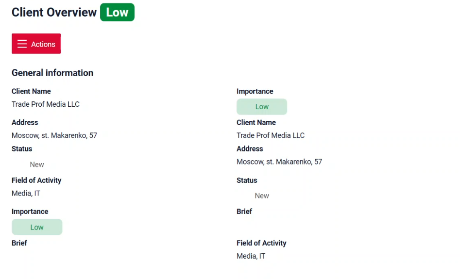

#### Added:  [Money](/widget_field_money) field - [currency](/widget_field_money/#currency) support

The [Money](/widget_field_money) field now supports currency. Constant currency value per widget field is supported in this release. Dynamic and editable currency value support will be added in next releases

=== "After"  
    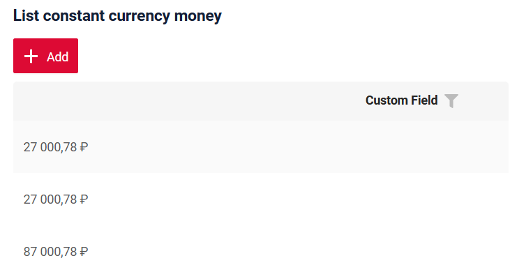
=== "Before"
    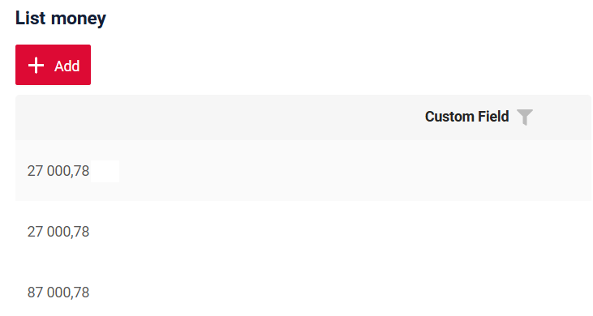

#### Added: Checkbox field - placeholder support

We have added placeholder support for checkbox. The value set for placeholder will be displayed on the right next to the checkbox itself. Note that it will not disappear once you click on the checkbox.  

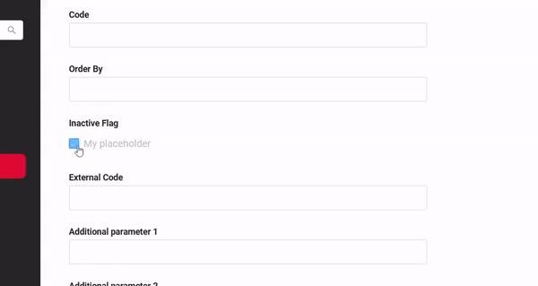

#### Added: [FormPopup](/widget_type_form_popup) widget - multiple popups support

It is now possible to set different [FormPopup](/widget_type_form_popup) widgets for different buttons on the same bc/widget.  

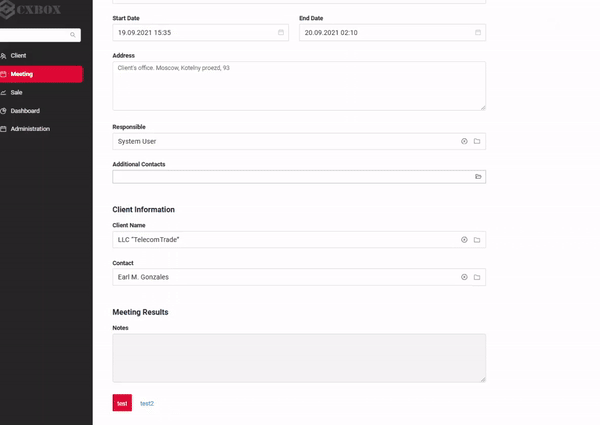  

#### Changed: Checkbox field - uniformed look

We have improved the checkbox look by aligning it with other field types

#### Other Changes
see [cxbox-demo changelog](https://github.com/CX-Box/cxbox-demo/releases/tag/v.2.0.7)

### CXBOX ([Core Ui](https://github.com/CX-Box/cxbox-ui/releases/tag/2.4.0))

#### Changed: Actions logic when required fields are left empty  

We have adjusted the logic of actions with `withoutAutoSaveBefore()` when required fields are left empty. Now, unsaved changes notification pop-up will appear. 

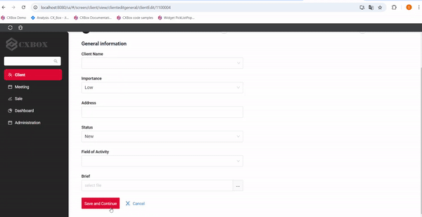

#### Changed: Improved data loading logic for child components with `hidden` parent

We have adjusted the logic of loading data into child business components when their parent widget is `hidden`  

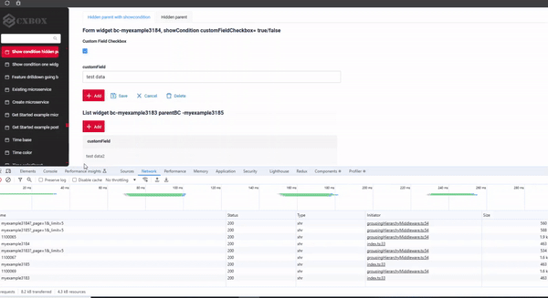  

#### Other Changes
see [cxbox-ui changelog](https://github.com/CX-Box/cxbox-ui/releases/tag/2.4.0)

### CXBOX 4.0.0-M10 ([Core](https://github.com/CX-Box/cxbox/tree/cxbox-4.0.0-M10))  

#### Added: FieldMetaBuilder class - `getParentField()` method support

This update makes `getParentField()` method available in FieldMetaBuilder. We have also introduced a new method `getBc()` in FieldMetaBuilder and `*ResponseService` classes

#### Added: FieldMetaBuilder class - `defaultGroupingHierarchy` method support
Example 1: <strong>explicitly</strong> provided default hierarchy tree (grouped by two Enum fields <strong>document</strong> and then <strong>briefing</strong>):
```java
fields.defaultGroupingHierarchy(
MeetingDocumentsDTO_.document,
MeetingDocumentsDTO_.briefing,
lvl -> lvl
  .add(
    Documents.POLICY,
    lvl2 -> lvl2
      .add(Briefings.PROJECT)
      .add(Briefings.SECURITY)
   )
  .add(
    Documents.COMPLIANCE
  )
);
```

Example 2: <strong>dynamically</strong> provided default hierarchy tree. Can be convenient, when default hierarchy structure is configurable through admin UI, so needed to be loaded from DB/microservice:
```java
Map<Documents, Set<Briefings>> external = Map.of(
 Documents.REFERENCE, Set.of(Briefings.FINANCIAL, Briefings.PROJECT),
 Documents.POLICY, new HashSet<>()
);
fields.defaultGroupingHierarchy(
 MeetingDocumentsDTO_.document,
 MeetingDocumentsDTO_.briefing,
 lvl1 -> external.entrySet().stream().collect(Hierarchy.toHierarchy(
   Entry::getKey,
   (doc, lvl2) -> doc.getValue().stream().collect(Hierarchy.toHierarchy(brief -> brief))
  )
 )
);
```
#### Other Changes
see [cxbox changelog](https://github.com/CX-Box/cxbox/releases/tag/cxbox-4.0.0-M10)

### CXBOX [plugin](https://plugins.jetbrains.com/plugin/19523-platform-tools)  

We've updated the plugin to version 1.7.7. New version of Plugin is currently being reviewed by JetBrains and will be available in a few business days

#### Added: *.screen.json - inspection when "type" : "standard"  

We have added inspections for screens that have explicitly set `"type"="standard"` in .screen.json. These include making sure each `viewName` is unique, detecting empty arrays. We have also improved view generation (triggered by `+` icon click)

#### Added: *.widget.json - auto-completion and navigation for `actionKey` 

Previous plugin versions provided navigation for actions referenced in `options->actionGroups` of .widget.json.
In this release we added same feature for actions referenced in `options->buttons->actionKey` tag of .widget.json used for files drag-and-drop configuration.  

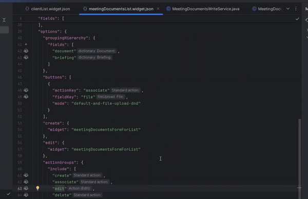{width="800"}

#### Added: *.widget.json - inspection for actionGroups location.  

We have added an inspection for `actionGroups` tag in .widget.json to ensure it is located within `options`.  

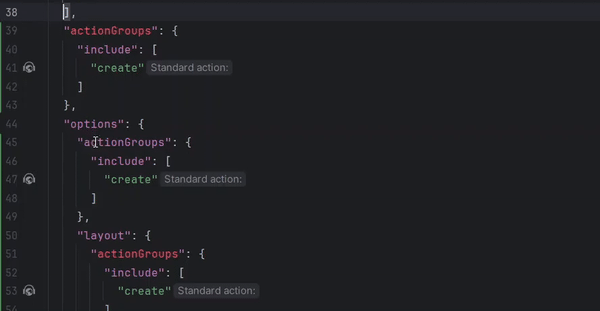{width="800"}  

### CXBOX [documentation](https://doc.cxbox.org/)  

#### Added: [PickListPopup](/widget_type_pick_list_popup) widget - documentation article  

We have added a description of [PickListPopup](/widget_type_pick_list_popup).

#### Added: List, Form, Info Widget's - showCondition documentation article  

We have added a full description of [Show Condition](https://doc.cxbox.org/widget/type/property/showcondition/showcondition/) and showCondition option for three main widgets ([Form](https://doc.cxbox.org/widget/type/formfamily/form/form/#show-condition), [Info](https://doc.cxbox.org/widget/type/infofamily/info/info.md/#show-condition), [List](https://doc.cxbox.org/widget/type/listfamily/list/list/#show-condition)).

#### Added: Money field - currency property section  

We have added a [currency](https://doc.cxbox.org/widget/fields/field/money/money/#currency) property description in Money field.

