# 2.0.7

* [cxbox/demo 2.0.7 git](https://github.com/CX-Box/cxbox-demo/tree/v2.0.7), [release notes](https://github.com/CX-Box/cxbox-demo/releases/tag/v2.0.7)

* [cxbox/core 4.0.0-M9 git](https://github.com/CX-Box/cxbox/tree/cxbox-4.0.0-M9), [release notes](https://github.com/CX-Box/cxbox/releases/tag/cxbox-4.0.0-M9), [maven](https://central.sonatype.com/artifact/org.cxbox/cxbox-starter-parent/4.0.0-M9)

* [cxbox-ui/core 2.4.0 git](https://github.com/CX-Box/cxbox-ui/tree/2.4.0), [release notes](https://github.com/CX-Box/cxbox-ui/releases/tag/2.4.0), [npm](https://www.npmjs.com/package/@cxbox-ui/core/v/2.4.0)  

## **Key updates October 2024**  

### CXBOX ([Demo](https://github.com/CX-Box/cxbox-demo))  

#### Grouping Hierarchy Display

We have improved Grouping Hierarchy widget.

1) **Compact Display**. Hierarchies now expand within the same row as grouping fields. If grouping fields are empty or contain a single item, the hierarchy displays as expanded by default, reducing unnecessary clicks.  

*Before*:  

  

*After*:  

  

2) **Default Hierarchy Setup**. You can now explicitly set an empty default hierarchy structure using a new Java API. If additional data is provided from backend, frontend merges it with the default and ensures complete and accurate rendering.  

*Default Hierarchy*:  

  

*Here we provided some additional data from backend*:  

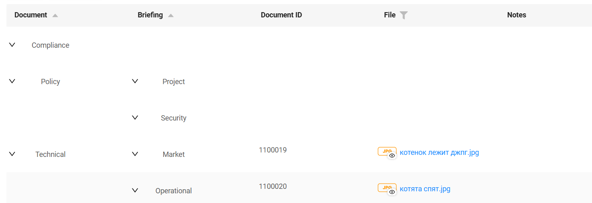

#### Updated info widget display (single- and multi-column)

We have updated the info widget display options for both single-column and multi-column layouts. You can now set `titleMode` to
`left` or `top` in the settings. When it is set to `left`, the title is on the left. When it is set to `top`, it is displayed above.
The default is `left`.

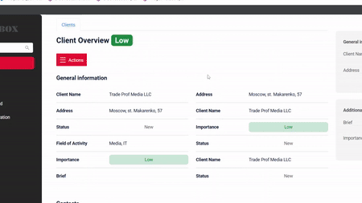  

#### Added currency support for field Money

The Money field now supports currency. It allows you to add and display currency values within the interface. If you only need to display a fixed currency value, you can use a constant currency.

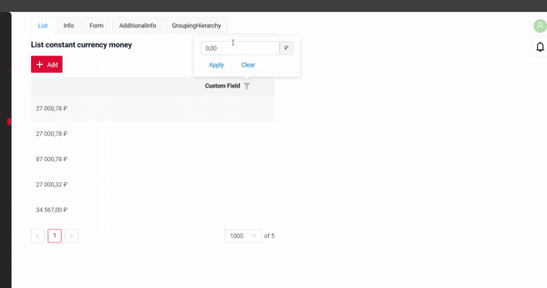

#### Checkbox display improvement

We have improved the checkbox display by aligning it with other field types and added support for a placeholder.

*Checkbox in List widget:*

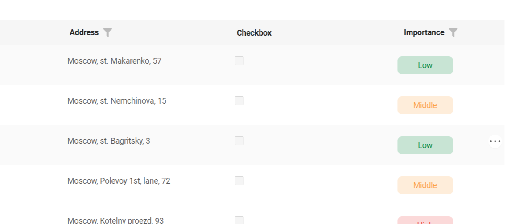

*Checkbox Placeholder:*

#### Introduced row editing style validation in List widget 

A new feature has been implemented to validate the consistency of row editing styles in List widget, based on the configuration specified in the `options`. If the explicitly set style option (e.g., inline, inlineForm, none) does not match the implied editing style (e.g., inlineForm is implied if a widget name is provided), an error is logged in the console. 

#### Fixed the display of several PreInvoke custom form widgets on the same bc  

It is now possible to set different popup forms for different buttons on the same bc.  

 
### CXBOX ([Core Ui](https://github.com/CX-Box/cxbox-ui))

#### Button logic when required fields are left empty  

We have adjusted the logic of buttons with `withoutAutoSaveBefore()` when required fields are left empty on the form. Now, a notification pop-up will appear and notify about the unsaved changes. 

#### Improved data loading logic for child components with `hidden` parent

We have adjusted the logic for loading data into child business components when their parent widget is `hidden`. This ensures reliable data loading across views.  

  

### CXBOX 4.0.0-M9 ([Core](https://github.com/CX-Box/cxbox))  

#### Updated showCondition  

We have actualized showCondition and marked certain unused parameters as `@Deprecated`: key, sequence, isDefault and multipleParams in the `Condition` class and valueList in the `IConditionFieldEqualityParams` class.

#### Extended `getParentField()` Support to FieldMetaBuilder  

This update adds the `getParentField()` method, making it accessible not only in services but also in FieldMetaBuilder. We have also introduced a new method `getBc()` to maintain backward compatibility. This allows bc to be used in `FieldMetaBuilder` without changing existing functionality.  

#### Fixed `EntityNotFoundException` for Non-Long ID Handling  

We have updated `EntityNotFoundException` by replacing `getIdAsLong` with `getId` to prevent incorrect error handling when dealing with non-Long IDs, such as strings. This change ensures that if an entity is not found, a clear "Entity Not Found" message is provided instead of a type-casting error.

### CXBOX [plugin](https://plugins.jetbrains.com/plugin/19523-platform-tools)  

We've updated the plugin to version 1.7.7.

#### Validation for Standard screen type  

We have added checks for screens with type `standard`. These include making sure each `viewName` is unique, detecting empty arrays, and checking for duplicates on the same screen. We have also fixed view generation for child elements in `singular` and `aggregate` types.  

1) Singular and Aggregate Generation  

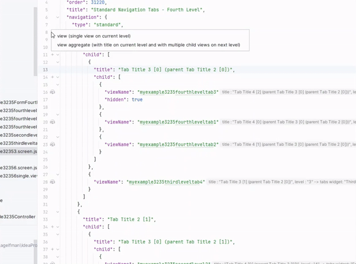  

2) No Empty Arrays Check  

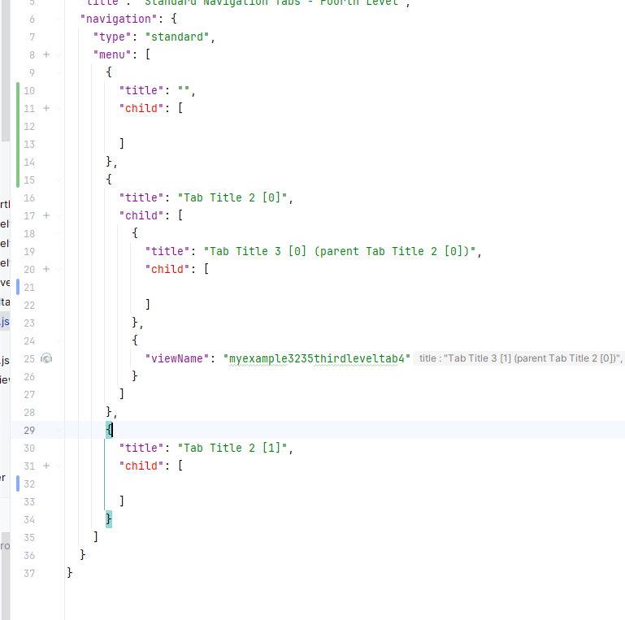  

3) Unique `viewName` Check  

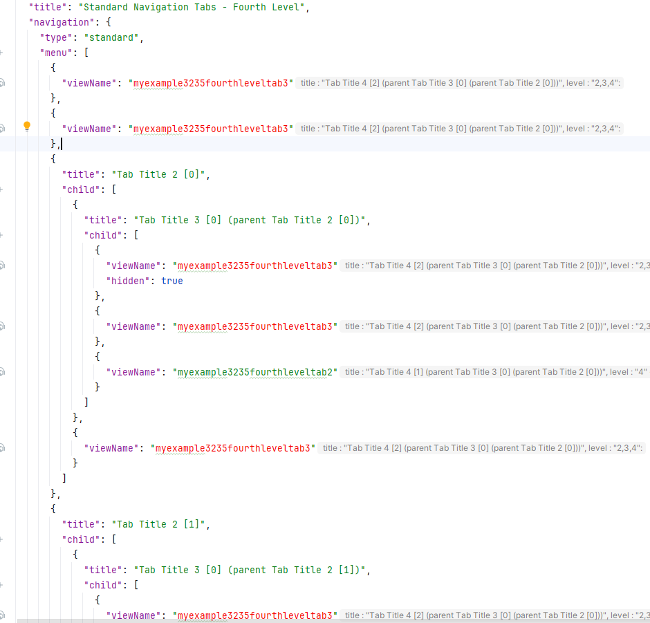

#### Added auto-completion for `options` with `Key` postfix  

We have regulated the logic of navigation and auto-completion for fields with `Key` postfix.  
Now, when you set a field using `Key` postfix in `options`, its values will be automatically taken from the `fields` array at the beginning of the file. For fields in this array, values are sourced from the DTO.  

  

As for `actionKey`, you can set either a `standard` or a `custom` action. If you set a `standard` action, the value is taken from the core file, if you set a `custom` one - the value is taken from the file, where the `.action` is first introduced.  

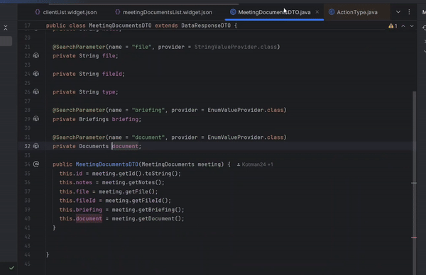

#### Added inspection for actionGroups location.  

We have added an inspection for `actionGroups` to ensure it is located within `options`.  

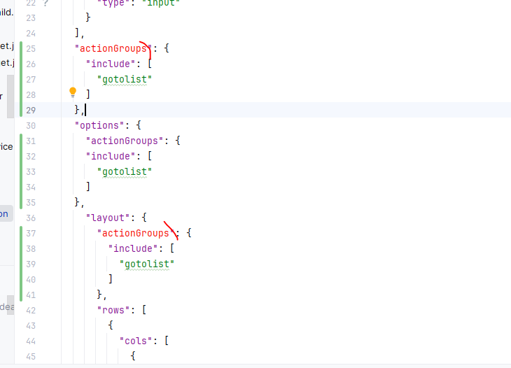

### CXBOX [documentation](https://doc.cxbox.org/)  

#### PickListPopup  

We have added a description of [PickListPopup](https://doc.cxbox.org/widget/type/pickListPopup/pickListPopup/).

#### showCondition for widgets  

We have added a full description of [Show Condition](https://doc.cxbox.org/widget/type/property/showcondition/showcondition/) and showCondition option for three main widgets ([Form](https://doc.cxbox.org/widget/type/form/form/#show-condition), [Info](https://doc.cxbox.org/widget/type/info/info/#show-condition), [List](https://doc.cxbox.org/widget/type/list/list/#show-condition)).

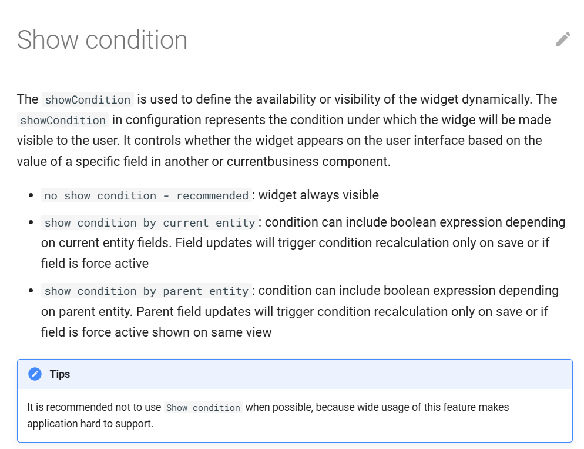

#### Currency  

We have added a [currency](https://doc.cxbox.org/widget/fields/field/money/money/#currency) property description in Money field.

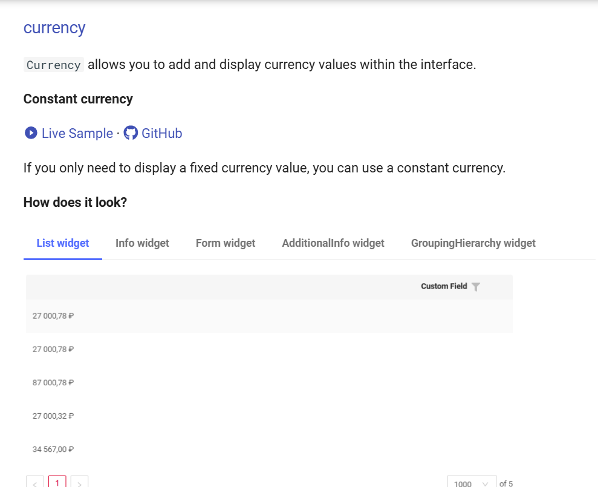

