# 2.0.8

* [cxbox/demo 2.0.8 git](https://github.com/CX-Box/cxbox-demo/tree/v.2.0.8), [release notes](https://github.com/CX-Box/cxbox-demo/releases/tag/v.2.0.8)

* [cxbox/core 4.0.0-M11 git](https://github.com/CX-Box/cxbox/tree/cxbox-4.0.0-M11), [release notes](https://github.com/CX-Box/cxbox/releases/tag/cxbox-4.0.0-M11), [maven](https://central.sonatype.com/artifact/org.cxbox/cxbox-starter-parent/4.0.0-M11)

* [cxbox-ui/core 2.4.1 git](https://github.com/CX-Box/cxbox-ui/tree/2.4.1), [release notes](https://github.com/CX-Box/cxbox-ui/releases/tag/2.4.1), [npm](https://www.npmjs.com/package/@cxbox-ui/core/v/2.4.1)

* [cxbox/code-samples 2.0.8 git](https://github.com/CX-Box/cxbox-code-samples/tree/v.2.0.8), [release notes](https://github.com/CX-Box/cxbox-code-samples/releases/tag/v.2.0.8)

## **Key updates November 2024**  

### CXBOX ([Demo](http://demo.cxbox.org))  

#### Added: GroupingHierarchy widget - counter  

We have added a counter for grouping fields to display the number nested rows with data. You configure it with `counterMode` (possible values: `always`, `collapsed` and default `none`)  

=== "None"
    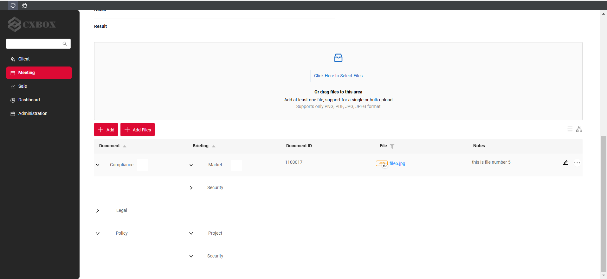
=== "Collapsed"  
    
=== "Always"  
      

#### Added: GroupingHierarchy widget - nodes expanded by default  

It is now possible configure expanded by default (`defaultExpanded` = `true`) nodes of GroupingHierarchy widget

=== "defaultExpanded: false/ null"  
    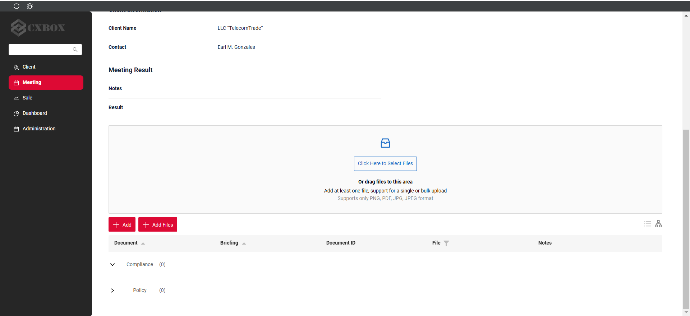  
=== "defaultExpanded: true"  
    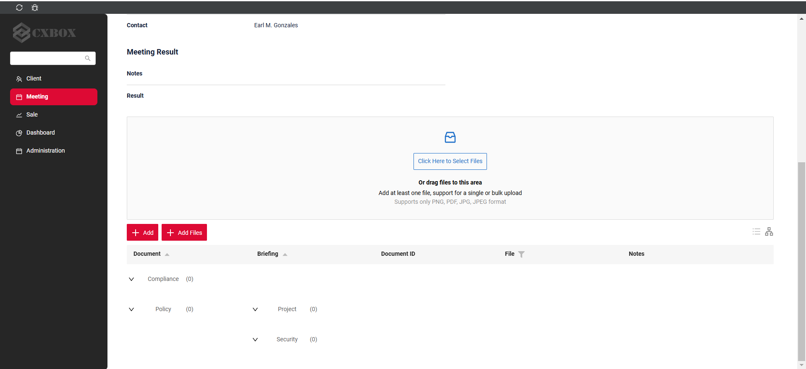

_Note!_ To reduce user clicks we always expand groups, that will use only 1 row, when expanded. So, when `defaultExpanded` is `false` or `null`, then nodes are by default 'smartly' collapsed:

* groups with 1 or 0 elements are expanded
* groups with more than 1 element are collapsed.

#### Changed: Additional Info widget - style  

We have updated the style of Additional Info widget.  

=== "After" 
    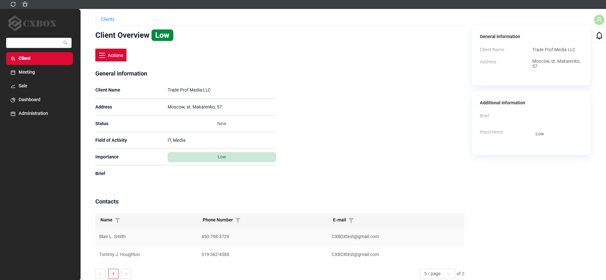
=== "Before"  
    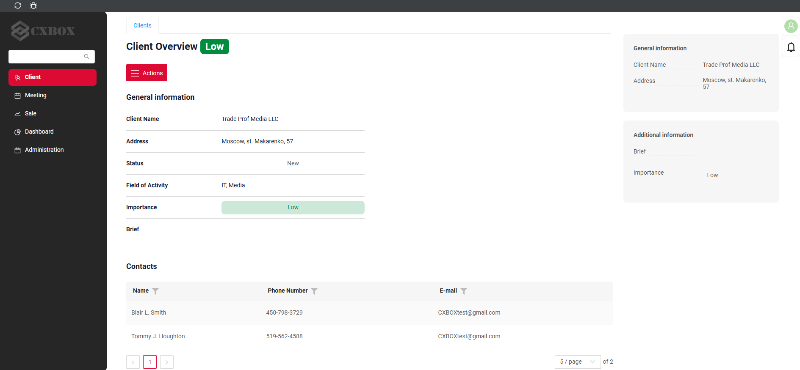

#### Added: Additional List widget - new widget type!  

We have introduced a new widget type - `AdditionalList`, which can display multiple data rows

* In this release: one must provide `.widget.json -> options -> read` parameter, that points to `AdditionalInfo` widget used to render each data row
* In next releases: one will be able to skip `.widget.json -> options -> read` parameter, e.g. render `AdditionalList` rows with default `List`-like style

=== "After"
    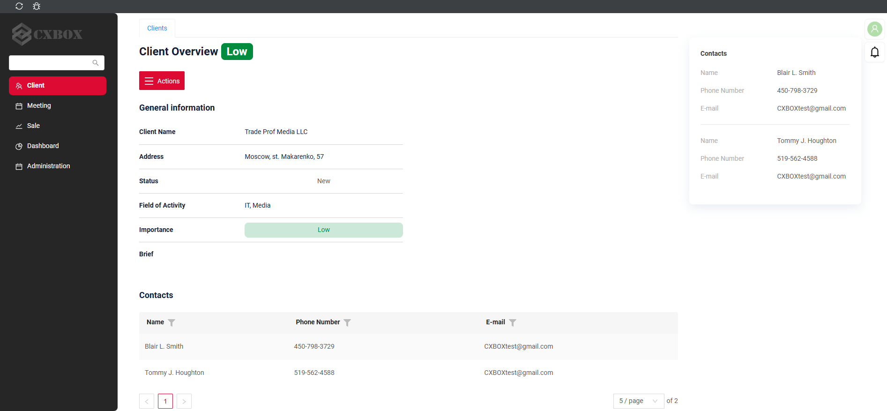
=== "Before"
    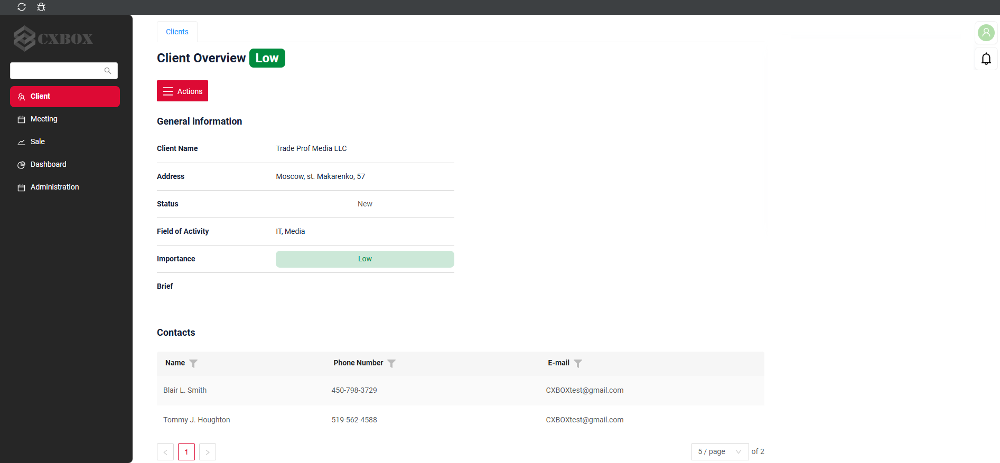  

#### Added: Dictionary field - icon support

It is now possible to set icon for a `dictionary` field. Using the `mode` parameter, you can either set it to `default` (displays both the icon and text) or `icon` (displays only icon).
Also, tooltip always appears on icon hover.

=== "Icon set (default)"
    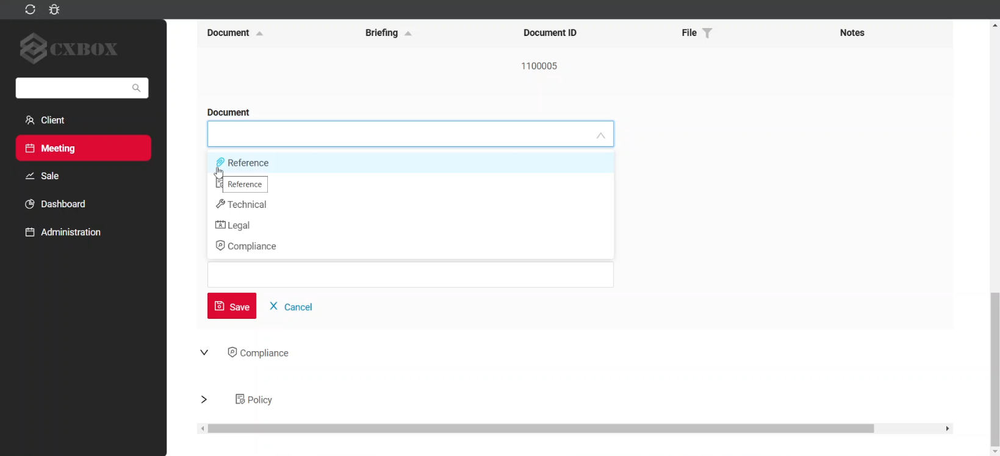
=== "Icon set (mode=icon)"
    
=== "No icon set"
    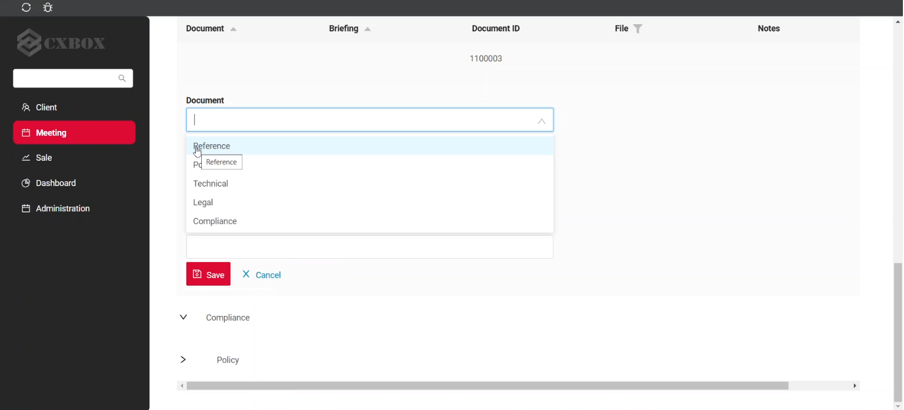  

#### Added: View - widget groups support 

You can now group multiple widgets together and collapse or expand them. The first widget in the group gets an icon to control collapsing. When collapsed, all widgets in the group become hidden except for the title of the first widget. The group of widgets is displayed as expanded by default.   

=== "Expanded (Default)"
    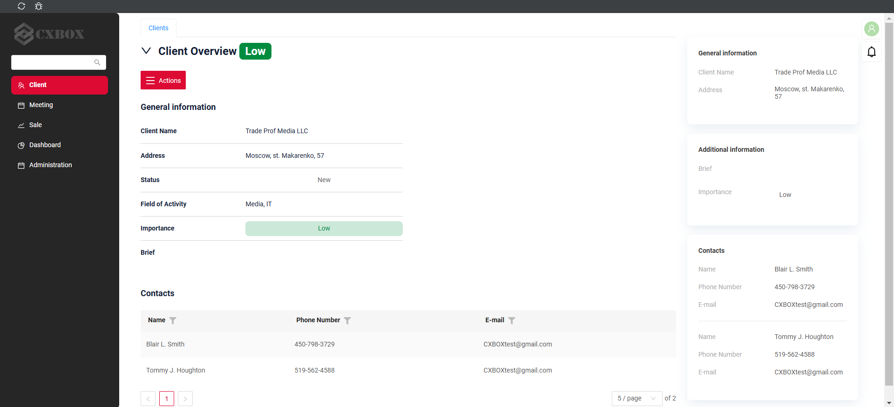
=== "Collapsed"
    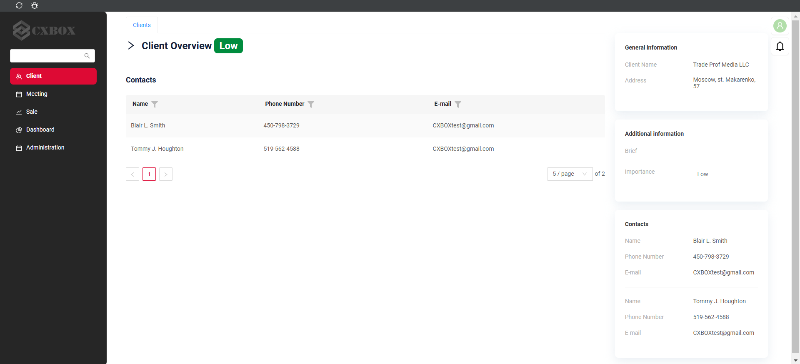

#### Other Changes
see [cxbox-demo changelog](https://github.com/CX-Box/cxbox-demo/releases/tag/v.2.0.8)  

### CXBOX ([Core Ui](https://github.com/CX-Box/cxbox-ui/releases/tag/2.4.1))  

#### Added: parameter for displaying icon in dictionary fields  

We have added support for icons to Dictionary field under a new `allValues` tag. Each entry in `allValues` includes an `icon` attribute, allowing configuration of the icon`s direction (ANT or custom) and color according to the corresponding value. 

#### Other Changes
see [cxbox-ui changelog](https://github.com/CX-Box/cxbox-ui/releases/tag/2.4.1)  

### CXBOX 4.0.0-M11 ([Core](https://github.com/CX-Box/cxbox/tree/cxbox-4.0.0-M11))  

#### Changed: Icon handling methods for dictionary fields

Such methods as `setIconWithValue()` and `setFilterValuesWithIcons()` are now marked as `@Deprecated`. They have been replaced by a new method `setAllValuesWithIcons()`, which is applicable for both LOV and Enum types  

#### Added: parameter for managing default display mode for Default Grouping Hierarchy  

A new Boolean `defaultExpanded` has been introduced.

#### Other Changes
see [cxbox changelog](https://github.com/CX-Box/cxbox/releases/tag/cxbox-4.0.0-M11)

### CXBOX [documentation](https://doc.cxbox.org/)  

#### Added: [Dictionary](/widget_field_dictionary) - Icon section  

We have added a full description of [Icon](https://doc.cxbox.org/widget/fields/field/dictionary/dictionary/#icon) in Dictionary field. 

