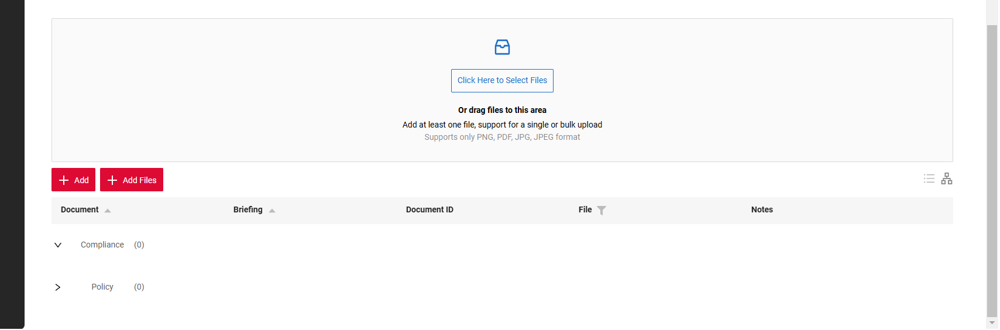
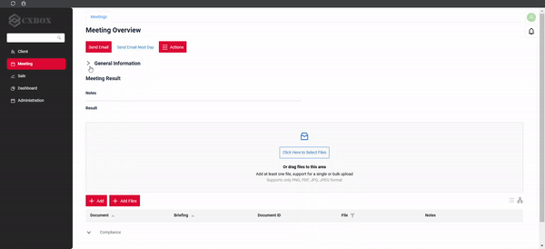
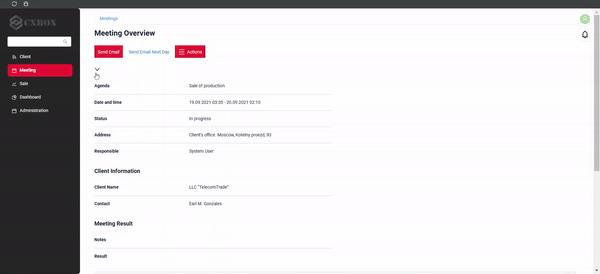

# 2.0.8

* [cxbox/demo 2.0.8 git](https://github.com/CX-Box/cxbox-demo/tree/v.2.0.8), [release notes](https://github.com/CX-Box/cxbox-demo/releases/tag/v.2.0.8)

* [cxbox/core 4.0.0-M11 git](https://github.com/CX-Box/cxbox/tree/cxbox-4.0.0-M11), [release notes](https://github.com/CX-Box/cxbox/releases/tag/cxbox-4.0.0-M11), [maven](https://central.sonatype.com/artifact/org.cxbox/cxbox-starter-parent/4.0.0-M11)

* [cxbox-ui/core 2.4.1 git](https://github.com/CX-Box/cxbox-ui/tree/2.4.1), [release notes](https://github.com/CX-Box/cxbox-ui/releases/tag/2.4.1), [npm](https://www.npmjs.com/package/@cxbox-ui/core/v/2.4.1)

* [cxbox/code-samples 2.0.8 git](https://github.com/CX-Box/cxbox-code-samples/tree/v.2.0.8), [release notes](https://github.com/CX-Box/cxbox-code-samples/releases/tag/v.2.0.8)

## **Key updates November 2024**  

### CXBOX ([Demo](http://demo.cxbox.org))  

#### Added: Grouping Hierarchy widget - counter  

We have added a counter for grouping fields to display the number of strings with data within each group. You can now set counterMode to `always`, `collapsed` (the counter is displayed only when the group is collapsed) or `none` in the settings.  

=== "None"
    
=== "Collapsed"  
    
=== "Always"  
      

#### Added: Grouping Hierarchy widget - default display mode 

It is now possible to manage the default display mode of Default Hierarchy. When the new parameter `defaultExpanded` is set to `true` the hierarchy is expanded by default. When it is set to `false` or `null`, the hierarchy display follows a general rule: groups with 1 or 0 elements are expanded; groups with more than 1 element are collapsed.  

=== "defaultExpanded: false/ null"  
      
=== "defaultExpanded: true"  
    

#### Changed: Additional Info widget - style  

We have updated the style of Additional Info widget.  

=== "After" 
    
=== "Before"  
    

#### Added: Additional List widget - new widget type!  

We have introduced a new widget type - Additional List, which can display multiple data rows. By setting the necessary `read` parameter, you link it to Additional Info widget. With this parameter set, Additional List looks like various Additional Info widgets, displayed one under another with a dividing line.  

=== "After"
    
=== "Before"
      

#### Added: Dictionary field - support for icon

It is now possible to set icon for a Dictionary field. Using the `mode` parameter, you can either set it to `default` (displays both the icon and text) or `icon` (displays only icon).
When hovering over the icon, a tooltip appears.

=== "After: default"
    
=== "After: icon"
    
=== "Before"
      

#### Added: grouping and collapsing widgets  

You can now group multiple widgets together and collapse or expand them as needed. The first widget in the group gets an icon to control collapsing. When collapsed, all widgets in the group become hidden except for the title of the first widget. The group of widgets is displayed as expanded by default.   

=== "Expanded (Default)"
    
=== "Collapsed"
      

If the title of the first widget is empty, the collapse icon will be displayed above the widget.  

=== "Title" 
    
=== "No title"
    

#### Other Changes
see [cxbox-demo changelog](https://github.com/CX-Box/cxbox-demo/releases/tag/v.2.0.8)  

### CXBOX ([Core Ui](https://github.com/CX-Box/cxbox-ui/releases/tag/2.4.0))  

#### Added: parameter for displaying icon for Dictionary field  

We have added support for icons to Dictionary field under a new `allValues` tag. Each entry in `allValues` includes an `icon` attribute, allowing configuration of the icon`s direction (ANT or custom) and color according to the corresponding value. 

#### Other Changes
see [cxbox-ui changelog](https://github.com/CX-Box/cxbox-ui/releases/tag/2.4.1)  

### CXBOX 4.0.0-M11 ([Core](https://github.com/CX-Box/cxbox/tree/cxbox-4.0.0-M11))  

#### Changed: Icon handling methods for Dictionary field

Such methods as `setIconWithValue()` and `setFilterValuesWithIcons()` are now marked as `@Deprecated`. They have been replaced by a new interface `Icon` and a method `setAllValuedWithIcons()`, which are applicable to both LOV and Enum types.  

#### Added: parameter for managing default display mode for Default Grouping Hierarchy  

A new Boolean `defaultExpanded` has been introduced.

#### Other Changes
see [cxbox changelog](https://github.com/CX-Box/cxbox/releases/tag/cxbox-4.0.0-M11)  

### CXBOX [plugin](https://plugins.jetbrains.com/plugin/19523-platform-tools)  
We've updated the plugin to version 1.7.8. New version of Plugin is currently being reviewed by JetBrains and will be available in a few business days!

#### Changed: optional `title` field for Dictionary  

We have updated the plugin's inspection for the Dictionary field to make the title field optional. Now, of the title is left blank, error message will not be displayed.  

### CXBOX [documentation](https://doc.cxbox.org/)  

#### Added: [Dictionary](/widget_field_dictionary) - Icon section  

We have added a full description of [Icon](https://doc.cxbox.org/widget/fields/field/dictionary/dictionary/#icon) in Dictionary field. 

