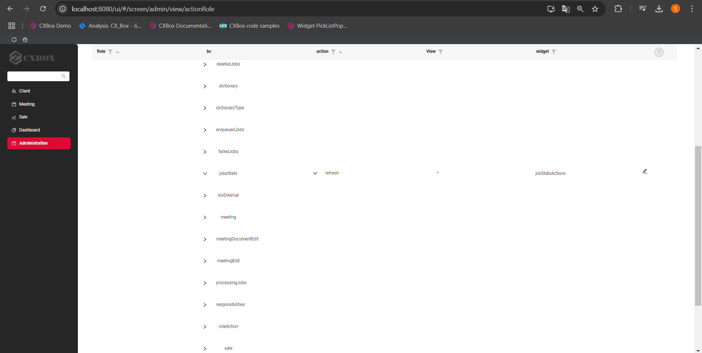
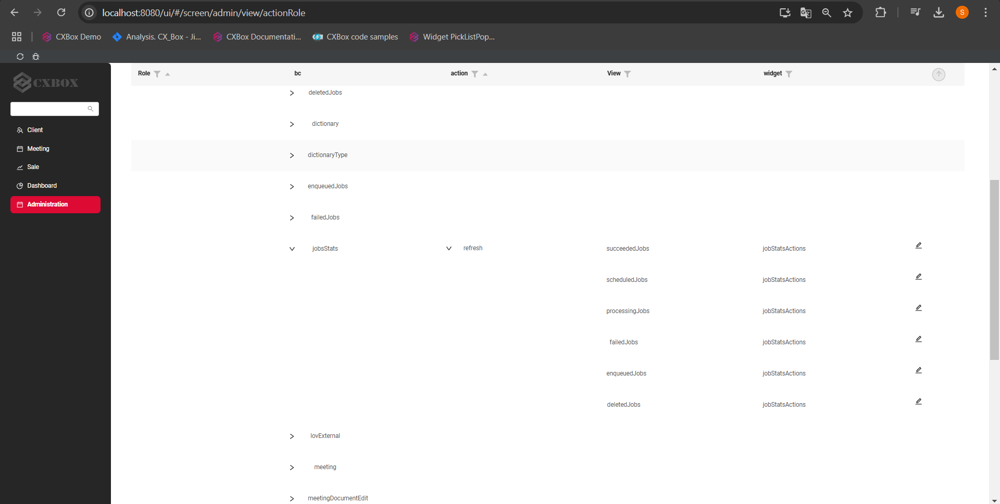

# 2.0.9

* [cxbox/demo 2.0.9 git](https://github.com/CX-Box/cxbox-demo/tree/v.2.0.9), [release notes](https://github.com/CX-Box/cxbox-demo/releases/tag/v.2.0.9)

* [cxbox/core 4.0.0-M12 git](https://github.com/CX-Box/cxbox/tree/cxbox-4.0.0-M12), [release notes](https://github.com/CX-Box/cxbox/releases/tag/cxbox-4.0.0-M12), [maven](https://central.sonatype.com/artifact/org.cxbox/cxbox-starter-parent/4.0.0-M12)  

* [cxbox-ui/core 2.4.2 git](https://github.com/CX-Box/cxbox-ui/tree/2.4.2), [release notes](https://github.com/CX-Box/cxbox-ui/releases/tag/2.4.2), [npm](https://www.npmjs.com/package/@cxbox-ui/core/v/2.4.2)

<!--* [cxbox/code-samples 2.0.9 git](https://github.com/CX-Box/cxbox-code-samples/tree/v.2.0.9), [release notes](https://github.com/CX-Box/cxbox-code-samples/releases/tag/v.2.0.9) --> 

## **Key updates November, December 2024**

### CXBOX ([Demo](http://demo.cxbox.org))  

#### Added: Dictionary field - Administration UI  

* A new Administration Screen has been added to the UI, allowing you to configure dictionaries directly from the interface  
* Changes made through the UI are applied instantly (experimental feature, does not support cluster)  
* You can now export dictionary data to a CSV file using the Export to CSV button. The exported file format matches the exact structure required for deployment, which makes migration process easier without any manual adjustments  
* CSV migration with Liquibase ensures effortless pre-filling and data transfer between environments (production ready)

  

See details in the updated Dictionary article, section [Administration Dictionary](https://doc.cxbox.org/widget/fields/field/dictionary/dictionary/#administration-dictionary).  

#### Added: Role-Based Model - View Responsibilities Configuration

BEFORE:

* View responsibilities are configured in `view.json -> rolesAllowed`.
* Database management of the Responsibilities table is only possible through `view.json`.

AFTER:

We have supported a new view responsibilities configuration under the parameter `view-allowed-roles-enabled: false`. If you indicate `view-allowed-roles-enabled: true`, the behavior is the same as in BEFORE.

If you indicate `view-allowed-roles-enabled: false` the changes are as follows:

* A new Administration Screen has been introduced in the UI for configuring view responsibilities directly  
* Any updates made in the UI are applied instantly (experimental feature, does not support cluster)
* Data can now be exported to a CSV file via the Export to CSV button in the UI. The exported file format aligns perfectly with the requirements for deployment, allowing quick migration of changes across environments without any additional formating.  
* CSV migration with Liquibase ensures effortless pre-filling and data transfer between environments (production ready)  

#### Added: Role-Based Model - Action Responsibilities Configuration

BEFORE:

* Security Layer: Action availability is tied only to a business component (BC) and determined by backend logic using `.available(bc -> true/false/any business logic)`.
* UI Layer: Action visibility (e.g., buttons on widgets) is managed in `widget.json -> include -> actionGroups`.

AFTER:

We have introduced a new parameter `widget-action-groups-enabled: true/false`. If you indicate `widget-action-groups-enabled: true` the behavior will be the same as in BEFORE.

If you indicate `widget-action-groups-enabled: false` the changes are as follows:

* The UI now includes an Administration Screen for configuring action responsibilities directly. Additionally, a database table (responsibilities_action) has been introduced to store action responsibilities data.   
* Changes made via the UI are applies instantly (experimental feature, does not support cluster)  
* With the Export to CSV feature, you can export action responsibilities data in a format ready for deployment, making it simple to migrate changes between environments without manual adjustments.  
* CSV migration with Liquibase ensures effortless pre-filling and data transfer between environments (production ready)

We have introduced another new parameter `widget-action-groups-compact: true/false`. If you indicate `widget-action-groups-compact: true` the responsibilities' data will be displayed in a compact way. Under this parameter, the asterisk (*) means that the responsibility is relevant for all roles and all views. This is especially helpful during migration process so that you don't have to handle with numerous data rows and just display them in a collapsed way instead. If you indicate `widget-action-groups-compact: false` the data will be displayed for each role and each view separately.  
=== "widget-action-groups-compact: true"  
      
=== "widget-action-groups-compact: false"  
    

#### Added: Role-Based Model - Multirole Configuration

BEFORE:

* Login Behavior. The backend returned an activeRole parameter indicating the user's active role (e.g., "activeRole": "CXBOX_USER").
* UI Behavior. The UI displayed a checkbox for the active role, and users can switch roles.  

AFTER:

We have added a new parameter `multi-role-enabled: true/false`. If you indicate `multi-role-enabled: false` the behavior is the same as in BEFORE.

If you indicate `multi-role-enabled: true` the changes are as follows:

* Login Behavior. The backend sends activeRole: null, and the UI ignores this value. All roles available to the user are sent in the roles list. The content of requests includes all views accessible by any of the user's roles. If the view is available for at least one role, it means that the view is available for all the roles in the multirole mode.
* UI Behavior. Checkboxes for all roles are displayed but are disabled, preventing role switching. Requests to the backend for role switching are no longer triggered.  

=== "After"  
    
=== "Before"  
    

#### Added: AdditionalList widget - new display mode  

Now, Additional List widget supports two display modes.  

* Default (NEW): each row in Additional List is rendered using the default List-like style.  
* (Old) If `options -> read` is populated with AdditionalInfo widget name: each row is rendered as specified  AdditionalInfo widget.   

=== "No read option"
    
=== "With read option"
      

#### Added: Notifications - drilldown to objects  

We have enhanced the Notifications popup to support multiple drilldown links.  

* The notification banner now displays number of links:
=== "After"    
    
=== "Before"  
      

* Clicking the bell icon opens the Notifications popup, where all hyperlinks to related objects are listed in the Links column. 
=== "After"
      
=== "Before"
        

#### Added: Drilldown - tooltip

Drilldowns has tooltip that appears on hover, offering two options:  

* Open in a New Tab: Open the drilldown link in a new browser tab.
* Copy Link Address: Copy the drilldown link to the clipboard. 

Feature can be turned on setting: cxbox.ui.drill-down-tooltip: newAndCopy.  
=== "After"  
    
=== "Before"  
    

*Limitations*:  

* Drilldowns of [to-view-with-fields-filtration](https://doc.cxbox.org/features/element/drilldown/drilldown/?h=drill#to-view-with-fields-filtration) type are currently not supported for the "Open in a New Tab" option.  
* The custom menu is not yet supported for the Stats Block widget.  

#### Added: FormPopup widget - forceActive  

We have introduced the `forceActive` feature for [FormPopup](https://doc.cxbox.org/widget/type/formpopup/formpopup/), allowing a backend request to be triggered before the modal window is opened. This ensures that the data within the popup is dynamically updated before being displayed, providing users with the most up-to-date information.  

{width="900"}  

#### Added: suggestionPickList field - backend query on first click  

We have optimized the functionality of `suggestionPickList` by removing the character limit for backend queries. Now, when users click on the field, a request is sent to the backend immediately, displaying all available data without the need to type any characters.  

{width="900"}  

#### Added: Notifications - Bearer Token Authentification for WebSocket

We have added support for Bearer token authentification when connecting to WebSocket endpoints for notifications. Now, the Bearer token is included in the request header for secure access to the following endpoints: `/api/v1/websocketnotification/` and `/api/v1/notification`.  

#### Added: FormPopup widget - width calculation enhancement  

We have improved the width calculation for [FormPopup](https://doc.cxbox.org/widget/type/formpopup/formpopup/). You can now directly indicate the width using `view.json -> widgets -> gridWidth` and the width now dynamically adjusts based on the following factors:  

* The state of the menu (collapsed or expanded)  
=== "gridWidth12 Menu Expanded"
    
=== "gridWidth Menu Collapsed"  
      

* The presence or absence of the additional widget on the view.  
=== "gridWidth12 No Additional"
    
=== "gridWidth12 With Additional"
    

These changes ensure that the `gridWidth` option for usual widget and for FormPopup widget has the same meaning (generates widgets of same size).  

See the detailed description in the updated [formPopup](https://doc.cxbox.org/widget/type/formpopup/formpopup/#widget-size) article.  

#### Fixed: List widget - improved inline create logic  

We enhanced the behavior of inline creation in List widgets. When adding a new row, it now automatically opens in edit mode, allowing users to immediately input data without extra clicks.  

  

#### Other Changes
see [cxbox-demo changelog](https://github.com/CX-Box/cxbox-demo/releases/tag/v.2.0.9)

### CXBOX ([Core Ui](https://github.com/CX-Box/cxbox-ui/releases/tag/2.4.2))  

We have released a new CORE UI version (2.4.2).  

#### Other Changes
see [cxbox-ui changelog](https://github.com/CX-Box/cxbox-ui/releases/tag/2.4.2)  

### CXBOX 4.0.0-M12 ([Core](https://github.com/CX-Box/cxbox/tree/cxbox-4.0.0-M12))   

#### Added: Dictionary class - LOV (deprecated) replacement.  

We have replaced the LOV strongly typed Dictionary class for managing configurable dictionaries. New Dictionary class uses specific subclasses to represent different types of dictionaries. It also has unified handling of dictionaries across Entity and DTO layers, ensuring consistency in compile time. Also, we enabled storing constants within subclasses for streamlines use in business logic.  

All details are provided in the updated [Dictionary](https://doc.cxbox.org/widget/fields/field/dictionary/dictionary/) article (see "Dictionary" tabs in all examples).  

  

#### Other Changes
see [cxbox changelog](https://github.com/CX-Box/cxbox/releases/tag/cxbox-4.0.0-M12)

### CXBOX [documentation](https://doc.cxbox.org/)  

#### Added: [Grouping Hierarchy](https://doc.cxbox.org/widget/type/groupinghierarchy/groupinghierarchy/)  
We have added a full description of Grouping Hierarchy.  

#### Added: [Export Excel](https://doc.cxbox.org/widget/type/property/export/excel/excel/)  
We have provided a detailed description of Export to Excel function.  

#### Added: [Page Limit](https://doc.cxbox.org/widget/type/property/defaultlimitpage/defaultlimitpage/)  
Default limit page (available for List and Grouping Hierarchy) is now described in the article.  

#### Added: [Checkbox - placeholder](https://doc.cxbox.org/widget/fields/field/checkbox/checkbox/?h=check#placeholder)  
See all the details about a Checkbox placeholder in our updated article. 

#### Added: [Customization of displayed columns](https://doc.cxbox.org/widget/type/list/list/#customization-of-displayed-columns)  
We have described the process of customization of displayed columns.  