# 2.0.9

* [cxbox/demo 2.0.9 git](https://github.com/CX-Box/cxbox-demo/tree/v.2.0.9), [release notes](https://github.com/CX-Box/cxbox-demo/releases/tag/v.2.0.9)

* [cxbox/core 4.0.0-M12 git](https://github.com/CX-Box/cxbox/tree/cxbox-4.0.0-M12), [release notes](https://github.com/CX-Box/cxbox/releases/tag/cxbox-4.0.0-M12), [maven](https://central.sonatype.com/artifact/org.cxbox/cxbox-starter-parent/4.0.0-M12)  

* [cxbox-ui/core 2.4.2 git](https://github.com/CX-Box/cxbox-ui/tree/2.4.2), [release notes](https://github.com/CX-Box/cxbox-ui/releases/tag/2.4.2), [npm](https://www.npmjs.com/package/@cxbox-ui/core/v/2.4.2)

* [cxbox/code-samples 2.0.9 git](https://github.com/CX-Box/cxbox-code-samples/tree/v.2.0.9), [release notes](https://github.com/CX-Box/cxbox-code-samples/releases/tag/v.2.0.9)

* cxbox/intellij-plugin [Jetbrains Marketplace](https://plugins.jetbrains.com/plugin/19523-platform-tools/versions/stable/653424),[plugin.zip](v2.0.9/plugin.zip){:download="plugin.zip"}

## **Key updates November, December 2024**

### CXBOX ([Demo](http://demo.cxbox.org))  

#### Added: AdditionalList widget - new display mode  

Now, Additional List widget supports two display modes.

* (NEW) Default: each row in Additional List is rendered using the default List-like style.
* (OLD) If `options -> read` is populated with AdditionalInfo widget name: each row is rendered as specified  AdditionalInfo widget.

=== "Default"
    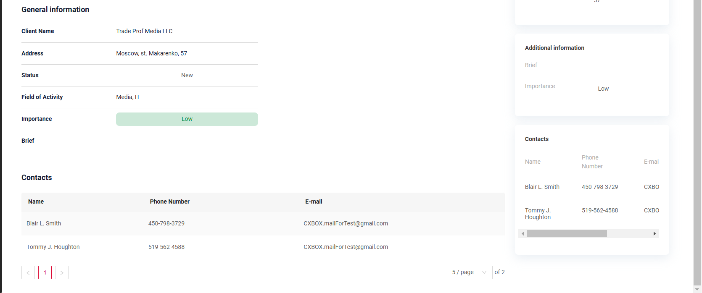
=== "With read option"
    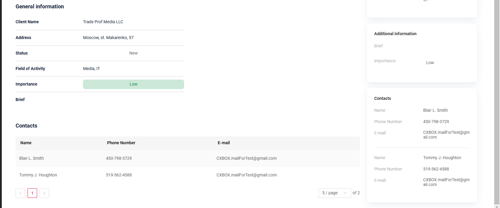

#### Added: Notifications - drilldown to objects

We have enhanced the Notifications popup to support multiple drilldown links.

* The notification banner now displays number of links: 

=== "After"  
    
=== "Before"  
    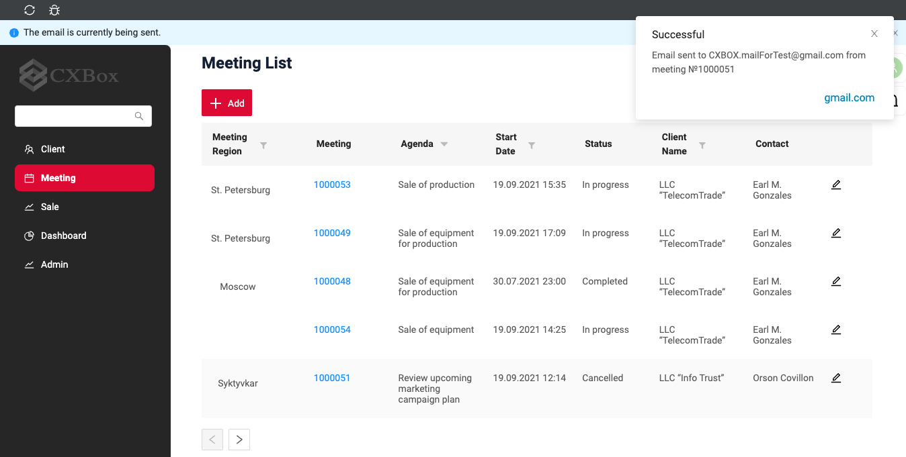

* Clicking the bell icon opens the Notifications popup, where all hyperlinks to related objects are listed.  

=== "After"  
    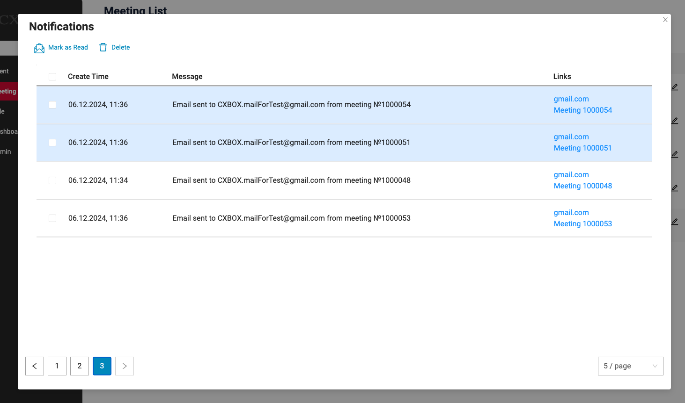  
=== "Before"  
    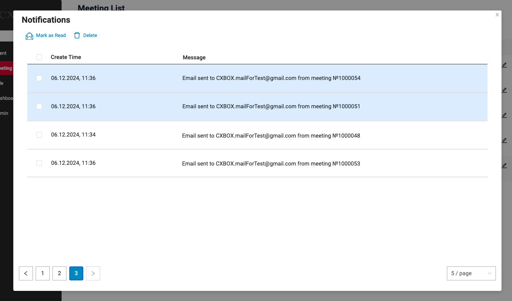  

#### Added: FormPopup widget - gridWidth support  

We now support `gridWidth` for [FormPopup](https://doc.cxbox.org/widget/type/formpopup/formpopup/). You can now directly indicate the width using `view.json -> widgets -> gridWidth` and the width now dynamically adjusts based on the following factors:  

* The state of the menu (collapsed or expanded)  

=== "gridWidth12 Menu Expanded"  
    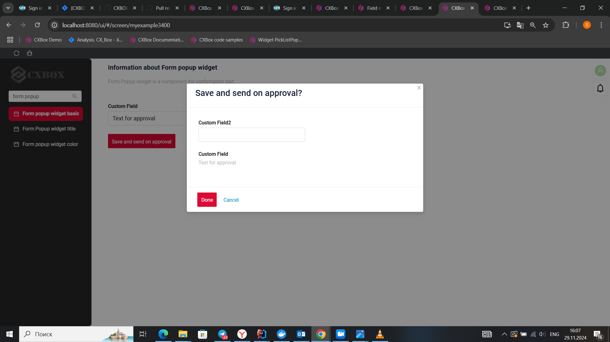   
=== "gridWidth Menu Collapsed"  
    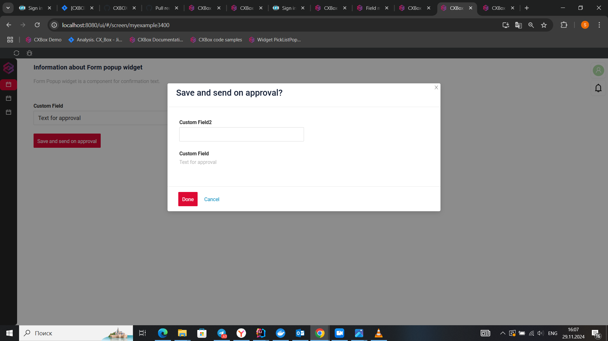  

* The presence or absence of the additional widget on the view.  

=== "gridWidth12 No Additional"
      
=== "gridWidth12 With Additional"
    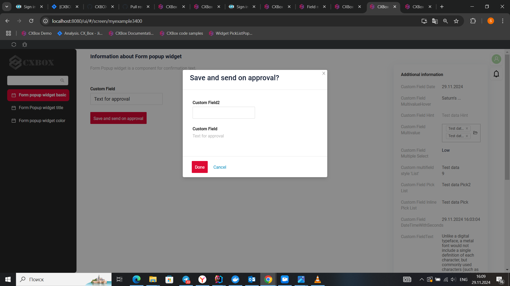

These changes ensure that the `gridWidth` option for usual widget and for FormPopup widget has the same meaning (e.g. generates widgets of same width).  

**Note!** Before this release value of `gridWidth` was ignored, e.g. popup widget was constant. After release one can set `gridWidth = 9` to remain old popup sizes.  

See the detailed description in the updated [formPopup](https://doc.cxbox.org/widget/type/formpopup/formpopup/#widget-size) article.  

#### Added: Dictionary field - Administration UI

* A new Administration Screen has been added to the UI, allowing you to configure `dictionaries` directly from the interface  
* Changes made through the UI are applied instantly via `Clear Cache` (experimental feature, does not support cluster)  
* You can now export dictionary data to a CSV file using the `Export`. Exported file format is same as used in Liquibase migration (see next paragraph) which makes migration process easier without any manual adjustments  
* A new CSV migration with Liquibase - ensures effortless pre-filling and data transfer between environments (production ready)

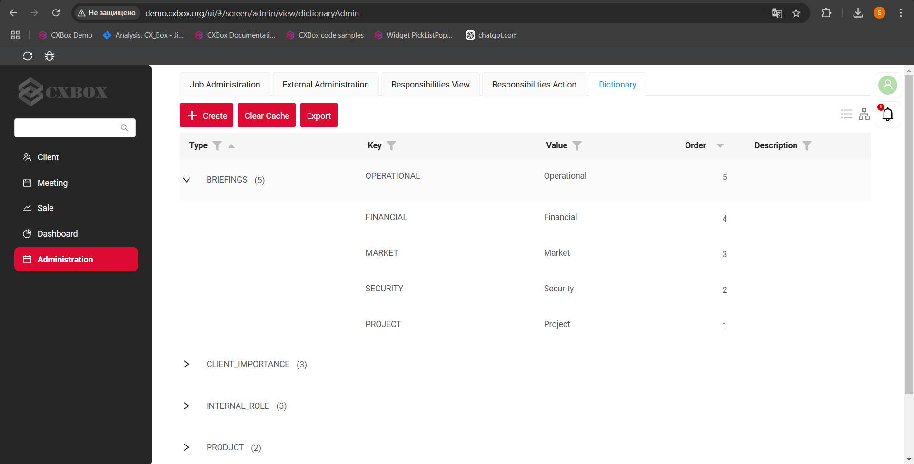  

See details in the updated Dictionary article:

* section [Administration Dictionary](https://doc.cxbox.org/widget/fields/field/dictionary/dictionary/#administration-dictionary)
* `How to add?` sections in this article now have snippets with `Dictionary` usage (instead of deprecated `LOV`)  

#### Added: Role-Based Model - MultiRole Support

BEFORE (`multi-role-enabled: false`):

* Login Behavior. The backend returned an activeRole parameter indicating the user's active role (e.g., "activeRole": "CXBOX_USER").
* UI Behavior. The UI displayed a checkbox for the active role, and users can switch roles.  

AFTER (`multi-role-enabled: true`):

* Login Behavior. The backend sends activeRole: null, and the UI ignores this value. All roles available to the user are sent in the roles list. The content of requests includes all views accessible by any of the user's roles. If the view is available for at least one role, it means that the view is available for user in the multirole mode.
* UI Behavior. Checkboxes for all roles are displayed but are disabled, preventing role switching. Requests to the backend for role switching are no longer triggered.  

=== "After"  
    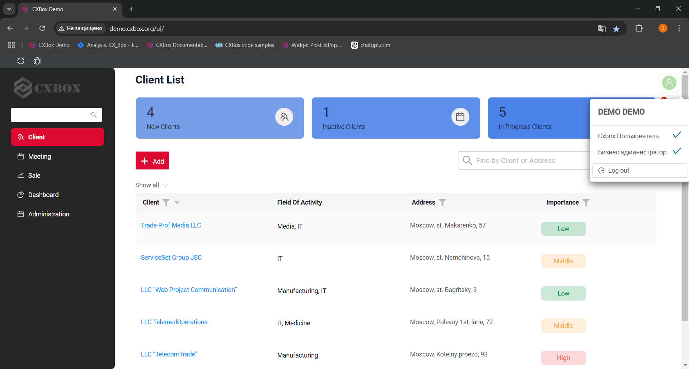
=== "Before"  
    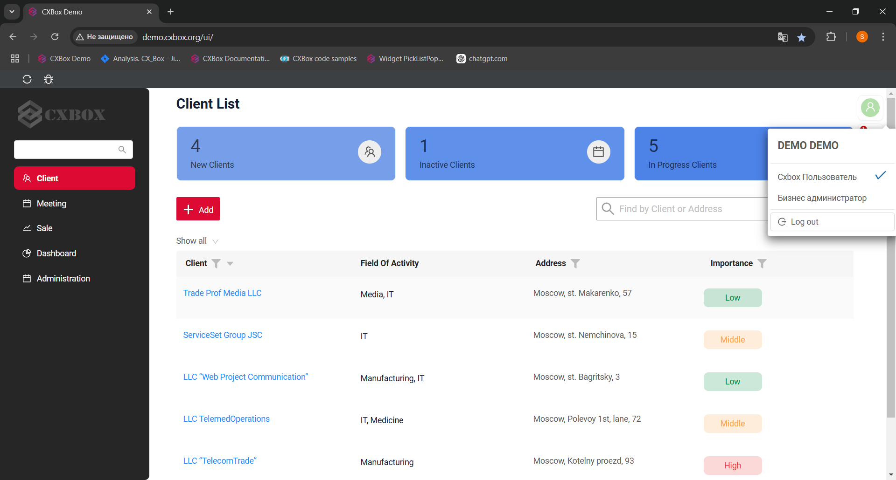  

#### Added: Role-Based Model - View Responsibilities Administration UI

BEFORE (`view-allowed-roles-enabled: true`):

* `view responsibilities` are configured in `view.json -> rolesAllowed`.
* Database management of the Responsibilities table is only possible through `view.json`.

AFTER (`view-allowed-roles-enabled: false`):

* A new Administration Screen has been introduced in the UI for configuring view responsibilities  
* Any updates made in the UI are applied instantly via `Clear Cache` (experimental feature, does not support cluster)
* You can now export `view responsibilities` data to a CSV file using the `Export`. Exported file format is same as used in Liquibase migration (see next paragraph) which makes migration process easier without any manual adjustments
* A new CSV migration with Liquibase - ensures effortless pre-filling and data transfer between environments (production ready)

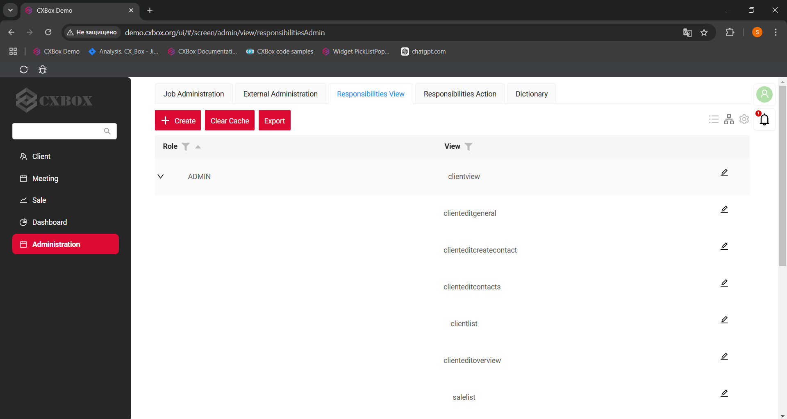

#### Added: Role-Based Model - Action Responsibilities Support

BEFORE (corresponds to `widget-action-groups-enabled: true`):

* UI Layer: Action visibility (e.g., buttons on widgets) is managed in `widget.json  -> actionGroups -> include`.

AFTER (`widget-action-groups-enabled: false`)

* The UI now includes an Administration Screen for configuring action responsibilities directly. Additionally, a database table (responsibilities_action) has been introduced to store action responsibilities data.   
* Any updates made in the UI are applied instantly via `Clear Cache` (experimental feature, does not support cluster)
* You can now export `action responsibilities` data to a CSV file using the `Export`. Exported file format is same as used in Liquibase migration (see next paragraph) which makes migration process easier without any manual adjustments
* A new CSV migration with Liquibase - ensures effortless pre-filling and data transfer between environments (production ready)

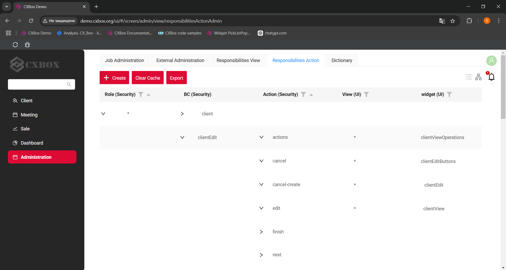

We have introduced automatic migration of `widget.json -> actionGroups -> include` configuration to `responsibilities_action`. Application fills table on start based on widget information if `widget-action-groups-enabled: true`. Only `widget.json -> actionGroups -> include` is supported - one should migrate manually if `widget.json -> actionGroups -> exclude` is used

Also, two migration modes introduced

=== "COMPACT (widget-action-groups-compact: true)"  
    If you indicate `widget-action-groups-compact: true` the `responsibilities_action` data will be filled in a compact way. Under this parameter, the asterisk (*) means that the responsibility is relevant for all roles and all views. This is especially helpful during migration process so that you don't have to handle with numerous data rows and just display them in a collapsed way instead.  
    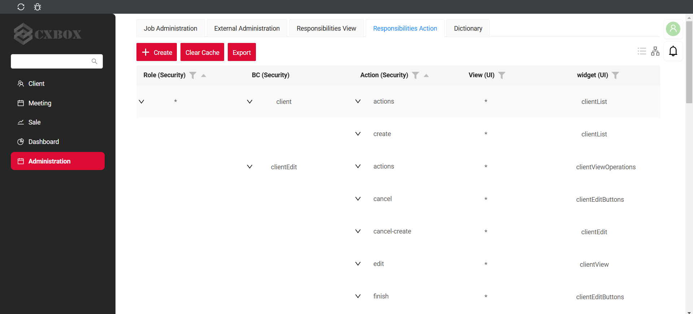  
=== "FULL (widget-action-groups-compact: false)"  
    If you indicate `widget-action-groups-compact: false` the data will be filled for each role and each view separately.  
    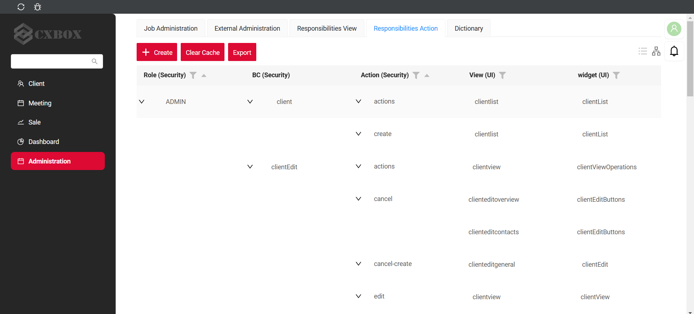  

#### Added: suggestionPickList field - backend query on click  

We have optimized the functionality of `suggestionPickList` by removing the character limit for backend queries. Now, when users click on the field, a request is sent to the backend immediately, displaying all available data without the need to type any characters.  

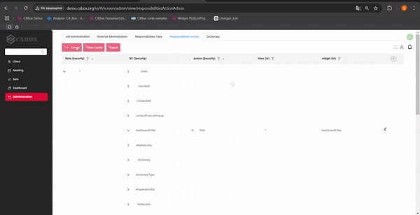{width="900"}  

#### Added: Notifications - Bearer Token authentication for WebSockets

We have added support for Bearer token authentication when connecting to WebSocket endpoints for notifications. Now, the Bearer token is included in the request header for secure access to the following endpoints: `/api/v1/websocketnotification/` and `/api/v1/notification`.  

#### Added: Drilldown - tooltip

`drilldown`s now has tooltip that appears on hover, offering two options:  

* Open in a New Tab: Open the `drilldown` link in a new browser tab.
* Copy Link Address: Copy the `drilldown` link to the clipboard. 

Feature can be turned on with `cxbox.ui.drill-down-tooltip: newAndCopy`.  
=== "After"  
    
=== "Before"  
    

*Limitations*:  

* `drilldowns` of [to-view-with-fields-filtration](https://doc.cxbox.org/features/element/drilldown/drilldown/?h=drill#to-view-with-fields-filtration) type are currently not supported for the "Open in a New Tab" option.  
* tooltip is not yet supported for the Stats Block widget.  

#### Added: FormPopup widget - forceActive  

We have introduced the `forceActive` feature for [FormPopup](https://doc.cxbox.org/widget/type/formpopup/formpopup/), allowing a backend request to be triggered before the modal window is opened. This ensures that the data within the popup is dynamically updated before being displayed, providing users with the most up-to-date information.  

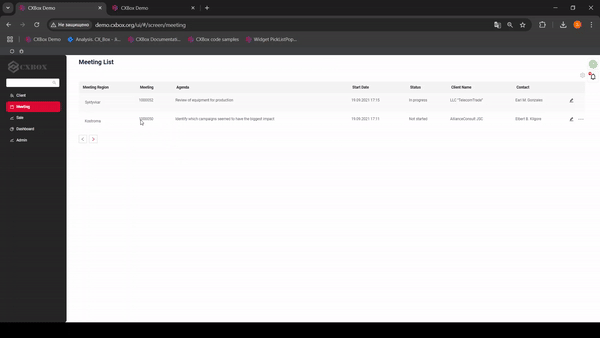{width="900"}  

#### Fixed: List widget - improved inline create logic  

We enhanced the behavior of inline creation in List widgets. When adding a new row, it now automatically opens in edit mode, allowing users to immediately input data without extra clicks.  

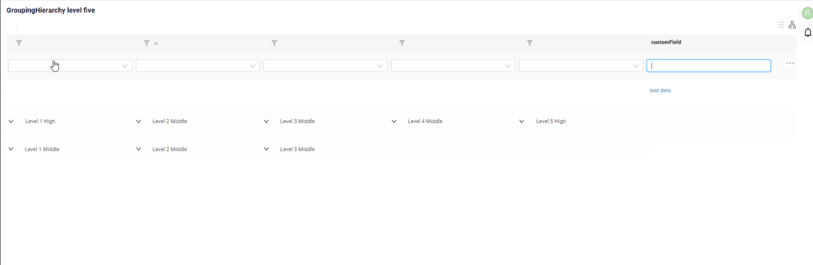  

#### Other Changes
see [cxbox-demo changelog](https://github.com/CX-Box/cxbox-demo/releases/tag/v.2.0.9)

### CXBOX ([Core Ui](https://github.com/CX-Box/cxbox-ui/releases/tag/2.4.2))  

We have released a new CORE UI version (2.4.2).  

#### Other Changes
see [cxbox-ui changelog](https://github.com/CX-Box/cxbox-ui/releases/tag/2.4.2)  

### CXBOX 4.0.0-M12 ([Core](https://github.com/CX-Box/cxbox/tree/cxbox-4.0.0-M12))   

#### Added: Dictionary class - LOV (deprecated) replacement.  

We have replaced the LOV strongly typed Dictionary class for managing configurable dictionaries. New Dictionary class uses specific subclasses to represent different types of dictionaries. It also has unified handling of dictionaries across Entity and DTO layers, ensuring consistency in compile time. Also, we enabled storing constants within subclasses for streamlines use in business logic.  

All details are provided in the updated [Dictionary](https://doc.cxbox.org/widget/fields/field/dictionary/dictionary/) article (see "Dictionary" tabs in all examples).  

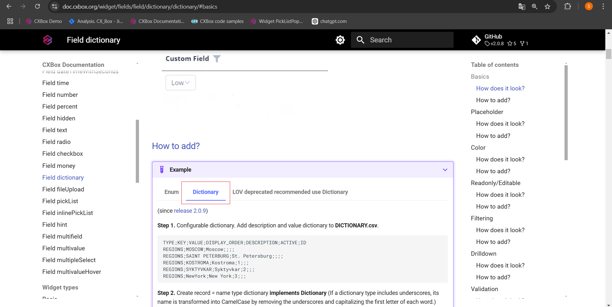  

#### Other Changes
Breaking changes have appeared! See [cxbox changelog](https://github.com/CX-Box/cxbox/releases/tag/cxbox-4.0.0-M12)

### CXBOX [documentation](https://doc.cxbox.org/)  

#### Added: [Grouping Hierarchy](https://doc.cxbox.org/widget/type/groupinghierarchy/groupinghierarchy/)  
We have added a full description of Grouping Hierarchy.  

#### Added: [Export Excel](https://doc.cxbox.org/widget/type/property/export/excel/excel/)  
We have provided a detailed description of Export to Excel function.  

#### Added: [Page Limit](https://doc.cxbox.org/widget/type/property/defaultlimitpage/defaultlimitpage/)  
Default limit page (available for List and Grouping Hierarchy) is now described in the article.  

#### Added: [Checkbox - placeholder](https://doc.cxbox.org/widget/fields/field/checkbox/checkbox/?h=check#placeholder)  
See all the details about a Checkbox placeholder in our updated article. 

#### Added: [Customization of displayed columns](https://doc.cxbox.org/widget/type/list/list/#customization-of-displayed-columns)  
We have described the process of customization of displayed columns.  

### CXBOX [plugin](https://plugins.jetbrains.com/plugin/19523-platform-tools)
#### New: Intellij 2024.3+ support
Intellij 2024.3+ support
#### New: Autocomplete, Ctrl-click navigation and inspection for @SearchParameter
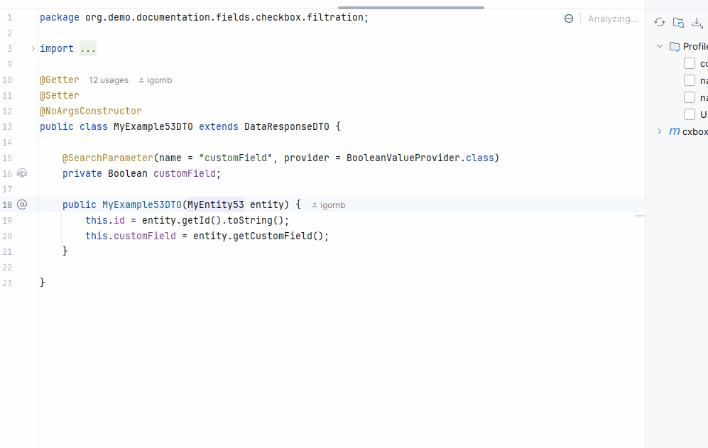

Autocomplete, Ctrl-click navigation and inspection for @SearchParameter name parameter containing path to Hibernate entity field. Inspection highlights 2 simple but usefully cases: not existing fields references (most common error) and not finished path (expression not ending with hibernate @Column field)
#### New. Actions in .widget.json -> options -> actionGroups -> include
* Plus icon and code generation in quickfix for Actions in .widget.json -> options -> actionGroups -> include. We can now generate java boilerplate for new action and navigate to it immediately!

* 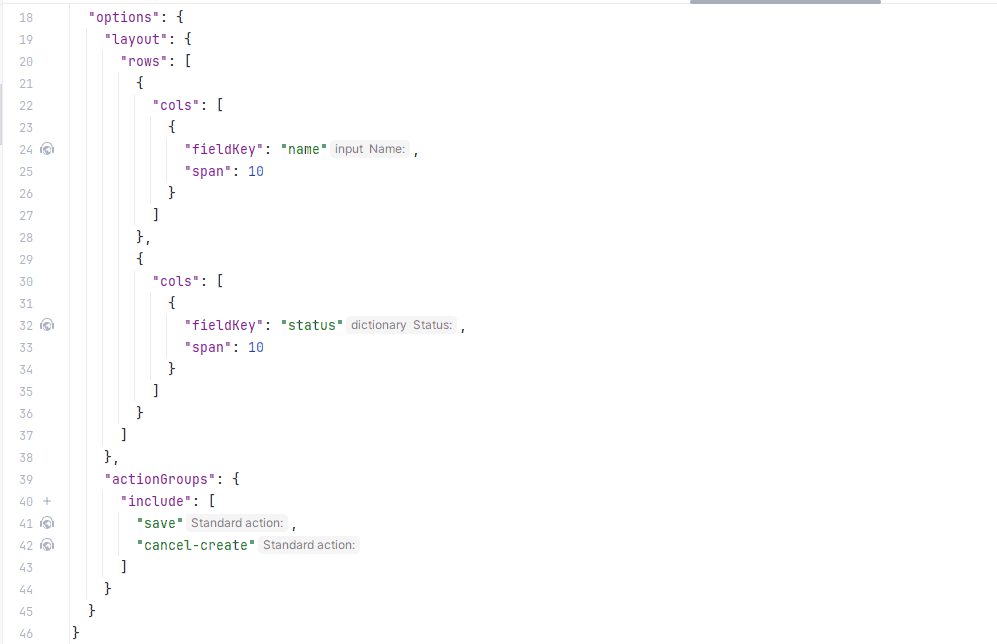
* Autocomplete, Ctrl-click navigation and inspection for Actions in .widget.json -> options -> actionGroups -> include. Now available without downloading sources with maven!
* Now .action(, ...) can be not only string but Enum.name() too. All features are supported

* 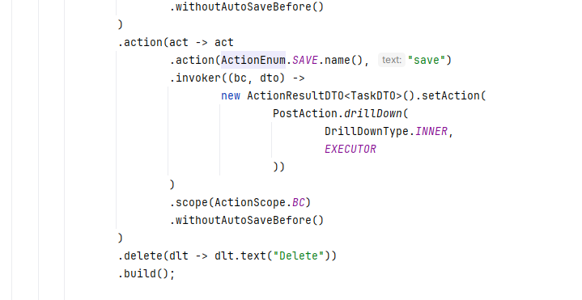
* Autocomplete, Ctrl-click navigation and inspection for Actions in .widget.json -> options -> actionGroups -> include. Now .action(, ...) can be not only string but java constant too. Only autocomplete/Ctrl-click in widget.json are supported. Navigation from constant to widget.json action and rename refactorings are not supported in this case for now

* 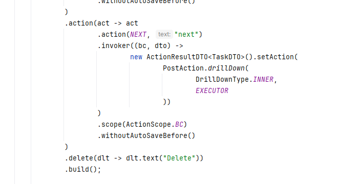
#### New. Inspection that checks viewName is unique per screen

Inspection that checks viewName is unique per screen (.screen.json -> navigation correctness), when type = standard is set (we skip this checks in other cases for backward compatibility with project customizations). We check:
#### New. Inspection that checks popupBcName in widget.json -> fields
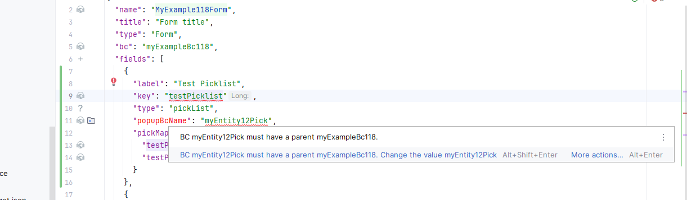

Inspection that checks popupBcName in widget.json -> fields must be child for owning widget bc. Inspection checks this only for fields with type picklist
#### New. Inspection that checks actionGroups in widget.json
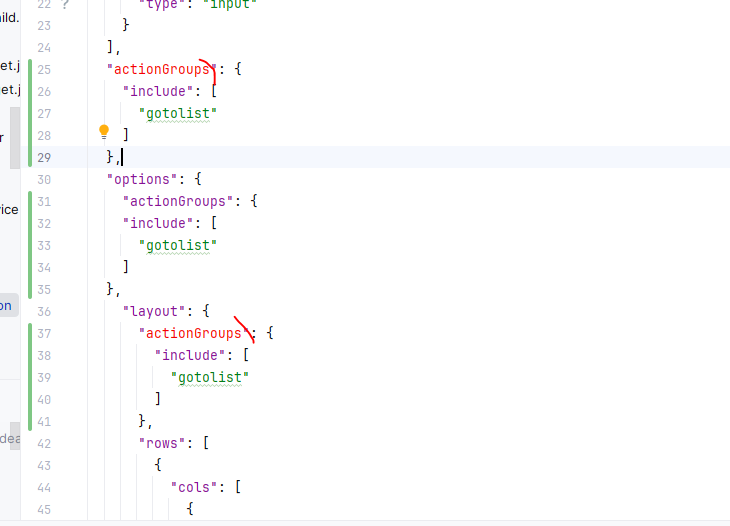

Inspection that checks actionGroups in widget.json location (e.g. it is located in options tag)

#### Other Changes
Other minor fixes: when AssocListPopup is code generated title and name order was reverted; when multipleSelect is code generated @CollectionTable name is made more unique (field name + bc); title required inspection is turned off - now we have widgets, that use empty titles by design
