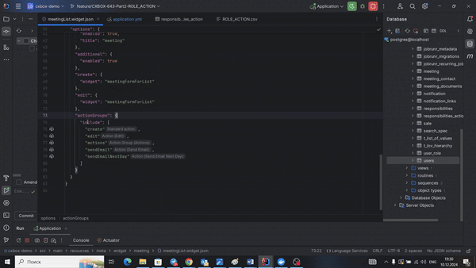
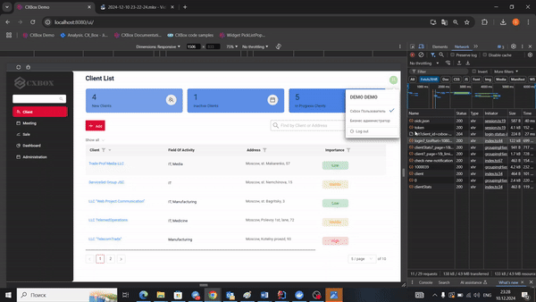
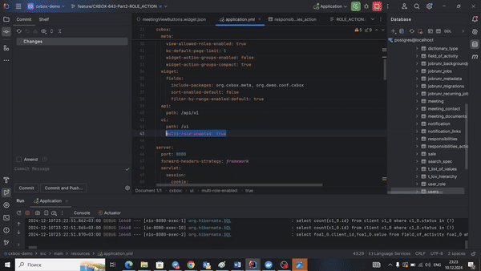

# 2.0.9

* [cxbox/demo 2.0.9 git](https://github.com/CX-Box/cxbox-demo/tree/v.2.0.9), [release notes](https://github.com/CX-Box/cxbox-demo/releases/tag/v.2.0.9)

* [cxbox/core 4.0.0-M12 git](https://github.com/CX-Box/cxbox/tree/cxbox-4.0.0-M12), [release notes](https://github.com/CX-Box/cxbox/releases/tag/cxbox-4.0.0-M12), [maven](https://central.sonatype.com/artifact/org.cxbox/cxbox-starter-parent/4.0.0-M12)

* [cxbox/code-samples 2.0.9 git](https://github.com/CX-Box/cxbox-code-samples/tree/v.2.0.9), [release notes](https://github.com/CX-Box/cxbox-code-samples/releases/tag/v.2.0.9)

## **Key updates November, December 2024**

### CXBOX ([Demo](http://demo.cxbox.org))  

#### Added: Additional List widget - new display mode  

Now, Additional List widget supports two display modes whether `read` option is indicated or not.  

 * If `read` parameter is NOT specified: the rows in Additional List are rendered using the default List-like style.  
 * If `read` parameter is specified: each row is displayed as a separate Additional Info widget.  

=== "No read option"
    
=== "With read option"
    

#### Added: Notifications - Drilldown to objects  

We have enhanced the Notifications popup to support a Multiple Select field with drilldown, allowing users to quickly navigate to objects mentioned in notification text. This improvement is specifically designed for the Notifications feature and introduces the following changes:  

* The notification banner now displays the number of links leading to relevant objects.  
=== "After"    
    
=== "Before"  
      

* Clicking the bell icon opens the Notifications popup, where all hyperlinks to related objects are listed in the Links column. 
=== "After"
      
=== "Before"
        

#### Added: Drilldown - custom menu  

Drilldowns now feature a custom menu that appears on hover, offering two options:  

* Open in a New Tab: Open the drilldown link in a new browser tab.
* Copy Link Address: Copy the drilldown link to the clipboard.  
=== "After"  
    {width="900"}
=== "Before"  
    {width="900"}

*Limitations*:  

* Drilldowns of [to-view-with-fields-filtration](https://doc.cxbox.org/features/element/drilldown/drilldown/?h=drill#to-view-with-fields-filtration) type are currently not supported for the "Open in a New Tab" option.  
* The custom menu is not yet supported for the Stats Block widget.  

#### Added: formPopup - forceActive  

We have introduced the `forceActive` feature for formPopup, allowing a backend request to be triggered before the modal window is opened. This ensures that the data within the popup is dynamically updated before being displayed, providing users with the most up-to-date information.  

{width="900"}  

#### Added: Bearer Token Authentification for WebSocket Notifications  

We have added support for Bearer token authentification when connecting to WebSocket endpoints for notifications. Now, the Bearer token is included in the request header for secure access to the following endpoints: `/api/v1/websocketnotification/` and `/api/v1/notification`.  

#### Fixed: formPopup - width calculation enhancement  

We have improved the width calculation for formPopup. You can now directly indicate the width using `view.json -> dridWidth` and the width now dynamically adjusts based on the following factors:  

* The state of the menu (collapsed or expanded)  
=== "gridWidth12 Menu Expanded"
    
=== "gridWidth Menu Collapsed"  
      

* The presence or absence of the additional widget on the view.  
=== "gridWidth12 No Additional"
    
=== "gridWidth12 With Additional"
    

These changes ensure that the form is displayed more accurately and flexibly, depending on the view configuration and interface state.  

See the detailed description in the updated [formPopup](https://doc.cxbox.org/widget/type/formpopup/formpopup/#widget-size) article. 

#### Fixed: List widget - Improved inline create logic  

We enhanced the behavior of inline creation in List widgets. When adding a new row, it now automatically opens in edit mode, allowing users to immediately input data without extra clicks.  

{width="900"}  

#### Fixed: Inline-Picklist - Data fetch on first click  

InlinePickList now fetches the list of values from the backend immediately upon the first click, even if the minimum number of characters has not been typed yet. This ensures faster and more accurate updates when the field depends on the force-active setting.  

#### Other Changes
see [cxbox-demo changelog](https://github.com/CX-Box/cxbox-demo/releases/tag/v.2.0.9)

### CXBOX 4.0.0-M12 ([Core](https://github.com/CX-Box/cxbox/tree/cxbox-4.0.0-M12))   

#### Added: Role-Based Model - View Responsibilities, Action Responsibilities, and Multi-role Configuration  

**1. View Responsibilities Configuration**  

BEFORE:  

View responsibilities are configured in `view.json -> rolesAllowed`.
Database management of the Responsibilities table is only possible through `view.json`.  
{width="900"}    

AFTER:  

We have supported a new view responsibilities configuration under the parameter `view-allowed-roles-enabled: false`. If you indicate `view-allowed-roles-enabled: true`, the behavior is the same as in BEFORE.  

If you indicate `view-allowed-roles-enabled: false` the changes are as follows:  
    
* CSV Integration: View responsibilities are managed through a CVS file. The database fields are filled according to CVS values and the fields which were not specified in the CVS are auto-filled with the default values.  
{width="900"}  
* Export Functionality: Now you can work with the database directly from the UI and export data with the help of "Export to CSV" button in the UI. This allows data export for easier management and review.  
{width="900"}    

**2. Action Responsibilities Configuration**  

BEFORE:  

Security Layer: Action availability is tied only to a business component (BC) and determined by backend logic using `.available(bc -> true/false/any business logic)`.  
UI Layer: Action visibility (e.g., buttons on widgets) is managed in `widget.json -> include -> actionGroups`.
{width="900"}  
  
AFTER:  

We have introduced a new parameter `widget-action-groups-enabled: true/false`. If you indicate `widget-action-groups-enabled: true` the behavior will be the same as in BEFORE.  

If you indicate `widget-action-groups-enabled: false` the changes are as follows:  

* Database Integration: Action availability for roles is now stored in a new *responsibilities_action* table in the database and displayed in the UI.  
* Security Layer Update: This layer now consists of two sub-layers, both of which must grant access for an action to be available:
1) New Layer: Verifies action availability based on settings in the Actions Responsibilities widget in the UI.
2) Existing Layer: determined by backend logic using `.available(bc -> true/false/any business logic)`.  
* UI Layer Update: Action visibility is NO longer configured in `widget.json -> include -> actionGroups`. Instead, action responsibilities are managed through a CVS file. The fields in the *responsibilities_action* table in the database are filled according to CVS values and the fields which were not specified in the CVS are auto-filled with the default values.  
{width="900"}  
* Export Functionality: Now you can work with the database directly from the UI and export data with the help of "Export to CSV" button in the UI. This allows data export for easier management and review.  
{width="900"}

We have introduced another new parameter `widget-action-groups-compact: true/false`. If you indicate `widget-action-groups-compact: true` the responsibilities' data will be displayed in a compact way. Under this parameter, the asterisk (*) means that the responsibility is relevant for all roles and all views. This is especially helpful during migration process so that you don't have to handle with numerous data rows and just display them in a collapsed way instead. If you indicate `widget-action-groups-compact: false` the data will be displayed for each role and each view separately.  
=== "true"  
      
=== "false"  
    

**3. Multirole Configuration**  

BEFORE:  

Login Behavior. The backend returned an activeRole parameter indicating the user's active role (e.g., "activeRole": "CXBOX_USER").  

UI Behavior. The UI displayed a checkbox for the active role, and users can switch roles. 
{width="900"}  
  
AFTER:  

We have added a new parameter `multi-role-enabled: true/false`. If you indicate `multi-role-enabled: false` the behavior is the same as in BEFORE.  
If you indicate `multi-role-enabled: true` the changes are as follows:  

* Login Behavior. The backend sends activeRole: null, and the UI ignores this value. All roles available to the user are sent in the roles list. The content of requests includes all views accessible by any of the user's roles. If the view is available for at least one role, it means that the view is available for all the roles in the multirole mode.  
* UI Behavior. Checkboxes for all roles are displayed but are disabled, preventing role switching. Requests to the backend for role switching are no longer triggered.  
{width="900"}  

#### Added: New Class with Extended Dictionary Support  

We have replaced the LOV mechanism with a more flexible Dictionary structure for managing reference data.  

We introduced a new base class to handle dictionaries, with support for specific subclasses to represent different types of dictionaries.
We have also unified handling of dictionaries across Entity and DTO layers, ensuring consistency.
Also, we enabled storing constants within subclasses for streamlined use in business logic.  
All details are provided in the updated [Dictionary](https://doc.cxbox.org/widget/fields/field/dictionary/dictionary/#administration-dictionary) article.

#### Other Changes
see [cxbox changelog](https://github.com/CX-Box/cxbox/releases/tag/cxbox-4.0.0-M12)

### CXBOX [documentation](https://doc.cxbox.org/)  

#### Added: [Grouping Hierarchy](https://doc.cxbox.org/widget/type/groupinghierarchy/groupinghierarchy/)  
We have added a full description of Grouping Hierarchy.  

#### Added: [Export Excel](https://doc.cxbox.org/widget/type/property/export/excel/excel/)  
We have provided a detailed description of Export to Excel function.  

#### Added: [Page Limit](https://doc.cxbox.org/widget/type/property/defaultlimitpage/defaultlimitpage/)  
Default limit page (available for List and Grouping Hierarchy) is now described in the article.  

#### Added: [Checkbox - placeholder](https://doc.cxbox.org/widget/fields/field/checkbox/checkbox/?h=check#placeholder)  
See all the details about a Checkbox placeholder in our updated article. 

#### Added: [Customization of displayed columns](https://doc.cxbox.org/widget/type/list/list/#customization-of-displayed-columns)  
We have described the process of customization of displayed columns.  