# 3.0.1

* [cxbox/demo 3.0.1 git](https://github.com/CX-Box/cxbox-demo/tree/v.3.0.1), [release notes](https://github.com/CX-Box/cxbox-demo/releases/tag/v.3.0.1)

* [cxbox/core 5.0.2 git](https://github.com/CX-Box/cxbox/tree/cxbox-5.0.2), [release notes](https://github.com/CX-Box/cxbox/releases/tag/cxbox-5.0.2), [maven](https://central.sonatype.com/artifact/org.cxbox/cxbox-starter-parent/5.0.2)

* [cxbox-ui/core 2.8.2 git](https://github.com/CX-Box/cxbox-ui/tree/2.8.2), [release notes](https://github.com/CX-Box/cxbox-ui/releases/tag/2.8.2), [npm](https://www.npmjs.com/package/@cxbox-ui/core/v/2.8.2)

* [cxbox/code-samples 3.0.1 git](https://github.com/CX-Box/cxbox-code-samples/tree/v.3.0.1), [release notes](https://github.com/CX-Box/cxbox-code-samples/releases/tag/v.3.0.1)

## **Key updates August 2026**

### CXBOX ([Demo](https://demo.cxbox.org))  

#### Added: Tree - NEW widget type!  
<!-- CXBOX-1341 -->  

We’ve added a new Tree widget for displaying data in a tree-like structure.

The widget is designed for working with large data sets and supports any number of nesting levels. Data is loaded on demand using lazy loading, so the entire data set does not need to be loaded at once. Initially, only the root-level rows are loaded. Upon expanding the nodes, child rows are loaded. The More option allows the user to load the next page of rows.  


The Tree widget supports the main functionality available in the List widget, including:

* actions
* filtering 
* pagination
* parent-child relation
* search  

Search and filtering results can be displayed in two modes:

* Collapse - only matching rows are highlighted and displayed, while the user can still navigate through the tree, expand nodes.  
* Hide - only matching rows are highlighted and displayed, navigation through the tree is not supported.  

=== "collapse" 
    
=== "hide"  
    

When matching rows are located deep in the tree, the path can be not fully displayed (for compact display reasons). The number of displayed parent nodes can be configured, and upper nodes can be loaded when needed to view the whole path.  

<!--TODO>> path not fully restored picture -->

!!! info  
    Detailed documentation for the [Tree](https://doc.cxbox.org/widget/type/tree/tree/) widget will be available soon in our official documentation - stay tuned!  

#### <a id="pickTree">Added: pickTree - NEW field type!</a>
<!-- CXBOX-1341 -->  

We have added a new pickTree field type for selecting a single value from tree-like data. The new field type triggers the new PickTreePopup widget.


For more information about the PickTreePopup widget, see [PickTreePopup](#PickTreePopup) widget.

!!! info  
    Detailed documentation for the [pickTree](https://doc.cxbox.org/widget/fields/field/picktree/picktree/)  field will be available soon in our official documentation - stay tuned!

####  <a id="PickTreePopup">Added: PickTreePopup - NEW widget type!</a>
<!-- CXBOX-1341 -->  

We’ve added a new PickTreePopup widget for selecting a single value from data displayed in a tree-like structure.

PickTreePopup is a tree-based alternative to the existing [PickListPopup](https://doc.cxbox.org/widget/type/picklistpopup/picklistpopup/). 

PickTreePopup supports any number of nesting levels and lazy loading, making it suitable for working with large data sets.
Just like with the new Tree widget, the root-level rows are loaded first, while child rows are loaded when the user expands a node. Next pages of data can be loaded using the More option.  


The widget supports:

* single-row selection
* actions
* filtering 
* search
* pagination
* parent-child relations
* lazy loading

The selection behavior can be configured depending on the use case. The user can be allowed to select:

* nodes only
* leaf rows only
* both nodes and leaf rows

Just like in Tree widget, search and filtering results can be displayed in two modes: collapse and hide.  

The PickTreePopup widget is opened from the new [pickTree](#pickTree) field.

!!! info
    Detailed documentation for the [PickTreePopup](https://doc.cxbox.org/widget/type/picktreepopup/picktreepopup/) widget will be available soon in our official documentation - stay tuned!

#### <a id="multivalueTree">Added: multivalueTree - NEW field type!</a>
<!-- CXBOX-1341 -->  

We have added a new multivalueTree field for selecting multiple values from tree-like data.


It works similarly to the existing multivalue field, but opens the new [AssocTreePopup](#AssocTreePopup) widget, where users navigate the tree and select multiple values using checkboxes.

!!! info  
    Detailed documentation for the [multivalueTree](https://doc.cxbox.org/widget/fields/field/multivalueTree/multivalueTree/)  field will be available soon in our official documentation - stay tuned!

#### <a id="AssocTreePopup">Added: AssocTreePopup - NEW widget type!</a>

We’ve added a new AssocTreePopup widget for selecting multiple values from data displayed in a tree-like structure.

AssocTreePopup is a tree-based alternative to the existing AssocListPopup. It allows users to select multiple rows using checkboxes while keeping the tree structure visible.  


The widget supports:

* multiple selection using checkboxes
* actions
* filtering and sorting
* search
* pagination
* parent-child relationships
* lazy loading 
* nodes/leaf rows/both nodes and leaf rows selection  

Selected values are displayed at the top of the popup.  

Search and filtering results can be displayed in two modes: collapse and hide.  

The AssocTreePopup widget is opened from the new [multivalueTree](#multivalueTree) field.

!!! info  
    Detailed documentation for the [AssocTreePopup](https://doc.cxbox.org/widget/type/assoctreepopup/assoctreepopup/) widget will be available soon in our official documentation - stay tuned!

#### Added: text and richText fields - configurable height  
<!-- CXBOX-1350 -->  

We've added support for configuring the height of text and richText fields on widgets.  

The minimum and maximum number of rows can now be set separately for viewing and editing, making it easier to adjust the fields to the content and screen layout.   
=== "List widget"
    
=== "Info widget"
    
=== "Form widget"
    


#### Added: Default filter by saved group (`filter group`)
<!-- CXBOX-1382 -->  
A default filter can now be configured for a saved group (`filter group`).
The configured filter is automatically applied when the page is initialized and refreshed.

The default filter is marked with a **star ★**.


### Added: Button To default filter(s)
<!-- CXBOX-1382 --> 
The **`To default filter(s)`** button has been added next to the **`Clear N filter(s)`** button.

The **`To default filter(s)`** button allows users to restore the filters to the default values defined by the developer.

When resetting filters, the following priority is applied:

1. **`bc_property`** — filters defined using `bc_property`;
2. **`default filter group`** — filters defined in the default filter group.

The **`To default filter(s)`** button is displayed only default filters are configured for the page.


#### Fixed: richText - formatting is preserved in the most common cases  
<!-- CXBOX-1364 -->  

The richText field stores content in Markdown, the same format that Yandex Wiki uses. Markdown cannot express some formatting combinations, and market leaders such as Yandex Wiki fail in these cases too. That is why we do not build our own editor. Instead, we add small patches to the underlying library and fix the most common cases, bringing the editor closer to market leaders.

Summary of supported formatting: ✅ supported, ⚠️ supported with a caveat, ❌ not supported, — not checked.  

**Basics**

| #  | Feature                                        | Before | After | Yandex Wiki | Markdown example             |
|----|------------------------------------------------|:------:|:-----:|:-----------:|------------------------------|
| 1  | Bold                                           | ✅ | ✅ | ✅ | `**bold**`                   |
| 2  | Italic                                         | ✅ | ✅ | ✅ | `*italic*`                   |
| 3  | Underline                                      | ✅ | ✅ | ✅ | `++under++`                  |
| 4  | Strikethrough                                  | ✅ | ✅ | ✅ | `~~strike~~`                 |
| 5  | Inline code                                    | ✅ | ✅ | ✅ | `` `code` ``                 |
| 6  | Text color                                     | ✅ | ✅ | ✅ | `{red}(text)`                |
| 7  | Link                                           | ✅ | ✅ | ✅ | `[text](url)`                |
| 8  | Heading H1–H6                                  | ✅ | ✅ | ✅ | `# Head` … `###### Head`     |
| 9  | Bullet / ordered list                          | ✅ | ✅ | ✅ | `- item` / `1. item`         |
| 10 | Blockquote                                     | ✅ | ✅ | ✅ | `> quote`                    |
| 11 | Code block                                     | ✅ | ✅ | ✅ | ` ```\ncode\n``` `           |
| 12 | Paragraph (Enter) / line break (Shift+Enter)   | ✅ | ✅ | ✅ | `a\n\nb` / `a  \nb`          |
| 13 | Text starting with 4 spaces or a tab stays plain text | ❌ | ✅ | — | `    text` was a code block |

**Combinations & overlaps**

| #  | Feature                                              | Before | After | Yandex Wiki | Markdown example                   |
|----|------------------------------------------------------|:------:|:-----:|:-----------:|------------------------------------|
| 14 | Two+ styles combined                                 | ✅ | ✅ | ✅ | `***x***`, `{red}(**x**)`          |
| 15 | Styles inside heading / list / quote                 | ✅ | ✅ | ✅ | `# **b** head`, `- {red}(c) item`  |
| 16 | Three+ styles overlapping in a staircase             | ❌ | ✅ | ✅ | `++abc**def**++**gh~~ij~~**~~kl~~` |
| 17 | Style across a line break (Shift+Enter)              | ❌ | ✅ | ✅ | `**a**  \n**b**`                   |
| 18 | Bold and italic overlapping each other               | ❌ | ⚠️ | — | an invisible separator is inserted where they meet |
| 19 | Bold or italic touching a parenthesis                | ❌ | ❌ | ❌ | `abc*def)*ghi` - cannot be written in Markdown; the toolbar disables such formatting |

**Text color**

| #  | Feature                                              | Before | After | Yandex Wiki | Markdown example                   |
|----|------------------------------------------------------|:------:|:-----:|:-----------:|------------------------------------|
| 20 | Color over text with parentheses                     | ❌ | ✅ | ✅ | `{red}(Hello \(world\))`           |
| 21 | Color across line breaks (Shift+Enter)               | ❌ | ✅ | ✅ | `{red}(a)  \n{red}(b)`             |
| 22 | Color on inline code                                 | ⚠️ | ⚠️ | — | impossible - inline code excludes other styles |

The cases below were fixed in this release.

**Text color on text with parentheses** (20)  
=== "After"
    In the editor: `Hello (world) and more` colored red.  
      
    After saving: the color is preserved.  
    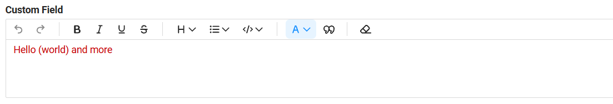  
    Stored Markdown - the parentheses are escaped, so the color span is closed in the right place:  
    ```
    {red}(Hello \(world\) and more)
    ```
=== "Before"
    In the editor: `Hello (world) and more` colored red.  
    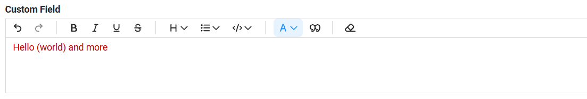  
    After saving: the color ends at the first `)`, and the parenthesis itself moved to the end of the text.  
    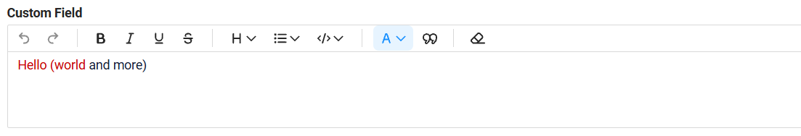  
    Stored Markdown - the first `)` closed the color span too early:  
    ```
    {red}(Hello (world) and more)
    ```

**Overlapping formatting** (16)  
=== "After"
    In the editor: underline on `abcdefgh`, bold on `ghijkl`, strikethrough on `klmnop`.  
      
    After saving: all formatting is preserved.  
    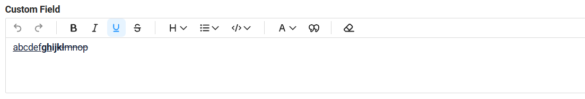  
    Stored Markdown - every style is closed and reopened with Markdown tags:  
    ```
    ++abcdef**gh**++**ij~~kl~~**~~mnop~~
    ```
=== "Before"
    In the editor: underline on `abcdefgh`, bold on `ghijkl`, strikethrough on `klmnop`.  
    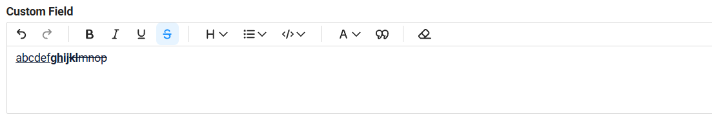  
    After saving: bold is shifted and `~~` appears as plain text.  
    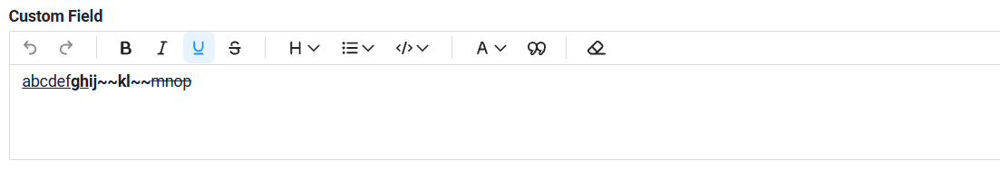  
    Stored Markdown - the editor fell back to raw HTML tags, which are not restored on reopen:  
    ```
    ++abcdef**gh**++<strong>ij~~kl~~</strong>~~mnop~~
    ```

**Text starting with spaces** (13)  
=== "After"
    In the editor: a line that starts with 4 spaces.  
    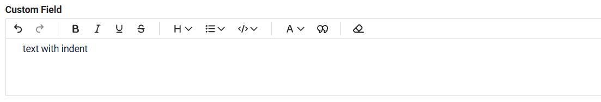  
    After saving: the text stays plain text.  
      
=== "Before"
    In the editor: a line that starts with 4 spaces.  
      
    After saving: the text was turned into a code block.  
    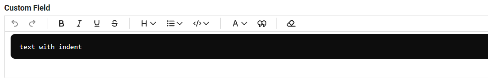  
    Stored Markdown - in Markdown, 4 leading spaces mean a code block:  
    ```
        text with indent
    ```

**Bold or italic touching a parenthesis** (19)  
=== "After"
    The toolbar disables bold, italic, underline, strikethrough and inline code when the selection starts or ends at a parenthesis, the same way Yandex Wiki does. Text color stays available.  
    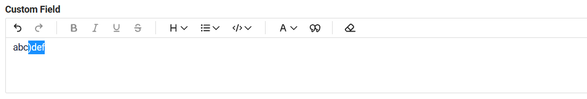  
=== "Before"
    In the editor: `)def` selected and made bold.  
    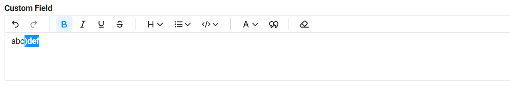  
    After saving: the bold was lost and `**` appeared as text.  
    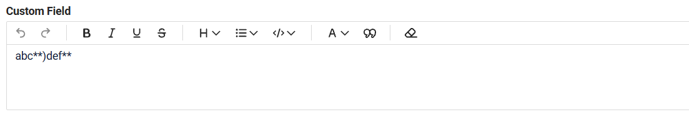  
    Stored Markdown - `**` right after `)` is not recognized as bold in Markdown (in Yandex Wiki too):  
    ```
    abc**)def**
    ```

We have also added autotests for richText to [cxbox/code-samples](https://github.com/CX-Box/cxbox-code-samples): a **RichText basic** sample and a [regression suite](https://github.com/CX-Box/cxbox-code-samples/blob/main/src/test/java/application/Samples/Form/RichTextOnFormTest.java) that checks every case from the table after user input, after saving and after reopening the record. Known limitations are fixed in the tests as well, so any change in their behavior is caught.

!!! info  
    Technical details for each case are available in [README_RICHTEXT.md](https://github.com/CX-Box/cxbox-demo/blob/768218b2db63ec05e1363a532302ff71dd962b4c/README_RICHTEXT.md).

#### Other Changes
see [cxbox-demo changelog](https://github.com/CX-Box/cxbox-demo/releases/tag/v.3.0.1)

### CXBOX ([Core Ui](https://github.com/CX-Box/cxbox-ui/releases/tag/???2.8.1))
We have released a new ???2.8.1 CORE UI version.

#### Fixed: `encryptAndSign` for detached signatures
<!-- CXBOX-1383 --> 
Fixed an issue with the `encryptAndSign` operation when creating a detached signature.

Additional Base64 encoding has been removed for detached signatures. Previously, signatures created using `encryptAndSign` in detached mode could not be successfully verified by the Gosuslugi signature verification service.

Detached signatures can now be successfully verified on Gosuslugi.


### CXBOX 5.0.2 ([Core](https://github.com/CX-Box/cxbox/tree/cxbox-5.0.2))
We have released a new 5.0.2 CORE version.

#### Fixed: uniqueness check when saving a filter name
<!-- CXBOX-1361 --> 
Fixed an issue where the uniqueness constraint could not be correctly identified when using the `ru_RU.UTF-8` locale.
The uniqueness check is now handled correctly regardless of the system locale.

#### Fixed: CIB seven migration compatibility
<!-- CXBOX-1362 --> 

If you are planning to migrate from **Camunda 7 Community Edition to CIB seven** because the final **Camunda 7 Community Edition 7.24** release does not support **Spring Boot 4**, the core has been updated to simplify and streamline the migration process.

Previously, using `@EnableWebMvc` caused Spring to create `WebMvcConfigurationSupport`, which prevented `WebMvcAutoConfiguration` from being applied. This could lead to additional configuration requirements during migration.

The core has been updated to eliminate this issue, making migration to CIB seven more straightforward.
