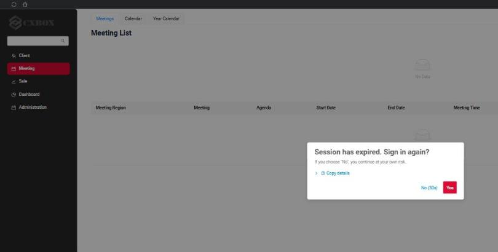
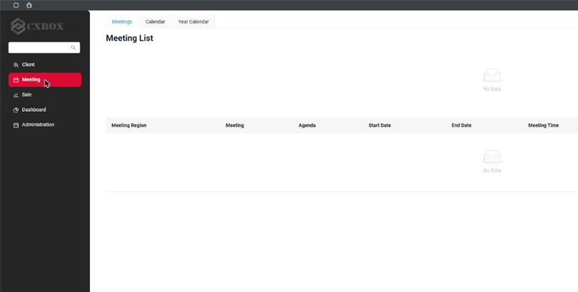
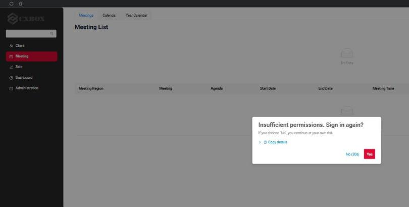
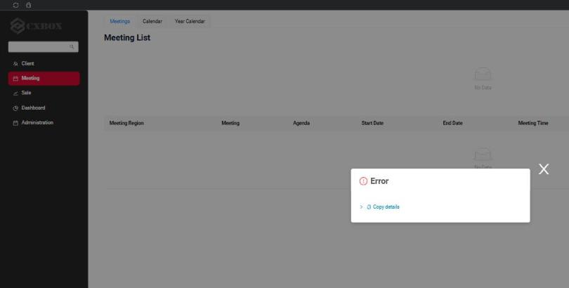
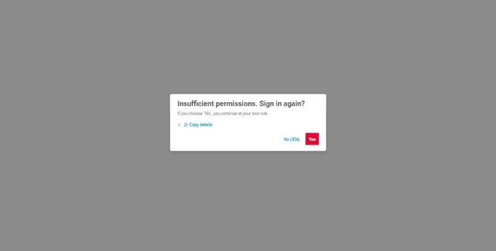
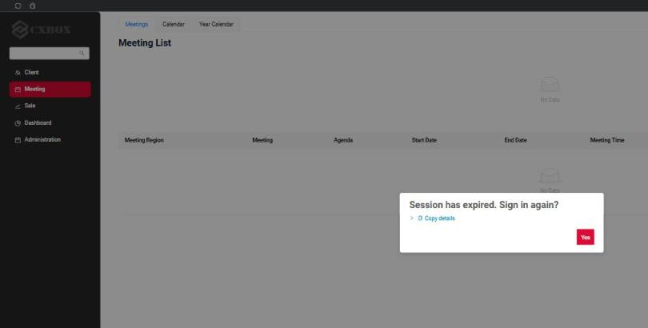
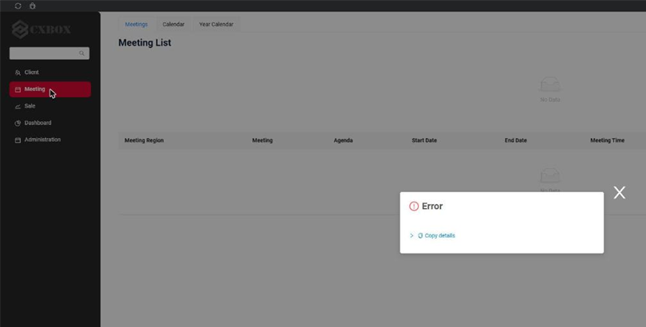
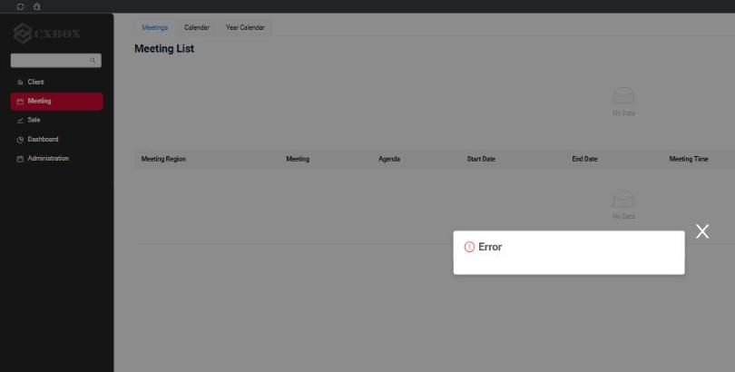
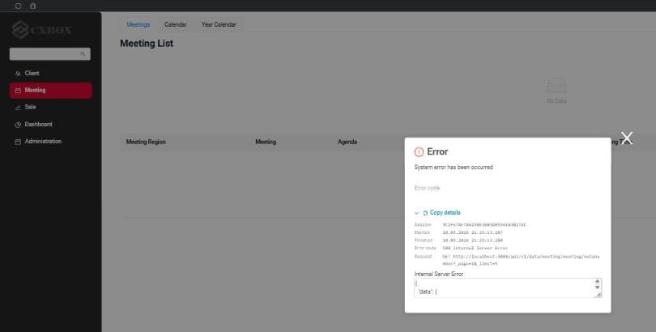
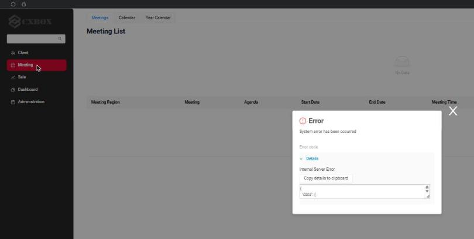

# 3.0.2

* [cxbox/demo 3.0.2 git](https://github.com/CX-Box/cxbox-demo/tree/v.3.0.2), [release notes](https://github.com/CX-Box/cxbox-demo/releases/tag/v.3.0.2)

* [cxbox/core 5.0.2 git](https://github.com/CX-Box/cxbox/tree/cxbox-5.0.2), [release notes](https://github.com/CX-Box/cxbox/releases/tag/cxbox-5.0.2), [maven](https://central.sonatype.com/artifact/org.cxbox/cxbox-starter-parent/5.0.2)

* [cxbox-ui/core 2.8.2 git](https://github.com/CX-Box/cxbox-ui/tree/2.8.2), [release notes](https://github.com/CX-Box/cxbox-ui/releases/tag/2.8.2), [npm](https://www.npmjs.com/package/@cxbox-ui/core/v/2.8.2)

## **Key updates September 2026**

### CXBOX ([Demo](https://demo.cxbox.org))

#### <a id="signInAgain">Added: Authorization - NEW popup "Sign in again?" on expired session/insufficient roles</a>
<!-- CXBOX-1384 -->

When the backend answers `401 Unauthorized` (the session has expired) or `403 Forbidden` (the user has no roles), the user now sees a popup instead of empty widgets and endless spinners.

The popup offers to sign in again:

* **Yes** does the same as the **Log out** button in the user menu: logs out and opens the login page.
* **No (30s)** closes the popup, the user continues at their own risk. The answer is remembered for 30 seconds, so further failing requests do not reopen the popup during that time.

**Session has expired (401)**  
=== "After"
    A popup is shown, every widget stays as it was.  
    
=== "Before"
    The request silently failed, widgets were left empty and nothing explained what happened.  
    

**Insufficient permissions (403)**  
=== "After"
    The popup names the reason.  
    
=== "Before"
    An empty "Error" popup without any text.  
    

**Sign in of a user without roles**  
The same popup is shown when a user without roles signs in. The application has not loaded yet at this point, so there is nothing behind the popup but the empty start page.  
=== "After"
    The popup on the empty start page: the user can sign in as someone else.  
    
=== "Before"
    The application stayed on the loading spinner forever.  
    

**Configuration**

The behavior is selected by the `AUTH_ERROR_MODE` constant in `ui/src/constants/index.ts`:

| Value             | Behavior                                                                                              |
|-------------------|-------------------------------------------------------------------------------------------------------|
| `legacy`          | Safety switch: the new code is bypassed and the frontend behaves exactly as before 3.0.2. Depending on the case: empty widgets (401 from the backend, expired token), endless spinner (sign in of a user without roles), the generic "Error" popup without text (403). AuthErrorPopup is not rendered, no token renewal before a request, no retries. |
| `soft`            | Default. The popup with **Yes** and **No (30s)**.                                                      |
| `strict`          | The popup with **Yes** only: signing in again is the only option.                                      |

The snooze time of the **No** button is set by `AUTH_ERROR_SNOOZE_SECONDS` (30 seconds by default).

=== "soft"
    The popup with **Yes** and **No (30s)**.  
    
=== "strict"
    The popup with **Yes** only.  
    
=== "legacy"
    Behavior before 3.0.2, it depended on the case: empty widgets (401 from the backend or an expired token, shown here), endless spinner (sign in of a user without roles), the generic "Error" popup without text (403).  
    

#### <a id="tokenRenewal">Fixed: Authorization - IMPROVED access token renewal: before every request, once for all tabs of the browser and for the websocket</a>
<!-- CXBOX-1384 -->

The access token is short-lived and has to be renewed by the OIDC provider (Keycloak in the demo) from time to time. Since the move to `oidc-client-ts` (3.0.0) the frontend relied on the library's background timer alone. All tabs of the application in one browser share the stored user and therefore one refresh token (`localStorage`); with refresh token rotation in the OIDC provider a refresh token works once: the second renewal with the same refresh token gets `invalid_grant`, and some providers treat it as a stolen token and revoke the whole session. The library does not protect against this, the issue is known and open since 2022: [oidc-client-ts #430](https://github.com/authts/oidc-client-ts/issues/430), the fix [PR #434](https://github.com/authts/oidc-client-ts/pull/434) was never merged, the same within one tab: [#1618](https://github.com/authts/oidc-client-ts/issues/1618). Keycloak considers it the client's job: [keycloak #16081](https://github.com/keycloak/keycloak/issues/16081).

* Before 3.0.2:
    * The token was renewed only by the background timer of `oidc-client-ts` (`automaticSilentRenew`, 60 seconds before expiry). `getUser()`, which the request interceptor calls, does not renew anything: it returns the stored token as is, even an expired one.
    * When the timer did not fire (Chrome freezes timers of background tabs, the laptop woke up from sleep) or its renewal failed (the OIDC provider unreachable, network), the expired token was sent with the next request: the backend answered 401 and the widgets were left empty.
    * The OIDC provider had closed the session: the same, 401 and empty widgets, nothing explained what happened.
    * The timer fired in every open tab at the same moment and every tab sent the same refresh token. With rotation the second tab got `invalid_grant`; with rotation and revocation both tabs lost the session and showed empty widgets until the user cleared the cookies.
    * The websocket of notifications renewed the token on its own before every reconnect, a third independent caller of `signinSilent()` next to the timer and the request interceptor. After a logout, or a 401, it kept reconnecting with the dead token every 2 seconds until the tab was closed.
* Since 3.0.2:
    * The token is checked before every request, the way `keycloak.updateToken(5)` did it before `oidc-client-ts`: a token that has expired or expires within 5 seconds is renewed on the spot, the rest go out at once with the stored token, no extra network calls.
    * The single place of renewal is `ui/src/auth/tokenRenewal.ts`: the request interceptor, the websocket and the "token is about to expire" event of the library all come there. The library's own timer is off (`automaticSilentRenew: false` in `ui/src/auth/index.ts`).
    * Within a tab, widgets that hit the expired token at the same time share one renewal (`signinSilent()` has no built-in queue, keycloak-js had one).
    * Across tabs the renewal runs under a [Web Lock](https://developer.mozilla.org/docs/Web/API/Web_Locks_API) (`navigator.locks`, the approach of auth0-spa-js), keyed by client id and user. The tab that gets the lock first renews, the others wait, then find the renewed token in the storage and send nothing. A lock of a closed tab is released by the browser; a tab that waits longer than 15 seconds (the holder is stuck) renews on its own, as before. Browsers without `navigator.locks` behave as before.
    * A tab frozen by the browser (background tabs after a few minutes, laptop asleep) misses the event; on waking up its first request either finds the token renewed by another tab or renews it.
    * The renewal failed for a technical reason: it is retried up to 3 times with a 1 second pause, each failed attempt is written to the browser console, then the [Sign in again? popup](#signInAgain) is shown.
    * The OIDC provider answered that the session is over (the refresh token was revoked, or the user logged out in another tab): the popup is shown at once, the user decides whether to sign in again.
    * The websocket gets its handshake token the way a request does: the stored token when it is still valid, otherwise the shared renewal (under the same lock, no separate `signinSilent()` call). A broken connection is reconnected without a limit, the delay doubles after every failure up to 30 seconds (`maxReconnectDelay` in `ui/src/constants/notification.ts`) and resets on success. Without a valid token (the session is over, the OIDC provider is down) no handshake is sent: a warning `Websocket handshake skipped ...` goes to the browser console, the [Sign in again? popup](#signInAgain) is shown with the websocket request in its details, and the client tries again after the delay, so it comes back by itself once a token is available (the provider is back, the user signed in again in another tab). Only a logout stops the client.

The constants live in `ui/src/auth/tokenRenewal.ts`: `TOKEN_MIN_VALIDITY_SECONDS` (5), `TOKEN_REFRESH_ATTEMPTS` (3), `TOKEN_REFRESH_RETRY_DELAY_MS` (1000), `LOCK_WAIT_MS` (15000). `AUTH_ERROR_MODE = 'legacy'` switches this off together with the popup: the library's timer renews, the token is sent as is, as before 3.0.2.

QA hook: `?token_renew_lock=off` in the url of a tab switches the lock off for that tab; the samples UI tests use it to reproduce the race and to show that the lock removes it (`TokenRenewalAcrossTabsTest`, `WebSocketSessionTest` in `cxbox-code-samples`).

**Timings.** The renewal is built on several timers, their ratio matters when a project tunes its OIDC provider:

* The token is renewed ahead of expiry 60 seconds before it expires (`accessTokenExpiringNotificationTimeInSeconds`, the library default; the settings live in `ui/src/auth/index.ts`), once for all tabs.
* The request interceptor renews a token that expires within 5 seconds (`TOKEN_MIN_VALIDITY_SECONDS`) and gives up after 3 attempts 1 second apart (`TOKEN_REFRESH_ATTEMPTS`, `TOKEN_REFRESH_RETRY_DELAY_MS`), about 3 seconds in total.
* A tab waits for the renewal of another tab up to 15 seconds (`LOCK_WAIT_MS`).
* **No** on the popup keeps it closed for 30 seconds (`AUTH_ERROR_SNOOZE_SECONDS`).

Recommended limits for the OIDC provider (Keycloak names in brackets):

* Access token lifetime (*Access Token Lifespan*, demo containers: 2 minutes, demo.cxbox.org: 5 minutes): not less than 2 minutes. It has to stay well above the 60 second renewal margin plus the 5 second interceptor margin, otherwise every freshly renewed token is already "expiring" and is renewed in a loop.
* Idle timeout of the session (*SSO Session Idle*, demo: 30 minutes) and the refresh token lifetime derived from it: longer than the access token lifetime. It is the time a user may stay idle before the next request ends in the "Sign in again?" popup.
* Refresh token rotation (*Revoke Refresh Token*, on in the demo containers): allowed. The renewal is shared by all widgets of a screen and by all tabs of the browser, so a rotated refresh token is used once.

#### Fixed: Authorization - IMPROVED user_roles db sync to roles from Keycloak/OIDC
<!-- CXBOX-1384 -->

When a user lost all roles in the OIDC provider, the roles were deactivated in the database on the next request, as before. But when the roles were returned in the OIDC provider, they stayed inactive in the database, because the comparison of token roles with database roles ignored the `active` flag. Now only active database roles take part in the comparison, so the roles are reactivated on the next login.

#### Added: Error popup - IMPROVED button 'Copy details'
<!-- CXBOX-1384 -->

Every error popup (the new 401/403 popup as well as the generic popup for business, system and network errors) now has a **Copy details** row:

* **Copy details** copies a JSON with everything the support team needs to find the request in the server log: session id (the same value is written to the SIEM log as `session: ...`), current screen, view and browser URL, request method and URL, HTTP status, request start and finish time, response headers and body.
* The arrow expands the same details on screen, so a screenshot is enough to start the investigation: session id, start and finish time, error code and request. Opening the details copies them as well.

**Generic error popup (a `400` response)**  
=== "After"
    The details row is always visible.  
    
=== "Before"
    The same error: an empty popup, nothing to copy or to show on a screenshot.  
    

**System error (a `500` response)**  
=== "After"
    The details are expanded.  
    
=== "Before"
    System error: only the response body was available under "Details".  
    

The same **Copy details** row is present on the new [Sign in again? popup](#signInAgain) for 401 and 403, see the before/after screenshots above.

Example of the copied JSON:

```json
{
  "sessionId": "3C1F67AF784230E3EB5DB594EA3B27EC",
  "clientId": 1789057000000,
  "login": "DEMO",
  "location": "http://localhost:3000/#/screen/meeting",
  "screen": "meeting",
  "view": "meetinglist",
  "statusCode": 403,
  "statusText": "Forbidden",
  "method": "GET",
  "url": "http://localhost:3000/api/v1/data/meeting/meetingStats?_page=1&_limit=5",
  "startedAt": "2026-09-10T18:26:00.410Z",
  "finishedAt": "2026-09-10T18:26:00.757Z",
  "responseHeaders": { "www-authenticate": "Bearer error=\"insufficient_scope\"" },
  "responseBody": null,
  "userAgent": "Mozilla/5.0 ..."
}
```

#### Fixed: Notifications - "Close all" button was always visible
<!-- CXBOX-1384 -->

The **Close all** button in the top right corner was visible even when there were no notifications: the stylesheet of the notifications container is loaded before the antd stylesheet, so the antd button style overrode the rule that hides the button. The rule is now more specific and the button is hidden until a notification appears.

#### Other Changes
see [cxbox-demo changelog](https://github.com/CX-Box/cxbox-demo/releases/tag/v.3.0.2)
