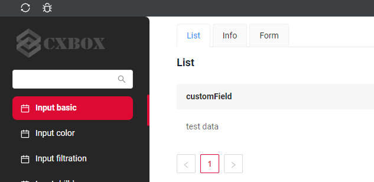

# What’s New in cxbox community

{  align=left }
рпалрподлжжэ
<figcaption>Image caption</figcaption>

<figure markdown>
  {  align=left }
  <figcaption>Image caption</figcaption>
</figure>

- :fontawesome-brands-js: __JavaScript__ for interactivity
- :fontawesome-brands-css3: __CSS__ for text running out of boxes
- :fontawesome-brands-internet-explorer: __Internet Explorer__ ... huh?

