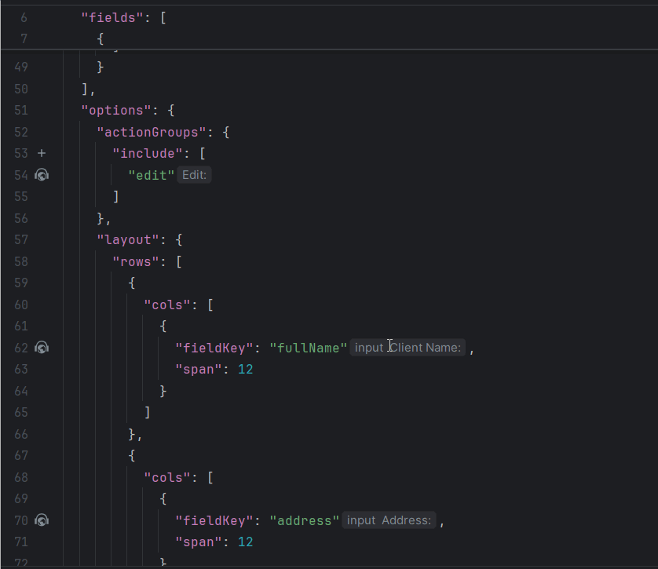
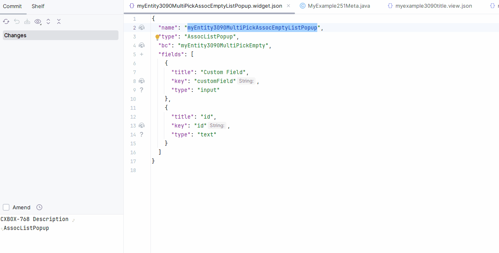
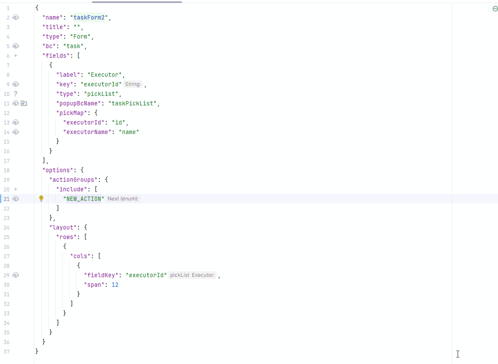
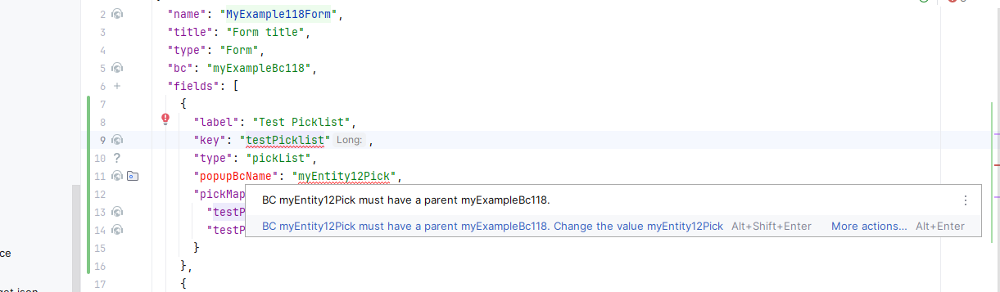

# Plugin
## [v2.0.15](/new/version215/)
#### Added: IntelliJ 2025.2+ support added. (with 1.9.0)
IntelliJ 2025.2+ support added.
 
#### Added: Added generation bc from widget (with 2.0.0)
Added generation bc from widget.


You can create a new Service, Entity, or DTO based on the name of your BK, or you can use existing Services, Entities, or DTOs

Select Parameters:


Example:


#### Added: Added to check the sum of span values in options.layout.rows.cols  (with 2.0.0)
Form and Info widgets, a validation was added to check that the sum of span values in options.layout.rows.cols does not exceed the grid limit (24)


#### Fixed: Incorrect triggering of inspection for ss (with 1.9.0)
We fixed the `SearchParameterAnnotationCorrectEndingInspection`, which was working incorrectly for the `multipleSelect` field.

=== "after"
    
=== "before"
    

## [v2.0.14](/new/version214/)
#### Added: IntelliJ 2025.1+ support

Installing the *Platform Tools* Plugin

The plugin now has **separate builds** for different versions of JetBrains IDEs. Make sure the correct update repository is configured.

1) Open the Plugin Manager

* In your JetBrains IDE, go to `Help → Find Action`
* Type `Plugins` and open the corresponding option

2) Add the Plugin Repository

* In the Plugins window, click the ⚙️ (gear icon) → `Manage Plugin Repositories...`
* Click ➕
* Enter the following URL:
  ```
  https://document.cxbox.org/plugin/updatePlugins.xml
  ```

* Click **OK**

3) Install the Plugin

* Switch to the `Marketplace` tab
* Search for **Platform Tools**
* Click **Install**
* After installation, click **OK**

4) Restart the IDE

#### Added: Code generation support added for fields with type <code>Time</code> in <code>.widget.json</code>.<br>

Works with [core 4.0.0-M17](https://github.com/CX-Box/cxbox/tree/cxbox-4.0.0-M17) and the versions above.

##### Code Generation

Added support for code generation of fields with the `time` type. You can now:

* Generate a `time` field with the default format `hh:mm:ss`;
* Specify a custom time format by selecting the desired pattern from the list of supported formats.

=== "time"
    
=== "time with format"
    

##### Autocomplete

Autocomplete is now available for `time` fields. When entering a format, you'll see a list of **officially supported patterns**,
making it easier and faster to configure the desired time format.


#### Added: type checking for fields containing <code>pickMap</code>
For fields containing <code>pickMap</code>, type checking was added to ensure Java type consistency of <code>pickMap</code> parameters (excluding the <code>id</code> field).

**Validation is implemented for the following field types:**

* `inline-pickList`
* `pickList`
* `suggestionPickList`


#### Added: inspection and quick-fix support for the new API
As part of the [core 4.0.0-M15](https://github.com/CX-Box/cxbox/tree/cxbox-4.0.0-M15) release, used Lombok’s @RequiredArgsConstructor and @Getter (meta,dao)
for AnySourceVersionAwareResponseService and @Getter (meta) VersionAwareResponseService instead of explicitly writing a constructor.
Added a quick-fix for the plugin to ensure compatibility with the new API and simplify the migration to the updated service implementation.


#### Added: <code>@SearchParameter</code>: if no explicit parameter is defined
Now, if no parameter is specified for @SearchParameter,  through to the entity with the corresponding field name.


#### Added: Autocomplete, Ctrl-click navigation and inspection for defaultView
Autocomplete, Ctrl-click navigation and inspectio support added for the <code>defaultView</code> property in <code>.screen.json</code>

##### Autocomplete:


##### Ctrl-click navigation


##### Inspection


##### Refactoring


#### Fixed: code generation for fields with type <code>Picklist</code> and <code>inline-pickList</code>
For fields with type <code>Picklist</code> and <code>inline-pickList</code> in <code>.widget.json</code> code generation fixed:

* **Field filtering added** to the popup for selecting fields when creating a picklist.
  Now only fields of the following types are displayed:

   * `String`
   * `LocalDateTime`
   * `Long`
   * `Double`
   * `Enum`
   * `Dictionary extension`
   * `Boolean`

* **Autogeneration of picklist configuration** is now supported **only** for the above simple field types.
  Other field types can be added manually via the picklist widget.

> **Autogeneration message:**
> *Autogeneration is supported for simple field types: String, LocalDateTime, Long, Double, Enum, Dictionary extension, Boolean. Other types can be added manually via the picklist widget.*


## [v2.0.12](/new/version212/)
#### Added: Run Inspections Button

We have added a Run Inspections button to the IntelliJ IDEA sidebar, enabling one-click execution of inspections across the entire project. The functionality automates the manual steps required to run inspections, eliminating the need to configure profiles or adjust settings.


#### Added: AdditionalInfo widget - fieldKey validation in *.widget.json

Added inspections for [AdditionalInfo](https://doc.cxbox.org/widget/type/additionalinfo/additionalinfo/) widget, following the same logic as [Info](https://doc.cxbox.org/widget/type/info/info/) widget. Now, if a `fieldKey` in `layout` is missing or does not reference a field from `fields`, an inspection warning is triggered.


#### Added: Inspection for options -> create/edit -> widget in *.widget.json

Added an inspection to ensure that widgets referenced in `create` and `edit` parameters are present on the same view as the main widget. Missing widgets are automatically added to the view.


#### Added: postAction drillDownAndWaitUntil - validation for successCondition_bcName

We have added a validation check to verify that the field specified in the successCondition_bcName parameter is present on the indicated bc in the drillDownAndWaitUntil postAction.


#### Added: multipleSelect field - updated method for field auto-generation in *.widget.json

Now, when adding a multipleSelect field via the + button, the plugin automatically generates the necessary code. If the project's core version supports it, the generated code will use `setConcreteValues()` instead of `setDictionaryTypeWithCustomValues()` marked as **@deprecated** since 4.0.0-M12.


#### Fixed: inlinePicklist field - parent bc check in *.widget.json

Fixed the inspection for `popupBcName` in *.widget.json, ensuring that it correctly checks that the referenced business component (bc) is a child to the parent widget's bc.


#### Added: @SearchParam – enhanced inspection algorithm

We've improved the validation of the path to the filtered field, ensuring better compatibility with microservices (Anysource services).
Additionally, we resolved an issue affecting the inspection process in cases where the initial annotated field lacked an explicitly specified path.

## [v2.0.10](/new/version210/)
#### Added: @SearchParameter - improved handling for unresolved entities

We have improved the plugin's behavior when the Entity specified in the annotation cannot be resolved.

Now, if the Entity cannot be resolved, the plugin will:

#####  Inspection
Highlight the class name in yellow (Warning) with the message "Entity not found."


##### Quick-fix suggestion
Quick-fix suggestion to specify the Entity path explicitly in a comment.
Example comment: //@entity:<fully qualified path to entity>.


#### Inspection for field references with -FieldKey postfix (options section).

The plugin now supports autocomplete, reference and inspections for field references in the options section of a widget.json file. To enable this functionality, ensure that fields in the options are named using the -FieldKey postfix (or simply named fieldKey). The plugin will link these fields to the fields array at the beginning of a widget.json file and, thus, ensure accurate references.

=== "Autocomplete"
   
=== "Reference"
   
=== "Inspection"
   

#### Added: Adding **MultipleSelect** field for Enum stored in Entity as Set<>
Adding **MultipleSelect** field now utilizes a new method for `buildRowDependentMeta`.


## [v2.0.9](/new/version209/)
#### New: Intellij 2024.3+ support
Intellij 2024.3+ support
#### New: Autocomplete, Ctrl-click navigation and inspection for @SearchParameter
Autocomplete, Ctrl-click navigation and inspection for @SearchParameter name parameter containing path to Hibernate entity field. Inspection highlights 2 simple but usefully cases: not existing fields references (most common error) and not finished path (expression not ending with hibernate @Column field)

* Autocomplete:
  

* Ctrl-click navigation
  

* Inspection
  

* Refactoring
  

#### New. Actions in .widget.json
Autocomplete, Ctrl-click navigation and inspection for Actions in .widget.json -> options -> actionGroups -> include. Now available without downloading sources with maven!

##### Plus icon and code generation
We can now generate java boilerplate for new action and navigate to it immediately!


##### **Actions - `string` in .widget.json support:**

###### Ctrl-click navigation
Service  -> .widget.json, .widget.json -> Service:


###### Autocomplete


###### Inspection


###### Refactoring


##### **Actions - `Enum` in .widget.json support:**

###### Ctrl-click navigation.
Service  -> .widget.json, .widget.json -> Service:


###### Autocomplete


###### Inspection


###### Refactoring


##### Actions - `java constant`  in .widget.json support:

###### Ctrl-click navigation
Only .widget.json -> Service :


###### Autocomplete


###### Inspection


#### New. Inspection viewName
Inspection that checks viewName is unique per screen


Inspection that checks viewName is unique per screen (.screen.json -> navigation correctness), when type = standard is set (we skip this checks in other cases for backward compatibility with project customizations). We check:
#### New. Inspection that checks popupBcName in widget.json -> fields


Inspection that checks popupBcName in widget.json -> fields must be child for owning widget bc. Inspection checks this only for fields with type picklist
#### New. Inspection that checks actionGroups in widget.json


Inspection that checks actionGroups in widget.json location (e.g. it is located in options tag)

## [v2.0.7](/new/version207/)

#### Added: *.screen.json - inspection when "type" : "standard"

We have added inspections for screens that have explicitly set `"type"="standard"` in .screen.json. These include making sure each `viewName` is unique, detecting empty arrays. We have also improved view generation (triggered by `+` icon click)

#### Added: *.widget.json - auto-completion and navigation for `actionKey`

Previous plugin versions provided navigation for actions referenced in `options->actionGroups` of .widget.json.
In this release we added same feature for actions referenced in `options->buttons->actionKey` tag of .widget.json used for files drag-and-drop configuration.

{width="800"}

#### Added: *.widget.json - inspection for actionGroups location.

We have added an inspection for `actionGroups` tag in .widget.json to ensure it is located within `options`.

{width="800"}

## [v2.0.5](/new/version205/)
### Fix for filtering fields of Type Hint
The `SearchParameter` annotation was added to `Hint` fields in the DTO, enabling proper filtering functionality.

#### Added quick-fix for action builder api
You can choose to migrate actions either selectively or for the entire project to the new API.

Selectively:


For the entire project:


####  Added inspection for widget references
1. Reference and inspection for `option.create.widget` and `option.edit.widget`  
   1.1 Added references in `.widget.json` for `option.create.widget` and `option.edit.widget` to the `name` field, enabling autocomplete, navigation to usages, definition, and rename refactoring.  
   1.2 Error and warning inspections added for invalid widget types and missing references.  
   
2. Reference and inspection for `confirmWithCustomWidget`  
   2.1 Implemented references for `confirmWithCustomWidget` method arguments to widgets in `.widget.json`, with the same autocomplete, navigation, and refactoring functionality.  
   2.2 Error and warning inspections added for invalid widget types and missing references.
   
3. Introduced the `@WidgetName` annotation in the core, which checks the widget type via the `typePostfix` parameter to ensure the correct type is used.
4. Expanded coverage of inspections and autocompletion for methods where arguments are annotated with `@WidgetName`.  
   

 


 