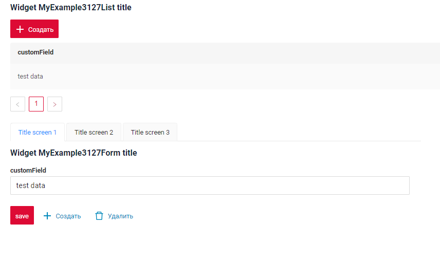

# Tabs
`Tab`  is a  component that enables users to switch between different components using tabs.
The tabs are organized as a tab bar. If the number of tabs exceeds the space available in the tab bar, navigation buttons will appear to help users scroll through the tabs.

## Basics
[:material-play-circle: Live Sample]({{ external_links.code_samples }}/ui/#/screen/myexample3000){:target="_blank"} ·
[:fontawesome-brands-github: GitHub]({{ external_links.github_ui }}/{{ external_links.github_branch }}/src/main/java/org/demo/documentation/widgets/form/base){:target="_blank"}

Tab levels:
* [SecondLevelMenu](#SecondLevel)
* [ThirdLevelMenu](#ThirdLevelMenu)
* [FourthLevelMenu](#FourthLevelMenu)

### How does it look?

 
##  <a id="SecondLevel">SecondLevel</a>

[:material-play-circle: Live Sample]({{ external_links.code_samples }}/ui/#/screen/myexample3124){:target="_blank"} · 
[:fontawesome-brands-github: GitHub]({{ external_links.github_ui }}/{{ external_links.github_branch }}/src/main/java/org/demo/documentation/feature/tab/secondlevel){:target="_blank"}
### How does it look?
=== "Top"
    
=== "Down"
    

###  How to add? 
??? Example
    === "Top"
        "menu": [
             "title": "List",
                "child": [
        ```json
        --8<--
        {{ external_links.github_raw_doc }}/feature/tab/secondlevel/top/myexample3124.screen.json
        --8<--
        ```
    === "Down"
        "menu": [
        "title": "List",
        "child": [
        ```json
        --8<--
        {{ external_links.github_raw_doc }}/feature/tab/secondlevel/down/myexample3127.screen.json
        --8<--
        ```

    ```
##  <a id="ThirdLevelMenu">ThirdLevelMenu</a>
[:material-play-circle: Live Sample]({{ external_links.code_samples }}/ui/#/screen/myexample3125){:target="_blank"} ·
[:fontawesome-brands-github: GitHub]({{ external_links.github_ui }}/{{ external_links.github_branch }}/src/main/java/org/demo/documentation/feature/tab/thirdlevel){:target="_blank"}
### How does it look?


###  How to add?
??? Example
 
    ```json
    --8<--
    {{ external_links.github_raw_doc }}/feature/tab/thirdlevel/myexample3125.screen.json
    --8<--
    ```

##  <a id="FourthLevelMenu">FourthLevelMenu</a>

[:material-play-circle: Live Sample]({{ external_links.code_samples }}/ui/#/screen/myexample3126){:target="_blank"} ·
[:fontawesome-brands-github: GitHub]({{ external_links.github_ui }}/{{ external_links.github_branch }}/src/main/java/org/demo/documentation/feature/tab/fourthlevel){:target="_blank"}
### How does it look?


### How to add?
??? Example
    ```json
    --8<--
    {{ external_links.github_raw_doc }}/feature/tab/fourthlevel/myexample3126.screen.json
    --8<--
    ```

