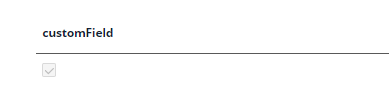
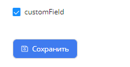

# CheckBox

`Field CheckBox` allows the user to make a binary choice.

## Basics
### How does it look?

=== "List widget"
    
=== "Info widget"
    
=== "Formwidget"
    

### How to add?
??? Example
    === "List widget"
        Add to **_.widget.json_**.

        ```json
        {
              ...
              "type": "Table",
              "fields": [
                {
                  "title": "Client Name",
                  "key": "fullName",
                  "type": "checkbox"
                }
              ]
            }
            
        ```

    === "Info widget"
        Add to **_.widget.json_**.
    
        ```json
        {
          ...
          "type": "Form",
          "fields": [
            {
              "label": "Client Name",
              "key": "fullName",
              "type": "checkbox"
            }
          ],
          "options": {
            "layout": {
              "rows": [
                {
                  "cols": [
                    {
                      "fieldKey": "fullName",
                      "span": 12
                    }
                  ]
                }
              ]
            }
          }
        }
        
        ```

    === "Form widget"
        Add to **_.widget.json_**.
    
        ```json
        {
          ...
          "type": "Info",
          "fields": [
            {
              "label": "Client Name",
              "key": "fullName",
              "type": "checkbox"
            }
          ],
          "options": {
            "layout": {
              "rows": [
                {
                  "cols": [
                    {
                      "fieldKey": "checkbox",
                      "span": 12
                    }
                  ]
                }
              ]
            }
          }
        }
        ```

## Color
### How does it look?
=== "List widget"
    _not applicable_
=== "Info widget"
    _not applicable_
=== "Form widget"
    _not applicable_

## Readonly/Editable
Indicates that the field can be edited or not.
### How to add?
??? Example
    === "List widget"
        === "Editable"

            Add **fields.setEnabled(`dto field name`, `field name`)** to corresponding **FieldMetaBuilder**.

            ```java
            @Service
            public class ClientWriteMeta extends FieldMetaBuilder<ClientWriteDTO> {
            
                @Override
                public void buildRowDependentMeta(RowDependentFieldsMeta<ClientWriteDTO> fields, InnerBcDescription bcDescription,
                        Long id, Long parentId) {
                     fields.setEnabled(ClientReadDTO_.residentFlag,residentFlag);
                }
            
                @Override
                public void buildIndependentMeta(FieldsMeta<ClientWriteDTO> fields, InnerBcDescription bcDescription, Long parentId) {
                }
            
            }
            ```

        === "Readonly"

            Check and delete property fields.setEnabled 

            or

            After property fields.setEnabled add  **fields.setDisabled(`dto field name`, `field name`)** to corresponding **FieldMetaBuilder**.

            ```java
            @Service
            public class ClientWriteMeta extends FieldMetaBuilder<ClientWriteDTO> {
            
                @Override
                public void buildRowDependentMeta(RowDependentFieldsMeta<ClientWriteDTO> fields, InnerBcDescription bcDescription,
                        Long id, Long parentId) {
                     fields.setDisabled(ClientReadDTO_.residentFlag,residentFlag);
                }
            
                @Override
                public void buildIndependentMeta(FieldsMeta<ClientWriteDTO> fields, InnerBcDescription bcDescription, Long parentId) {
                }
            
            }
            ```
    === "Info widget"
        _not applicable_
    === "Form widget"
        === "Editable"
        
            Add **fields.setEnabled(`dto field name`, `field name`)** to corresponding **FieldMetaBuilder**.

            ```java
            @Service
            public class ClientWriteMeta extends FieldMetaBuilder<ClientWriteDTO> {
            
                @Override
                public void buildRowDependentMeta(RowDependentFieldsMeta<ClientWriteDTO> fields, InnerBcDescription bcDescription,
                        Long id, Long parentId) {
                     fields.setEnabled(ClientReadDTO_.residentFlag,residentFlag);
                }
            
                @Override
                public void buildIndependentMeta(FieldsMeta<ClientWriteDTO> fields, InnerBcDescription bcDescription, Long parentId) {
                }
            
            }
            ```

        === "Readonly"

            Check and delete property fields.setEnabled 

            or

            After property fields.setEnabled add  **fields.setDisabled(`dto field name`, `field name`)** to corresponding **FieldMetaBuilder**.

            ```java
            @Service
            public class ClientWriteMeta extends FieldMetaBuilder<ClientWriteDTO> {
            
                @Override
                public void buildRowDependentMeta(RowDependentFieldsMeta<ClientWriteDTO> fields, InnerBcDescription bcDescription,
                        Long id, Long parentId) {
                     fields.setDisabled(ClientReadDTO_.residentFlag,residentFlag);
                }
            
                @Override
                public void buildIndependentMeta(FieldsMeta<ClientWriteDTO> fields, InnerBcDescription bcDescription, Long parentId) {
                }
            
            }
            ```

## Filtration
### How does it look?
=== "List widget"
    
=== "Info widget"
    _not applicable_
=== "Form widget"
    _not applicable_

### How to add?
??? Example
=== "List widget"
Add **fields.enableFilter(`dto field name`.`custom field name`)** to corresponding **buildIndependentMeta**.

            ```java
            @Service
              @Override
                public void buildIndependentMeta(FieldsMeta<InputDTO> fields, InnerBcDescription bcDescription, Long parentId) {
                fields.enableFilter(InputDTO_.customField);
                }
            ```
     
         ??? разобраться   @SearchParameter(name = "customField", provider = StringValueProvider.class)

    === "Info widget"
        _not applicable_
    === "Form widget"
        _not applicable_

## Drill-down
### How does it look?
=== "List widget"
    _not applicable_
=== "Info widget"
    _not applicable_
=== "Form widget"
    _not applicable_

## Validation

## Sorting