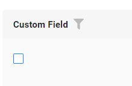

# CheckBox

`Field CheckBox` allows the user to make a binary choice.

## Basics
[:material-play-circle: Live Sample]({{ external_links.code_samples }}/ui/#/screen/myexample82){:target="_blank"} ·
[:fontawesome-brands-github: GitHub]({{ external_links.github_ui }}/{{ external_links.github_branch }}/src/main/java/org/demo/documentation/fields/checkbox/basic){:target="_blank"}
### How does it look?

=== "List widget"
    
=== "Info widget"
    
=== "Formwidget"
    

### How to add?
??? Example
    **Step1** Add field **Boolean** to corresponding **BaseEntity**.

    ```java
    --8<--
    {{ external_links.github_raw_doc }}/fields/checkbox/basic/MyEntity82.java
    --8<--
    ```

    **Step2** Add field **Boolean** to corresponding **DataResponseDTO**.

    ```java
    --8<--
    {{ external_links.github_raw_doc }}/fields/checkbox/basic/MyExample82DTO.java
    --8<--
    ```

    === "List widget"
        **Step3** Add to **_.widget.json_**.

        ```json
        --8<--
        {{ external_links.github_raw_doc }}/fields/checkbox/basic/MyExample82List.widget.json
        --8<--
        ```
    === "Info widget"
        **Step3** Add to **_.widget.json_**.
        
        ```json
        --8<--
        {{ external_links.github_raw_doc }}/fields/checkbox/basic/MyExample82Info.widget.json
        --8<--
        ```

    === "Form widget"

        **Step3** Add to **_.widget.json_**.

        ```json
        --8<--
        {{ external_links.github_raw_doc }}/fields/checkbox/basic/MyExample82Form.widget.json
        --8<--
        ```        

## Placeholder
**_not applicable_**

## Color
**_not applicable_**

## Readonly/Editable

`Readonly/Editable` indicates whether the field can be edited or not. It can be calculated based on business logic of application

`Editable`
[:material-play-circle: Live Sample]({{ external_links.code_samples }}/ui/#/screen/myexample82){:target="_blank"} ·
[:fontawesome-brands-github: GitHub]({{ external_links.github_ui }}/{{ external_links.github_branch }}/src/main/java/org/demo/documentation/fields/checkbox/basic){:target="_blank"}

`Readonly`
[:material-play-circle: Live Sample]({{ external_links.code_samples }}/ui/#/screen/myexample79){:target="_blank"} ·
[:fontawesome-brands-github: GitHub]({{ external_links.github_ui }}/{{ external_links.github_branch }}/src/main/java/org/demo/documentation/fields/checkbox/ro){:target="_blank"}


### How does it look?
=== "Readonly"
    === "List widget"
        
    === "Info widget"
        _not applicable_
    === "Form widget"
        
=== "Editable"
    === "List widget"
        
    === "Info widget"
        
    === "Form widget"
        

### How to add?
??? Example
    === "Editable"

        **Step1** Add mapping DTO->entity to corresponding **VersionAwareResponseService**.
        ```java
        --8<--
        {{ external_links.github_raw_doc }}/fields/checkbox/basic/MyExample82Service.java:doUpdateEntity
        --8<--
        ```            
        **Step2** Add **fields.setEnabled** to corresponding **FieldMetaBuilder**.
        ```java
        --8<--
        {{ external_links.github_raw_doc }}/fields/checkbox/basic/MyExample82Meta.java:buildRowDependentMeta
        --8<--
        ```
        === "List widget"
            **Works for List.**
        === "Info widget"
            **_not applicable_**
        === "Form widget"
            **Works for Form.**

    === "Readonly"

        **Option 1** Enabled by default.
        ```java
        --8<--
        {{ external_links.github_raw_doc }}/fields/checkbox/ro/MyExample79Meta.java:buildRowDependentMeta
        --8<--
        ```

        **Option 2** `Not recommended.` Property fields.setDisabled() overrides the enabled field if you use after property fields.setEnabled.

        === "List widget"
            **Works for List.**
        === "Info widget"
            **Works for Info.**
        === "Form widget"
            **Works for Form.**

## Filtering
[:material-play-circle: Live Sample]({{ external_links.code_samples }}/ui/#/screen/myexample53){:target="_blank"} ·
[:fontawesome-brands-github: GitHub]({{ external_links.github_ui }}/{{ external_links.github_branch }}/src/main/java/org/demo/documentation/fields/checkbox/filtration){:target="_blank"}
 
`Filtering` allows you to search data based on criteria. Search uses `in` operator.
### How does it look?
=== "List widget"
    
=== "Info widget"
    _not applicable_
=== "Form widget"
    _not applicable_

TEST6
TEST6
    ```java
    --8<--
    {{ external_links.github_raw_doc }}/fields/checkbox/basic/MyEntity82.java
    --8<-
    ```


### How to add?
??? Example
    === "List widget"
        **Step 1** Add **@SearchParameter** to corresponding **DataResponseDTO**. (Advanced customization [SearchParameter](/advancedCustomization/element/searchparameter/searchparameter))
        ```java
        --8<--
        {{ external_links.github_raw_doc }}/fields/checkbox/filtration/MyExample53DTO.java
        --8<--
        ```
        **Step 2**  Add **fields.enableFilter** to corresponding **FieldMetaBuilder**.
        ```java
        --8<--
        {{ external_links.github_raw_doc }}/fields/checkbox/filtration/MyExample53Meta.java:buildIndependentMeta
        --8<--
        ```
    === "Info widget"
        _not applicable_
    === "Form widget"
        _not applicable_


## Drilldown
**_not applicable_**


## Validation
`Validation` allows you to check any business rules for user-entered value. There are types of validation:

1) Exception:Displays a message to notify users about technical or business errors.

   `Business Exception`:
   [:material-play-circle: Live Sample]({{ external_links.code_samples }}/ui/#/screen/myexample77){:target="_blank"} ·
   [:fontawesome-brands-github: GitHub]({{ external_links.github_ui }}/{{ external_links.github_branch }}/src/main/java/org/demo/documentation/fields/checkbox/validationbusinessex){:target="_blank"}

   `Runtime Exception`:
   [:material-play-circle: Live Sample]({{ external_links.code_samples }}/ui/#/screen/myexample80){:target="_blank"} ·
   [:fontawesome-brands-github: GitHub]({{ external_links.github_ui }}/{{ external_links.github_branch }}/src/main/java/org/demo/documentation/fields/checkbox/validationruntimeex){:target="_blank"}
   
2) Confirm: Presents a dialog with an optional message, requiring user confirmation or cancellation before proceeding.

   [:material-play-circle: Live Sample]({{ external_links.code_samples }}/ui/#/screen/myexample78){:target="_blank"} ·
   [:fontawesome-brands-github: GitHub]({{ external_links.github_ui }}/{{ external_links.github_branch }}/src/main/java/org/demo/documentation/fields/checkbox/validationconfirm){:target="_blank"}

3) Field level validation: shows error next to all fields, that validation failed for

   `Option 1`:
   [:material-play-circle: Live Sample]({{ external_links.code_samples }}/ui/#/screen/myexample168){:target="_blank"} ·
   [:fontawesome-brands-github: GitHub]({{ external_links.github_ui }}/{{ external_links.github_branch }}/src/main/java/org/demo/documentation/fields/checkbox/validationannotation){:target="_blank"}

   `Option 2`:
   [:material-play-circle: Live Sample]({{ external_links.code_samples }}/ui/#/screen/myexample289){:target="_blank"} ·
   [:fontawesome-brands-github: GitHub]({{ external_links.github_ui }}/{{ external_links.github_branch }}/src/main/java/org/demo/documentation/fields/checkbox/validationdynamic){:target="_blank"}


### How does it look?
=== "List widget"
    === "BusinessException"
        
    === "RuntimeException"
        
    === "Confirm"
        
    === "Field level validation"
        
=== "Info widget"
    _not applicable_
=== "Form widget"
    === "BusinessException"
        
    === "RuntimeException"
        
    === "Confirm"
        
    === "Field level validation"
        
### How to add?
??? Example
    === "BusinessException"
        `BusinessException` describes an error  within a business process.

        Add **BusinessException** to corresponding **VersionAwareResponseService**.
        ```java
        --8<--
        {{ external_links.github_raw_doc }}/fields/checkbox/validationbusinessex/MyExample77Service.java:doUpdateEntity
        --8<--
        ```
        === "List widget"
            **Works for List.**
        === "Info widget"
            **_not applicable_**
        === "Form widget"
            **Works for Form.**
    === "RuntimeException"

        `RuntimeException` describes technical error  within a business process.
        
        Add **RuntimeException** to corresponding **VersionAwareResponseService**.
        ```java
        --8<--
        {{ external_links.github_raw_doc }}/fields/checkbox/validationruntimeex/MyExample80Service.java:doUpdateEntity
        --8<--
        ```        
        === "List widget"
            **Works for List.**
        === "Info widget"
            **_not applicable_**
        === "Form widget"
            **Works for Form.**
    === "Confirm"
        Add [PreAction.confirm](/advancedCustomization_validation) to corresponding **VersionAwareResponseService**.
        ```java
        --8<--
        {{ external_links.github_raw_doc }}/fields/checkbox/validationconfirm/MyExample78Service.java:getActions
        --8<--
        ```
        === "List widget"
            **Works for List.**
        === "Info widget"
            **_not applicable_**
        === "Form widget"
            **Works for Form.**
    === "Field level validation"
        === "Option 1"
            Use if:

            Requires a simple fields check (javax validation)
            ```java
            --8<--
            {{ external_links.github_raw_doc }}/fields/checkbox/validationannotation/MyExample168DTO.java
            --8<--
            ```
            === "List widget"
                **Works for List.**
            === "Info widget"
                **_not applicable_**
            === "Form widget"
                **Works for Form.**
        === "Option 2"
            Create сustom service for business logic check.

            Use if:

            Business logic check required for fields

            `Step 1`  Create сustom method for check.
            ```java
            --8<--
            {{ external_links.github_raw_doc }}/fields/checkbox/validationdynamic/MyExample289Service.java:validateFields
            --8<--
            ```
            `Step 2` Add сustom method for check to corresponding **VersionAwareResponseService**.
            ```java
            --8<--
            {{ external_links.github_raw_doc }}/fields/checkbox/validationdynamic/MyExample289Service.java:doUpdateEntity
            --8<--
            ```
 
## Sorting
[:material-play-circle: Live Sample]({{ external_links.code_samples }}/ui/#/screen/myexample76){:target="_blank"} ·
[:fontawesome-brands-github: GitHub]({{ external_links.github_ui }}/{{ external_links.github_branch }}/src/main/java/org/demo/documentation/fields/checkbox/sorting){:target="_blank"}

`Sorting` allows you to sort data in ascending or descending order.

### How does it look?
=== "List widget"
    
=== "Info widget"
    _not applicable_
=== "Form widget"
    _not applicable_
### How to add?
??? Example
    === "List widget"
        Enabled by default.
    === "Info widget"
        _not applicable_
    === "Form widget"
        _not applicable_

## Required
[:material-play-circle: Live Sample]({{ external_links.code_samples }}/ui/#/screen/myexample75){:target="_blank"} ·
[:fontawesome-brands-github: GitHub]({{ external_links.github_ui }}/{{ external_links.github_branch }}/src/main/java/org/demo/documentation/fields/checkbox/required){:target="_blank"}

`Required` allows you to denote, that this field must have a value provided.

### How does it look?
=== "List widget"
    
=== "Info widget"
    _not applicable_
=== "Form widget"
    
### How to add?
??? Example
    Add **fields.setRequired** to corresponding **FieldMetaBuilder**.
    ```java
    --8<--
    {{ external_links.github_raw_doc }}/fields/checkbox/required/MyExample75Meta.java:buildRowDependentMeta
    --8<--
    ```
    === "List widget"
        **Works for List.**
    === "Info widget"
        **_not applicable_**
    === "Form widget"
        **Works for Form.**
