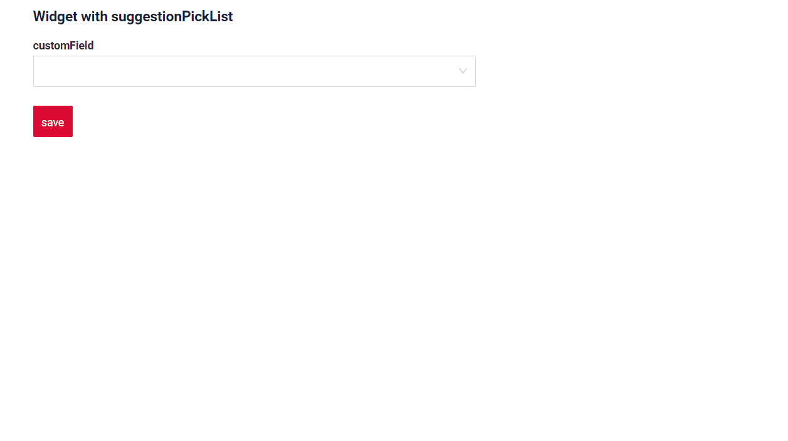
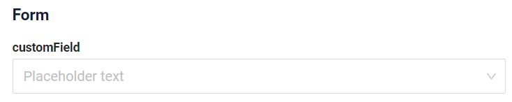
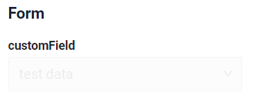
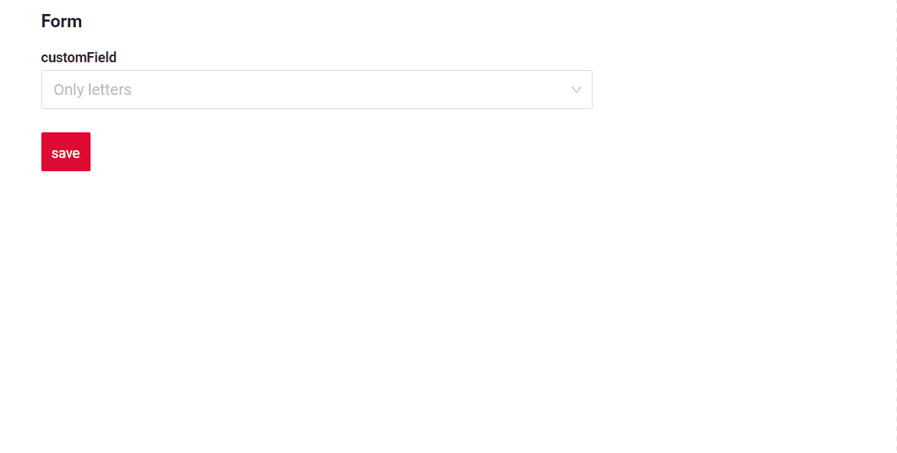
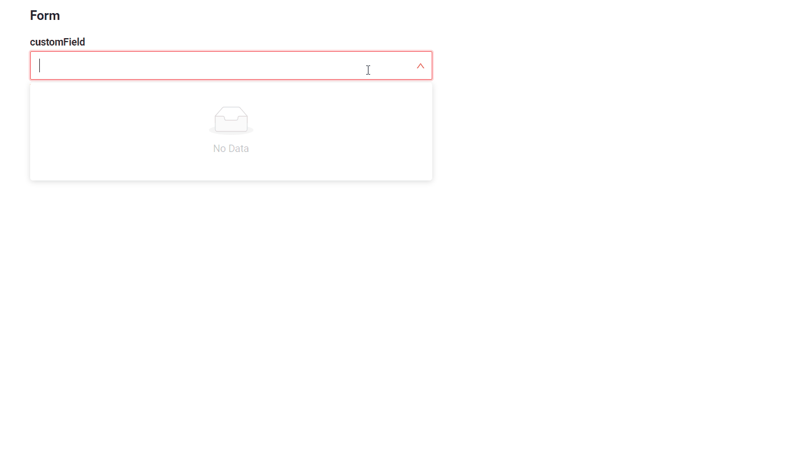
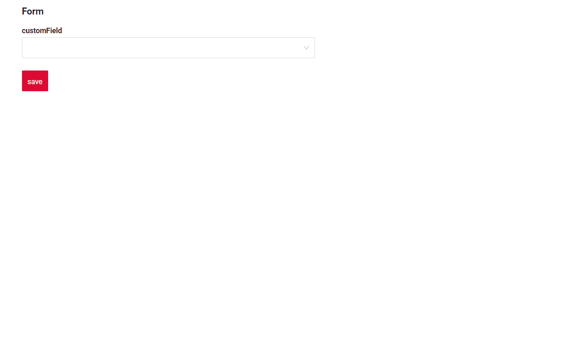
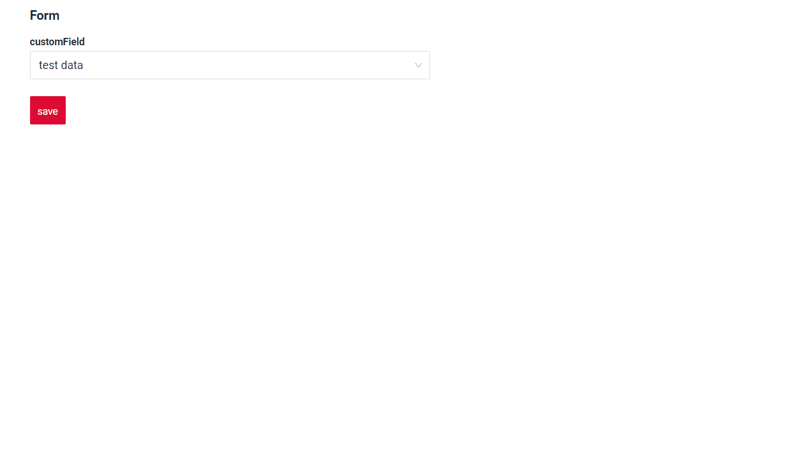
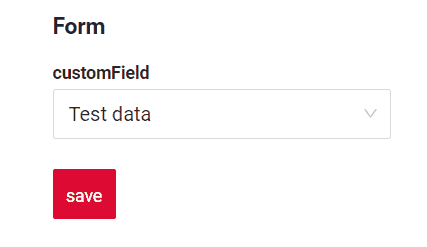

# CompanySuggestionPickList

`companySuggestionPickList` is component similar to <!-- не хватает статьи, 410 тикет [PickList Popup](/widget/fields/field/inlinePickList/inlinePickList) -->, but used to select a value from an external system microservice response.

## Basics
[:material-play-circle: Live Sample]({{ external_links.code_samples }}/ui/#/screen/myexample3080){:target="_blank"} ·
[:fontawesome-brands-github: GitHub]({{ external_links.github_ui }}/{{ external_links.github_branch }}/src/main/java/org/demo/documentation/fields/suggestion/basic){:target="_blank"}
### How does it look?

=== "List widget"
    _not applicable_
=== "Info widget"
    _not applicable_
=== "Form widget"
    


### How to add?
<!--
??? Example
    - **Step 1. Popup**

        In the following example, **MyEntity** entity has a **OneToOne/ManyToOne** reference to the **MyEntityPick** entity. Link is made by id, e.g. **MyEntity.customFieldId** = **MyEntityPick.id**. Also, is this example we will use one `additional field` **MyEntityPick.customField**, that will be shown on MyEntity widget

        +  **Step 1.1** Add **String** `additional field`  to corresponding **BaseEntity**.
            ```java
            --8<--
            {{ external_links.github_raw_doc }}/fields/inlinepicklist/basic/MyEntity132Pick.java
            --8<--
            ```

        +  **Step 1.2** Add **String** `additional field` to corresponding **DataResponseDTO**.
            ```java
            --8<--
            {{ external_links.github_raw_doc }}/fields/inlinepicklist/basic/MyEntity132PickDTO.java
            --8<--
            ```

        +  **Step 1.3**  Create Popup List **_.widget.json_**.
       
            ```json
            --8<--
            {{ external_links.github_raw_doc }}/fields/inlinepicklist/basic/myEntity132PickListPopupPickListPopup.widget.json
            --8<--
            ```
        +  **Step 1.4** Add **fields.enableFilter** to corresponding **FieldMetaBuilder**.
            ```java
            --8<--
            {{ external_links.github_raw_doc }}/fields/inlinepicklist/basic/MyEntity132PickPickListMeta.java:buildIndependentMeta
            --8<--
            ```
        
    -   **Step 2** Add **Popup** to **_.view.json_**.

        === "list.view.json"
            ```json
            --8<--
            {{ external_links.github_raw_doc }}/fields/inlinepicklist/basic/myexample133list.view.json
            --8<--
            ```
        === "form.view.json"
            ```json
            --8<--
            {{ external_links.github_raw_doc }}/fields/inlinepicklist/basic/myexample133form.view.json
            --8<--
            ```

    -   **Step3** Add **MyEntityPick** field to corresponding **BaseEntity**.
        ```java
        --8<--
        {{ external_links.github_raw_doc }}/fields/inlinepicklist/basic/MyEntity133.java
        --8<--
        ```

    -   **Step4** Add two fields (for id and for `additional field`) to corresponding **DataResponseDTO**.
        ```java
        --8<--
        {{ external_links.github_raw_doc }}/fields/inlinepicklist/basic/MyExample133DTO.java
        --8<--
        ```

    -   **Step5** Add bc myEntityPickListPopup to corresponding **EnumBcIdentifier**.
        ```java
        --8<--
        {{ external_links.github_raw_doc }}/fields/inlinepicklist/basic/PlatformMyExample133Controller.java:bc
        --8<--
        ```

    === "List widget"
        **Step6** Add popupBcName and pickMap to **_.widget.json_**.
        `pickMap` - maping for field Picklist to MyEntity

        ```json
        --8<--
        {{ external_links.github_raw_doc }}/fields/inlinepicklist/basic/MyExample133List.widget.json
        --8<--
        ``` 

    === "Info widget"
        **Step6** Add popupBcName and pickMap to **_.widget.json_**.
        `pickMap` - maping for field Picklist to MyEntity

        ```json
        --8<--
        {{ external_links.github_raw_doc }}/fields/inlinepicklist/basic/MyExample133Info.widget.json
        --8<--
        ``` 

    === "Form widget"

        **Step6** Add popupBcName and pickMap to **_.widget.json_**.
        `pickMap` - maping for field Picklist to MyEntity

        ```json
        --8<--
        {{ external_links.github_raw_doc }}/fields/inlinepicklist/basic/MyExample133Form.widget.json
        --8<--
        ``` 

-->
## Placeholder
[:material-play-circle: Live Sample]({{ external_links.code_samples }}/ui/#/screen/myexample3086){:target="_blank"} ·
[:fontawesome-brands-github: GitHub]({{ external_links.github_ui }}/{{ external_links.github_branch }}/src/main/java/org/demo/documentation/fields/suggestion/placeholder){:target="_blank"}

`Placeholder` allows you to provide a concise hint, guiding users on the expected value. This hint is displayed before any user input. It can be calculated based on business logic of application
### How does it look?
=== "List widget"
    _not applicable_
=== "Info widget"
    _not applicable_
=== "Form widget"
    

### How to add?
<!--
??? Example

    Add **fields.setPlaceholder** to corresponding **FieldMetaBuilder**.    
    ```java
    --8<--
    {{ external_links.github_raw_doc }}/fields/inlinepicklist/placeholder/MyExample144Meta.java:buildRowDependentMeta
    --8<--
    ```
    
    === "List widget"
        **Works for List.**
    === "Info widget"
        **_not applicable_**
    === "Form widget"
        **Works for Form.**

-->
## Readonly/Editable
`Readonly/Editable` indicates whether the field can be edited or not. It can be calculated based on business logic of application

`Editable`
[:material-play-circle: Live Sample]({{ external_links.code_samples }}/ui/#/screen/myexample3080){:target="_blank"} ·
[:fontawesome-brands-github: GitHub]({{ external_links.github_ui }}/{{ external_links.github_branch }}/src/main/java/org/demo/documentation/fields/suggestion/basic){:target="_blank"}

`Readonly`
[:material-play-circle: Live Sample]({{ external_links.code_samples }}/ui/#/screen/myexample3088){:target="_blank"} ·
[:fontawesome-brands-github: GitHub]({{ external_links.github_ui }}/{{ external_links.github_branch }}/src/main/java/org/demo/documentation/fields/suggestion/ro){:target="_blank"}


### How does it look?
=== "Editable"
    === "List widget"
        _not applicable_
    === "Info widget"
        _not applicable_
    === "Form widget"
        
=== "Readonly"
    === "List widget"
        _not applicable_
    === "Info widget"
        _not applicable_ 
    === "Form widget"
        


### How to add?
<!--
??? Example
    === "Editable"
        **Step1** Add mapping DTO->entity to corresponding **VersionAwareResponseService**.
        ```java
        --8<--
        {{ external_links.github_raw_doc }}/fields/inlinepicklist/basic/MyExample133Service.java:doUpdateEntity
        --8<--
        ```
        **Step2** Add **fields.setEnabled** to corresponding **FieldMetaBuilder**.
        ```java
        --8<--
        {{ external_links.github_raw_doc }}/fields/inlinepicklist/basic/MyExample133Meta.java:buildRowDependentMeta
        --8<--
        ```    
        
        === "List widget"
            **Works for List.**
        === "Info widget"
            **_not applicable_**
        === "Form widget"
            **Works for Form.**
   
    === "Readonly"
    
        **Option 1** Enabled by default.
        ```java
        --8<--
        {{ external_links.github_raw_doc }}/fields/inlinepicklist/ro/MyExample139Meta.java:buildRowDependentMeta
        --8<--
        ```    
    
        **Option 2** `Not recommended.` Property fields.setDisabled() overrides the enabled field if you use after property fields.setEnabled.
        === "List widget"
            **Works for List.**
        === "Info widget"
            **Works for Info.**
        === "Form widget"
            **Works for Form.**
-->
<!--
## Drilldown
[:material-play-circle: Live Sample]({{ external_links.code_samples }}/ui/#/screen/myexample3084){:target="_blank"} ·
[:fontawesome-brands-github: GitHub]({{ external_links.github_ui }}/{{ external_links.github_branch }}/src/main/java/org/demo/documentation/fields/suggestion/drilldown){:target="_blank"}

`DrillDown` allows you to navigate to another view by simply tapping on it. Target view and other drill-down parts can be calculated based on business logic of application

Also, it optionally allows you to filter data on target view before it will be opened `see more` [DrillDown](/features/element/drilldown/drilldown)


### How does it look?
=== "List widget"
    
=== "Info widget"
    
=== "Form widget"
    _not applicable_

### How to add?
??? Example

    **Option 1**

    `Step 1` Add [fields.setDrilldown](/features/element/drilldown/drilldown) to corresponding **FieldMetaBuilder**.
    ```java
    --8<--
    {{ external_links.github_raw_doc }}/fields/inlinepicklist/drilldown/MyExample140Meta.java:buildRowDependentMeta
    --8<--
    ```

    === "List widget"

        `Step 2` Add **"drillDown": "true"**  to .widget.json.
        ```json
        --8<--
        {{ external_links.github_raw_doc }}/fields/inlinepicklist/drilldown/MyExample140List.widget.json
        --8<--
        ```

        **Option 2**
           Add **"drillDownKey"** :  `custom field`  to .widget.json. See more [Drilldown](/advancedCustomization/element/drilldown/drilldown) 
 
    === "Info widget"

        `Step 2` Add **"drillDown": "true"**  to .widget.json.

        ```json
        --8<--
        {{ external_links.github_raw_doc }}/fields/inlinepicklist/drilldown/MyExample140Info.widget.json
        --8<--
        ```
        **Option 2**
           Add **"drillDownKey"** :  `custom field`  to .widget.json. See more [Drilldown](/advancedCustomization/element/drilldown/drilldown) 
 
    === "Form widget"
        _not applicable_
[Advanced customization](/advancedCustomization/element/drilldown/drilldown)
-->

## Validation
`Validation` allows you to check any business rules for user-entered value. There are types of validation:

1) Exception:Displays a message to notify users about technical or business errors.

   `Business Exception`:
   [:material-play-circle: Live Sample]({{ external_links.code_samples }}/ui/#/screen/myexample3112){:target="_blank"} ·
   [:fontawesome-brands-github: GitHub]({{ external_links.github_ui }}/{{ external_links.github_branch }}/src/main/java/org/demo/documentation/fields/suggestion/validationbusinessex){:target="_blank"}

   `Runtime Exception`:
   [:material-play-circle: Live Sample]({{ external_links.code_samples }}/ui/#/screen/myexample3119){:target="_blank"} ·
   [:fontawesome-brands-github: GitHub]({{ external_links.github_ui }}/{{ external_links.github_branch }}/src/main/java/org/demo/documentation/fields/suggestion/validationruntimeex){:target="_blank"}
   
2) Confirm: Presents a dialog with an optional message, requiring user confirmation or cancellation before proceeding.

   [:material-play-circle: Live Sample]({{ external_links.code_samples }}/ui/#/screen/myexample3114){:target="_blank"} ·
   [:fontawesome-brands-github: GitHub]({{ external_links.github_ui }}/{{ external_links.github_branch }}/src/main/java/org/demo/documentation/fields/suggestion/validationconfirm){:target="_blank"}

3) Field level validation: shows error next to all fields, that validation failed for

   `Option 1`:
   [:material-play-circle: Live Sample]({{ external_links.code_samples }}/ui/#/screen/myexample3117){:target="_blank"} ·
   [:fontawesome-brands-github: GitHub]({{ external_links.github_ui }}/{{ external_links.github_branch }}/src/main/java/org/demo/documentation/fields/suggestion/validationannotation){:target="_blank"}

   `Option 2`:
   [:material-play-circle: Live Sample]({{ external_links.code_samples }}/ui/#/screen/myexample3117){:target="_blank"} ·
   [:fontawesome-brands-github: GitHub]({{ external_links.github_ui }}/{{ external_links.github_branch }}/src/main/java/org/demo/documentation/fields/suggestion/validationdynamic){:target="_blank"}


### How does it look?
=== "List widget"
    _not applicable_
=== "Info widget"
    _not applicable_
=== "Form widget"
    === "BusinessException"
        
    === "RuntimeException"
        
    === "Confirm"
        
    === "Field level validation"
        
### How to add?
<!--
??? Example
    === "BusinessException"
        `BusinessException` describes an error  within a business process.

        Add **BusinessException** to corresponding **VersionAwareResponseService**.
        ```java
        --8<--
        {{ external_links.github_raw_doc }}/fields/inlinepicklist/validationbusinessex/MyExample150Service.java:doUpdateEntity
        --8<--
        ```
 
        === "List widget"
            **Works for List.**
        === "Info widget"
            **_not applicable_**
        === "Form widget"
            **Works for Form.**
    === "RuntimeException"

        `RuntimeException` describes technical error  within a business process.
        
        Add **RuntimeException** to corresponding **VersionAwareResponseService**.
        ```java
        --8<--
        {{ external_links.github_raw_doc }}/fields/inlinepicklist/validationruntimeex/MyExample154Service.java:doUpdateEntity
        --8<--
        ```        
  
        === "List widget"
            **Works for List.**
        === "Info widget"
            **_not applicable_**
        === "Form widget"
            **Works for Form.**
    === "Confirm"
        Add [PreAction.confirm](/advancedCustomization_validation) to corresponding **VersionAwareResponseService**.
        ```java
        --8<--
        {{ external_links.github_raw_doc }}/fields/inlinepicklist/validationconfirm/MyExample152Service.java:getActions
        --8<--
        ```
 
        === "List widget"
            **Works for List.**
        === "Info widget"
            **_not applicable_**
        === "Form widget"
            **Works for Form.**
    === "Field level validation"
        === "Option 1"
            Add javax.validation to corresponding **DataResponseDTO**.

            Use if:

            Requires a simple fields check (javax validation)
            ```java
            --8<--
            {{ external_links.github_raw_doc }}/fields/inlinepicklist/validationannotation/MyExample281DTO.java
            --8<--
            ```

            === "List widget"
                **Works for List.**
            === "Info widget"
                **_not applicable_**
            === "Form widget"
                **Works for Form.**
        === "Option 2"
            Create сustom service for business logic check.

            Use if:

            Business logic check required for fields

            `Step 1`  Create сustom method for check.
            ```java
            --8<--
            {{ external_links.github_raw_doc }}/fields/inlinepicklist/validationdynamic/MyExample325Service.java:validateFields
            --8<--
            ```

            `Step 2` Add сustom method for check to corresponding **VersionAwareResponseService**.
            ```java
            --8<--
            {{ external_links.github_raw_doc }}/fields/inlinepicklist/validationdynamic/MyExample325Service.java:doUpdateEntity
            --8<--
            ```

-->
## Required
[:material-play-circle: Live Sample]({{ external_links.code_samples }}/ui/#/screen/myexample3087){:target="_blank"} ·
[:fontawesome-brands-github: GitHub]({{ external_links.github_ui }}/{{ external_links.github_branch }}/src/main/java/org/demo/documentation/fields/suggestion/required){:target="_blank"}

`Required` allows you to denote, that this field must have a value provided. 

### How does it look?
=== "List widget"
    _not applicable_
=== "Info widget"
    _not applicable_
=== "Form widget"
    
### How to add?
<!--
??? Example
    Add **fields.setRequired** to corresponding **FieldMetaBuilder**.
    ```java
    --8<--
    {{ external_links.github_raw_doc }}/fields/inlinepicklist/required/MyExample146Meta.java:buildRowDependentMeta
    --8<--
    ```
 
    === "List widget"
        **Works for List.**
    === "Info widget"
        **_not applicable_**
    === "Form widget"
        **Works for Form.**
-->


