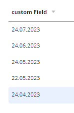

# Date
`Date`  is a component for date with time editing. It can be used for editing and displaying dates.

## Basics
### How does it look?

=== "List widget"
    
=== "Info widget"
    
=== "Form widget"
    


### How to add?
??? Example
    **Step1** Add field **LocalDate** to corresponding **DataResponseDTO**.

    ```java
    public class DateDTO extends DataResponseDTO {
        @SearchParameter(name = "customField", provider = DateValueProvider.class)   
        private LocalDate customField;
    
        public DateDTO(DateEntity entity) {
            this.customField = entity.getCustomField();
        }
    }
    ```

    **Step2** Add field **LocalDate** to corresponding **BaseEntity**.
    
    ```java
    public class DateEntity extends BaseEntity {
    
        private LocalDate customField;
    
    }
    ```
    === "List widget"
  
        **Step3** Add to **_.widget.json_**.

        ```json
        {
          "name": "DateList",
          "title": "List title",
          "type": "List",
          "bc": "myBcDate",
          "fields": [
            {
              "title": "custom Field",
              "key": "customField",
              "type": "date"
            }
          ],
          "options": {
            "actionGroups": {
            }
          }
        }
        ```
    === "Info widget"
 
        **Step3** Add to **_.widget.json_**.

        ```json
        {
          "name": "DateInfo",
          "title": "Info title",
          "type": "Info",
          "bc": "myBcDate",
          "fields": [
            {
              "label": "custom Field",
              "key": "customField",
              "type": "date"
            }
          ],
          "options": {
            "layout": {
              "rows": [
                {
                  "cols": [
                    {
                      "fieldKey": "customField",
                      "span": 12
                    }
                  ]
                }
              ]
            }
          }
        }
        ```

    === "Form widget"
         **Step3** Add to **_.widget.json_**.

        ```json
        {
          "name": "DateForm",
          "title": "Form title",
          "type": "Form",
          "bc": "myBcDate",
          "fields": [
            {
              "label": "custom Field",
              "key": "customField",
              "type": "date"
            }
          ],
          "options": {
            "layout": {
              "rows": [
                {
                  "cols": [
                    {
                      "fieldKey": "customField",
                      "span": 12
                    }
                  ]
                }
              ]
            }
          }
        }
        ```

## Placeholder

## Color
`Color`  is an element of user interface that lets an user to specify a field color.
It can be calculated.

### How does it look?
=== "List widget"
    

=== "Info widget"
    

=== "Form widget"
    _not applicable_


### How to add?
??? Example
    === "Calculated color"
        It can be calculated.

        **Step 1**   Add `custom field` for color to corresponding **DataResponseDTO**. 
    
        ```java
        public class DateDTO extends DataResponseDTO {
        
                  private LocalDate customField;    
                  private String customFieldColor;
                
                  public DateDTO(DateEntity entity) {
                    this.customField = entity.getCustomField();
                    this.customFieldColor = "#eda6a6";
                  }        
                }
        ```
        === "List widget"   
            **Step 2** Add **"bgColorKey"** :  `custom field for color`  to .widget.json.
            ```json
            {
              "name": "DateList",
              "title": "List title",
              "type": "List",
              "bc": "myBcDate",
              "fields": [
                {
                  "title": "custom Field",
                  "key": "customField",
                  "type": "date",
                  "bgColorKey": "customFieldColor"
                }
              ],
              "options": {
                "actionGroups": {
                }
              }
            }
            ```
        === "Info widget"
            **Step 2** Add **"bgColorKey"** :  `custom field for color`  to .widget.json.
            ```json
            {
              "name": "DateInfo",
              "title": "Info title",
              "type": "Info",
              "bc": "myBcDate",
              "fields": [
                {
                  "label": "custom Field",
                  "key": "customField",
                  "type": "date",
                  "bgColorKey": "customFieldColor"
                }
              ],
              "options": {
                "layout": {
                  "rows": [
                    {
                      "cols": [
                        {
                          "fieldKey": "customField",
                          "span": 12
                        }
                      ]
                    }
                  ]
                }
              }
            }
            ```
        === "Form widget"
            _not applicable_   

    === "Constant color"
        === "List widget" 
            Add **"bgColor"** :  `custom color`  to .widget.json.
            ```json
            {
              "name": "DaterList",
              "title": "List title",
              "type": "List",
              "bc": "myBcDate",
              "fields": [
                {
                  "title": "custom Field",
                  "key": "customField",
                  "type": "date",
                  "bgColor": "#eda6a6"
                }
              ],
              "options": {
                "actionGroups": {
                }
              }
            }
            ```

        === "Info widget"
            Add **"bgColor"** :  `custom color`  to .widget.json.
            ```json
            {
              "name": "DaterInfo",
              "title": "Info title",
              "type": "Info",
              "bc": "myBcDate",
              "fields": [
                {
                  "label": "custom Field",
                  "key": "customField",
                  "type": "date",
                  "bgColor": "#eda6a6"
                }
              ],
              "options": {
                "layout": {
                  "rows": [
                    {
                      "cols": [
                        {
                          "fieldKey": "customField",
                          "span": 12
                        }
                      ]
                    }
                  ]
                }
              }
            }
            ```

        === "Form widget"
           _not applicable_    


## Readonly/Editable
`Readonly/Editable` indicates that the field can be edited or not.It can be calculated.

### How does it look?
=== "Editable List widget"
    
=== "Editable Info widget"
    _not applicable_
=== "Editable Form widget"
    

### How to add?
??? Example
    === "Editable"
        **Step1** Add mapping DTO->entity to corresponding **VersionAwareResponseService**.
            ```java
            
            public class DateService extends VersionAwareResponseService<DateDTO, Date> {
     
                @Override
                protected ActionResultDTO<DateDTO> doUpdateEntity(DateEntity entity, DateDTO data, BusinessComponent bc) {
                    if (data.isFieldChanged(DateDTO_.customField)) {
                        entity.setCustomField(data.getCustomField());
                    }
                    return new ActionResultDTO<>(entityToDto(bc, entity));
                }
          
            ```
        **Step2** Add **fields.setEnabled** to corresponding **FieldMetaBuilder**.
    
        ```java
        public class DateMeta extends FieldMetaBuilder<DateDTO> {
          @Override
          public void buildRowDependentMeta(RowDependentFieldsMeta<DateDTO> fields, InnerBcDescription bcDescription,
                                            Long id, Long parentId) {
            fields.setEnabled(
              DateDTO_.customField
            );
          }
        }
        ```
        === "List widget"
            **Works for List.**
        === "Info widget"
            **_not applicable_**
        === "Form widget"
            **Works for Form.**
   
    === "Readonly"
    
        **Option 1** Enabled by default.
    
        ```java
        public class DateMeta extends FieldMetaBuilder<DateDTO> {
          @Override
          public void buildRowDependentMeta(RowDependentFieldsMeta<DateDTO> fields, InnerBcDescription bcDescription,
                                            Long id, Long parentId) {
        
          }
        }
        ```
    
        **Option 2** `Not recommended.` Property fields.setDisabled() overrides the enable field if you use after property fields.setEnabled.
        === "List widget"
            **Works for List.**
        === "Info widget"
            **_not applicable_**
        === "Form widget"
            **Works for Form.**
## Filtration
`Filtration` is used to filter data according to specified criteria. Search by = day.
### How does it look?
=== "List widget"
    
=== "Info widget"
    _not applicable_
=== "Form widget"
    _not applicable_

### How to add?
??? Example
    === "List widget"
        **Step 1** Add **@SearchParameter** to corresponding **DataResponseDTO**. (Advanced customization [SearchParameter](/advancedCustomization_filtration)
        
        ```java
        public class DateDTO extends DataResponseDTO {
        
          @SearchParameter(name = "customField", provider = DateValueProvider.class)
          private LocalDate customField;

        ```
        
        **Step 2**  Add **fields.enableFilter** to corresponding **FieldMetaBuilder**.
        
        ```java
        
            public class DateMeta extends FieldMetaBuilder<DateDTO> {
            
              @Override
                public void buildIndependentMeta(FieldsMeta<DateDTO> fields, InnerBcDescription bcDescription, Long parentId) {
                 fields.enableFilter(DateDTO_.customField);
              }
            
            }
        ```

    === "Info widget"
        _not applicable_
    === "Form widget"
        _not applicable_

## Drilldown
`DrillDown` lets the user to navigate to another view by tapping it.

`see more` [DrillDown](/features/element/drillDown/drillDown)

### How does it look?
=== "List widget"
    
=== "Info widget"
    
=== "Form widget"
    _not applicable_

### How to add?
??? Example

    **Option 1**

    `Step 1` Add [fields.setDrilldown](/features/element/drillDown/drillDown) to corresponding **FieldMetaBuilder**.
    ```java
    public class DateMeta extends FieldMetaBuilder<DateDTO> {
 
        @Override
        public void buildRowDependentMeta(RowDependentFieldsMeta<DateDTO> fields, InnerBcDescription bcDescription,
                                          Long id, Long parentId) {
              fields.setDrilldown(
                    DateDTO_.customField,
                    DrillDownType.INNER,
                    "/screen/Date/view/Dateform/" + PlatformDateController.Date + "/" + id
            );
    ```
    === "List widget"
        `Step 2` For visual add **"drillDown": "true"**  to .widget.json.
            ```json
            {
              "name": "DateList",
              "title": "List title",
              "type": "List",
              "bc": "myBcDate",
              "fields": [
                {
                  "title": "custom Field",
                  "key": "customField",
                  "type": "date",
                  "drillDown": "true"
                }
              ],
              "options": {
                "actionGroups": {
                }
              }
            }
            ```


        **Option 2**
           Add **"drillDownKey"** :  `custom field`  to .widget.json. see more [Drilldown](/advancedCustomization/element/drillDown/drillDown) 
 
    === "Info widget"

        `Step 2` For visual add **"drillDown": "true"**  to .widget.json.

        ```json
        {
          "name": "DateInfo",
          "title": "Info title",
          "type": "Info",
          "bc": "myBcDate",
          "fields": [
            {
              "label": "custom Field",
              "key": "customField",
              "type": "date",
              "drillDown": "true"
            }
          ],
          "options": {
            "layout": {
              "rows": [
                {
                  "cols": [
                    {
                      "fieldKey": "customField",
                      "span": 12
                    }
                  ]
                }
              ]
            }
          }
        }
        ```
        **Option 2**
           Add **"drillDownKey"** :  `custom field`  to .widget.json. see more [Drilldown](/advancedCustomization/element/drillDown/drillDown) 
 
    === "Form widget"
        _not applicable_
[Advanced customization](/advancedCustomization/element/drillDown/drillDown)

## Validation
`Validation` is designed to check values entered into visual components.
Validation can be of two types:

1) Exception is message about technical or business errors.

2) Confirm  is designed to display a dialog with an optional message, and to wait until the user either confirms or cancels the dialog.
### How does it look?
=== "List widget"
    === "BusinessException"

    === "RuntimeException"
        _not applicable_   
    === "Confirm"
        
=== "Info widget"
    _not applicable_
=== "Form widget"
    === "BusinessException"

    === "RuntimeException"
    
    === "Confirm"
        

### How to add?
??? Example
    === "BusinessException"
        `BusinessException` describes an error  within a business process.
    
        Add **BusinessException** to corresponding **VersionAwareResponseService**.
    
        ```java
            @Override
            protected ActionResultDTO<DateDTO> doUpdateEntity(DateEntity entity, DateDTO data, BusinessComponent bc) {
            if (data.isFieldChanged(DateDTO_.customField)) {
                entity.setCustomField(data.getCustomField());
                LocalDate sysdate = LocalDate.now();
                if (sysdate.compareTo(data.getCustomField().toLocalDate()) > 0) {
                    throw new BusinessException().addPopup("The field 'customField' cannot be less than the current date");
                }
            }
            return new ActionResultDTO<>(entityToDto(bc, entity));          
        ```
        === "List widget"
            **Works for List.**
        === "Info widget"
            **_not applicable_**
        === "Form widget"
            **Works for Form.**
    === "RuntimeException"

        `RuntimeException` describes an error  within a business process.
        
        Add **RuntimeException** to corresponding **VersionAwareResponseService**.
        
        ```java
        @Override
        protected ActionResultDTO<DateDTO> doUpdateEntity(DateEntity entity, DateDTO data, BusinessComponent bc) {
            if (data.isFieldChanged(DateDTO_.customField)) {
                entity.setCustomField(data.getCustomField());
                try {
                    //call custom function
                 }
                catch(Exception e){
                    throw new RuntimeException("An unexpected error has occurred.");
                }
            }
             return new ActionResultDTO<>(entityToDto(bc, entity));
        }
        ```                   
        === "List widget"
            **Works for List.**
        === "Info widget"
            **_not applicable_**
        === "Form widget"
            **Works for Form.**
    === "Confirm"
        Add [PreAction.confirm](/advancedCustomization/element/confirm/confirm) to corresponding **VersionAwareResponseService**.
        ```java
            @Override
            public Actions<DateValidationDTO> getActions() {
                return Actions.<DateValidationDTO>builder()
                        .newAction()
                        .action("save", "save")
                        .withPreAction(PreAction.confirm("You want to save the value 'customField'?"))
                        .add()
                        .build();
            }
        ```
        === "List widget"
            **Works for List.**
        === "Info widget"
            **_not applicable_**
        === "Form widget"
            **Works for Form.**

## Sorting
`Sorting` function allows to sort in ascending or descending order.
The records in descending order by default.

### How does it look?
=== "List widget"
    
=== "Info widget"
    _not applicable_
=== "Form widget"
    _not applicable_
### How to add?
=== "List widget"
    Enabled on default.
=== "Info widget"
    _not applicable_
=== "Form widget"
    _not applicable_

## Required
`Required` indicates that this field requires a value.

### How does it look?
=== "List widget"
    
=== "Info widget"
    _not applicable_
=== "Form widget"
    
### How to add?
??? Example
    Add **fields.setRequired** to corresponding **FieldMetaBuilder**.
    
    ```java    
    public class DateMeta extends FieldMetaBuilder<DateDTO> {
    
        @Override
        public void buildRowDependentMeta(RowDependentFieldsMeta<DateDTO> fields, InnerBcDescription bcDescription,
                                          Long id, Long parentId) {
            fields.setEnabled(DateDTO_.customField);
            fields.setRequired(DateDTO_.customField);
        }
    ```
    === "List widget"
        **Works for List.**
    === "Info widget"
        **_not applicable_**
    === "Form widget"
        **Works for Form.**
