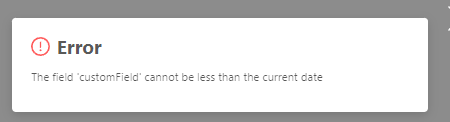

# DateTime
`DateTime`  is a component for date with time editing. It can be used for editing and displaying dates with time.
## Basics
[:material-play-circle: Live Sample]({{ external_links.code_samples }}/ui/#/screen/DateTimeBasic){:target="_blank"} ·
[:fontawesome-brands-github: GitHub]({{ external_links.github_ui }}/{{ external_links.github_branch }}/src/main/java/org/demo/documentation/fields/datetime/basic){:target="_blank"}
### How does it look?

=== "List widget"
    
=== "Info widget"
    
=== "Form widget"
    


### How to add?
??? Example
    **Step1** Add field **LocalDateTime** to corresponding **BaseEntity**.

    ```java
    --8<--
    {{ external_links.github_raw_doc }}/fields/datetime/basic/DateTimeBasic.java
    --8<--
    ```

    **Step2**  Add field **LocalDateTime** to corresponding **DataResponseDTO**.
    
    ```java
    --8<--
    {{ external_links.github_raw_doc }}/fields/datetime/basic/DateTimeBasicDTO.java
    --8<--
    ```

    === "List widget"
        **Step3** Add to **_.widget.json_**.

        ```json
        --8<--
        {{ external_links.github_raw_doc }}/fields/datetime/basic/DateTimeBasicList.widget.json
        --8<--
        ```
    === "Info widget"
        **Step3** Add to **_.widget.json_**.
        
        ```json
        --8<--
        {{ external_links.github_raw_doc }}/fields/datetime/basic/DateTimeBasicInfo.widget.json
        --8<--
        ```

    === "Form widget"

        **Step3** Add to **_.widget.json_**.

        ```json
        --8<--
        {{ external_links.github_raw_doc }}/fields/datetime/basic/DateTimeBasicForm.widget.json
        --8<--
        ```    
## Placeholder
[:material-play-circle: Live Sample]({{ external_links.code_samples }}/ui/#/screen/DateTimePlaceholder){:target="_blank"} ·
[:fontawesome-brands-github: GitHub]({{ external_links.github_ui }}/{{ external_links.github_branch }}/src/main/java/org/demo/documentation/fields/datetime/placeholder){:target="_blank"}


`Placeholder` allows you to provide a concise hint, guiding users on the expected value. This hint is displayed before any user input. It can be calculated based on business logic of application.
### How does it look?
=== "List widget"
    
=== "Info widget"
    _not applicable_
=== "Form widget"
    

### How to add?
??? Example

    Add **fields.setPlaceholder** to corresponding **FieldMetaBuilder**.
    
    ```java
    --8<--
    {{ external_links.github_raw_doc }}/fields/datetime/placeholder/DateTimePlaceholderMeta.java:buildRowDependentMeta
    --8<--
    ```
    === "List widget"
        **Works for List.**
    === "Info widget"
        **_not applicable_**
    === "Form widget"
        **Works for Form.**

## Color
`Color` allows you to specify a field color. It can be calculated based on business logic of application

**Calculated color**

[:material-play-circle: Live Sample]({{ external_links.code_samples }}/ui/#/screen/DateTimeColor){:target="_blank"} ·
[:fontawesome-brands-github: GitHub]({{ external_links.github_ui }}/{{ external_links.github_branch }}/src/main/java/org/demo/documentation/fields/datetime/color){:target="_blank"}

**Constant color**

[:material-play-circle: Live Sample]({{ external_links.code_samples }}/ui/#/screen/DateTimeColorConst){:target="_blank"} ·
[:fontawesome-brands-github: GitHub]({{ external_links.github_ui }}/{{ external_links.github_branch }}/src/main/java/org/demo/documentation/fields/datetime/colorconst){:target="_blank"}


### How does it look?
=== "List widget"
    

=== "Info widget"
    

=== "Form widget"
    _not applicable_


### How to add?
??? Example
    === "Calculated color"

        **Step 1**   Add `custom field for color` to corresponding **DataResponseDTO**. The field can contain a HEX color or be null. 
        ```java
        --8<--
        {{ external_links.github_raw_doc }}/fields/datetime/color/DateTimeColorCalcDTO.java
        --8<--
        ```

        === "List widget"   
            **Step 2** Add **"bgColorKey"** :  `custom field for color`  to .widget.json.
            ```json
            --8<--
            {{ external_links.github_raw_doc }}/fields/datetime/color/DateTimeColorCalcList.widget.json
            --8<--
            ```
        === "Info widget"
            **Step 2** Add **"bgColorKey"** :  `custom field for color`  to .widget.json.
            ```json
            --8<--
            {{ external_links.github_raw_doc }}/fields/datetime/color/DateTimeColorCalcInfo.widget.json
            --8<--
            ```
        === "Form widget"
            _not applicable_   

    === "Constant color"
        === "List widget" 
            Add **"bgColor"** :  `HEX color`  to .widget.json.
            ```json
            --8<--
            {{ external_links.github_raw_doc }}/fields/datetime/color/DateTimeColorCalcForm.widget.json
            --8<--
            ```

        === "Info widget"
            Add **"bgColor"** :  `HEX color`  to .widget.json.
            ```json
            --8<--
            {{ external_links.github_raw_doc }}/fields/datetime/color/DateTimeColorCalcInfo.widget.json
            --8<--
            ```
        === "Form widget"
           _not applicable_    


## Readonly/Editable
`Readonly/Editable` indicates whether the field can be edited or not. It can be calculated based on business logic of application

`Editable`
[:material-play-circle: Live Sample]({{ external_links.code_samples }}/ui/#/screen/DateTimeBasic){:target="_blank"} ·
[:fontawesome-brands-github: GitHub]({{ external_links.github_ui }}/{{ external_links.github_branch }}/src/main/java/org/demo/documentation/fields/datetime/basic){:target="_blank"}

`Readonly`
[:material-play-circle: Live Sample]({{ external_links.code_samples }}/ui/#/screen/DateTimeEdit){:target="_blank"} ·
[:fontawesome-brands-github: GitHub]({{ external_links.github_ui }}/{{ external_links.github_branch }}/src/main/java/org/demo/documentation/fields/datetime/ro){:target="_blank"}


### How does it look?
=== "Readonly"
    === "List widget"
        
    === "Info widget"
        _not applicable_
    === "Form widget"
        
=== "Readonly"
    === "List widget"
        
    === "Info widget"
        
    === "Form widget"
        


### How to add?
??? Example
    === "Editable"
        **Step1** Add mapping DTO->entity to corresponding **VersionAwareResponseService**.

        ```java
        --8<--
        {{ external_links.github_raw_doc }}/fields/datetime/basic/DateTimeBasicService.java:doUpdateEntity
        --8<--
        ```

        **Step2** Add **fields.setEnabled** to corresponding **FieldMetaBuilder**.
        ```java
        --8<--
        {{ external_links.github_raw_doc }}/fields/datetime/basic/DateTimeBasicMeta.java:buildRowDependentMeta
        --8<--
        ```

        === "List widget"
            **Works for List.**
        === "Info widget"
            **_not applicable_**
        === "Form widget"
            **Works for Form.**
   
    === "Readonly"
        **Option 1** Enabled by default.

        ```java
        --8<--
        {{ external_links.github_raw_doc }}/fields/datetime/ro/DateTimeEditMeta.java:buildRowDependentMeta
        --8<--
        ```
    
        **Option 2** `Not recommended.` Property fields.setDisabled() overrides the enabled field if you use after property fields.setEnabled.
        === "List widget"
            **Works for List.**
        === "Info widget"
            **Works for Info.**
        === "Form widget"
            **Works for Form.**
## Filtering
[:material-play-circle: Live Sample]({{ external_links.code_samples }}/ui/#/screen/DateTimeFiltration){:target="_blank"} ·
[:fontawesome-brands-github: GitHub]({{ external_links.github_ui }}/{{ external_links.github_branch }}/src/main/java/org/demo/documentation/fields/datetime/filtration){:target="_blank"}

`Filtering` allows you to search data based on criteria. Search is carried out between 00:00 and 23:59.
### How does it look?
=== "List widget"
    
=== "Info widget"
    _not applicable_
=== "Form widget"
    _not applicable_

### How to add?
??? Example
    === "List widget"
        **Step 1** Add **@SearchParameter** to corresponding **DataResponseDTO**. (Advanced customization [SearchParameter](/advancedCustomization/element/searchparameter/searchparameter))

        ```java
        --8<--
        {{ external_links.github_raw_doc }}/fields/datetime/filtration/DateTimeFiltrationDTO.java
        --8<--
        ```
        **Step 2**  Add **fields.enableFilter** to corresponding **FieldMetaBuilder**.

        ```java
        --8<--
        {{ external_links.github_raw_doc }}/fields/datetime/filtration/DateTimeFiltrationMeta.java:buildIndependentMeta
        --8<--
        ```

    === "Info widget"
        _not applicable_
    === "Form widget"
        _not applicable_

## Drilldown
[:material-play-circle: Live Sample]({{ external_links.code_samples }}/ui/#/screen/DateTimeDrilldown){:target="_blank"} ·
[:fontawesome-brands-github: GitHub]({{ external_links.github_ui }}/{{ external_links.github_branch }}/src/main/java/org/demo/documentation/fields/datetime/drilldown){:target="_blank"}

`DrillDown` allows you to navigate to another view by simply tapping on it. Target view and other drill-down parts can be calculated based on business logic of application

Also, it optionally allows you to filter data on target view before it will be opened `see more` [DrillDown](/features/element/drilldown/drilldown)


### How does it look?
=== "List widget"
    
=== "Info widget"
    
=== "Form widget"
    _not applicable_

### How to add?
??? Example

    **Option 1**

    `Step 1` Add [fields.setDrilldown](/features/element/drilldown/drilldown) to corresponding **FieldMetaBuilder**.
    ```java
    --8<--
    {{ external_links.github_raw_doc }}/fields/datetime/drilldown/DateTimeDrilldownMeta.java:buildRowDependentMeta
    --8<--
    ```
    === "List widget"
        `Step 2` Add **"drillDown": "true"**  to .widget.json.

        ```json
        --8<--
        {{ external_links.github_raw_doc }}/fields/datetime/drilldown/DateTimeDrilldownList.widget.json
        --8<--
        ```

        **Option 2**
           Add **"drillDownKey"** :  `custom field`  to .widget.json. See more [Drilldown](/advancedCustomization/element/drilldown/drilldown) 
 
    === "Info widget"

        `Step 2` Add **"drillDown": "true"**  to .widget.json.

        ```json
        --8<--
        {{ external_links.github_raw_doc }}/fields/datetime/drilldown/DateTimeDrilldownInfo.widget.json
        --8<--
        ```

        **Option 2**
           Add **"drillDownKey"** :  `custom field`  to .widget.json. See more [Drilldown](/advancedCustomization/element/drilldown/drilldown) 
 
    === "Form widget"
        _not applicable_

[Advanced customization](/advancedCustomization/element/drilldown/drilldown)

## Validation
`Validation` allows you to check any business rules for user-entered value. There are types of validation:

1) Exception:Displays a message to notify users about technical or business errors.

   `Business Exception`:
   [:material-play-circle: Live Sample]({{ external_links.code_samples }}/ui/#/screen/DateTimeValidationBusinessEx){:target="_blank"} ·
   [:fontawesome-brands-github: GitHub]({{ external_links.github_ui }}/{{ external_links.github_branch }}/src/main/java/org/demo/documentation/fields/datetime/validationbusinessex){:target="_blank"}

   `Runtime Exception`:
   [:material-play-circle: Live Sample]({{ external_links.code_samples }}/ui/#/screen/DateTimeValidationRuntimeEx){:target="_blank"} ·
   [:fontawesome-brands-github: GitHub]({{ external_links.github_ui }}/{{ external_links.github_branch }}/src/main/java/org/demo/documentation/fields/datetime/validationruntimeex){:target="_blank"}
   
2) Confirm: Presents a dialog with an optional message, requiring user confirmation or cancellation before proceeding.

   [:material-play-circle: Live Sample]({{ external_links.code_samples }}/ui/#/screen/DateTimeConfirm){:target="_blank"} ·
   [:fontawesome-brands-github: GitHub]({{ external_links.github_ui }}/{{ external_links.github_branch }}/src/main/java/org/demo/documentation/fields/datetime/validationconfirm){:target="_blank"}

3) Field level validation: shows error next to all fields, that validation failed for

   `Option 1`:
   [:material-play-circle: Live Sample]({{ external_links.code_samples }}/ui/#/screen/myexample166){:target="_blank"} ·
   [:fontawesome-brands-github: GitHub]({{ external_links.github_ui }}/{{ external_links.github_branch }}/src/main/java/org/demo/documentation/fields/datetime/validationannotation){:target="_blank"}

   `Option 2`:
   [:material-play-circle: Live Sample]({{ external_links.code_samples }}/ui/#/screen/myexample321){:target="_blank"} ·
   [:fontawesome-brands-github: GitHub]({{ external_links.github_ui }}/{{ external_links.github_branch }}/src/main/java/org/demo/documentation/fields/datetime/validationdynamic){:target="_blank"}

### How does it look?
=== "List widget"
    === "BusinessException"
        
    === "RuntimeException"
        
    === "Confirm"
        
    === "Field level validation"
        
=== "Info widget"
    _not applicable_
=== "Form widget"
    === "BusinessException"
        
    === "RuntimeException"
        
    === "Confirm"
        
    === "Field level validation"
        


### How to add?
??? Example
    === "BusinessException"
        `BusinessException` describes an error  within a business process.
    
        Add **BusinessException** to corresponding **VersionAwareResponseService**.

        ```java
        --8<--
        {{ external_links.github_raw_doc }}/fields/datetime/validationbusinessex/DateTimeValidationBusinessExService.java:doUpdateEntity
        --8<--
        ```
        === "List widget"
            **Works for List.**
        === "Info widget"
            **_not applicable_**
        === "Form widget"
            **Works for Form.**
    === "RuntimeException"

        `RuntimeException` describes technical error  within a business process.
        
        Add **RuntimeException** to corresponding **VersionAwareResponseService**.
 
        ```java
        --8<--
        {{ external_links.github_raw_doc }}/fields/datetime/validationruntimeex/DateTimeValidationRuntimeExService.java:doUpdateEntity
        --8<--
        ```
        === "List widget"
            **Works for List.**
        === "Info widget"
            **_not applicable_**
        === "Form widget"
            **Works for Form.**
    === "Confirm"
        Add [PreAction.confirm](/advancedCustomization/element/confirm/confirm) to corresponding **VersionAwareResponseService**.
        ```java
        --8<--
        {{ external_links.github_raw_doc }}/fields/datetime/validationconfirm/DateTimeValidationService.java:getActions
        --8<--
        ```
        === "List widget"
            **Works for List.**
        === "Info widget"
            **_not applicable_**
        === "Form widget"
            **Works for Form.**

    === "Field level validation"
        === "Option 1"
            Add javax.validation to corresponding **DataResponseDTO**.

            Use if:

            Requires a simple fields check (javax validation)
            ```java
            --8<--
            {{ external_links.github_raw_doc }}/fields/datetime/validationannotation/MyExample166DTO.java
            --8<--
            ```
            === "List widget"
                **Works for List.**
            === "Info widget"
                **_not applicable_**
            === "Form widget"
                **Works for Form.**
        === "Option 2"
            Create сustom service for business logic check.

            Use if:

            Business logic check required for fields

            `Step 1`  Create сustom method for check.

            ```java
            --8<--
            {{ external_links.github_raw_doc }}/fields/datetime/validationdynamic/MyExample321Service.java:validateFields
            --8<--
            ```
            `Step 2` Add сustom method for check to corresponding **VersionAwareResponseService**.

            ```java
            --8<--
            {{ external_links.github_raw_doc }}/fields/datetime/validationdynamic/MyExample321Service.java:doUpdateEntity
            --8<--
            ```
 
## Sorting
[:material-play-circle: Live Sample]({{ external_links.code_samples }}/ui/#/screen/DateTimeSort){:target="_blank"} ·
[:fontawesome-brands-github: GitHub]({{ external_links.github_ui }}/{{ external_links.github_branch }}/src/main/java/org/demo/documentation/fields/datetime/sorting){:target="_blank"}

`Sorting` allows you to sort data in ascending or descending order.

### How does it look?
=== "List widget"
    
=== "Info widget"
    _not applicable_
=== "Form widget"
    _not applicable_
### How to add?
??? Example
    === "List widget"
        see more [Sorting](/widget/type/property/sorting/sorting)

        **Step 1**  Add **fields.enableSort** to corresponding **FieldMetaBuilder**.
        ```java
        --8<--
        {{ external_links.github_raw_doc }}/fields/datetime/sorting/DateTimeSortMeta.java:buildIndependentMeta
        --8<--
        ```
 
        [:material-play-circle: Live Sample]({{ external_links.code_samples }}/ui/#/screen/DateTimeSort){:target="_blank"} ·
        [:fontawesome-brands-github: GitHub]({{ external_links.github_ui }}/{{ external_links.github_branch }}/src/main/java/org/demo/documentation/fields/datetime/sorting){:target="_blank"}

    === "Info widget"
        _not applicable_
    === "Form widget"
        _not applicable_

## Required
[:material-play-circle: Live Sample]({{ external_links.code_samples }}/ui/#/screen/RequiredDateTime){:target="_blank"} ·
[:fontawesome-brands-github: GitHub]({{ external_links.github_ui }}/{{ external_links.github_branch }}/src/main/java/org/demo/documentation/fields/datetime/required){:target="_blank"}

`Required` allows you to denote, that this field must have a value provided.
### How does it look?
=== "List widget"
    
=== "Info widget"
    _not applicable_
=== "Form widget"
    
### How to add?
??? Example
    Add **fields.setRequired** to corresponding **FieldMetaBuilder**.
    ```java
    --8<--
    {{ external_links.github_raw_doc }}/fields/datetime/required/RequiredDateTimeMeta.java:buildRowDependentMeta
    --8<--
    ```    

    === "List widget"
        **Works for List.**
    === "Info widget"
        **_not applicable_**
    === "Form widget"
        **Works for Form.**
