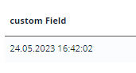

# DateTimeWithSeconds
`DateTimeWithSeconds` is a component for date with time editing. It can be used for editing and displaying dates with time and with seconds.

## Basics
[:material-play-circle: Live Sample]({{ external_links.code_samples }}/ui/#/screen/DateTimeWithSecondsBasic){:target="_blank"} ·
[:fontawesome-brands-github: GitHub]({{ external_links.github_ui }}/{{ external_links.github_branch }}/src/main/java/org/demo/documentation/datetimewithseconds/basic){:target="_blank"}
### How does it look?

=== "List widget"
    
=== "Info widget"
    
=== "Form widget"
    


### How to add?
??? Example
    **Step1** Add field **LocalDateTimeWithSeconds** to corresponding **BaseEntity**.

    ```java
    --8<--
    {{ external_links.github_raw }}/{{ external_links.github_branch }}/src/main/java/org/demo/documentation/datetimewithseconds/basic/DateTimeWithSecondsEntity.java
    --8<--
    ```

    **Step2** Add field **LocalDateTimeWithSeconds** to corresponding **DataResponseDTO**.
   
    ```java
    --8<--
    {{ external_links.github_raw }}/{{ external_links.github_branch }}/src/main/java/org/demo/documentation/datetimewithseconds/basic/DateTimeWithSecondsDTO.java
    --8<--
    ```

    === "List widget"
        **Step3** Add to **_.widget.json_**.

        ```json
        --8<--
        {{ external_links.github_raw }}/{{ external_links.github_branch }}/src/main/java/org/demo/documentation/datetimewithseconds/basic/DateTimeWithSecondsList.widget.json
        --8<--
        ```
    === "Info widget"
        **Step3** Add to **_.widget.json_**.
        
        ```json
        --8<--
        {{ external_links.github_raw }}/{{ external_links.github_branch }}/src/main/java/org/demo/documentation/datetimewithseconds/basic/DateTimeWithSecondsInfo.widget.json
        --8<--
        ```

    === "Form widget"

        **Step3** Add to **_.widget.json_**.

        ```json
        --8<--
        {{ external_links.github_raw }}/{{ external_links.github_branch }}/src/main/java/org/demo/documentation/datetimewithseconds/basic/DateTimeWithSecondsForm.widget.json
        --8<--
        ```    

## Placeholder
[:material-play-circle: Live Sample]({{ external_links.code_samples }}/ui/#/screen/DateTimeWithSecondsPlaceholder){:target="_blank"} ·
[:fontawesome-brands-github: GitHub]({{ external_links.github_ui }}/{{ external_links.github_branch }}/src/main/java/org/demo/documentation/datetimewithseconds/placeholder){:target="_blank"}


`Placeholder` allows you to provide a concise hint, guiding users on the expected value. This hint is displayed before any user input. It can be calculated based on business logic of application.
### How does it look?
=== "List widget"
    
=== "Info widget"
    _not applicable_
=== "Form widget"
    

### How to add?
??? Example

    Add **fields.setPlaceholder** to corresponding **FieldMetaBuilder**.
    
    ```java
    --8<--
    {{ external_links.github_raw }}/{{ external_links.github_branch }}/src/main/java/org/demo/documentation/datetimewithseconds/placeholder/DateTimeWithSecondsPlaceholderMeta.java:buildRowDependentMeta
    --8<--
    ```
    === "List widget"
        **Works for List.**
    === "Info widget"
        **_not applicable_**
    === "Form widget"
        **Works for Form.**

## Color
`Color` allows you to specify a field color. It can be calculated based on business logic of application

`Calculated color`:
[:material-play-circle: Live Sample]({{ external_links.code_samples }}/ui/#/screen/DateTimeWithSecondsColor){:target="_blank"} ·
[:fontawesome-brands-github: GitHub]({{ external_links.github_ui }}/{{ external_links.github_branch }}/src/main/java/org/demo/documentation/datetimewithseconds/color){:target="_blank"}

`Constant color`:
[:material-play-circle: Live Sample]({{ external_links.code_samples }}/ui/#/screen/DateTimeWithSecondsColorConst){:target="_blank"} ·
[:fontawesome-brands-github: GitHub]({{ external_links.github_ui }}/{{ external_links.github_branch }}/src/main/java/org/demo/documentation/datetimewithseconds/colorconst){:target="_blank"}


### How does it look?
=== "List widget"
    

=== "Info widget"
    

=== "Form widget"
    _not applicable_


### How to add?
??? Example
    === "Calculated color"
    
        **Step 1**   Add `custom field for color` to corresponding **DataResponseDTO**. The field can contain a HEX color or be null. 
    
        ```java
        --8<--
        {{ external_links.github_raw }}/{{ external_links.github_branch }}/src/main/java/org/demo/documentation/datetimewithseconds/color/DateTimeWithSecondsColorDTO.java
        --8<--
        ```
        === "List widget"   
            **Step 2** Add **"bgColorKey"** :  `custom field for color`  to .widget.json.
            ```json
            --8<--
            {{ external_links.github_raw }}/{{ external_links.github_branch }}/src/main/java/org/demo/documentation/datetimewithseconds/color/DateTimeWithSecondsColorList.widget.json
            --8<--
            ```
        === "Info widget"
            **Step 2** Add **"bgColorKey"** :  `custom field for color`  to .widget.json.
            ```json
            --8<--
            {{ external_links.github_raw }}/{{ external_links.github_branch }}/src/main/java/org/demo/documentation/datetimewithseconds/color/DateTimeWithSecondsColorInfo.widget.json
            --8<--
            ```
        === "Form widget"
            _not applicable_   

    === "Constant color"
        === "List widget" 
            Add **"bgColor"** :  `HEX color`  to .widget.json.
            
            ```json
            --8<--
            {{ external_links.github_raw }}/{{ external_links.github_branch }}/src/main/java/org/demo/documentation/datetimewithseconds/colorconst/DateTimeWithSecondsColorConstList.widget.json
            --8<--
            ```

        === "Info widget"
            Add **"bgColor"** :  `HEX color`  to .widget.json.

            ```json
            --8<--
            {{ external_links.github_raw }}/{{ external_links.github_branch }}/src/main/java/org/demo/documentation/datetimewithseconds/colorconst/DateTimeWithSecondsColorConstInfo.widget.json
            --8<--
            ```

        === "Form widget"
            _not applicable_    


## Readonly/Editable
`Readonly/Editable` indicates whether the field can be edited or not. It can be calculated based on business logic of application

`Editable`
[:material-play-circle: Live Sample]({{ external_links.code_samples }}/ui/#/screen/DateTimeWithSecondsBasic){:target="_blank"} ·
[:fontawesome-brands-github: GitHub]({{ external_links.github_ui }}/{{ external_links.github_branch }}/src/main/java/org/demo/documentation/datetimewithseconds/basic){:target="_blank"}

`Readonly`
[:material-play-circle: Live Sample]({{ external_links.code_samples }}/ui/#/screen/DateTimeWithSecondsCreateEdit){:target="_blank"} ·
[:fontawesome-brands-github: GitHub]({{ external_links.github_ui }}/{{ external_links.github_branch }}/src/main/java/org/demo/documentation/datetimewithseconds/ro){:target="_blank"}


### How does it look?
=== "Readonly"
    === "List widget"
        
    === "Info widget"
        _not applicable_
    === "Form widget"
        
=== "Readonly"
    === "List widget"
        
    === "Info widget"
        
    === "Form widget"
        


### How to add?
??? Example
    === "Editable"
        **Step1** Add mapping DTO->entity to corresponding **VersionAwareResponseService**.
        ```java
        --8<--
        {{ external_links.github_raw }}/{{ external_links.github_branch }}/src/main/java/org/demo/documentation/datetimewithseconds/basic/DateTimeWithSecondsService.java:doUpdateEntity
        --8<--
        ```

        **Step2** Add **fields.setEnabled** to corresponding **FieldMetaBuilder**.
        ```java
        --8<--
        {{ external_links.github_raw }}/{{ external_links.github_branch }}/src/main/java/org/demo/documentation/datetimewithseconds/basic/DateTimeWithSecondsMeta.java:buildRowDependentMeta
        --8<--
        ```    

        === "List widget"
            **Works for List.**
        === "Info widget"
            **_not applicable_**
        === "Form widget"
            **Works for Form.**
   
    === "Readonly"
    
        **Option 1** Enabled by default.
 
        ```java
        --8<--
        {{ external_links.github_raw }}/{{ external_links.github_branch }}/src/main/java/org/demo/documentation/datetimewithseconds/ro/DateTimeWithSecondsCreateEditMeta.java:buildRowDependentMeta
        --8<--
        ```  
    
        **Option 2** `Not recommended.` Property fields.setDisabled() overrides the enabled field if you use after property fields.setEnabled.
        === "List widget"
            **Works for List.**
        === "Info widget"
            **Works for Info.**
        === "Form widget"
            **Works for Form.**
## Filtering
[:material-play-circle: Live Sample]({{ external_links.code_samples }}/ui/#/screen/DateTimeWithSecondsFiltration){:target="_blank"} ·
[:fontawesome-brands-github: GitHub]({{ external_links.github_ui }}/{{ external_links.github_branch }}/src/main/java/org/demo/documentation/datetimewithseconds/filtration){:target="_blank"}

`Filtering` allows you to search data based on criteria. Search is carried out between 00:00:00 and 23:59:59.
### How does it look?
=== "List widget"
    
=== "Info widget"
    _not applicable_
=== "Form widget"
    _not applicable_

### How to add?
??? Example
    === "List widget"
        **Step 1** Add **@SearchParameter** to corresponding **DataResponseDTO**. (Advanced customization [SearchParameter](/advancedCustomization/element/searchparameter/searchparameter))

        ```java
        --8<--
        {{ external_links.github_raw }}/{{ external_links.github_branch }}/src/main/java/org/demo/documentation/datetimewithseconds/filtration/DateTimeWithSecondsFiltrationDTO.java
        --8<--
        ```

        **Step 2**  Add **fields.enableFilter** to corresponding **FieldMetaBuilder**.
        ```java
        --8<--
        {{ external_links.github_raw }}/{{ external_links.github_branch }}/src/main/java/org/demo/documentation/datetimewithseconds/filtration/DateTimeWithSecondsFiltrationMeta.java:buildIndependentMeta
        --8<--
        ``` 

    === "Info widget"
        _not applicable_
    === "Form widget"
        _not applicable_

## Drilldown
[:material-play-circle: Live Sample]({{ external_links.code_samples }}/ui/#/screen/DateTimeWithSecondsDrillDown){:target="_blank"} ·
[:fontawesome-brands-github: GitHub]({{ external_links.github_ui }}/{{ external_links.github_branch }}/src/main/java/org/demo/documentation/datetimewithseconds/drilldown){:target="_blank"}

`DrillDown` allows you to navigate to another view by simply tapping on it. Target view and other drill-down parts can be calculated based on business logic of application

Also, it optionally allows you to filter data on target view before it will be opened `see more` [DrillDown](/features/element/drillDown/drillDown)


### How does it look?
=== "List widget"
    
=== "Info widget"
    
=== "Form widget"
    _not applicable_

### How to add?
??? Example

    **Option 1**

    `Step 1` Add [fields.setDrilldown](/features/element/drillDown/drillDown) to corresponding **FieldMetaBuilder**.
    ```java
    --8<--
    {{ external_links.github_raw }}/{{ external_links.github_branch }}/src/main/java/org/demo/documentation/datetimewithseconds/drilldown/DateTimeWithSecondsDrillDownMeta.java:buildRowDependentMeta
    --8<--
    ``` 

    === "List widget"
        `Step 2` Add **"drillDown": "true"**  to .widget.json.
        ```json
        --8<--
        {{ external_links.github_raw }}/{{ external_links.github_branch }}/src/main/java/org/demo/documentation/datetimewithseconds/drilldown/DateTimeWithSecondsDrillDownList.widget.json
        --8<--
        ```

        **Option 2**
           Add **"drillDownKey"** :  `custom field`  to .widget.json. See more [Drilldown](/advancedCustomization/element/drillDown/drillDown) 
 
    === "Info widget"

        `Step 2` Add **"drillDown": "true"**  to .widget.json.

        ```json
        --8<--
        {{ external_links.github_raw }}/{{ external_links.github_branch }}/src/main/java/org/demo/documentation/datetimewithseconds/drilldown/DateTimeWithSecondsDrillDownInfo.widget.json
        --8<--
        ```
        **Option 2**
           Add **"drillDownKey"** :  `custom field`  to .widget.json. See more [Drilldown](/advancedCustomization/element/drillDown/drillDown) 
 
    === "Form widget"
        _not applicable_
[Advanced customization](/advancedCustomization/element/drillDown/drillDown)

## Validation
`Validation` allows you to check any business rules for user-entered value. There are types of validation:

1) Exception:Displays a message to notify users about technical or business errors.

   `Business Exception`:
   [:material-play-circle: Live Sample]({{ external_links.code_samples }}/ui/#/screen/DateValidationBusinessEx){:target="_blank"} ·
   [:fontawesome-brands-github: GitHub]({{ external_links.github_ui }}/{{ external_links.github_branch }}/src/main/java/org/demo/documentation/datetimewithseconds/validationbusinessex){:target="_blank"}

   `Runtime Exception`:
   [:material-play-circle: Live Sample]({{ external_links.code_samples }}/ui/#/screen/DateTimeWithSecondsValidationRuntimeExEntity){:target="_blank"} ·
   [:fontawesome-brands-github: GitHub]({{ external_links.github_ui }}/{{ external_links.github_branch }}/src/main/java/org/demo/documentation/datetimewithseconds/validationruntimeex){:target="_blank"}
   
2) Confirm: Presents a dialog with an optional message, requiring user confirmation or cancellation before proceeding.

   [:material-play-circle: Live Sample]({{ external_links.code_samples }}/ui/#/screen/DateTimeWithSecondsValidationBusinessEx){:target="_blank"} ·
   [:fontawesome-brands-github: GitHub]({{ external_links.github_ui }}/{{ external_links.github_branch }}/src/main/java/org/demo/documentation/datetimewithseconds/validationconfirm){:target="_blank"}

3) Field level validation: shows error next to all fields, that validation failed for

   `Option 1`:
   [:material-play-circle: Live Sample]({{ external_links.code_samples }}/ui/#/screen/myexample167){:target="_blank"} ·
   [:fontawesome-brands-github: GitHub]({{ external_links.github_ui }}/{{ external_links.github_branch }}/src/main/java/org/demo/documentation/datetimewithseconds/validationannotation){:target="_blank"}

   `Option 2`:
   [:material-play-circle: Live Sample]({{ external_links.code_samples }}/ui/#/screen/myexample322){:target="_blank"} ·
   [:fontawesome-brands-github: GitHub]({{ external_links.github_ui }}/{{ external_links.github_branch }}/src/main/java/org/demo/documentation/datetimewithseconds/validationdynamic){:target="_blank"}

### How does it look?
=== "List widget"
    === "BusinessException"
        
    === "RuntimeException"
        
    === "Confirm"
        
    === "Field level validation"
        
=== "Info widget"
    _not applicable_
=== "Form widget"
    === "BusinessException"
        
    === "RuntimeException"
        
    === "Confirm"
        
    === "Field level validation"
        


### How to add?
??? Example
    === "BusinessException"
        `BusinessException` describes an error  within a business process.
    
        Add **BusinessException** to corresponding **VersionAwareResponseService**.
        ```java
        --8<--
        {{ external_links.github_raw }}/{{ external_links.github_branch }}/src/main/java/org/demo/documentation/datetimewithseconds/validationbusinessex/MyExample300Service.java:doUpdateEntity
        --8<--
        ```
        === "List widget"
            **Works for List.**
        === "Info widget"
            **_not applicable_**
        === "Form widget"
            **Works for Form.**

    === "RuntimeException"

        `RuntimeException` describes technical error  within a business process.
        
        Add **RuntimeException** to corresponding **VersionAwareResponseService**.
        ```java
        --8<--
        {{ external_links.github_raw }}/{{ external_links.github_branch }}/src/main/java/org/demo/documentation/datetimewithseconds/validationruntimeex/DateTimeWithSecondsValidationRuntimeExEntityService.java:doUpdateEntity
        --8<--
        ```        
        === "List widget"
            **Works for List.**
        === "Info widget"
            **_not applicable_**
        === "Form widget"
            **Works for Form.**
    === "Confirm"
        Add [PreAction.confirm](/advancedCustomization/element/confirm/confirm) to corresponding **VersionAwareResponseService**.
        ```java
        --8<--
        {{ external_links.github_raw }}/{{ external_links.github_branch }}/src/main/java/org/demo/documentation/datetimewithseconds/validationconfirm/DateTimeWithSecondsValidationBusinessExService.java:getActions
        --8<--
        ```

        === "List widget"
            **Works for List.**
        === "Info widget"
            **_not applicable_**
        === "Form widget"
            **Works for Form.**

    === "Field level validation"
        === "Option 1"
            Add javax.validation to corresponding **DataResponseDTO**.

            Use if:

            Requires a simple fields check (javax validation)
            ```java
            --8<--
            {{ external_links.github_raw }}/{{ external_links.github_branch }}/src/main/java/org/demo/documentation/datetimewithseconds/validationannotation/MyExample167DTO.java
            --8<--
            ```

            === "List widget"
                **Works for List.**
            === "Info widget"
                **_not applicable_**
            === "Form widget"
                **Works for Form.**
        === "Option 2"
            Create сustom service for business logic check.

            Use if:

            Business logic check required for fields

            `Step 1`  Create сustom method for check.
            ```java
            --8<--
            {{ external_links.github_raw }}/{{ external_links.github_branch }}/src/main/java/org/demo/documentation/datetimewithseconds/validationdynamic/MyExample322Service.java:validateFields
            --8<--
            ```
 
            `Step 2` Add сustom method for check to corresponding **VersionAwareResponseService**.
            ```java
            --8<--
            {{ external_links.github_raw }}/{{ external_links.github_branch }}/src/main/java/org/demo/documentation/datetimewithseconds/validationdynamic/MyExample322Service.java:doUpdateEntity
            --8<--
            ```

            === "List widget"
                Add custom action check to **_.widget.json_**.
                ```json
                --8<--
                {{ external_links.github_raw }}/{{ external_links.github_branch }}/src/main/java/org/demo/documentation/datetimewithseconds/validationdynamic/MyExample322List.widget.json
                --8<--
                ```
               
            === "Info widget"
                **_not applicable_**
            === "Form widget"
                Add custom action check to **_.widget.json_**.
                ```json
                --8<--
                {{ external_links.github_raw }}/{{ external_links.github_branch }}/src/main/java/org/demo/documentation/datetimewithseconds/validationdynamic/MyExample322Form.widget.json
                --8<--
                ```
## Sorting
[:material-play-circle: Live Sample]({{ external_links.code_samples }}/ui/#/screen/DateTimeWithSecondsSorting){:target="_blank"} ·
[:fontawesome-brands-github: GitHub]({{ external_links.github_ui }}/{{ external_links.github_branch }}/src/main/java/org/demo/documentation/datetimewithseconds/sorting){:target="_blank"}

`Sorting` allows you to sort data in ascending or descending order.

### How does it look?
=== "List widget"
    
=== "Info widget"
    _not applicable_
=== "Form widget"
    _not applicable_
### How to add?
=== "List widget"
    Enabled by default.
=== "Info widget"
    _not applicable_
=== "Form widget"
    _not applicable_

## Required
[:material-play-circle: Live Sample]({{ external_links.code_samples }}/ui/#/screen/DateTimeWithSecondsRequred){:target="_blank"} ·
[:fontawesome-brands-github: GitHub]({{ external_links.github_ui }}/{{ external_links.github_branch }}/src/main/java/org/demo/documentation/datetimewithseconds/required){:target="_blank"}

`Required` allows you to denote, that this field must have a value provided.
### How does it look?
=== "List widget"
    
=== "Info widget"
    _not applicable_
=== "Form widget"
    
### How to add?
??? Example
    Add **fields.setRequired** to corresponding **FieldMetaBuilder**.
    ```java
    --8<--
    {{ external_links.github_raw }}/{{ external_links.github_branch }}/src/main/java/org/demo/documentation/datetimewithseconds/required/DateTimeWithSecondsRequredMeta.java:buildRowDependentMeta
    --8<--
    ```

    === "List widget"
        **Works for List.**
    === "Info widget"
        **_not applicable_**
    === "Form widget"
        **Works for Form.**
