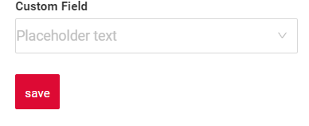

# Dictionary

`Dictionary` is a component that allows to select single value from dropdown.

!!! tip
    Use for dictionaries or slowly-growing entities, e.g. no more than 1000 values (all values are loaded in memory). Otherwise, use [inlinePickList](/widget/fields/field/inlinePickList/inlinePickList)

## Basics
### How does it look?

=== "List widget"
    
=== "Info widget"
    
=== "Form widget"
    


### How to add?
??? Example
    === "Enum"

        **Step1** Create Enum. Best practice: storing enum name in the Database and using a separate field for displayed UI values
            ```java
            public enum CustomFieldEnum {
                HIGH("High"),
                MIDDLE("Middle"),
                LOW("Low");
            
                @JsonValue
                private final String value;
            
                public static CustomFieldEnum getByValue(@NonNull String value) {
                    return Arrays.stream(CustomFieldEnum.values())
                            .filter(enm -> Objects.equals(enm.getValue(), value))
                            .findFirst()
                            .orElse(null);
                }
            }
            ```
        **Step2** Add  **Enum** field to corresponding **DataResponseDTO**.
    
        ```java
        public class MyExampleDTO extends DataResponseDTO {
        
            @SearchParameter(name = "customField", provider = EnumValueProvider.class)
            private CustomFieldEnum customField;
        
            public MyExampleDTO(MyEntity entity) {
                this.customField = entity.getCustomField();
            }
        }
        ```
    
        **Step3** Add  **Enum** field to corresponding **BaseEntity**.
    
        ```java
        public class MyEntity extends BaseEntity {
       
            @Enumerated(value = EnumType.STRING)
            @Column
            private CustomFieldEnum customField;
        }
        ```
        **Step4** Add **fields.setEnumValues** to corresponding **FieldMetaBuilder**.
    
        ```java
        public void buildRowDependentMeta(RowDependentFieldsMeta<MyExampleDTO> fields, InnerBcDescription bcDescription,
                                          Long id, Long parentId) {
            fields.setEnumValues(MyExampleDTO_.customField, CustomFieldEnum.values());
        }
        ```
    
        === "List widget"
            **Step5** Add to **_.widget.json_**.
            ```json
            {
              "name": "MyExampleList",
              "title": "List title",
              "type": "List",
              "bc": "myExampleBc",
              "fields": [
                {
                  "title": "Custom Field",
                  "key": "customField",
                  "type": "dictionary"
                }
              ]
            }
            ```
    
        === "Info widget"
            **Step5** Add to **_.widget.json_**.
    
            ```json
            {
              "name": "MyExampleInfo",
              "title": "Info title",
              "type": "Info",
              "bc": "myExampleBc",
              "fields": [
                {
                  "label": "Custom Field",
                  "key": "customField",
                  "type": "dictionary"
                }
              ],
              "options": {
                "layout": {
                  "rows": [
                    {
                      "cols": [
                        {
                          "fieldKey": "customField",
                          "span": 12
                        }
                      ]
                    }
                  ]
                }
              }
            }
            ```
    
        === "Form widget"
    
            **Step5** Add to **_.widget.json_**.
    
            ```json
            {
              "name": "MyExampleForm",
              "title": "Form title",
              "type": "Form",
              "bc": "myExampleBc",
              "fields": [
                {
                  "label": "Custom Field",
                  "key": "customField",
                  "type": "dictionary"
                }
              ],
              "options": {
                "layout": {
                  "rows": [
                    {
                      "cols": [
                        {
                          "fieldKey": "customField",
                          "span": 12
                        }
                      ]
                    }
                  ]
                }
              }
            }
            ```

## Placeholder
`Placeholder` allows you to provide a concise hint, guiding users on the expected value. This hint is displayed before any user input. It can be calculated based on business logic of application
### How does it look?
=== "List widget"
    
=== "Info widget"
    _not applicable_
=== "Form widget"
    
### How to add?
??? Example
    Add **fields.setPlaceholder** to corresponding **FieldMetaBuilder**.

    ```java

    public class MyExampleMeta extends FieldMetaBuilder<MyExampleDTO> {
    
      @Override
      public void buildRowDependentMeta(RowDependentFieldsMeta<MyExampleDTO> fields, InnerBcDescription bcDescription,
        Long id, Long parentId) {
        fields.setPlaceholder(MyExampleDTO_.customField, "Placeholder text"));
      }
    ```
    === "List widget"
        **Works for List.**
    === "Info widget"
        **_not applicable_**
    === "Form widget"
        **Works for Form.**


## Color
`Color` allows you to specify a field color. It can be calculated based on business logic of application

### How does it look?
=== "List widget"
    
=== "Info widget"
    
=== "Form widget"
    _not applicable_


### How to add?
??? Example
    === "Calculated color"
        
    
        **Step 1**   Add `custom field for color` to corresponding **DataResponseDTO**. The field can contain a HEX color or be null. 
    
        ```java
        public class MyExampleDTO extends DataResponseDTO {
            
            @SearchParameter(name = "customField", provider = EnumValueProvider.class)
            private CustomFieldEnum customField;
            private String customFieldColor;
        
            public MyExampleDTO(MyEntity entity) {
                this.customField = entity.getCustomField();
                this.customFieldColor = "#eda6a6";
            }
        ```
        === "List widget"   
            **Step 2** Add **"bgColorKey"** :  `custom field for color`  to .widget.json.
            ```json
            {
              "name": "MyExampleList",
              "title": "List title",
              "type": "List",
              "bc": "myExampleBc",
              "fields": [
                {
                  "title": "custom Field",
                  "key": "customField",
                  "type": "dictionary",
                  "bgColorKey": "customFieldColor"
                }
              ]
            }
            ```
        === "Info widget"
            **Step 2** Add **"bgColorKey"** :  `custom field for color`  to .widget.json.
            ```json
            {
              "name": "MyExampleInfo",
              "title": "Info title",
              "type": "Info",
              "bc": "myExampleBc",
              "fields": [
                {
                  "label": "custom Field",
                  "key": "customField",
                  "type": "dictionary",
                  "bgColorKey": "customFieldColor"
                }
              ],
              "options": {
                "layout": {
                  "rows": [
                    {
                      "cols": [
                        {
                          "fieldKey": "customField",
                          "span": 12
                        }
                      ]
                    }
                  ]
                }
              }
            }       
            ```
        === "Form widget"
            _not applicable_
    === "Constant color"
        === "List widget" 
            Add **"bgColor"** :  `HEX color`  to .widget.json.
            ```json
            {
              "name": "MyExampleList",
              "title": "List title",
              "type": "List",
              "bc": "myExampleBc",
              "fields": [
                {
                  "title": "custom Field",
                  "key": "customField",
                  "type": "dictionary",
                  "bgColor": "#eda6a6"
                }
              ]
            }
            ```

        === "Info widget"

            Add **"bgColor"** :  `HEX color`  to .widget.json.
            ```json
            {
              "name": "MyExampleInfo",
              "title": "Info title",
              "type": "Info",
              "bc": "myExampleBc",
              "fields": [
                {
                  "label": "custom Field",
                  "key": "customField",
                  "type": "dictionary",
                  "bgColor": "#eda6a6"
                }
              ],
              "options": {
                "layout": {
                  "rows": [
                    {
                      "cols": [
                        {
                          "fieldKey": "customField",
                          "span": 12
                        }
                      ]
                    }
                  ]
                }
              }
            }
            ```

        === "Form widget"
            _not applicable_

## Readonly/Editable
`Readonly/Editable` indicates whether the field can be edited or not. It can be calculated based on business logic of application

### How does it look?
=== "Editable"
    === "List widget"
        
    === "Info widget"
        _not applicable_
    === "Form widget"
        
=== "Readonly"
    === "List widget"
        
    === "Info widget"
        
    === "Form widget"
        


### How to add?
??? Example
    === "Editable" 
        **Step1** Add mapping DTO->entity to corresponding **VersionAwareResponseService**.
            ```java
            protected ActionResultDTO<MyExampleDTO> doUpdateEntity(MyEntity entity, MyExampleDTO data, BusinessComponent bc) {
                if (data.isFieldChanged(MyExampleDTO_.customField)) {
                    entity.setCustomField(data.getCustomField());
                }
            return new ActionResultDTO<>(entityToDto(bc, entity));
            ```

        **Step2** Add **fields.setEnabled** to corresponding **FieldMetaBuilder**.
    
        ```java
        public class MyExampleMeta extends FieldMetaBuilder<MyExampleDTO> {
        
            @Override
            public void buildRowDependentMeta(RowDependentFieldsMeta<MyExampleDTO> fields, InnerBcDescription bcDescription,
                                              Long id, Long parentId) {
              fields.setEnumValues(MyExampleDTO_.customField, CustomFieldEnum.values());
              fields.setEnabled(MyExampleDTO_.customField);
            }
        ```
        === "List widget"
            **Works for List.**
        === "Info widget"
            **_not applicable_**
        === "Form widget"
            **Works for Form.**
   
    === "Readonly"
    
        **Option 1** Enabled by default.
    
        ```java
        public class MyExampleMeta extends FieldMetaBuilder<MyExampleDTO> {
            public void buildRowDependentMeta(RowDependentFieldsMeta<MyExampleDTO> fields, InnerBcDescription bcDescription, Long id, Long parentId) {
            }
        }
        ```
    
        **Option 2** `Not recommended.` Property fields.setDisabled() overrides the enabled field if you use after property fields.setEnabled.
        === "List widget"
            **Works for List.**
        === "Info widget"
            **Works for Info.**
        === "Form widget"
            **Works for Form.**
## Filtration
`Filtering` allows you to search data based on criteria. Search uses `in` operator.
### How does it look?
=== "List widget"
    
=== "Info widget"
    _not applicable_
=== "Form widget"
    _not applicable_

### How to add?
??? Example
    === "List widget"
        **Step 1** Add **@SearchParameter** to corresponding **DataResponseDTO**. (Advanced customization [SearchParameter](/advancedCustomization_filtration))

        ```java
        public class MyExampleDTO extends DataResponseDTO {
        
            @SearchParameter(name = "customField", provider = EnumValueProvider.class)
            private CustomFieldEnum customField;

        
            public MyExampleDTO(MyEntity entity) {
                this.customField = entity.getCustomField();
            }
        }
        ```
        **Step 2**  Add **fields.enableFilter** to corresponding **FieldMetaBuilder**.

        ```java 
        public class MyExampleMeta extends FieldMetaBuilder<MyExampleDTO>  {
        
            public void buildIndependentMeta(FieldsMeta<MyExampleDTO> fields, InnerBcDescription bcDescription, Long parentId) {
                fields.enableFilter(MyExampleDTO_.customField);
            }
        
        }
        ```

    === "Info widget"
        _not applicable_
    === "Form widget"
        _not applicable_

## Drilldown
`DrillDown` allows you to navigate to another view by simply tapping on it. Target view and other drill-down parts can be calculated based on business logic of application

Also, it optionally allows you to filter data on target view before it will be opened `see more` [DrillDown](/features/element/drillDown/drillDown)


### How does it look?
=== "List widget"
    
=== "Info widget"
    
=== "Form widget"
    _not applicable_

### How to add?
??? Example

    **Option 1**

    `Step 1` Add [fields.setDrilldown](/features/element/drillDown/drillDown) to corresponding **FieldMetaBuilder**.
    ```java
    public class MyExampleMeta extends FieldMetaBuilder<MyExampleDTO> {
    
        @Override
        public void buildRowDependentMeta(RowDependentFieldsMeta<MyExampleDTO> fields, InnerBcDescription bcDescription,
                                          Long id, Long parentId) {
            fields.setDrilldown(
                    MyExampleDTO_.customField,
                    DrillDownType.INNER,
                    "/screen/myexample/view/myexampleinfo/" + PlatformMyExampleController.myExampleBc + "/" + id
            );
    ```
    === "List widget"
        `Step 2` Add **"drillDown": "true"**  to .widget.json.
        ```json
        {
          "name": "MyExampleList",
          "title": "List title",
          "type": "List",
          "bc": "myExampleBc",
          "fields": [
            {
              "title": "custom Field",
              "key": "customField",
              "type": "dictionary",
              "drillDown": "true"
            }
          ]
        }
        ```


        **Option 2**
           Add **"drillDownKey"** :  `custom field`  to .widget.json. See more [Drilldown](/advancedCustomization/element/drillDown/drillDown) 
 
    === "Info widget"

        `Step 2` Add **"drillDown": "true"**  to .widget.json.

        ```json
        {
          "name": "MyExampleInfo",
          "title": "Info title",
          "type": "Info",
          "bc": "myExampleBc",
          "fields": [
            {
              "label": "custom Field",
              "key": "customField",
              "type": "dictionary",
              "drillDown": "true"
            }
          ],
          "options": {
            "layout": {
              "rows": [
                {
                  "cols": [
                    {
                      "fieldKey": "customField",
                      "span": 12
                    }
                  ]
                }
              ]
            }
          }
        }
        ```
        **Option 2**
           Add **"drillDownKey"** :  `custom field`  to .widget.json. See more [Drilldown](/advancedCustomization/element/drillDown/drillDown) 
 
    === "Form widget"
        _not applicable_
[Advanced customization](/advancedCustomization/element/drillDown/drillDown)

## Validation
`Validation` allows you to check any business rules for user-entered value. There are two types of validation:

1) Exception: Displays a message to notify users about technical or business errors.

2) Confirm: Presents a dialog with an optional message, requiring user confirmation or cancellation before proceeding.

3) Field level validation: shows error next to all fields, that validation failed for

### How does it look?
=== "List widget"
    === "BusinessException"
        
    === "RuntimeException"
        
    === "Confirm"
        
    === "Field level validation"
        
=== "Info widget"
    _not applicable_
=== "Form widget"
    === "BusinessException"
        
    === "RuntimeException"
        
    === "Confirm"
        
    === "Field level validation"
        


### How to add?
??? Example
    === "BusinessException"
        `BusinessException` describes an error  within a business process.

        Add **BusinessException** to corresponding **VersionAwareResponseService**.

        ```java
        public class MyExampleService extends VersionAwareResponseService<MyExampleDTO, MyEntity> {
 
            @Override
            protected ActionResultDTO<MyExampleDTO> doUpdateEntity(MyEntity entity, MyExampleDTO data, BusinessComponent bc) {
                if (data.isFieldChanged(MyExampleDTO_.customField)) {
                    if (!CustomFieldEnum.HIGH.getValue().equals(data.getCustomField().getValue())) {
                        throw new BusinessException().addPopup("Custom message about error");
                    }
                    entity.setCustomField(data.getCustomField());
                }
                return new ActionResultDTO<>(entityToDto(bc, entity));
            }              
        ```
        === "List widget"
            **Works for List.**
        === "Info widget"
            **_not applicable_**
        === "Form widget"
            **Works for Form.**
    === "RuntimeException"

        `RuntimeException` describes technical error  within a business process.
        
        Add **RuntimeException** to corresponding **VersionAwareResponseService**.
        
        ```java
            @Override
            protected ActionResultDTO<MyExampleDTO> doUpdateEntity(MyEntity entity, MyExampleDTO data, BusinessComponent bc) {
                if (data.isFieldChanged(MyExampleDTO_.customField)) {
                   try {
                       //call custom function
                   }
                   catch(Exception e){
                        throw new RuntimeException("An unexpected error has occurred.");
                    }
                }
                return new ActionResultDTO<>(entityToDto(bc, entity));
            }
        ```    
        === "List widget"
            **Works for List.**
        === "Info widget"
            **_not applicable_**
        === "Form widget"
            **Works for Form.**
    === "Confirm"
        Add [PreAction.confirm](/advancedCustomization_validation) to corresponding **VersionAwareResponseService**.
        ```java
     
            public class MyExampleService extends VersionAwareResponseService<MyExampleDTO, MyEntity> {

                @Override
                public Actions<MyExampleDTO> getActions() {
                    return Actions.<MyExampleDTO>builder()
                    .newAction()
                    .action("save", "save")
                    .withPreAction(PreAction.confirm("You want to save the value 'customField'?"))
                    .add()
                    .build();
                }
            }
        ```
    === "Field level validation"
        === "Option 1"
            Add javax.validation to corresponding **DataResponseDTO**.

            Use if:

            Requires a simple fields check (javax validation)
            Add javax.validation to corresponding **DataResponseDTO**.
            ```java
         
                public class MyExampleDTO extends DataResponseDTO {
                    @NotNull(message = "Custom message about required field")
                    private CustomFieldEnum customField
                }
            ```
    
            === "List widget"
                **Works for List.**
            === "Info widget"
                **_not applicable_**
            === "Form widget"
                **Works for Form.**
        === "Option 2"
            Create сustom service for business logic check.

            Use if:

            Business logic check required for fields

            `Step 1`  Create сustom method for check.
            ```java
            private void validate(BusinessComponent bc, MyExampleDTO dto) {
                BusinessError.Entity entity = new BusinessError.Entity(bc);
                if(!CustomFieldEnum.HIGH.getValue().equals(dto.getCustomField().getValue())) {
                    entity.addField(MyExampleDTO_.customField.getName(), errorMessage("The field 'customField' can contain only 'High'"));
                }
                if (!CustomFieldEnum.HIGH.getValue().equals(dto.getCustomFieldAdditional().getValue()))  {
                    entity.addField(MyExampleDTO_.customFieldAdditional.getName(), errorMessage("The field 'customFieldAdditional' can contain only 'High'"));
                }
                if (entity.getFields().size() > 0) {
                    throw new BusinessException().setEntity(entity);
                }
            }
            ```
            `Step 2` Add new Action to corresponding **VersionAwareResponseService**.
            ```java
        
              public Actions<MyExampleDTO> getActions() {
                return Actions.<MyExampleDTO>builder()
                        .newAction()
                        .action("save", "save")
                        .add()
                        .action("check", "Check")
                        .invoker((bc, dto) -> {
                            validate(bc, dto);
                            return new ActionResultDTO<>();
                        })
                        .add()
                        .build();
            }
            ```
            === "List widget"
                Add custom action check to **_.widget.json_**.
                ```json
                {
                  "name": "MyExampleList",
                  "title": "List title",
                  "type": "List",
                  "bc": "myExampleBc",
                  "fields": [
                    {
                      "title": "Custom Field",
                      "key": "customField",
                      "type": "dictionary"
                    },
                    {
                      "title": "Custom Field Additional",
                      "key": "customFieldAdditional",
                      "type": "dictionary"
                    }
                  ],
                  "options": {
                    "actionGroups": {
                      "include": [
                        "check"
                      ]
                    }
                  }
                }
                ```               
            === "Info widget"
                 **_not applicable_**
            === "Form widget"
                ```json
                {
                  "name": "MyExampleForm",
                  "title": "Form title",
                  "type": "Form",
                  "bc": "myExampleBc",
                  "fields": [
                    {
                      "label": "Custom Field",
                      "key": "customField",
                      "type": "dictionary"
                    },
                    {
                      "label": "Custom Field Additional",
                      "key": "customFieldAdditional",
                      "type": "dictionary"
                    }
                  ],
                  "options": {
                    "actionGroups": {
                      "include": [
                        "check"
                      ]
                    },
                    "layout": {
                      "rows": [
                        {
                          "cols": [
                            {
                              "fieldKey": "customFieldAdditional",
                              "span": 12
                            }
                          ]
                        },
                        {
                          "cols": [
                            {
                              "fieldKey": "customField",
                              "span": 12
                            }
                          ]
                        }
                      ]
                    }
                  }
                }
                ```
## Sorting
`Sorting` allows you to sort data in ascending or descending order.
Sort by key value.

### How does it look?
=== "List widget"
    
=== "Info widget"
    _not applicable_
=== "Form widget"
    _not applicable_
### How to add?
??? Example
    === "List widget"
        Enabled by default.
    === "Info widget"
        _not applicable_
    === "Form widget"
        _not applicable_

## Required
`Required` allows you to denote, that this field must have a value provided.

### How does it look?
=== "List widget"
    
=== "Info widget"
    _not applicable_
=== "Form widget"
    
### How to add?
??? Example
    Add **fields.setRequired** to corresponding **FieldMetaBuilder**.

    ```java

    public class MyExampleMeta extends FieldMetaBuilder<MyExampleDTO> {
    
      @Override
      public void buildRowDependentMeta(RowDependentFieldsMeta<MyExampleDTO> fields, InnerBcDescription bcDescription,
        Long id, Long parentId) {
        fields.setEnumValues(MyExampleDTO_.customField, CustomFieldEnum.values());
        fields.setEnabled(MyExampleDTO_.customField);
        fields.setRequired(MyExampleDTO_.customField);
      }
    ```
    === "List widget"
        **Works for List.**
    === "Info widget"
        **_not applicable_**
    === "Form widget"
        **Works for Form.**
