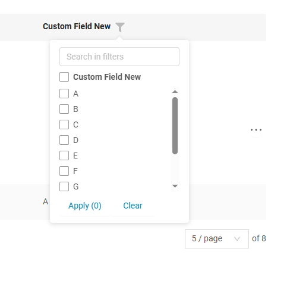

# Dictionary

`Dictionary` is a component that allows to select single value from dropdown.

!!! tips
    Use for dictionaries or slowly-growing entities, e.g. no more than 1000 values (all values are loaded in memory). Otherwise, use [inlinePickList](/widget/fields/field/inlinePickList/inlinePickList)

## Basics
[:material-play-circle: Live Sample]({{ external_links.code_samples }}/ui/#/screen/myexample70){:target="_blank"} ·
[:fontawesome-brands-github: GitHub]({{ external_links.github_ui }}/{{ external_links.github_branch }}/src/main/java/org/demo/documentation/fields/dictionary/basic){:target="_blank"}

Dictionary can configurable:

* Enum
* Dictionary (since [release 2.0.9](https://doc.cxbox.org/new/version209/"))
* `Not recommended.` LOV deprecated (since [release 2.0.9](https://doc.cxbox.org/new/version209/")) 

`Dictionary` enables adding, deleting, and modifying its values through the administrative interface, so it should remain independent of business logic.

If the dictionary is tied to business logic, it is recommended to use `Enum` to prevent modifications or deletions via the administration panel.

### How does it look?

=== "List widget"
    
=== "Info widget"
    
=== "Form widget"
    


### <a id="basics_how_to_add">How to add?</a>
??? Example
    === "Enum"
        === "With plugin(recommended)"
            **Step 1** Download plugin
                [download Intellij Plugin](https://plugins.jetbrains.com/plugin/195-tesler-helper)
        
            **Step 2** Add dictionary field to an existing form widget
                

        === "Example of writing code"
            Add field to **_.widget.json_**.

            - **Step1** Create Enum. Best practice: storing enum name in the Database and using a separate field for displayed UI values
                ```java
                --8<--
                {{ external_links.github_raw_doc }}/fields/dictionary/basic/enums/CustomFieldEnum.java
                --8<--
                ```
            - **Step2** Add  **Enum** field to corresponding **BaseEntity**.
        
            ```java
                --8<--
                {{ external_links.github_raw_doc }}/fields/dictionary/basic/MyEntity70.java
                --8<--
            ```
       
            - **Step3** Add  **Enum** field to corresponding **DataResponseDTO**.
        
            ```java
                --8<--
                {{ external_links.github_raw_doc }}/fields/dictionary/basic/MyExample70DTO.java
                --8<--
            ```
    
            - **Step4** Use **fields.setEnumValues** in the appropriate **FieldMetaBuilder** to ensure the frontend reseives the list of values in the **/row-meta**
                method under **"values"** tag.
                
                If the values list is dependent on a parent field, use fields.setEnumValues within the buildRowDependentMeta 
                method to dynamically set it based on the parent.

            ```java
            --8<--
            {{ external_links.github_raw_doc }}/fields/dictionary/basic/MyExample70Meta.java:buildIndependentMeta
            --8<--
            ```
    
            === "List widget"
                - **Step5** Add to **_.widget.json_**.
    
                ```json
                --8<--
                {{ external_links.github_raw_doc }}/fields/dictionary/basic/MyExample70List.widget.json
                --8<--
                ```
    
                [:material-play-circle: Live Sample]({{ external_links.code_samples }}/ui/#/screen/myexample70){:target="_blank"} ·
                [:fontawesome-brands-github: GitHub]({{ external_links.github_ui }}/{{ external_links.github_branch }}/src/main/java/org/demo/documentation/fields/dictionary/basic){:target="_blank"}
    
            === "Info widget"
                - **Step5** Add to **_.widget.json_**.
            
                ```json
                --8<--
                {{ external_links.github_raw_doc }}/fields/dictionary/basic/MyExample70Info.widget.json
                --8<--
                ```
    
                [:material-play-circle: Live Sample]({{ external_links.code_samples }}/ui/#/screen/myexample70){:target="_blank"} ·
                [:fontawesome-brands-github: GitHub]({{ external_links.github_ui }}/{{ external_links.github_branch }}/src/main/java/org/demo/documentation/fields/dictionary/basic){:target="_blank"}
        
            === "Form widget"
        
                - **Step5** Add to **_.widget.json_**.
            
                ```json
                --8<--
                {{ external_links.github_raw_doc }}/fields/dictionary/basic/MyExample70Form.widget.json
                --8<--
                ```  
    
                [:material-play-circle: Live Sample]({{ external_links.code_samples }}/ui/#/screen/myexample70){:target="_blank"} ·
                [:fontawesome-brands-github: GitHub]({{ external_links.github_ui }}/{{ external_links.github_branch }}/src/main/java/org/demo/documentation/fields/dictionary/basic){:target="_blank"}
    
    === "Dictionary" 
        (since [release 2.0.9](https://doc.cxbox.org/new/version209/"))

        **Step 1.**  Configurable dictionary. Add description and value dictionary to **DICTIONARY.csv**.

        ```csv
        TYPE;KEY;VALUE;DISPLAY_ORDER;DESCRIPTION;ACTIVE;ID
        REGIONS;MOSCOW;Moscow;;;;
        REGIONS;SAINT PETERBURG;St. Petersburg;;;;
        REGIONS;KOSTROMA;Kostroma;1;;;
        REGIONS;SYKTYVKAR;Syktyvkar;2;;;
        REGIONS;NewYork;New York;3;;;
        ```
 
        **Step 2.**  Create record = name type dictionary **implements Dictionary** (If a dictionary type includes underscores, 
                its name is transformed into CamelCase by removing the underscores and capitalizing the first letter of each word.)  
        
        ```java
        --8<--
        {{ external_links.github_raw_doc }}/fields/dictionary/dictionarydictionary/basic/Regions.java
        --8<--
        ```
        
        **Step 3.** Add field with new record to corresponding **BaseEntity**.
        
        ```java
        --8<--
        {{ external_links.github_raw_doc }}/fields/dictionary/dictionarydictionary/basic/MyEntity352.java
        --8<--
        ```
        
        **Step 4.** Add field with new record to corresponding **DataResponseDTO**.
        
        ```java
        --8<--
        {{ external_links.github_raw_doc }}/fields/dictionary/dictionarydictionary/basic/MyExample352DTO.java
         --8<--
        ```
            
        **Step 5.** Use **fields.setDictionaryValues** in the appropriate **FieldMetaBuilder** to ensure the frontend reseives the list of values in the **/row-meta**
                method under **"values"** tag.

        If the values list is dependent on a parent field, use fields.setEnumValues within the buildRowDependentMeta 
                method to dynamically set it based on the parent.

        ```java
        --8<--
        {{ external_links.github_raw_doc }}/fields/dictionary/dictionarydictionary/basic/MyExample352Meta.java:buildRowDependentMeta
        --8<--
        ```
            
        **Step 6.** Add **fields.setDictionaryFilterValues** to corresponding **FieldMetaBuilder**.
        
        The front-end requires us to display all directory data within the method /row-meta tag values. 
        If the values list is dependent on the parent, we should use the buildIndependentMeta method for this purpose.        

        ```java
        --8<--
        {{ external_links.github_raw_doc }}/fields/dictionary/dictionarydictionary/basic/MyExample352Meta.java:buildIndependentMeta
        --8<--
        ```
        === "List widget"
            **Step 7.** Add to **_.widget.json_**.
        
            ```json
            --8<--
            {{ external_links.github_raw_doc }}/fields/dictionary/dictionarydictionary/basic/MyExample352List.widget.json
            --8<--
            ```
        
            [:material-play-circle: Live Sample]({{ external_links.code_samples }}/ui/#/screen/myexample352){:target="_blank"} ·
            [:fontawesome-brands-github: GitHub]({{ external_links.github_ui }}/{{ external_links.github_branch }}/src/main/java/org/demo/documentation/fields/dictionary/dictionarydictionary/basic){:target="_blank"}
        
        === "Info widget"
            **Step 7.** Add to **_.widget.json_**.
        
            ```json
            --8<--
            {{ external_links.github_raw_doc }}/fields/dictionary/dictionarydictionary/basic/MyExample352Info.widget.json
            --8<--
            ```
        
            [:material-play-circle: Live Sample]({{ external_links.code_samples }}/ui/#/screen/myexample352){:target="_blank"} ·
            [:fontawesome-brands-github: GitHub]({{ external_links.github_ui }}/{{ external_links.github_branch }}/src/main/java/org/demo/documentation/fields/dictionary/dictionarydictionary/basic){:target="_blank"}
         
        === "Form widget"
        
            **Step 7.** Add to **_.widget.json_**.
        
            ```json
            --8<--
            {{ external_links.github_raw_doc }}/fields/dictionary/dictionarydictionary/basic/MyExample352Form.widget.json
            --8<--
            ```  
        
            [:material-play-circle: Live Sample]({{ external_links.code_samples }}/ui/#/screen/myexample352){:target="_blank"} ·
            [:fontawesome-brands-github: GitHub]({{ external_links.github_ui }}/{{ external_links.github_branch }}/src/main/java/org/demo/documentation/fields/dictionary/dictionarydictionary/basic){:target="_blank"}
        
        **Step 8.**  Add bean DictionaryProvider. Incorporate it into the application a single time.

        ```java
        import java.util.Collection;
        import lombok.NonNull;
        import org.cxbox.api.data.dictionary.DictionaryCache;
        import org.cxbox.api.data.dictionary.SimpleDictionary;
        import org.cxbox.dictionary.Dictionary;
        import org.cxbox.dictionary.DictionaryProvider;
        import org.springframework.context.annotation.Bean;
        import org.springframework.context.annotation.Configuration;
        
        @Configuration
        public class DictionaryConfig {
        
            @Bean
            public DictionaryProvider dictionaryProvider() {
                return new DictionaryProvider() {
        
                    @Override
                    public <T extends Dictionary> T lookupName(@NonNull Class<T> type, @NonNull DictionaryValue value) {
                        var dictTmp = Dictionary.of(type, "");
                        var lov = DictionaryCache.dictionary().lookupName(value.getValue(), dictTmp.getDictionaryType());
                        return Dictionary.of(type, lov.getKey());
                    }
        
                    @Override
                    public <T extends Dictionary> SimpleDictionary lookupValue(@NonNull T dictionary) {
                        return DictionaryCache.dictionary().get(dictionary.getDictionaryType(), dictionary.key());
                    }
        
                    @Override
                    public <T extends Dictionary> Collection<T> getAll(@NonNull Class<T> dictionaryType) {
                        return DictionaryCache.dictionary().getAll(Dictionary.of(dictionaryType, "").getDictionaryType())
                                .stream()
                                .map(e -> Dictionary.of(dictionaryType, e.getKey()))
                                .toList();
                    }
                };
            }
        
        }
        ```

    === "LOV deprecated recommended use Dictionary"

        - **Step 1. LOV** Create LOV

            +  **Step 1.1** Add type LOV to **CXBOX-DICTIONARY_TYPE.csv**.
 
                ```csv
                ID;TYPE;TYPE_DESC
                200;REGIONS;Regions
                ```
            +  **Step 1.2** Add description and value LOV to **CXBOX-DICTIONARY_ITEM.csv**.

                ```csv
                "300";200;"REGIONS";"MOSCOW";"Moscow";true;0;null
                "301";200;"REGIONS";"SAINT PETERBURG";"St. Petersburg";true;1;null
                "302";200;"REGIONS";"KOSTROMA";"Kostroma";true;2;null
                "303";200;"REGIONS";"SYKTYVKAR";"Syktyvkar";true;3;null
                ```
            +  **Step 1.3** Add corresponding launguage to database change management **DICTIONARY_ITEM_TR**.
            
                  ```xml
                  <changeSet id="ADD LANGUAGE DICTIONARY_ITEM_TR" author="initial">
                    <sql>
                      insert into DICTIONARY_ITEM_TR (ID, LANGUAGE, VALUE)
                      select ID, 'en' as LANGUAGE, VALUE as VALUE
                      from DICTIONARY_ITEM;
                    </sql>
                    <sql>
                      insert into DICTIONARY_ITEM_TR (ID, LANGUAGE, VALUE)
                      select ID, 'ru' as LANGUAGE, VALUE as VALUE
                      from DICTIONARY_ITEM;
                    </sql>
                  </changeSet>
                  ```
            +  **Step 1.4** Add in project AdministeredDictionary
    
                ```java
                --8<--
                {{ external_links.github_raw_doc }}/fields/dictionary/dictionarydictionary/old/AdministeredDictionary.java
                --8<--
                ```
            +  **Step 1.5**  Add in project AdministeredDictionaryType
    
                ```java
                @Getter
                @RequiredArgsConstructor
                public enum AdministeredDictionaryType implements Serializable, IDictionaryType {
                
                    @Override
                    public LOV lookupName(String val) {
                        return dictionary().lookupName(val, this);
                    }
                
                    @Override
                    public String lookupValue(LOV lov) {
                        return dictionary().lookupValue(lov, this);
                    }
                
                    @Override
                    public String getName() {
                        return name();
                    }
                
                    public boolean containsKey(String key) {
                        return dictionary().containsKey(key, this);
                    }
                
                }
                ```
            + **Step 1.6**  Add  **LOV** (REGIONS) in AdministeredDictionaryType
                ```java
                @Getter
                @RequiredArgsConstructor
                public enum AdministeredDictionaryType implements Serializable, IDictionaryType {
                
                    REGIONS;
    
                    @Override
                    public LOV lookupName(String val) {
                        return dictionary().lookupName(val, this);
                    }
                
                    @Override
                    public String lookupValue(LOV lov) {
                        return dictionary().lookupValue(lov, this);
                    }
                
                    @Override
                    public String getName() {
                        return name();
                    }
                
                    public boolean containsKey(String key) {
                        return dictionary().containsKey(key, this);
                    }
                
                }
                ```

        - **Step2**  Add  **LOV** field to corresponding **BaseEntity**. 
    
        ```java
        --8<--
        {{ external_links.github_raw_doc }}/fields/dictionary/dictionarydictionary/old/basic/MyEntity350.java
        --8<--
        ```
    
        - **Step3**Add  **String** field to corresponding **DataResponseDTO**.
    
        ```java
        --8<--
        {{ external_links.github_raw_doc }}/fields/dictionary/dictionarydictionary/old/basic/MyExample350DTO.java
        --8<--
        ```

        - **Step4** Add **fields.setDictionaryTypeWithAllValues** to corresponding **FieldMetaBuilder**.

        The front-end requires us to display all directory data within the method /row-meta tag values. 
        If the values list is dependent on the parent, we should use the buildRowDependentMeta method for this purpose.

        ```java
        --8<--
        {{ external_links.github_raw_doc }}/fields/dictionary/dictionarydictionary/old/basic/MyExample350Meta.java:buildRowDependentMeta
        --8<--
        ```
    
        === "List widget"
            - **Step5** Add to **_.widget.json_**.

            ```json
                --8<--
                {{ external_links.github_raw_doc }}/fields/dictionary/dictionarydictionary/old/basic/MyExample350Info.widget.json
                --8<--
            ```

            [:material-play-circle: Live Sample]({{ external_links.code_samples }}/ui/#/screen/myexample350){:target="_blank"} ·
            [:fontawesome-brands-github: GitHub]({{ external_links.github_ui }}/{{ external_links.github_branch }}/src/main/java/org/demo/documentation/fields/dictionary/dictionarydictionary/old/basic){:target="_blank"}
     
        === "Info widget"
            - **Step5** Add to **_.widget.json_**.
        
            ```json
            --8<--
            {{ external_links.github_raw_doc }}/fields/dictionary/dictionarydictionary/basic/MyExample350Info.widget.json
            --8<--
            ```

            [:material-play-circle: Live Sample]({{ external_links.code_samples }}/ui/#/screen/myexample350){:target="_blank"} ·
            [:fontawesome-brands-github: GitHub]({{ external_links.github_ui }}/{{ external_links.github_branch }}/src/main/java/org/demo/documentation/fields/dictionary/dictionarydictionary/old/basic){:target="_blank"}
         
        === "Form widget"
    
            - **Step5** Add to **_.widget.json_**.
        
            ```json
            --8<--
            {{ external_links.github_raw_doc }}/fields/dictionary/dictionarydictionary/basic/MyExample350Form.widget.json
            --8<--
            ```  

            [:material-play-circle: Live Sample]({{ external_links.code_samples }}/ui/#/screen/myexample350){:target="_blank"} ·
            [:fontawesome-brands-github: GitHub]({{ external_links.github_ui }}/{{ external_links.github_branch }}/src/main/java/org/demo/documentation/fields/dictionary/dictionarydictionary/old/basic){:target="_blank"}


## Placeholder
[:material-play-circle: Live Sample]({{ external_links.code_samples }}/ui/#/screen/myexample88){:target="_blank"} ·
[:fontawesome-brands-github: GitHub]({{ external_links.github_ui }}/{{ external_links.github_branch }}/src/main/java/org/demo/documentation/fields/dictionary/placeholder){:target="_blank"}

`Placeholder` allows you to provide a concise hint, guiding users on the expected value. This hint is displayed before any user input. It can be calculated based on business logic of application
### How does it look?
=== "List widget"
    
=== "Info widget"
    _not applicable_
=== "Form widget"
    
### How to add?
??? Example
    Add **fields.setPlaceholder** to corresponding **FieldMetaBuilder**.

    ```java
    --8<--
    {{ external_links.github_raw_doc }}/fields/dictionary/placeholder/MyExample88Meta.java:buildRowDependentMeta
    --8<--
    ```  
    === "List widget"
        **Works for List.**

        [:material-play-circle: Live Sample]({{ external_links.code_samples }}/ui/#/screen/myexample88){:target="_blank"} ·
        [:fontawesome-brands-github: GitHub]({{ external_links.github_ui }}/{{ external_links.github_branch }}/src/main/java/org/demo/documentation/fields/dictionary/placeholder){:target="_blank"}
    === "Info widget"
        **_not applicable_**
    === "Form widget"
        **Works for Form.**

        [:material-play-circle: Live Sample]({{ external_links.code_samples }}/ui/#/screen/myexample88){:target="_blank"} ·
        [:fontawesome-brands-github: GitHub]({{ external_links.github_ui }}/{{ external_links.github_branch }}/src/main/java/org/demo/documentation/fields/dictionary/placeholder){:target="_blank"}

## Color
`Color` allows you to specify a field color. It can be calculated based on business logic of application

**Calculated color**

[:material-play-circle: Live Sample]({{ external_links.code_samples }}/ui/#/screen/myexample71){:target="_blank"} ·
[:fontawesome-brands-github: GitHub]({{ external_links.github_ui }}/{{ external_links.github_branch }}/src/main/java/org/demo/documentation/fields/dictionary/color){:target="_blank"}

**Constant color**

[:material-play-circle: Live Sample]({{ external_links.code_samples }}/ui/#/screen/myexample84){:target="_blank"} ·
[:fontawesome-brands-github: GitHub]({{ external_links.github_ui }}/{{ external_links.github_branch }}/src/main/java/org/demo/documentation/fields/dictionary/colorconst){:target="_blank"}

### How does it look?
=== "List widget"
    
=== "Info widget"
    
=== "Form widget"
    _not applicable_


### How to add?
??? Example
    === "Calculated color"
   
        **Step 1**   Add `custom field for color` to corresponding **DataResponseDTO**. The field can contain a HEX color or be null. 
        ```java
        --8<--
        {{ external_links.github_raw_doc }}/fields/dictionary/color/MyExample71DTO.java
        --8<--
        ```    
 
        === "List widget"   
            **Step 2** Add **"bgColorKey"** :  `custom field for color`  to .widget.json.
            ```json
            --8<--
            {{ external_links.github_raw_doc }}/fields/dictionary/color/MyExample71List.widget.json
            --8<--
            ```

            [:material-play-circle: Live Sample]({{ external_links.code_samples }}/ui/#/screen/myexample71){:target="_blank"} ·
            [:fontawesome-brands-github: GitHub]({{ external_links.github_ui }}/{{ external_links.github_branch }}/src/main/java/org/demo/documentation/fields/dictionary/color){:target="_blank"}

        === "Info widget"
            **Step 2** Add **"bgColorKey"** :  `custom field for color`  to .widget.json.
            ```json
            --8<--
            {{ external_links.github_raw_doc }}/fields/dictionary/color/MyExample71Info.widget.json
            --8<--
            ```

            [:material-play-circle: Live Sample]({{ external_links.code_samples }}/ui/#/screen/myexample71){:target="_blank"} ·
            [:fontawesome-brands-github: GitHub]({{ external_links.github_ui }}/{{ external_links.github_branch }}/src/main/java/org/demo/documentation/fields/dictionary/color){:target="_blank"}

        === "Form widget"
            _not applicable_
    === "Constant color"
        === "List widget" 
            Add **"bgColor"** :  `HEX color`  to .widget.json.
            ```json
            --8<--
            {{ external_links.github_raw_doc }}/fields/dictionary/colorconst/MyExample84List.widget.json
            --8<--
            ```

            [:material-play-circle: Live Sample]({{ external_links.code_samples }}/ui/#/screen/myexample84){:target="_blank"} ·
            [:fontawesome-brands-github: GitHub]({{ external_links.github_ui }}/{{ external_links.github_branch }}/src/main/java/org/demo/documentation/fields/dictionary/colorconst){:target="_blank"}

        === "Info widget"

            Add **"bgColor"** :  `HEX color`  to .widget.json.
            ```json
            --8<--
            {{ external_links.github_raw_doc }}/fields/dictionary/colorconst/MyExample84Info.widget.json
            --8<--
            ```

            [:material-play-circle: Live Sample]({{ external_links.code_samples }}/ui/#/screen/myexample84){:target="_blank"} ·
            [:fontawesome-brands-github: GitHub]({{ external_links.github_ui }}/{{ external_links.github_branch }}/src/main/java/org/demo/documentation/fields/dictionary/colorconst){:target="_blank"}

        === "Form widget"
            _not applicable_

## Readonly/Editable
`Readonly/Editable` indicates whether the field can be edited or not. It can be calculated based on business logic of application

`Editable`
[:material-play-circle: Live Sample]({{ external_links.code_samples }}/ui/#/screen/myexample70){:target="_blank"} ·
[:fontawesome-brands-github: GitHub]({{ external_links.github_ui }}/{{ external_links.github_branch }}/src/main/java/org/demo/documentation/fields/dictionary/basic){:target="_blank"}

`Readonly`
[:material-play-circle: Live Sample]({{ external_links.code_samples }}/ui/#/screen/myexample85){:target="_blank"} ·
[:fontawesome-brands-github: GitHub]({{ external_links.github_ui }}/{{ external_links.github_branch }}/src/main/java/org/demo/documentation/fields/dictionary/ro){:target="_blank"}


### How does it look?
=== "Editable"
    === "List widget"
        
    === "Info widget"
        _not applicable_
    === "Form widget"
        
=== "Readonly"
    === "List widget"
        
    === "Info widget"
        
    === "Form widget"
        


### How to add?
??? Example
    === "Editable"
        **Step1** Add mapping DTO->entity to corresponding **VersionAwareResponseService**.
        ```java
        --8<--
        {{ external_links.github_raw_doc }}/fields/dictionary/basic/MyExample70Service.java:doUpdateEntity
        --8<--
        ```

        **Step2** Add **fields.setEnabled** to corresponding **FieldMetaBuilder**.
        ```java
        --8<--
        {{ external_links.github_raw_doc }}/fields/dictionary/basic/MyExample70Meta.java:buildRowDependentMeta
        --8<--
        ```
        === "List widget"
            **Works for List.**

            [:material-play-circle: Live Sample]({{ external_links.code_samples }}/ui/#/screen/myexample70){:target="_blank"} ·
            [:fontawesome-brands-github: GitHub]({{ external_links.github_ui }}/{{ external_links.github_branch }}/src/main/java/org/demo/documentation/fields/dictionary/basic){:target="_blank"}
        === "Info widget"
            **_not applicable_**
        === "Form widget"
            **Works for Form.**

            [:material-play-circle: Live Sample]({{ external_links.code_samples }}/ui/#/screen/myexample70){:target="_blank"} ·
            [:fontawesome-brands-github: GitHub]({{ external_links.github_ui }}/{{ external_links.github_branch }}/src/main/java/org/demo/documentation/fields/dictionary/basic){:target="_blank"}

   
    === "Readonly"
    
        **Option 1** Enabled by default.
    
        ```java
        --8<--
        {{ external_links.github_raw_doc }}/fields/dictionary/ro/MyExample85Meta.java:buildRowDependentMeta
        --8<--
        ```
    
        **Option 2** `Not recommended.` Property fields.setDisabled() overrides the enabled field if you use after property fields.setEnabled.
        === "List widget"
            **Works for List.**

            [:material-play-circle: Live Sample]({{ external_links.code_samples }}/ui/#/screen/myexample85){:target="_blank"} ·
            [:fontawesome-brands-github: GitHub]({{ external_links.github_ui }}/{{ external_links.github_branch }}/src/main/java/org/demo/documentation/fields/dictionary/ro){:target="_blank"}

        === "Info widget"
            **Works for Info.**

            [:material-play-circle: Live Sample]({{ external_links.code_samples }}/ui/#/screen/myexample85){:target="_blank"} ·
            [:fontawesome-brands-github: GitHub]({{ external_links.github_ui }}/{{ external_links.github_branch }}/src/main/java/org/demo/documentation/fields/dictionary/ro){:target="_blank"}

        === "Form widget"
            **Works for Form.**

            [:material-play-circle: Live Sample]({{ external_links.code_samples }}/ui/#/screen/myexample85){:target="_blank"} ·
            [:fontawesome-brands-github: GitHub]({{ external_links.github_ui }}/{{ external_links.github_branch }}/src/main/java/org/demo/documentation/fields/dictionary/ro){:target="_blank"}

##  Filtering
**Enum**
[:material-play-circle: Live Sample]({{ external_links.code_samples }}/ui/#/screen/myexample87){:target="_blank"} ·
[:fontawesome-brands-github: GitHub]({{ external_links.github_ui }}/{{ external_links.github_branch }}/src/main/java/org/demo/documentation/fields/dictionary/filtration){:target="_blank"}

**Dictionary**
[:material-play-circle: Live Sample]({{ external_links.code_samples }}/ui/#/screen/myexample358){:target="_blank"} ·
[:fontawesome-brands-github: GitHub]({{ external_links.github_ui }}/{{ external_links.github_branch }}/src/main/java/org/demo/documentation/fields/dictionary/dictionarydictionary/filtration){:target="_blank"}


`Filtering` allows you to search data based on criteria. Search uses `in` operator.

The filter component displays a text search field and scrollbar based on the number of available filter values.
(since [release 2.0.13](https://doc.cxbox.org/new/version2013/"))

- The search input and scrollbar appear only when the number of filterable values exceeds  
  7 items (Default count items - configurable via frontend constant).

- The Apply button shows a counter of selected items (e.g., `Apply (5)`).
- If the selection count exceeds  7 items, it displays `Apply (N+)` (e.g., `Apply (9+)`).
 

### How does it look?
=== "List widget"
    === "< Default count items"    
        
    === "> Default count items"
        
=== "Info widget"
    _not applicable_
=== "Form widget"
    _not applicable_

### <a id="filtering_how_to_add">How to add?</a>
??? Example
    === "Enum"
        === "List widget"
            **Step 1** Add **@SearchParameter** to corresponding **DataResponseDTO**. (Advanced customization [SearchParameter](/advancedCustomization/element/searchparameter/searchparameter))
            ```java
            --8<--
            {{ external_links.github_raw_doc }}/fields/dictionary/filtration/MyExample87DTO.java
            --8<--
            ```
    
            **Step 2**  Add **fields.enableFilter** to corresponding **FieldMetaBuilder**.
    
            Add **fields.setEnumFilterValues** to corresponding **FieldMetaBuilder**.
    
            The front-end requires us to display all directory data within the method */row-meta* tag **`filterValues`**. 
    
            ```java
            --8<--
            {{ external_links.github_raw_doc }}/fields/dictionary/filtration/MyExample87Meta.java:buildIndependentMeta
            --8<--
            ```
    
            [:material-play-circle: Live Sample]({{ external_links.code_samples }}/ui/#/screen/myexample87){:target="_blank"} ·
            [:fontawesome-brands-github: GitHub]({{ external_links.github_ui }}/{{ external_links.github_branch }}/src/main/java/org/demo/documentation/fields/dictionary/filtration){:target="_blank"}
    
        === "Info widget"
            _not applicable_
        === "Form widget"
            _not applicable_

    === "Dictionary"
        === "List widget"
            **Step 1** Add **@SearchParameter** to corresponding **DataResponseDTO**. (Advanced customization [SearchParameter](/advancedCustomization/element/searchparameter/searchparameter))
            ```java
            --8<--
            {{ external_links.github_raw_doc }}/fields/dictionary/dictionarydictionary/filtration/MyExample358DTO.java
            --8<--
            ```
    
            **Step 2**  Add **fields.enableFilter** to corresponding **FieldMetaBuilder**.
    
            Add **fields.setDictionaryFilterValues** to corresponding **FieldMetaBuilder**.
    
            The front-end requires us to display all directory data within the method */row-meta* tag **`filterValues`**. 
    
            ```java
            --8<--
            {{ external_links.github_raw_doc }}/fields/dictionary/dictionarydictionary/filtration/MyExample358Meta.java:buildIndependentMeta
            --8<--
            ```
   
            [:material-play-circle: Live Sample]({{ external_links.code_samples }}/ui/#/screen/myexample358){:target="_blank"} ·
            [:fontawesome-brands-github: GitHub]({{ external_links.github_ui }}/{{ external_links.github_branch }}/src/main/java/org/demo/documentation/fields/dictionary/dictionarydictionary/filtration){:target="_blank"}
    
        === "Info widget"
            _not applicable_
        === "Form widget"
            _not applicable_

    **Configuration Default count items**

    - Location: `\ui\src\constants\filter.ts`
    - Variables:

        - `checkboxFilterMaxVisibleItems` – Controls when scroll/search appear.
        - `checkboxFilterCounterLimit` – Sets the maximum number before switching to `+` notation.

## Drilldown
[:material-play-circle: Live Sample]({{ external_links.code_samples }}/ui/#/screen/myexample86){:target="_blank"} ·
[:fontawesome-brands-github: GitHub]({{ external_links.github_ui }}/{{ external_links.github_branch }}/src/main/java/org/demo/documentation/fields/dictionary/drilldown){:target="_blank"}

`DrillDown` allows you to navigate to another view by simply tapping on it. Target view and other drill-down parts can be calculated based on business logic of application

Also, it optionally allows you to filter data on target view before it will be opened `see more` [DrillDown](/features/element/drilldown/drilldown)


### How does it look?
=== "List widget"
    
=== "Info widget"
    
=== "Form widget"
    _not applicable_

### How to add?
??? Example

    **Option 1**

    `Step 1` Add [fields.setDrilldown](/features/element/drilldown/drilldown) to corresponding **FieldMetaBuilder**.
    ```java
    --8<--
    {{ external_links.github_raw_doc }}/fields/dictionary/drilldown/MyExample86Meta.java:buildRowDependentMeta
    --8<--
    ```
    === "List widget"
        `Step 2` Add **"drillDown": "true"**  to .widget.json.
        ```json
        --8<--
        {{ external_links.github_raw_doc }}/fields/dictionary/drilldown/MyExample86List.widget.json
        --8<--
        ```
    
        **Option 2**
           Add **"drillDownKey"** :  `custom field`  to .widget.json. See more [Drilldown](/advancedCustomization/element/drilldown/drilldown) 

        [:material-play-circle: Live Sample]({{ external_links.code_samples }}/ui/#/screen/myexample86){:target="_blank"} ·
        [:fontawesome-brands-github: GitHub]({{ external_links.github_ui }}/{{ external_links.github_branch }}/src/main/java/org/demo/documentation/fields/dictionary/drilldown){:target="_blank"}

    === "Info widget"

        `Step 2` Add **"drillDown": "true"**  to .widget.json.
        ```json
        --8<--
        {{ external_links.github_raw_doc }}/fields/dictionary/drilldown/MyExample86Info.widget.json
        --8<--
        ```
        **Option 2**
           Add **"drillDownKey"** :  `custom field`  to .widget.json. See more [Drilldown](/advancedCustomization/element/drilldown/drilldown) 

        [:material-play-circle: Live Sample]({{ external_links.code_samples }}/ui/#/screen/myexample86){:target="_blank"} ·
        [:fontawesome-brands-github: GitHub]({{ external_links.github_ui }}/{{ external_links.github_branch }}/src/main/java/org/demo/documentation/fields/dictionary/drilldown){:target="_blank"}

    === "Form widget"
        _not applicable_
[Advanced customization](/advancedCustomization/element/drilldown/drilldown)

## Validation
`Validation` allows you to check any business rules for user-entered value. There are types of validation:

1) Exception:Displays a message to notify users about technical or business errors.

   `Business Exception`:
   [:material-play-circle: Live Sample]({{ external_links.code_samples }}/ui/#/screen/myexample91){:target="_blank"} ·
   [:fontawesome-brands-github: GitHub]({{ external_links.github_ui }}/{{ external_links.github_branch }}/src/main/java/org/demo/documentation/fields/dictionary/validationbusinessex){:target="_blank"}

   `Runtime Exception`:
   [:material-play-circle: Live Sample]({{ external_links.code_samples }}/ui/#/screen/myexample93){:target="_blank"} ·
   [:fontawesome-brands-github: GitHub]({{ external_links.github_ui }}/{{ external_links.github_branch }}/src/main/java/org/demo/documentation/fields/dictionary/validationruntimeex){:target="_blank"}
   
2) Confirm: Presents a dialog with an optional message, requiring user confirmation or cancellation before proceeding.

   [:material-play-circle: Live Sample]({{ external_links.code_samples }}/ui/#/screen/myexample92){:target="_blank"} ·
   [:fontawesome-brands-github: GitHub]({{ external_links.github_ui }}/{{ external_links.github_branch }}/src/main/java/org/demo/documentation/fields/dictionary/validationconfirm){:target="_blank"}

3) Field level validation: shows error next to all fields, that validation failed for

   `Option 1`:
   [:material-play-circle: Live Sample]({{ external_links.code_samples }}/ui/#/screen/myexample293){:target="_blank"} ·
   [:fontawesome-brands-github: GitHub]({{ external_links.github_ui }}/{{ external_links.github_branch }}/src/main/java/org/demo/documentation/fields/dictionary/validationannotation){:target="_blank"}

   `Option 2`:
   [:material-play-circle: Live Sample]({{ external_links.code_samples }}/ui/#/screen/myexample323){:target="_blank"} ·
   [:fontawesome-brands-github: GitHub]({{ external_links.github_ui }}/{{ external_links.github_branch }}/src/main/java/org/demo/documentation/fields/dictionary/validationdynamic){:target="_blank"}


### How does it look?
=== "List widget"
    === "BusinessException"
        
    === "RuntimeException"
        
    === "Confirm"
        
    === "Field level validation"
        
=== "Info widget"
    _not applicable_
=== "Form widget"
    === "BusinessException"
        
    === "RuntimeException"
        
    === "Confirm"
        
    === "Field level validation"
        


### How to add?
??? Example
    === "BusinessException"
        `BusinessException` describes an error  within a business process.
        
        Add **BusinessException** to corresponding **VersionAwareResponseService**.
        ```java
        --8<--
        {{ external_links.github_raw_doc }}/fields/dictionary/validationbusinessex/MyExample91Service.java:doUpdateEntity
        --8<--
        ```

        === "List widget"
            **Works for List.**

            [:material-play-circle: Live Sample]({{ external_links.code_samples }}/ui/#/screen/myexample91){:target="_blank"} ·
            [:fontawesome-brands-github: GitHub]({{ external_links.github_ui }}/{{ external_links.github_branch }}/src/main/java/org/demo/documentation/fields/dictionary/validationbusinessex){:target="_blank"}

        === "Info widget"
            **_not applicable_**
        === "Form widget"
            **Works for Form.**

            [:material-play-circle: Live Sample]({{ external_links.code_samples }}/ui/#/screen/myexample91){:target="_blank"} ·
            [:fontawesome-brands-github: GitHub]({{ external_links.github_ui }}/{{ external_links.github_branch }}/src/main/java/org/demo/documentation/fields/dictionary/validationbusinessex){:target="_blank"}

    === "RuntimeException"

        `RuntimeException` describes technical error  within a business process.
        
        Add **RuntimeException** to corresponding **VersionAwareResponseService**.
        ```java
        --8<--
        {{ external_links.github_raw_doc }}/fields/dictionary/validationruntimeex/MyExample93Service.java:doUpdateEntity
        --8<--
        ```       
     
        === "List widget"
            **Works for List.**

            [:material-play-circle: Live Sample]({{ external_links.code_samples }}/ui/#/screen/myexample93){:target="_blank"} ·
            [:fontawesome-brands-github: GitHub]({{ external_links.github_ui }}/{{ external_links.github_branch }}/src/main/java/org/demo/documentation/fields/dictionary/validationruntimeex){:target="_blank"}
        === "Info widget"
            **_not applicable_**
        === "Form widget"
            **Works for Form.**

            [:material-play-circle: Live Sample]({{ external_links.code_samples }}/ui/#/screen/myexample93){:target="_blank"} ·
            [:fontawesome-brands-github: GitHub]({{ external_links.github_ui }}/{{ external_links.github_branch }}/src/main/java/org/demo/documentation/fields/dictionary/validationruntimeex){:target="_blank"}
    === "Confirm"
        Add [PreAction.confirm](/advancedCustomization_validation) to corresponding **VersionAwareResponseService**.
        ```java
        --8<--
        {{ external_links.github_raw_doc }}/fields/dictionary/validationconfirm/MyExample92Service.java:getActions
        --8<--
        ```
        === "List widget"
            **Works for List.**

            [:material-play-circle: Live Sample]({{ external_links.code_samples }}/ui/#/screen/myexample92){:target="_blank"} ·
            [:fontawesome-brands-github: GitHub]({{ external_links.github_ui }}/{{ external_links.github_branch }}/src/main/java/org/demo/documentation/fields/dictionary/validationconfirm){:target="_blank"}
        === "Info widget"
            **_not applicable_**
        === "Form widget"
            **Works for Form.**

            [:material-play-circle: Live Sample]({{ external_links.code_samples }}/ui/#/screen/myexample92){:target="_blank"} ·
            [:fontawesome-brands-github: GitHub]({{ external_links.github_ui }}/{{ external_links.github_branch }}/src/main/java/org/demo/documentation/fields/dictionary/validationconfirm){:target="_blank"}

    === "Field level validation"
        === "Option 1"
            Add javax.validation to corresponding **DataResponseDTO**.

            Use if:

            Requires a simple fields check (javax validation)
            Add javax.validation to corresponding **DataResponseDTO**.
            ```java
            --8<--
            {{ external_links.github_raw_doc }}/fields/dictionary/validationannotation/MyExample293DTO.java
            --8<--
            ```
    
            === "List widget"
                **Works for List.**

                [:material-play-circle: Live Sample]({{ external_links.code_samples }}/ui/#/screen/myexample293){:target="_blank"} ·
                [:fontawesome-brands-github: GitHub]({{ external_links.github_ui }}/{{ external_links.github_branch }}/src/main/java/org/demo/documentation/fields/dictionary/validationannotation){:target="_blank"}
            === "Info widget"
                **_not applicable_**
            === "Form widget"
                **Works for Form.**

                [:material-play-circle: Live Sample]({{ external_links.code_samples }}/ui/#/screen/myexample293){:target="_blank"} ·
                [:fontawesome-brands-github: GitHub]({{ external_links.github_ui }}/{{ external_links.github_branch }}/src/main/java/org/demo/documentation/fields/dictionary/validationannotation){:target="_blank"}

        === "Option 2"
            Create сustom service for business logic check.
            
            Use if:
            
            Business logic check required for fields
            
            `Step 1`  Create сustom method for check.
            ```java
            --8<--
            {{ external_links.github_raw_doc }}/fields/dictionary/validationdynamic/MyExample323Service.java:validateFields
            --8<--
            ```
            
            `Step 2` Add сustom method for check to corresponding **VersionAwareResponseService**.
            ```java
            --8<--
            {{ external_links.github_raw_doc }}/fields/dictionary/validationdynamic/MyExample323Service.java:doUpdateEntity
            --8<--
            ```

            [:material-play-circle: Live Sample]({{ external_links.code_samples }}/ui/#/screen/myexample323){:target="_blank"} ·
            [:fontawesome-brands-github: GitHub]({{ external_links.github_ui }}/{{ external_links.github_branch }}/src/main/java/org/demo/documentation/fields/dictionary/validationdynamic){:target="_blank"}

## Sorting
`Enum`
[:material-play-circle: Live Sample]({{ external_links.code_samples }}/ui/#/screen/myexample90){:target="_blank"} ·
[:fontawesome-brands-github: GitHub]({{ external_links.github_ui }}/{{ external_links.github_branch }}/src/main/java/org/demo/documentation/fields/dictionary/sorting){:target="_blank"}

`Dictionary`
[:material-play-circle: Live Sample]({{ external_links.code_samples }}/ui/#/screen/myexample106){:target="_blank"} ·
[:fontawesome-brands-github: GitHub]({{ external_links.github_ui }}/{{ external_links.github_branch }}/src/main/java/org/demo/documentation/fields/dictionary/dictionarydictionary/sorting){:target="_blank"}

`Sorting` allows you to sort data in ascending or descending order.

**Sorting data**:
The sorting of values is based on those stored in the database rather than those displayed in the interface.

!!! info
    Sorting won't function until the page is refreshed after adding or updating records.

**Sorting Drop-down list or  List values for filter**: 
Can also arrange the values in the drop-down list or list values for filter in the desired order.
`Enum` possible to  arrange list values for filter different from sorting for drop-down values.

### How does it look?
=== "Sorting data"
    === "List widget"
        
    === "Info widget"
        _not applicable_
    === "Form widget"
        _not applicable_

=== "List values for filter"
    === "List widget"
        
    === "Info widget"
        _not applicable_
    === "Form widget"
        _not applicable_
=== "Drop-down list"
    === "List widget"
        
    === "Info widget"
        _not applicable_
    === "Form widget"
        

### How to add?
??? Example
    === "List widget"
        === "Enum"
            === "Sorting data"
                see more [Sorting](/widget/type/property/sorting/sorting)

                The sorting of values is based on those stored in the database rather than those displayed in the interface, using lexicographic sorting.

                **Step 1**  Add **fields.enableSort** to corresponding **FieldMetaBuilder**.
                ```java
                --8<--
                {{ external_links.github_raw_doc }}/fields/dictionary/sorting/MyExample90Meta.java:buildIndependentMeta
                --8<--
                ```

            === "Drop-down list"
                The sorting of drop-down values is determined by the order specified by the developer in the method.

                **Step 1**  Add **fields.setEnumValues** to corresponding **FieldMetaBuilder**.
                Ensure the values are passed in the correct order to achieve the desired sorting.

                ```java
                --8<--
                {{ external_links.github_raw_doc }}/fields/dictionary/sorting/MyExample90Meta.java:buildRowDependentMeta
                --8<--
                ```
 
            === "List values for filter"
                The sorting of drop-down values is determined by the order specified by the developer in the method.
                 
                **Step 1**  Add **fields.setEnumFilterValues** to corresponding **FieldMetaBuilder**.
                Ensure the values are passed in the correct order to achieve the desired sorting.

                ```java
                --8<--
                {{ external_links.github_raw_doc }}/fields/dictionary/sorting/MyExample90Meta.java:buildIndependentMeta
                --8<--
                ```
    
            [:material-play-circle: Live Sample]({{ external_links.code_samples }}/ui/#/screen/myexample90){:target="_blank"} ·
            [:fontawesome-brands-github: GitHub]({{ external_links.github_ui }}/{{ external_links.github_branch }}/src/main/java/org/demo/documentation/fields/field/dictionary/sorting){:target="_blank"}

        === "Dictionary"
            === "Sorting data"
                see more [Sorting](/widget/type/property/sorting/sorting)

                The sorting of values is based on those stored in the database rather than those displayed in the interface.

                **Step 1**  Add **fields.enableSort** to corresponding **FieldMetaBuilder**.
                ```java
                --8<--
                {{ external_links.github_raw_doc }}/fields/dictionary/dictionarydictionary/sorting/MyExample106Meta.java:buildIndependentMeta
                --8<--
                ```
 
            === "Drop-down list and List values for filter"
                If you use DictionaryProvider. getAll(Class), that delegates to org. cxbox. api. data. dictionary. DictionaryCache, then drop-down values are sorted by display_order, then by key (display_order can be null)
                ```java
                @Configuration
                public class DictionaryConfig {
                
                    @Bean
                    public DictionaryProvider dictionaryProvider() {
                        return new DictionaryProvider() {
                
                            @Override
                            public <T extends Dictionary> T lookupName(@NonNull Class<T> type, @NonNull DictionaryValue value) {
                                var dictTmp = Dictionary.of(type, "");
                                var lov = DictionaryCache.dictionary().lookupName(value.getValue(), dictTmp.getDictionaryType());
                                return Dictionary.of(type, lov.getKey());
                            }
                
                            @Override
                            public <T extends Dictionary> SimpleDictionary lookupValue(@NonNull T dictionary) {
                                return DictionaryCache.dictionary().get(dictionary.getDictionaryType(), dictionary.key());
                            }
                
                            @Override
                            public <T extends Dictionary> Collection<T> getAll(@NonNull Class<T> dictionaryType) {
                
                                if (dictionaryType == CustomDictionarySortingExample.class) {
                                    return DictionaryCache.dictionary().getAll(Dictionary.of(dictionaryType, "").getDictionaryType())
                                            .stream()
                                            .sorted(Comparator.comparing(SimpleDictionary::getKey))
                                            .map(e -> Dictionary.of(dictionaryType, e.getKey()))
                                            .toList();
                                }
                
                                return DictionaryCache.dictionary().getAll(Dictionary.of(dictionaryType, "").getDictionaryType())
                                        .stream()
                                        .map(e -> Dictionary.of(dictionaryType, e.getKey()))
                                        .toList();
                            }
                        };
                    }
                
                }
                ```
            [:material-play-circle: Live Sample]({{ external_links.code_samples }}/ui/#/screen/myexample106){:target="_blank"} ·
            [:fontawesome-brands-github: GitHub]({{ external_links.github_ui }}/{{ external_links.github_branch }}/src/main/java/org/demo/documentation/fields/dictionary/dictionarydictionary/sorting){:target="_blank"}

    === "Info widget"
        _not applicable_
    === "Form widget"
        === "Enum"
            === "Sorting data"
                _not applicable_
            === "Drop-down list"
                The sorting of drop-down values is determined by the order specified by the developer in the method.

                **Step 1**  Add **fields.setEnumValues** to corresponding **FieldMetaBuilder**.
                Ensure the values are passed in the correct order to achieve the desired sorting.

                ```java
                --8<--
                {{ external_links.github_raw_doc }}/fields/dictionary/sorting/MyExample90Meta.java:buildRowDependentMeta
                --8<--
                ```
 
            === "List values for filter"
                _not applicable_
        === "Dictionary"
            === "Sorting data"
                _not applicable_
            === "Drop-down list"
                If you use DictionaryProvider. getAll(Class), that delegates to org. cxbox. api. data. dictionary. DictionaryCache, then drop-down values are sorted by display_order, then by key (display_order can be null)
                ```java
                @Configuration
                public class DictionaryConfig {

                    @Bean
                    public DictionaryProvider dictionaryProvider() {
                        return new DictionaryProvider() {
                
                            @Override
                            public <T extends Dictionary> T lookupName(@NonNull Class<T> type, @NonNull DictionaryValue value) {
                                var dictTmp = Dictionary.of(type, "");
                                var lov = DictionaryCache.dictionary().lookupName(value.getValue(), dictTmp.getDictionaryType());
                                return Dictionary.of(type, lov.getKey());
                            }
                
                            @Override
                            public <T extends Dictionary> SimpleDictionary lookupValue(@NonNull T dictionary) {
                                return DictionaryCache.dictionary().get(dictionary.getDictionaryType(), dictionary.key());
                            }
                
                            @Override
                            public <T extends Dictionary> Collection<T> getAll(@NonNull Class<T> dictionaryType) {
                
                                if (dictionaryType == CustomDictionarySortingExample.class) {
                                    return DictionaryCache.dictionary().getAll(Dictionary.of(dictionaryType, "").getDictionaryType())
                                            .stream()
                                            .sorted(Comparator.comparing(SimpleDictionary::getKey))
                                            .map(e -> Dictionary.of(dictionaryType, e.getKey()))
                                            .toList();
                                }
                
                                return DictionaryCache.dictionary().getAll(Dictionary.of(dictionaryType, "").getDictionaryType())
                                        .stream()
                                        .map(e -> Dictionary.of(dictionaryType, e.getKey()))
                                        .toList();
                            }
                        };
                    }
                
                }
                ```
            === "List values for filter"
                _not applicable_

## Required
[:material-play-circle: Live Sample]({{ external_links.code_samples }}/ui/#/screen/myexample89){:target="_blank"} ·
[:fontawesome-brands-github: GitHub]({{ external_links.github_ui }}/{{ external_links.github_branch }}/src/main/java/org/demo/documentation/fields/dictionary/required){:target="_blank"}

`Required` allows you to denote, that this field must have a value provided.

### How does it look?
=== "List widget"
    
=== "Info widget"
    _not applicable_
=== "Form widget"
    
### How to add?
??? Example
    Add **fields.setRequired** to corresponding **FieldMetaBuilder**.
    ```java
    --8<--
    {{ external_links.github_raw_doc }}/fields/dictionary/required/MyExample89Meta.java:buildRowDependentMeta
    --8<--
    ```

    === "List widget"
        **Works for List.**

        [:material-play-circle: Live Sample]({{ external_links.code_samples }}/ui/#/screen/myexample89){:target="_blank"} ·
        [:fontawesome-brands-github: GitHub]({{ external_links.github_ui }}/{{ external_links.github_branch }}/src/main/java/org/demo/documentation/fields/dictionary/required){:target="_blank"}

    === "Info widget"
        **_not applicable_**
    === "Form widget"
        **Works for Form.**

        [:material-play-circle: Live Sample]({{ external_links.code_samples }}/ui/#/screen/myexample89){:target="_blank"} ·
        [:fontawesome-brands-github: GitHub]({{ external_links.github_ui }}/{{ external_links.github_branch }}/src/main/java/org/demo/documentation/fields/dictionary/required){:target="_blank"}

## Additional properties
### <a id="icon">Icon</a>
(since [release 2.0.8](https://doc.cxbox.org/new/version208/"))

[:material-play-circle: Live Sample]({{ external_links.code_samples }}/ui/#/screen/myexample3011){:target="_blank"} ·
[:fontawesome-brands-github: GitHub]({{ external_links.github_ui }}/{{ external_links.github_branch }}/src/main/java/org/demo/documentation/fields/dictionary/icon){:target="_blank"}

Icons are small graphic symbols used within a user interface to visually represent certain actions, fields, or data types, making the interface more intuitive and easier to navigate. They serve as visual cues to help users quickly identify the purpose of a field without needing to read a title.

#### Basic

!!! tips
    We recommend avoiding long values for value fields, as filtering sends a string with vallue to the backend, which may be subject to length limitations.

There are two display types icons:

* [`Standard icons`](#standard_icons)
* [`Custom icons`](#custom_icons)

There are two display modes:

* [`Default Mode`](#default_mode) (icon and text)
* [`Icon-Only Mode`](#icon_mode) (only icon)

#### Modes
##### <a id="default_mode">Default Mode</a>
Both icon and text are always shown.

Applies to:

* Drop-down directory
* Edit mode/Creation
* Filtering

###### How does it look?
=== "List widget"
    
=== "Info widget"
    
=== "Form widget"
    
=== "AdditionalInfo widget"
    
=== "GroupingHierarchy widget"
    

###### How to add?
??? Example

    The frontend display mechanism for icons works as follows:
    
    Icon Value Matching: The frontend needs to have all occurrences of the icon values within a comprehensive tag collection (allValues).

    Icon Retrieval: It then takes the specified value from values(see more [how_to_add](#basics_how_to_add))/filterValues(see more [how_to_add](#filtering_how_to_add) and searches for a matching icon value within allValues.
    This process ensures that icons are displayed based on the specified icon values.

    === "Enum"
        `Step 1` Add **fields.setEnumIcons** to buildIndependentMeta to corresponding **FieldMetaBuilder**.
        ```java
        --8<--
        {{ external_links.github_raw_doc }}/fields/dictionary/icon/MyExample3011Meta.java:buildIndependentMeta
        --8<--
        ``` 

        `Step 2` (optional)

        Missing mod tag = "mode": "default
    
        Add **"mode": "default"** to corresponding **widget.json**.

        ```json
        --8<--
        {{ external_links.github_raw_doc }}/fields/dictionary/icon/list/MyExample3011List.widget.json
        --8<--
        ```  

    === "Dictionary"

        `Step 1` Add **fields.setDictionaryValues** to corresponding **FieldMetaBuilder**.
        ```java
        --8<--
        {{ external_links.github_raw_doc }}/fields/dictionary/dictionarydictionary/icon/MyExample355Meta.java:buildIndependentMeta
        --8<--
        ``` 
 
        `Step 2` (optional)

        Missing mod tag = "mode": "default
    
        Add **"mode": "default"** to corresponding **widget.json**.

        ```json
        --8<--
        {{ external_links.github_raw_doc }}/fields/dictionary/dictionarydictionary/icon/MyExample355List.widget.json
        --8<--
        ```

    === "LOV deprecated recommended use Dictionary""

        `Step 1` Add **fields.setDictionaryTypeWithAllValues** to corresponding **FieldMetaBuilder**.
        ```java
        --8<--
        {{ external_links.github_raw_doc }}/fields/dictionary/dictionarydictionary/old/icon/MyExample351Meta.java:buildIndependentMeta
        --8<--
        ``` 
 
        `Step 2 ` Missing mod tag = "mode": "default
    
        Add **"mode": "default"** to corresponding **widget.json**.
        ```json
        --8<--
        {{ external_links.github_raw_doc }}/fields/dictionary/dictionarydictionary/old/icon/MyExample351List.widget.json
        --8<--
        ```

    [:material-play-circle: Live Sample]({{ external_links.code_samples }}/ui/#/screen/myexample3011){:target="_blank"} ·
    [:fontawesome-brands-github: GitHub]({{ external_links.github_ui }}/{{ external_links.github_branch }}/src/main/java/org/demo/documentation/fields/dictionary/icon){:target="_blank"}

##### <a id="icon_mode">Icon Mode</a>
[:material-play-circle: Live Sample]({{ external_links.code_samples }}/ui/#/screen/myexample3011){:target="_blank"} ·
[:fontawesome-brands-github: GitHub]({{ external_links.github_ui }}/{{ external_links.github_branch }}/src/main/java/org/demo/documentation/fields/dictionary/icon){:target="_blank"}


Only the icon is displayed.

When hovering over the icon, a tooltip appears displaying text that is retrieved from the value.

Applies to:

* Drop-down directory
* Edit mode/Creation
* For filtering, **icon and text are always shown**.

###### How does it look?
=== "List widget"
    
=== "Info widget"
        
=== "Form widget"
    
=== "AdditionalInfo widget"
    
=== "GroupingHierarchy widget"
    

###### How to add?
??? Example

    The frontend display mechanism for icons works as follows:
         `allValues` tag is filled with values from the icon-to-value mapping directory. 
    Next, we retrieve the value from either values (see [how_to_add](#basics_how_to_add)) or filterValues (see  [how_to_add](#filtering_how_to_add))
    and then search for the matching icon in allValues.
    === "Enum"
        `Step 1` Add **fields.setAllValuesWithIcons** to corresponding **FieldMetaBuilder**.
        ```java
        --8<--
        {{ external_links.github_raw_doc }}/fields/dictionary/icon/MyExample3011Meta.java:buildIndependentMeta
        --8<--
        ``` 
        `Step 2 ` Add **"mode": "icon"** to corresponding **widget.json**.
        ```json
        --8<--
        {{ external_links.github_raw_doc }}/fields/dictionary/icon/list/MyExample3011ListIconMode.widget.json
        --8<--
        ```  
    === "Dictionary"
        `Step 1` Add **fields.setDictionaryIcons** to corresponding **FieldMetaBuilder**.
        ```java
        --8<--
        {{ external_links.github_raw_doc }}/fields/dictionary/dictionarydictionary/icon/MyExample355Meta.java:buildIndependentMeta
        --8<--
        ``` 

        `Step 2 ` Add **"mode": "icon"** to corresponding **widget.json**.
        ```json
        --8<--
        {{ external_links.github_raw_doc }}/fields/dictionary/dictionarydictionary/icon/MyExample355ListOnlyIcon.widget.json
        --8<--
        ```  

    === "LOV deprecated recommended use Dictionary"
        `Step 1` Add **fields.setDictionaryTypeWithAllValues** to corresponding **FieldMetaBuilder**.
        ```java
        --8<--
        {{ external_links.github_raw_doc }}/fields/dictionarydictionary/icon/MyExample351Meta.java:buildIndependentMeta
        --8<--
        ``` 

        `Step 2 ` Add **"mode": "icon"** to corresponding **widget.json**.
        ```json
        --8<--
        {{ external_links.github_raw_doc }}/fields/dictionary/dictionarydictionary/icon/MyExample351ListModeIcon.widget.json
        --8<--
        ```  

    [:material-play-circle: Live Sample]({{ external_links.code_samples }}/ui/#/screen/myexample3011){:target="_blank"} ·
    [:fontawesome-brands-github: GitHub]({{ external_links.github_ui }}/{{ external_links.github_branch }}/src/main/java/org/demo/documentation/fields/dictionary/icon){:target="_blank"}

#### Types icons
The workflow logic is to first search for the icon name in the custom icons folder.
If the icon is found, it will be used from there; if not, the search will continue in the standard Ant icons folder.

Icon selection logic:

* Search by icon name in the custom icons folder.
* If found, use the custom icon.
* If not found, look in the standard Ant icons folder and use the icon from there.

##### <a id="standard_icons">Standard icons</a>
Cxbox-ui already includes this icon library.

[Ant Design icons](https://3x.ant.design/components/icon/)
You can customize the color of the standard icon using a hex color code.

###### How does it look?
=== "Basic"
    
=== "With Color"
    

###### How to add?
??? Example
    === "Basic"
        Simply copy the icon name and pass it to the method—that's all you need.
        For example, add [<Icon type="arrow-up" />](https://3x.ant.design/components/icon/)

        === "Enum"
            Add standart icon  to corresponding **Icon**.
            **ARROW_UP("arrow-up")**
            ```java
            --8<--
            {{ external_links.github_raw_doc }}/fields/dictionary/icon/enums/IconsEnum.java
            --8<--
            ```
         
            [:material-play-circle: Live Sample]({{ external_links.code_samples }}/ui/#/screen/myexample3011){:target="_blank"} ·
            [:fontawesome-brands-github: GitHub]({{ external_links.github_ui }}/{{ external_links.github_branch }}/src/main/java/org/demo/documentation/fields/dictionary/icon/enums){:target="_blank"}

        === "Dictionary"
            `Step 1` Add standart icon  to corresponding **Enum** with icons.
            **ARROW_UP("arrow-up")**
            ```java
            --8<--
            {{ external_links.github_raw_doc }}/fields/dictionary/dictionarydictionary/icon/enums/IconsEnum.java
            --8<--
            ```
         
            [:material-play-circle: Live Sample]({{ external_links.code_samples }}/ui/#/screen/myexample351){:target="_blank"} ·
            [:fontawesome-brands-github: GitHub]({{ external_links.github_ui }}/{{ external_links.github_branch }}/src/main/java/org/demo/documentation/fields/dictionary/dictionarydictionary/icon/enums){:target="_blank"}

        === "LOV deprecated recommended use Dictionary"
            `Step 1` Add standart icon  to corresponding **Enum** with icons.
            **ARROW_UP("arrow-up")**
            ```java
            --8<--
            {{ external_links.github_raw_doc }}/fields/dictionary/dictionarydictionary/icon/enums/IconsEnum.java
            --8<--
            ```
 
            [:material-play-circle: Live Sample]({{ external_links.code_samples }}/ui/#/screen/myexample351){:target="_blank"} ·
            [:fontawesome-brands-github: GitHub]({{ external_links.github_ui }}/{{ external_links.github_branch }}/src/main/java/org/demo/documentation/fields/dictionary/dictionarydictionary/icon/enums){:target="_blank"}

    === "With Color"
        === "Enum"
            Add standart icon and hex color code to corresponding **Icon**.

            For example, add [<Icon type="arrow-up" />](https://3x.ant.design/components/icon/)

            **ARROW_UP_BLUE("arrow-up #0cbfe9")**

            ```java
            --8<--
            {{ external_links.github_raw_doc }}/fields/dictionary/icon/enums/IconsEnum.java
            --8<--
            ```
         
            [:material-play-circle: Live Sample]({{ external_links.code_samples }}/ui/#/screen/myexample3011){:target="_blank"} ·
            [:fontawesome-brands-github: GitHub]({{ external_links.github_ui }}/{{ external_links.github_branch }}/src/main/java/org/demo/documentation/fields/dictionary/icon/enums){:target="_blank"}

        === "Dictionary"
            `Step 1` Add standart icon and hex color code to corresponding **Enum** with icons.

            For example, add [<Icon type="arrow-up" />](https://3x.ant.design/components/icon/)

            **ARROW_UP_BLUE("arrow-up #0cbfe9")**

            ```java
            --8<--
            {{ external_links.github_raw_doc }}/fields/dictionary/dictionarydictionary/icon/enums/IconsEnum.java
            --8<--
            ```

            [:material-play-circle: Live Sample]({{ external_links.code_samples }}/ui/#/screen/myexample351){:target="_blank"} ·
            [:fontawesome-brands-github: GitHub]({{ external_links.github_ui }}/{{ external_links.github_branch }}/src/main/java/org/demo/documentation/fields/dictionary/dictionarydictionary/icon/enums){:target="_blank"}

        === "LOV deprecated recommended use Dictionary"
            `Step 1` Add standart icon and hex color code to corresponding **Enum** with icons.

            For example, add [<Icon type="arrow-up" />](https://3x.ant.design/components/icon/)

            **ARROW_UP_BLUE("arrow-up #0cbfe9")**

            ```java
            --8<--
            {{ external_links.github_raw_doc }}/fields/dictionary/dictionarydictionary/icon/enums/IconsEnum.java
            --8<--
            ```

            [:material-play-circle: Live Sample]({{ external_links.code_samples }}/ui/#/screen/myexample351){:target="_blank"} ·
            [:fontawesome-brands-github: GitHub]({{ external_links.github_ui }}/{{ external_links.github_branch }}/src/main/java/org/demo/documentation/fields/dictionary/dictionarydictionary/icon/enums){:target="_blank"}

##### <a id="custom_icons">Custom icons</a>
[:material-play-circle: Live Sample]({{ external_links.code_samples }}/ui/#/screen/myexample3011){:target="_blank"} ·
[:fontawesome-brands-github: GitHub]({{ external_links.github_ui }}/{{ external_links.github_branch }}/src/main/java/org/demo/documentation/fields/dictionary/icon/enums){:target="_blank"}

Custom icons can be uploaded. Icons should be uploaded in SVG format.

###### How does it look?


###### How to add?
??? Example    

    `Step 1` Add icon (watermelon.svg) in folder ui/src/assets/icons/dictionaryCustomIcons

    [:fontawesome-brands-github: GitHub]({{ external_links.github_ui }}/{{ external_links.github_branch }}/ui/src/assets/icons/dictionaryCustomIcons){:target="_blank"}

    `Step 2` Create a link to the icon file by adding a reference to  ui/src/assets/icons/dictionaryCustomIcons/index.ts

    [:fontawesome-brands-github: GitHub]({{ external_links.github_ui }}/{{ external_links.github_branch }}/ui/src/assets/icons/dictionaryCustomIcons/index.ts){:target="_blank"}

    ```java
        export { ReactComponent as watermelon } from './watermelon.svg'
    ```

    `Step 3`
    Add custom icon  to corresponding **Icon**.
    **WATERMELON("watermelon")**
    ```java
    --8<--
    {{ external_links.github_raw_doc }}/fields/dictionary/icon/enums/IconsEnum.java
    --8<--
    ```
    
    [:material-play-circle: Live Sample]({{ external_links.code_samples }}/ui/#/screen/myexample3011){:target="_blank"} ·
    [:fontawesome-brands-github: GitHub]({{ external_links.github_ui }}/{{ external_links.github_branch }}/src/main/java/org/demo/documentation/fields/dictionary/icon/enums){:target="_blank"}


## Administration dictionary
(since [release 2.0.9](https://doc.cxbox.org/new/version209/"))

cxbox/core 4.0.0-M12

[:material-play-circle: Live Sample]({{ external_links.code_samples }}/ui/#/screen/myexample357){:target="_blank"}
[:fontawesome-brands-github: GitHub]({{ external_links.github_ui }}/{{ external_links.github_branch }}/src/main/java/org/demo/documentation/fields/dictionary/dictionarydictionary/administrations){:target="_blank"}

This screen allows you to edit and create dictionaries .

To apply the changes, click the "Clear Cache" button  on the administration screen and refresh the page on the user screen to re-request the data.

### How does it look?


### How to add?
??? Example

    - **Step 1.** Create **DTO** with core entity **DictionaryItem**

        ```java
        --8<--
        {{ external_links.github_raw_doc }}/fields/dictionary/dictionarydictionary/dictionary/DictionaryItemDTO.java
        --8<--
        ```

    - **Step2** Create **FieldMetaBuilder**
    
        ```java
        --8<--
        {{ external_links.github_raw_doc }}/fields/dictionary/dictionarydictionary/dictionary/MyExample357Meta.java
        --8<--
        ```

    - **Step3** Create **VersionAwareResponseService**

        Add buttons:

        * `clear-cache` To apply changes to the dictionary clearing the cache is required.
        This will not work in cluster (>1 app nodes).Please, add scheduler or other mechanism to clear cache in cluster
    
        * `export_liquibase` Button that allows users to upload reference books in the csv format.
    
        ```java
        --8<--
        {{ external_links.github_raw_doc }}/fields/dictionary/dictionarydictionary/dictionary/MyExample357Service.java:toCsv
        --8<--
        ```
    
        Add validate in  `updateEntity` :
    
        ```java
        --8<--
        {{ external_links.github_raw_doc }}/fields/dictionary/dictionarydictionary/dictionary/MyExample357Service.java:validate
        --8<--
        ```    
    
        ```java
        --8<--
        {{ external_links.github_raw_doc }}/fields/dictionary/dictionarydictionary/dictionary/MyExample357Service.java
        --8<--
        ```

    - **Step4** Create **PickListPopup** with types for dictionary fields.

        +  **Step 4.1** Create **DTO** with core entity **DictionaryTypeDesc**.

         ```java
            --8<--
            {{ external_links.github_raw_doc }}/fields/dictionary/dictionarydictionary/dictionary/DictionaryTypeDescPickDTO.java
            --8<--
         ```
 
        +  **Step 4.2** Add business component to corresponding **EnumBcIdentifier**.

            ```java
            --8<--
            {{ external_links.github_raw_doc }}/fields/dictionary/dictionarydictionary/dictionary/CxboxMyExample357Controller.java:bc
            --8<--
            ``` 
 
        +  **Step 4.3** Create **FieldMetaBuilder**

            ```java
            --8<--
            {{ external_links.github_raw_doc }}/fields/dictionary/dictionarydictionary/dictionary/DictionaryTypeDescPickMeta.java
            --8<--
            ``` 
 
        +  **Step 4.4**  Create `PickListPopup` **widget.json**

            ```json
            --8<--
            {{ external_links.github_raw_doc }}/fields/dictionary/dictionarydictionary/dictionary/dictionaryTypeDescPickPickListPopup.widget.json
            --8<--
            ```

    - **Step5** Create administration **widget.json**

        ```json
          {
              "title": "Type",
              "key": "type",
              "type": "pickList",
              "popupBcName": "dictionaryTypeDescPick",
              "pickMap": {
                "type": "type",
                "id": "id"
              }
            }
        ```
    
    
        ```json
        --8<--
        {{ external_links.github_raw_doc }}/fields/dictionary/dictionarydictionary/dictionary/MyExample357DictionaryListc
        --8<--
        ``
    - **Step6** Add administration widget to corresponding  **view.json**
    
        ```json
        --8<--
        {{ external_links.github_raw_doc }}/fields/dictionary/dictionarydictionary/dictionary/myexample357list.view.json
        --8<--
        ```
    - **Step7** Add `PickListPopup` widget to corresponding  **view.json**
    
        ```json
        --8<--
        {{ external_links.github_raw_doc }}/fields/dictionary/dictionarydictionary/dictionary/myexample357list.view.json
        --8<--
        ```
    
    [:material-play-circle: Live Sample]({{ external_links.code_samples }}/ui/#/screen/myexample357){:target="_blank"}
    [:fontawesome-brands-github: GitHub]({{ external_links.github_ui }}/{{ external_links.github_branch }}/src/main/java/org/demo/documentation/fields/dictionary/dictionarydictionary/administrations){:target="_blank"}

## Release

To ensure that user-made changes are not lost during the release process, follow these steps:

* Upload the Current Reference File with button export:
Retrieve the format file containing the current reference books from the environment (stand) where the release will be deployed.


* Match the Files:
Compare the downloaded reference file with the release file to ensure consistency and identify any discrepancies. This will help preserve user changes.

* Proceed with Release:
After verifying that the files align correctly, continue with the deployment process, ensuring that user changes are retained in the updated system.
