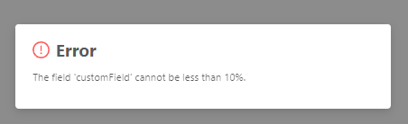
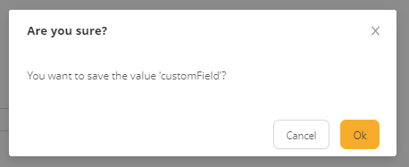
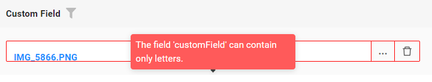

# FileUpload

`FileUpload` is a component that allows to view and attach single file

!!! info
    * When a file is selected, it is stored in the storage system immediately, which then generates a unique "file ID". When the save button is clicked, only this "file ID" is sent to the backend
    * If a new file is selected, it will be saved as a new file in storage. Previous file remains untouched (e.g. one is free to implement custom deletion logic)

## Basics
[:material-play-circle: Live Sample]({{ external_links.code_samples }}/ui/#/screen/NumberBasic){:target="_blank"} ·
[:fontawesome-brands-github: GitHub]({{ external_links.github_ui }}/{{ external_links.github_branch }}/src/main/java/org/demo/documentation/money/basic){:target="_blank"}
### How does it look?

=== "List widget"
    
=== "Info widget"
    
=== "Form widget"
    


### How to add?

??? Example
    For the entire application, a single file storage solution needs to be defined.  In this example file storage is minio.

    **Step1 FileStorage** Add file storage. `see more` [FileStorage](/features/element/fileStorage/fileStorage)

    **Step2** Add two **String** fields (for file name and id)  to corresponding **DataResponseDTO**.

    ```java
    public class MyExampleDTO extends DataResponseDTO {
    
    @SearchParameter(name = "customField")
    private String customField;
   
    private String customFieldId;

    public MyExampleDTO(MyEntity entity) {
        this.customField = entity.getCustomField();
        this.customFieldId = entity.getCustomFieldId();
    }
    }
    ```

    **Step3** Add same **String** fields  to corresponding **BaseEntity**.

    ```java
    public class MyEntity extends BaseEntity {
   
        @Column
        private String customField;

        @Column
        private String customFieldId;
    }
    ```
    === "List widget"
        **Step4** Add to **_.widget.json_**.

        ```json
        {
          "name": "MyExampleList",
          "title": "List title",
          "type": "List",
          "bc": "myExampleBc",
          "fields": [
            {
              "title": "Custom Field",
              "key": "customField",
              "type": "fileUpload",
              "fileIdKey": "customFieldId"
            }
          ]
        }
        ```
    === "Info widget"
        **Step4** Add to **_.widget.json_**.
        
        ```json
        {
          "name": "MyExampleInfo",
          "title": "Info title",
          "type": "Info",
          "bc": "myExampleBc",
          "fields": [
             {
                "label": "Custom Field",
                "key": "customField",
                "type": "fileUpload",
                "fileIdKey": "customFieldId"
             }
          ],
          "options": {
            "layout": {
              "rows": [
                {
                  "cols": [
                    {
                      "fieldKey": "customField",
                      "span": 12
                    }
                  ]
                }
              ]
            }
          }
        }
        ```

    === "Form widget"

        **Step4** Add to **_.widget.json_**.

        ```json
        {
          "name": "MyExampleForm",
          "title": "Form title",
          "type": "Form",
          "bc": "myExampleBc",
          "fields": [
             {
               "label": "Custom Field",
               "key": "customField",
               "type": "fileUpload",
               "fileIdKey": "customFieldId"
             }
          ],
          "options": {
            "layout": {
              "rows": [
                {
                  "cols": [
                    {
                      "fieldKey": "customField",
                      "span": 12
                    }
                  ]
                }
              ]
            }
          }
        }
        ```

## Placeholder
[:material-play-circle: Live Sample]({{ external_links.code_samples }}/ui/#/screen/NumberPlaceholder){:target="_blank"} ·
[:fontawesome-brands-github: GitHub]({{ external_links.github_ui }}/{{ external_links.github_branch }}/src/main/java/org/demo/documentation/money/placeholder){:target="_blank"}
**_not applicable_**

## Color
**_not applicable_**

## Readonly/Editable
`Readonly/Editable` indicates whether the field can be edited or not. It can be calculated based on business logic of application

`Editable`
[:material-play-circle: Live Sample]({{ external_links.code_samples }}/ui/#/screen/InputBasic){:target="_blank"} ·
[:fontawesome-brands-github: GitHub]({{ external_links.github_ui }}/{{ external_links.github_branch }}/src/main/java/org/demo/documentation/input/basic){:target="_blank"}

`Readonly`
[:material-play-circle: Live Sample]({{ external_links.code_samples }}/ui/#/screen/InputCreateEdit){:target="_blank"} ·
[:fontawesome-brands-github: GitHub]({{ external_links.github_ui }}/{{ external_links.github_branch }}/src/main/java/org/demo/documentation/input/ro){:target="_blank"}


### How does it look?
=== "Readonly"
    === "List widget"
        
    === "Info widget"
        _not applicable_
    === "Form widget"
        
=== "Readonly"
    === "List widget"
        
    === "Info widget"
        
    === "Form widget"
        


### How to add?
??? Example
    === "Editable"
    [:material-play-circle: Live Sample]({{ external_links.code_samples }}/ui/#/screen/NumberBasic){:target="_blank"} ·
    [:fontawesome-brands-github: GitHub]({{ external_links.github_ui }}/{{ external_links.github_branch }}/src/main/java/org/demo/documentation/money/basic){:target="_blank"} 
        **Step1** Add mapping DTO->entity to corresponding **VersionAwareResponseService**.
            ```java
            protected ActionResultDTO<MyExampleDTO> doUpdateEntity(MyEntity entity, MyExampleDTO data, BusinessComponent bc) {
                if (data.isFieldChanged(MyExampleDTO_.customField)) {
                    entity.setCustomField(data.getCustomField());
                }
            return new ActionResultDTO<>(entityToDto(bc, entity));
            ```

        **Step2** Add **fields.setEnabled** to corresponding **FieldMetaBuilder**.
    
        ```java
        public class MyExampleMeta extends FieldMetaBuilder<MyExampleDTO> {
        
            @Override
            public void buildRowDependentMeta(RowDependentFieldsMeta<MyExampleDTO> fields, InnerBcDescription bcDescription,
                                              Long id, Long parentId) {
              fields.setEnabled(MyExampleDTO_.customFieldId);
              fields.setEnabled(MyExampleDTO_.customField);
            }
        ```
        === "List widget"
            **Works for List.**
        === "Info widget"
            **_not applicable_**
        === "Form widget"
            **Works for Form.**
   
    === "Readonly"
    
        **Option 1** Enabled by default.
    
        ```java
        public class MyExampleMeta extends FieldMetaBuilder<MyExampleDTO> {
            public void buildRowDependentMeta(RowDependentFieldsMeta<MyExampleDTO> fields, InnerBcDescription bcDescription, Long id, Long parentId) {
            }
        }
        ```
    
        **Option 2** `Not recommended.` Property fields.setDisabled() overrides the enabled field if you use after property fields.setEnabled.
        === "List widget"
            **Works for List.**
        === "Info widget"
            **Works for Info.**
        === "Form widget"
            **Works for Form.**

## Filtering
[:material-play-circle: Live Sample]({{ external_links.code_samples }}/ui/#/screen/myexample63){:target="_blank"} ·
[:fontawesome-brands-github: GitHub]({{ external_links.github_ui }}/{{ external_links.github_branch }}/src/main/java/org/demo/documentation/money/filtration){:target="_blank"}

`Filtering` allows you to search data based on criteria.
For `FileUpload field` filtering is case-insensitive and retrieves records containing the specified value at any position of file name (similar to SQL ```Like %value%``` ).

### How does it look?
=== "List widget"
    
=== "Info widget"
    _not applicable_
=== "Form widget"
    _not applicable_

### How to add?
??? Example
    === "List widget"
        **Step 1** Add **@SearchParameter** to corresponding **DataResponseDTO**. (Advanced customization [SearchParameter](/advancedCustomization_filtration))

        ```java
            @SearchParameter(name = "customField")
            private String customField;
            
            private String customFieldId;
                
            public MyExampleDTO(MyEntity entity) {
                
                this.customField = entity.getCustomField();
                this.customFieldId = entity.getCustomFieldId();
            }
        }
        ```

        **Step 2**  Add **fields.enableFilter** to corresponding **FieldMetaBuilder**.

        ```java 
        public class MyExampleMeta extends FieldMetaBuilder<MyExampleDTO>  {
        
            public void buildIndependentMeta(FieldsMeta<MyExampleDTO> fields, InnerBcDescription bcDescription, Long parentId) {
                fields.enableFilter(MyExampleDTO_.customField);
            }
        
        }
        ```
    === "Info widget"
        _not applicable_
    === "Form widget"
        _not applicable_

## Drilldown
**_not applicable_**

## Validation
`Validation` allows you to check any business rules for user-entered value. There are types of validation:

1) Exception:Displays a message to notify users about technical or business errors.

   `Business Exception`:
   [:material-play-circle: Live Sample]({{ external_links.code_samples }}/ui/#/screen/myexample67/view/myexample67list){:target="_blank"} ·
   [:fontawesome-brands-github: GitHub]({{ external_links.github_ui }}/{{ external_links.github_branch }}/src/main/java/org/demo/documentation/money/validationbusinessex){:target="_blank"}

   `Runtime Exception`:
   [:material-play-circle: Live Sample]({{ external_links.code_samples }}/ui/#/screen/myexample69){:target="_blank"} ·
   [:fontawesome-brands-github: GitHub]({{ external_links.github_ui }}/{{ external_links.github_branch }}/src/main/java/org/demo/documentation/money/validationruntimeex){:target="_blank"}
   
2) Confirm: Presents a dialog with an optional message, requiring user confirmation or cancellation before proceeding.

   [:material-play-circle: Live Sample]({{ external_links.code_samples }}/ui/#/screen/myexample68){:target="_blank"} ·
   [:fontawesome-brands-github: GitHub]({{ external_links.github_ui }}/{{ external_links.github_branch }}/src/main/java/org/demo/documentation/money/validationconfirm){:target="_blank"}

3) Field level validation: shows error next to all fields, that validation failed for

   `Option 1`:
   [:material-play-circle: Live Sample]({{ external_links.code_samples }}/ui/#/screen/myexample68){:target="_blank"} ·
   [:fontawesome-brands-github: GitHub]({{ external_links.github_ui }}/{{ external_links.github_branch }}/src/main/java/org/demo/documentation/money/validationannotation){:target="_blank"}

   `Option 2`:
   [:material-play-circle: Live Sample]({{ external_links.code_samples }}/ui/#/screen/myexample68){:target="_blank"} ·
   [:fontawesome-brands-github: GitHub]({{ external_links.github_ui }}/{{ external_links.github_branch }}/src/main/java/org/demo/documentation/money/validationconfirm){:target="_blank"}


### How does it look?
=== "List widget"
    === "BusinessException"
        
    === "RuntimeException"
        
    === "Confirm"
        
    === "Field level validation"
        
=== "Info widget"
    _not applicable_
=== "Form widget"
    === "BusinessException"
        
    === "RuntimeException"
        
    === "Confirm"
        
    === "Field level validation"
        
### How to add?
??? Example
    === "BusinessException"
        `BusinessException` describes an error  within a business process.

        Add **BusinessException** to corresponding **VersionAwareResponseService**.

        ```java
        public class MyExampleService extends VersionAwareResponseService<MyExampleDTO, MyEntity> {
 
            @Override
            protected ActionResultDTO<MyExampleDTO> doUpdateEntity(MyEntity entity, MyExampleDTO data, BusinessComponent bc) {
                if (data.isFieldChanged(MyExampleDTO_.customField)) {
                    if (data.getCustomField() < 10) {
                        throw new BusinessException().addPopup("The field 'customField' cannot be less than 10%.");
                    }
                    entity.setCustomField(data.getCustomField());
                }
                return new ActionResultDTO<>(entityToDto(bc, entity));
            }              
        ```
        === "List widget"
            **Works for List.**
        === "Info widget"
            **_not applicable_**
        === "Form widget"
            **Works for Form.**
    === "RuntimeException"

        `RuntimeException` describes technical error  within a business process.
        
        Add **RuntimeException** to corresponding **VersionAwareResponseService**.
        
        ```java
            @Override
            protected ActionResultDTO<MyExampleDTO> doUpdateEntity(MyEntity entity, MyExampleDTO data, BusinessComponent bc) {
                if (data.isFieldChanged(MyExampleDTO_.customField)) {
                   try {
                       //call custom function
                   }
                   catch(Exception e){
                        throw new RuntimeException("An unexpected error has occurred.");
                    }
                }
                return new ActionResultDTO<>(entityToDto(bc, entity));
            }
        ```    
        === "List widget"
            **Works for List.**
        === "Info widget"
            **_not applicable_**
        === "Form widget"
            **Works for Form.**
    === "Confirm"
        Add [PreAction.confirm](/advancedCustomization_validation) to corresponding **VersionAwareResponseService**.
        ```java
     
            public class MyExampleService extends VersionAwareResponseService<MyExampleDTO, MyEntity> {

                @Override
                public Actions<MyExampleDTO> getActions() {
                    return Actions.<MyExampleDTO>builder()
                    .newAction()
                    .action("save", "save")
                    .withPreAction(PreAction.confirm("You want to save the value 'customField'?"))
                    .add()
                    .build();
                }
            }
        ```
        === "List widget"
            **Works for List.**
        === "Info widget"
            **_not applicable_**
        === "Form widget"
            **Works for Form.**

    === "Field level validation"
        === "Option 1"
            Add javax.validation to corresponding **DataResponseDTO**.

            Use if:

            Requires a simple fields check (javax validation)
            ```java
         
                public class MyExampleDTO extends DataResponseDTO {
                    @SearchParameter(name = "customField")
                    @Pattern(regexp="[A-Za-z]+", message = "The field 'customField' can contain only letters.")
                    private String customField;
                    @SearchParameter(name = "customFieldId")
                    private String customFieldId;
                }
            ```
            === "List widget"
                **Works for List.**
            === "Info widget"
                **_not applicable_**
            === "Form widget"
                **Works for Form.**
        === "Option 2"
            Create сustom service for business logic check.

            Use if:

            Business logic check required for fields

            `Step 1`  Create сustom method for check.
            ```java
            private void validate(BusinessComponent bc, MyExampleDTO dto) {
                BusinessError.Entity entity = new BusinessError.Entity(bc);
                if  (!String.valueOf(dto.getCustomField()).matches("[A-Za-z]+")){
                    entity.addField(MyExampleDTO_.customField.getName(), "The field 'customField' can contain only letters.");
                }
                if  (!String.valueOf(dto.getCustomFieldAdditional()).matches("[A-Za-z]+")) {
                    entity.addField(MyExampleDTO_.customFieldAdditional.getName(), "The field 'customFieldAdditional' can contain only letters.");
                }
                if (entity.getFields().size() > 0) {
                    throw new BusinessException().setEntity(entity);
                }
            }
            ```
            `Step 2` Add сustom method for check to corresponding **VersionAwareResponseService**..
            ```java
                protected ActionResultDTO<MyExampleDTO> doUpdateEntity(MyEntity entity, MyExampleDTO data, BusinessComponent bc) {
                    validateFields(bc, data);
            ```
            === "List widget"
                Add custom action check to **_.widget.json_**.
                ```json
                {
                  "name": "MyExampleList",
                  "title": "List title",
                  "type": "List",
                  "bc": "myExampleBc",
                  "fields": [
                    {
                      "title": "Custom Field Additional",
                      "key": "customFieldAdditional",
                      "type": "fileUpload",
                      "fileIdKey": "customFieldAdditionalId"
                    },
                    {
                      "title": "Custom Field",
                      "key": "customField",
                      "type": "fileUpload",
                      "fileIdKey": "customFieldId"
                    }
                  ]
                }
                ```               
            === "Info widget"
                **_not applicable_**
            === "Form widget"
                ```json
                {
                  "name": "MyExampleForm",
                  "title": "Form title",
                  "type": "Form",
                  "bc": "myExampleBc",
                  "fields": [
                    {
                      "label": "Custom Field",
                      "key": "customField",
                      "type": "fileUpload",
                      "fileIdKey": "customFieldId"
                    },
                    {
                      "label": "Custom Field Additional",
                      "key": "customFieldAdditional",
                      "type": "fileUpload",
                      "fileIdKey": "customFieldAdditionalId"
                    }
                  ],
                    "layout": {
                      "rows": [
                        {
                          "cols": [
                            {
                              "fieldKey": "customField",
                              "span": 12
                            }
                          ]
                        },
                        {
                          "cols": [
                            {
                              "fieldKey": "customFieldAdditional",
                              "span": 12
                            }
                          ]
                        }
                      ]
                    }
                  }
                }
                ```
 
## Sorting

`Sorting` allows you to sort data in ascending or descending order.
`FileUpload field` is a text field, so lexicographic sorting is used for it

### How does it look?
=== "List widget"
    
=== "Info widget"
    _not applicable_
=== "Form widget"
    _not applicable_
### How to add?
??? Example
    === "List widget"
        Enabled by default.
    === "Info widget"
        _not applicable_
    === "Form widget"
        _not applicable_


## Required
[:material-play-circle: Live Sample]({{ external_links.code_samples }}/ui/#/screen/myexample68){:target="_blank"} ·
[:fontawesome-brands-github: GitHub]({{ external_links.github_ui }}/{{ external_links.github_branch }}/src/main/java/org/demo/documentation/money/required){:target="_blank"}

`Required` allows you to denote, that this field must have a value provided. 

### How does it look?
=== "List widget"
    
=== "Info widget"
    _not applicable_
=== "Form widget"
    
### How to add?
??? Example
    Add **fields.setRequired** to corresponding **FieldMetaBuilder**.

    ```java

    public class MyExampleMeta extends FieldMetaBuilder<MyExampleDTO> {
    
      @Override
      public void buildRowDependentMeta(RowDependentFieldsMeta<MyExampleDTO> fields, InnerBcDescription bcDescription,
        Long id, Long parentId) {
        fields.setEnabled(MyExampleDTO_.customField);
        fields.setRequired(MyExampleDTO_.customField);
      }
    ```
    === "List widget"
        **Works for List.**
    === "Info widget"
        **_not applicable_**
    === "Form widget"
        **Works for Form.**
