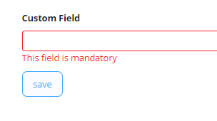

# FileUpload

`FileUpload` is a component that allows to view and attach single file

## Basics
### How does it look?

=== "List widget"
    
=== "Info widget"
    
=== "Form widget"
    


### How to add?

??? Example
    **Option1**
    **Step1** Add field **Long** to corresponding **DataResponseDTO**.

    ```java
    public class MyExampleDTO extends DataResponseDTO {
    
    @SearchParameter(name = "customField")
    private String customField;
    @SearchParameter(name = "customFieldId")
    private String customFieldId;

    public MyExampleDTO(MyEntity entity) {
        this.customField = entity.getCustomField();
        this.customFieldId = entity.getCustomFieldId();
    }
    }
    ```

    **Step2** Add field **Long** to corresponding **BaseEntity**.

    ```java
    public class MyExampleEntity extends BaseEntity {
   
        @Column
        private Long customField;
    }
    ```
    === "List widget"
        **Step3** Add to **_.widget.json_**.

        ```json
        {
          "name": "MyExampleList",
          "title": "List title",
          "type": "List",
          "bc": "myExampleBc",
          "fields": [
            {
              "title": "custom Field",
              "key": "customField",
              "type": "percent"
            }
          ],
          "options": {
            "actionGroups": {
            }
          }
        }
        ```
    === "Info widget"
        **Step3** Add to **_.widget.json_**.
        
        ```json
        {
          "name": "MyExampleInfo",
          "title": "Info title",
          "type": "Info",
          "bc": "myExampleBc",
          "fields": [
            {
              "label": "custom Field",
              "key": "customField",
              "type": "percent"
            }
          ],
          "options": {
            "layout": {
              "rows": [
                {
                  "cols": [
                    {
                      "fieldKey": "customField",
                      "span": 12
                    }
                  ]
                },
                {
                  "cols": [
                  ]
                }
              ]
            }
          }
        }
        ```

    === "Form widget"

        **Step3** Add to **_.widget.json_**.

        ```json
        {
          "name": "MyExampleForm",
          "title": "Form title",
          "type": "Form",
          "bc": "myExampleBc",
          "fields": [
            {
              "label": "custom Field",
              "key": "customField",
              "type": "percent"
            }
          ],
          "options": {
            "layout": {
              "rows": [
                {
                  "cols": [
                    {
                      "fieldKey": "customField",
                      "span": 12
                    }
                  ]
                },
                {
                  "cols": [
                  ]
                }
              ]
            }
          }
        }
        ```
    **Option2** Add field **Double** to corresponding **DataResponseDTO** in Step1.

## Placeholder
**_not applicable_**

## Color
**_not applicable_**

## Readonly/Editable
`Readonly/Editable` indicates whether the field can be edited or not. It can be calculated based on business logic of application

### How does it look?
=== "Editable List widget"
    
=== "Editable Info widget"
    _not applicable_
=== "Editable Form widget"
    


### How to add?
??? Example
    === "Editable" 
        **Step1** Add mapping DTO->entity to corresponding **VersionAwareResponseService**.
            ```java
            protected ActionResultDTO<MyExampleDTO> doUpdateEntity(MyExampleEntity entity, MyExampleDTO data, BusinessComponent bc) {
                if (data.isFieldChanged(MyExampleDTO_.customField)) {
                    entity.setCustomField(data.getCustomField());
                }
            return new ActionResultDTO<>(entityToDto(bc, entity));
            ```

        **Step2** Add **fields.setEnabled** to corresponding **FieldMetaBuilder**.
    
        ```java
        public class MyExampleMeta extends FieldMetaBuilder<MyExampleDTO> {
        
            @Override
            public void buildRowDependentMeta(RowDependentFieldsMeta<MyExampleDTO> fields, InnerBcDescription bcDescription,
                                              Long id, Long parentId) {
              fields.setEnabled(MyExampleDTO_.customFieldId);
              fields.setEnabled(MyExampleDTO_.customField);
            }
        ```
        === "List widget"
            **Works for List.**
        === "Info widget"
            **_not applicable_**
        === "Form widget"
            **Works for Form.**
   
    === "Readonly"
    
        **Option 1** Enabled by default.
    
        ```java
        public class MyExampleMeta extends FieldMetaBuilder<MyExampleDTO> {
            public void buildRowDependentMeta(RowDependentFieldsMeta<MyExampleDTO> fields, InnerBcDescription bcDescription, Long id, Long parentId) {
            }
        }
        ```
    
        **Option 2** `Not recommended.` Property fields.setDisabled() overrides the enable field if you use after property fields.setEnabled.
        === "List widget"
            **Works for List.**
        === "Info widget"
            **_not applicable_**
        === "Form widget"
            **Works for Form.**
## Filtration
**_not applicable_**

## Drilldown
**_not applicable_**

## Validation
`Validation` allows you to check any business rules for user-entered value. There are two types of validation:

1) Exception: Displays a message to notify users about technical or business errors.

2) Confirm: Presents a dialog with an optional message, requiring user confirmation or cancellation before proceeding.

### How does it look?
=== "List widget"
    === "BusinessException"
        
    === "RuntimeException"
        
    === "Confirm"
        
=== "Info widget"
    _not applicable_
=== "Form widget"
    === "BusinessException"
        
    === "RuntimeException"
        
    === "Confirm"
        

### How to add?
??? Example
    === "BusinessException"
        `BusinessException` describes an error  within a business process.

        Add **BusinessException** to corresponding **VersionAwareResponseService**.

        ```java
        public class MyExampleService extends VersionAwareResponseService<MyExampleDTO, MyExample> {
 
            @Override
            protected ActionResultDTO<MyExampleDTO> doUpdateEntity(MyExampleEntity entity, MyExampleDTO data, BusinessComponent bc) {
                if (data.isFieldChanged(MyExampleDTO_.customField)) {
                    entity.setCustomField(data.getCustomField());
                    if (data.getCustomField() < 10) {
                        throw new BusinessException().addPopup("The field 'customField' cannot be less than 10.");
                    }
                }
                return new ActionResultDTO<>(entityToDto(bc, entity));
            }              
        ```
        === "List widget"
            **Works for List.**
        === "Info widget"
            **_not applicable_**
        === "Form widget"
            **Works for Form.**
    === "RuntimeException"

        `RuntimeException` describes an error  within a business process.
        
        Add **RuntimeException** to corresponding **VersionAwareResponseService**.
        
        ```java
            @Override
            protected ActionResultDTO<MyExampleDTO> doUpdateEntity(MyExampleEntity entity, MyExampleDTO data, BusinessComponent bc) {
                if (data.isFieldChanged(MyExampleDTO_.customField)) {
                    entity.setCustomField(data.getCustomField());
                   try {
                       //call custom function
                   }
                   catch(Exception e){
                        throw new RuntimeException("An unexpected error has occurred.");
                    }
                }
                return new ActionResultDTO<>(entityToDto(bc, entity));
            }
        ```    
        === "List widget"
            **Works for List.**
        === "Info widget"
            **_not applicable_**
        === "Form widget"
            **Works for Form.**
    === "Confirm"
        Add [PreAction.confirm](/advancedCustomization_validation) to corresponding **VersionAwareResponseService**.
        ```java
     
            public class MyExampleService extends VersionAwareResponseService<MyExampleDTO, MyExample> {

                @Override
                public Actions<MyExampleDTO> getActions() {
                    return Actions.<MyExampleDTO>builder()
                    .newAction()
                    .action("save", "save")
                    .withPreAction(PreAction.confirm("You want to save the value 'customField'?"))
                    .add()
                    .build();
                }
            }
        ```
        === "List widget"
            **Works for List.**
        === "Info widget"
            **_not applicable_**
        === "Form widget"
            **Works for Form.**

## Sorting
**_not applicable_**

## Required
`Required` allows you to denote, that this field must have a value provided. 

### How does it look?
=== "List widget"
    
=== "Info widget"
    _not applicable_
=== "Form widget"
    
### How to add?
??? Example
    Add **fields.setRequired** to corresponding **FieldMetaBuilder**.

    ```java

    public class MyExampleMeta extends FieldMetaBuilder<MyExample> {
    
      @Override
      public void buildRowDependentMeta(RowDependentFieldsMeta<MyExample> fields, InnerBcDescription bcDescription,
        Long id, Long parentId) {
        fields.setEnabled(MyExample_.customField);
        fields.setRequired(MyExample_.customField);
      }
    ```
    === "List widget"
        **Works for List.**
    === "Info widget"
        **_not applicable_**
    === "Form widget"
        **Works for Form.**
