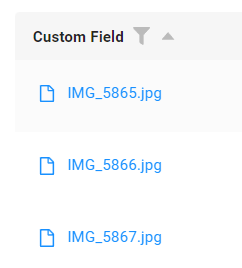

# FileUpload

`FileUpload` is a component that allows to view and attach single file

!!! info
    * When a file is selected, it is stored in the storage system immediately, which then generates a unique "file ID". When the save button is clicked, only this "file ID" is sent to the backend
    * If a new file is selected, it will be saved as a new file in storage. Previous file remains untouched (e.g. one is free to implement custom deletion logic)

## Basics
[:material-play-circle: Live Sample]({{ external_links.code_samples }}/ui/#/screen/myexample94){:target="_blank"} ·
[:fontawesome-brands-github: GitHub]({{ external_links.github_ui }}/{{ external_links.github_branch }}/src/main/java/org/demo/documentation/fileupload/basic){:target="_blank"}
### How does it look?

=== "List widget"
    
=== "Info widget"
    
=== "Form widget"
    


### How to add?

??? Example
    For the entire application, a single file storage solution needs to be defined.  In this example file storage is minio.

    **Step1 FileStorage** Add file storage. `see more` [FileStorage](/features/element/fileStorage/fileStorage)


    **Step2** Add same **String** fields  to corresponding **BaseEntity**.

    ```java
    --8<--
    {{ external_links.github_raw }}/fileupload/basic/MyEntity94.java
    --8<--
    ```

    **Step3** Add two **String** fields (for file name and id)  to corresponding **DataResponseDTO**.

    ```java
    --8<--
    {{ external_links.github_raw }}/fileupload/basic/MyExample94DTO.java
    --8<--
    ```
 
    === "List widget"
        **Step4** Add to **_.widget.json_**.

        ```json
        --8<--
        {{ external_links.github_raw }}/fileupload/basic/MyExample94List.widget.json
        --8<--
        ```
    === "Info widget"
        **Step4** Add to **_.widget.json_**.
        
        ```json
        --8<--
        {{ external_links.github_raw }}/fileupload/basic/MyExample94Info.widget.json
        --8<--
        ```

    === "Form widget"

        **Step4** Add to **_.widget.json_**.

        ```json
        --8<--
        {{ external_links.github_raw }}/fileupload/basic/MyExample94Form.widget.json
        --8<--
        ```    


## Placeholder
[:material-play-circle: Live Sample]({{ external_links.code_samples }}/ui/#/screen/myexample100){:target="_blank"} ·
[:fontawesome-brands-github: GitHub]({{ external_links.github_ui }}/{{ external_links.github_branch }}/src/main/java/org/demo/documentation/fileupload/placeholder){:target="_blank"}

`Placeholder` allows you to provide a concise hint, guiding users on the expected value. This hint is displayed before any user input. It can be calculated based on business logic of application
### How does it look?
=== "List widget"
    
=== "Info widget"
    _not applicable_
=== "Form widget"
    
### How to add?
??? Example
    Add **fields.setPlaceholder** to corresponding **FieldMetaBuilder**.

    ```java
    --8<--
    {{ external_links.github_raw }}/fileupload/placeholder/MyExample100Meta.java:buildRowDependentMeta
    --8<--
    ```  
    === "List widget"
        **Works for List.**
    === "Info widget"
        **_not applicable_**
    === "Form widget"
        **Works for Form.**

## Color
**_not applicable_**

## Readonly/Editable
`Readonly/Editable` indicates whether the field can be edited or not. It can be calculated based on business logic of application

`Editable`
[:material-play-circle: Live Sample]({{ external_links.code_samples }}/ui/#/screen/myexample94){:target="_blank"} ·
[:fontawesome-brands-github: GitHub]({{ external_links.github_ui }}/{{ external_links.github_branch }}/src/main/java/org/demo/documentation/fileupload/basic){:target="_blank"}

`Readonly`
[:material-play-circle: Live Sample]({{ external_links.code_samples }}/ui/#/screen/myexample97){:target="_blank"} ·
[:fontawesome-brands-github: GitHub]({{ external_links.github_ui }}/{{ external_links.github_branch }}/src/main/java/org/demo/documentation/fileupload/ro){:target="_blank"}


### How does it look?
=== "Readonly"
    === "List widget"
        
    === "Info widget"
        _not applicable_
    === "Form widget"
        
=== "Readonly"
    === "List widget"
        
    === "Info widget"
        
    === "Form widget"
        


### How to add?
??? Example
    === "Editable"
        **Step1** Add mapping DTO->entity to corresponding **VersionAwareResponseService**.
        ```java
        --8<--
        {{ external_links.github_raw }}/fileupload/basic/MyExample94Service.java:doUpdateEntity
        --8<--
        ```

        **Step2** Add **fields.setEnabled** to corresponding **FieldMetaBuilder**.
        ```java
        --8<--
        {{ external_links.github_raw }}/fileupload/basic/MyExample94Meta.java:buildRowDependentMeta
        --8<--
        ```
        === "List widget"
            **Works for List.**
        === "Info widget"
            **_not applicable_**
        === "Form widget"
            **Works for Form.**
   
    === "Readonly"
    
        **Option 1** Enabled by default.
        ```java
        --8<--
        {{ external_links.github_raw }}/fileupload/ro/MyExample97Meta.java:buildRowDependentMeta
        --8<--
        ```

        **Option 2** `Not recommended.` Property fields.setDisabled() overrides the enabled field if you use after property fields.setEnabled.
        === "List widget"
            **Works for List.**
        === "Info widget"
            **Works for Info.**
        === "Form widget"
            **Works for Form.**

## Filtering
[:material-play-circle: Live Sample]({{ external_links.code_samples }}/ui/#/screen/myexample99){:target="_blank"} ·
[:fontawesome-brands-github: GitHub]({{ external_links.github_ui }}/{{ external_links.github_branch }}/src/main/java/org/demo/documentation/fileupload/filtration){:target="_blank"}

`Filtering` allows you to search data based on criteria.
For `FileUpload field` filtering is case-insensitive and retrieves records containing the specified value at any position of file name (similar to SQL ```Like %value%``` ).

### How does it look?
=== "List widget"
    
=== "Info widget"
    _not applicable_
=== "Form widget"
    _not applicable_

### How to add?
??? Example
    === "List widget"
        **Step 1** Add **@SearchParameter** to corresponding **DataResponseDTO**. (Advanced customization [SearchParameter](/advancedCustomization/element/searchparameter/searchparameter))
        ```java
        --8<--
        {{ external_links.github_raw }}/fileupload/filtration/MyExample99DTO.java
        --8<--
        ```


        **Step 2**  Add **fields.enableFilter** to corresponding **FieldMetaBuilder**.
        ```java
        --8<--
        {{ external_links.github_raw }}/fileupload/filtration/MyExample99Meta.java:buildIndependentMeta
        --8<--
        ```

    === "Info widget"
        _not applicable_
    === "Form widget"
        _not applicable_

## Drilldown
**_not applicable_**

## Validation
`Validation` allows you to check any business rules for user-entered value. There are types of validation:

1) Exception:Displays a message to notify users about technical or business errors.

   `Business Exception`:
   [:material-play-circle: Live Sample]({{ external_links.code_samples }}/ui/#/screen/myexample103){:target="_blank"} ·
   [:fontawesome-brands-github: GitHub]({{ external_links.github_ui }}/{{ external_links.github_branch }}/src/main/java/org/demo/documentation/fileupload/validationbusinessex){:target="_blank"}

   `Runtime Exception`:
   [:material-play-circle: Live Sample]({{ external_links.code_samples }}/ui/#/screen/myexample105){:target="_blank"} ·
   [:fontawesome-brands-github: GitHub]({{ external_links.github_ui }}/{{ external_links.github_branch }}/src/main/java/org/demo/documentation/fileupload/validationruntimeex){:target="_blank"}
   
2) Confirm: Presents a dialog with an optional message, requiring user confirmation or cancellation before proceeding.

   [:material-play-circle: Live Sample]({{ external_links.code_samples }}/ui/#/screen/myexample104){:target="_blank"} ·
   [:fontawesome-brands-github: GitHub]({{ external_links.github_ui }}/{{ external_links.github_branch }}/src/main/java/org/demo/documentation/fileupload/validationconfirm){:target="_blank"}

3) Field level validation: shows error next to all fields, that validation failed for

   `Option 1`:
   [:material-play-circle: Live Sample]({{ external_links.code_samples }}/ui/#/screen/myexample170){:target="_blank"} ·
   [:fontawesome-brands-github: GitHub]({{ external_links.github_ui }}/{{ external_links.github_branch }}/src/main/java/org/demo/documentation/fileupload/validationannotation){:target="_blank"}

   `Option 2`:
   [:material-play-circle: Live Sample]({{ external_links.code_samples }}/ui/#/screen/myexample324){:target="_blank"} ·
   [:fontawesome-brands-github: GitHub]({{ external_links.github_ui }}/{{ external_links.github_branch }}/src/main/java/org/demo/documentation/fileupload/validationdynamic){:target="_blank"}


### How does it look?
=== "List widget"
    === "BusinessException"
        
    === "RuntimeException"
        
    === "Confirm"
        
    === "Field level validation"
        
=== "Info widget"
    _not applicable_
=== "Form widget"
    === "BusinessException"
        
    === "RuntimeException"
        
    === "Confirm"
        
    === "Field level validation"
        
### How to add?
??? Example
    === "BusinessException"
        `BusinessException` describes an error  within a business process.

        Add **BusinessException** to corresponding **VersionAwareResponseService**.
        ```java
        --8<--
        {{ external_links.github_raw }}/fileupload/validationbusinessex/MyExample103Service.java:doUpdateEntity
        --8<--
        ```
        === "List widget"
            **Works for List.**
        === "Info widget"
            **_not applicable_**
        === "Form widget"
            **Works for Form.**
    === "RuntimeException"

        `RuntimeException` describes technical error  within a business process.
        
        Add **RuntimeException** to corresponding **VersionAwareResponseService**.
        ```java
        --8<--
        {{ external_links.github_raw }}/fileupload/validationruntimeex/MyExample105Service.java:doUpdateEntity
        --8<--
        ```
    
        === "List widget"
            **Works for List.**
        === "Info widget"
            **_not applicable_**
        === "Form widget"
            **Works for Form.**
    === "Confirm"
        Add [PreAction.confirm](/advancedCustomization_validation) to corresponding **VersionAwareResponseService**.
        ```java
        --8<--
        {{ external_links.github_raw }}/fileupload/validationconfirm/MyExample104Service.java:getActions
        --8<--
        ```
        === "List widget"
            **Works for List.**
        === "Info widget"
            **_not applicable_**
        === "Form widget"
            **Works for Form.**

    === "Field level validation"
        === "Option 1"
            Add javax.validation to corresponding **DataResponseDTO**.

            Use if:

            Requires a simple fields check (javax validation)
            ```java
            --8<--
            {{ external_links.github_raw }}/fileupload/validationannotation/MyExample170DTO.java
            --8<--
            ```
	 
            === "List widget"
                **Works for List.**
            === "Info widget"
                **_not applicable_**
            === "Form widget"
                **Works for Form.**
        === "Option 2"
            Create сustom service for business logic check.

            Use if:

            Business logic check required for fields

            `Step 1`  Create сustom method for check.
            ```java
            --8<--
            {{ external_links.github_raw }}/fileupload/validationdynamic/MyExample324Service.java:validateFields
            --8<--
            ```
 
            `Step 2` Add сustom method for check to corresponding **VersionAwareResponseService**.
            ```java
            --8<--
            {{ external_links.github_raw }}/fileupload/validationdynamic/MyExample324Service.java:doUpdateEntity
            --8<--
            ```
 
            === "List widget"
                Add custom action check to **_.widget.json_**.
                ```json
                --8<--
                {{ external_links.github_raw }}/fileupload/validationdynamic/MyExample324List.widget.json
                --8<--
                ```
		    
            === "Info widget"
                **_not applicable_**
            === "Form widget"
                Add custom action check to **_.widget.json_**.
                ```json
                --8<--
                {{ external_links.github_raw }}/fileupload/validationdynamic/MyExample324Form.widget.json
                --8<--
                ```
## Sorting
[:material-play-circle: Live Sample]({{ external_links.code_samples }}/ui/#/screen/myexample102){:target="_blank"} ·
[:fontawesome-brands-github: GitHub]({{ external_links.github_ui }}/{{ external_links.github_branch }}/src/main/java/org/demo/documentation/fileupload/sorting){:target="_blank"}

`Sorting` allows you to sort data in ascending or descending order.
`FileUpload field` is a text field, so lexicographic sorting is used for it

### How does it look?
=== "List widget"
    
=== "Info widget"
    _not applicable_
=== "Form widget"
    _not applicable_
### How to add?
??? Example
    === "List widget"
        Enabled by default.
    === "Info widget"
        _not applicable_
    === "Form widget"
        _not applicable_


## Required
[:material-play-circle: Live Sample]({{ external_links.code_samples }}/ui/#/screen/myexample101){:target="_blank"} ·
[:fontawesome-brands-github: GitHub]({{ external_links.github_ui }}/{{ external_links.github_branch }}/src/main/java/org/demo/documentation/fileupload/required){:target="_blank"}

`Required` allows you to denote, that this field must have a value provided. 

### How does it look?
=== "List widget"
    
=== "Info widget"
    _not applicable_
=== "Form widget"
    
### How to add?
??? Example
    Add **fields.setRequired** to corresponding **FieldMetaBuilder**.
    ```java
    --8<--
    {{ external_links.github_raw }}/fileupload/required/MyExample101Meta.java:buildRowDependentMeta
    --8<--
    ```
    === "List widget"
        **Works for List.**
    === "Info widget"
        **_not applicable_**
    === "Form widget"
        **Works for Form.**
