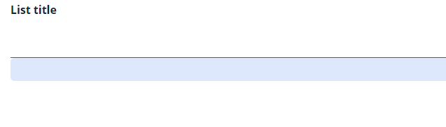
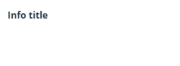
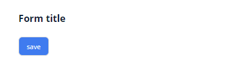

# Hidden
`Hidden` is invisible technical component that allows to send field value to frontend
## Basics
[:material-play-circle: Live Sample]({{ external_links.code_samples }}/ui/#/screen/HiddenBasic){:target="_blank"} ·
[:fontawesome-brands-github: GitHub]({{ external_links.github_ui }}/{{ external_links.github_branch }}/src/main/java/org/demo/documentation/fields/hidden/basic){:target="_blank"}
### How does it look?

=== "List widget"
    
=== "Info widget"
    
=== "Form widget"
    


### How to add?
??? Example
    **Step1** Add **String** field to corresponding **DataResponseDTO**.

    ```java
    --8<--
    {{ external_links.github_raw_doc }}/fields/hidden/basic/HiddenBasic.java
    --8<--
    ```

    **Step2** Add **String** field to corresponding **BaseEntity**.

    ```java
    --8<--
    {{ external_links.github_raw_doc }}/fields/hidden/basic/HiddenBasicDTO.java
    --8<--
    ```

    === "List widget"
        **Step3** Add to **_.widget.json_**.

        ```json
        --8<--
        {{ external_links.github_raw_doc }}/fields/hidden/basic/HiddenBasicList.widget.json
        --8<--
        ```
    === "Info widget"
        **Step3** Add to **_.widget.json_**.
        
        ```json
        --8<--
        {{ external_links.github_raw_doc }}/fields/hidden/basic/HiddenBasicInfo.widget.json
        --8<--
        ```

    === "Form widget"

        **Step3** Add to **_.widget.json_**.

        ```json
        --8<--
        {{ external_links.github_raw_doc }}/fields/hidden/basic/HiddenBasicForm.widget.json
        --8<--
        ```      
## Placeholder
_not applicable_

## Color
_not applicable_

## Readonly/Editable
_not applicable_

## Filtering
_not applicable_

## Drilldown
_not applicable_

## Validation
_not applicable_

## Sorting
_not applicable_

## Required
_not applicable_