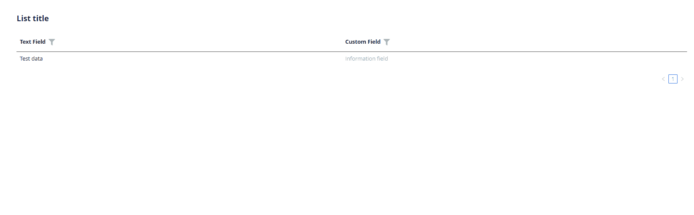
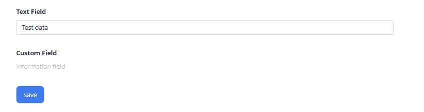

# Hint

`Hint` is a non-editable component used for indirect indication or suggestion

## Basics
### How does it look?

=== "List widget"
    
=== "Info widget"
    
=== "Form widget"
    


### How to add?

??? Example
    **Step1** Add field **String** to corresponding **DataResponseDTO**.

    ```java
    public class MyExampleDTO extends DataResponseDTO {
    
        private String customField;
    
        public MyExampleDTO(MyEntity1 entity) {
            this.customField = entity.getCustomField();
        }
    }
    ```

    **Step2** Add field **String** to corresponding **BaseEntity**.

    ```java
    public class MyExampleEntity extends BaseEntity {
   
        @Column
        private String customField;
    }
    ```
    === "List widget"
        **Step3** Add to **_.widget.json_**.

        ```json
        {
          "name": "MyExampleList",
          "title": "List title",
          "type": "List",
          "bc": "myExampleBc",
          "fields": [
            {
              "title": "Text Field",
              "key": "textField",
              "type": "input"
            },
            {
              "title": "Custom Field",
              "key": "customField",
              "type": "hint",
              "showLength": 100
            }
          ],
          "options": {
            "actionGroups": {
            }
          }
        }
        ```
    === "Info widget"
        **Step3** Add to **_.widget.json_**.

        ```json
        {
          "name": "MyExampleInfo",
          "title": "Info title",
          "type": "Info",
          "bc": "myExampleBc",
          "fields": [
            {
              "label": "Text Field",
              "key": "textField",
              "type": "input"
            },
            {
              "label": "Custom Field",
              "key": "customField",
              "type": "hint",
              "showLength": 100
            }
          ],
          "options": {
            "layout": {
              "rows": [
                {
                  "cols": [
                    {
                      "fieldKey": "textField",
                      "span": 12
                    }
                  ]
                },
                {
                  "cols": [
                    {
                      "fieldKey": "customField",
                      "span": 12
                    }
                  ]
                },
                {
                  "cols": [
                  ]
                }
              ]
            }
          }
        }
        ```

    === "Form widget"

        **Step3** Add to **_.widget.json_**.

        ```json
        {
          "name": "MyExampleForm",
          "title": "Form title",
          "type": "Form",
          "bc": "myExampleBc",
          "fields": [
            {
              "label": "Text Field",
              "key": "textField",
              "type": "input"
            },
            {
              "label": "Custom Field",
              "key": "customField",
              "type": "hint",
              "showLength": 100
            }
          ],
          "options": {
            "layout": {
              "rows": [
                {
                  "cols": [
                    {
                      "fieldKey": "textField",
                      "span": 12
                    }
                  ]
                },
                {
                  "cols": [
                    {
                      "fieldKey": "customField",
                      "span": 12
                    }
                  ]
                },
                {
                  "cols": [
                  ]
                }
              ]
            }
          }
        }
        ```

## Placeholder
_not applicable_

## Color
_not applicable_

## Readonly/Editable
_not applicable_

## Filtration
_not applicable_

## Drilldown
_not applicable_

## Validation
_not applicable_

## Sorting
_not applicable_

## Required
_not applicable_