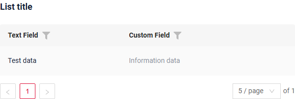
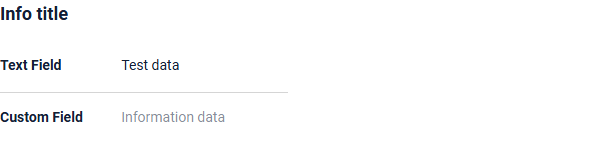
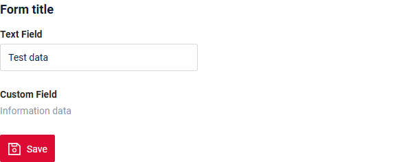
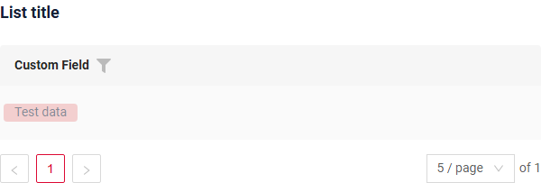
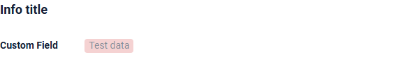
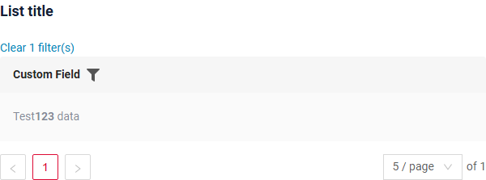
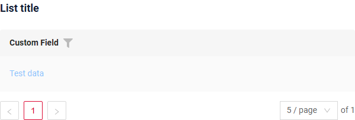
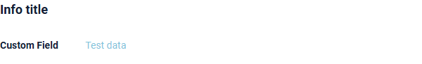
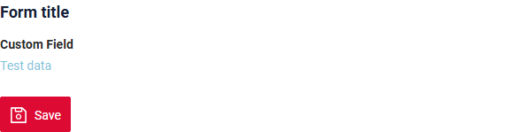

# Hint

`Hint` is a non-editable component used for indirect indication or suggestion
The typical scenario involves using in a logical block [Multifield](/widget/fields/field/multifield/multifield)
## Basics
[:material-play-circle: Live Sample]({{ external_links.code_samples }}/ui/#/screen/myexample156){:target="_blank"} ·
[:fontawesome-brands-github: GitHub]({{ external_links.github_ui }}/{{ external_links.github_branch }}/src/main/java/org/demo/documentation/fields/hint/basic){:target="_blank"}

### How does it look?

=== "List widget"
    
=== "Info widget"
    
=== "Form widget"
    


### How to add?

??? Example
    **Step1** Add **String** field  to corresponding **BaseEntity**.
    ```java
    --8<--
    {{ external_links.github_raw_doc }}/fields/hint/basic/MyEntity156.java
    --8<--
    ```

    **Step2** Add **String** field  to corresponding **DataResponseDTO**.

    ```java
    --8<--
    {{ external_links.github_raw_doc }}/fields/hint/basic/MyExample156DTO.java
    --8<--
    ```

    === "List widget"
        **Step3** Add to **_.widget.json_**.

        ```json
        --8<--
        {{ external_links.github_raw_doc }}/fields/hint/basic/MyExample156List.widget.json
        --8<--
        ```
    === "Info widget"
        **Step3** Add to **_.widget.json_**.
        
        ```json
        --8<--
        {{ external_links.github_raw_doc }}/fields/hint/basic/MyExample156Info.widget.json
        --8<--
        ```

    === "Form widget"

        **Step3** Add to **_.widget.json_**.

        ```json
        --8<--
        {{ external_links.github_raw_doc }}/fields/hint/basic/MyExample156Form.widget.json
        --8<--
        ```

    [:material-play-circle: Live Sample]({{ external_links.code_samples }}/ui/#/screen/myexample156){:target="_blank"} ·
    [:fontawesome-brands-github: GitHub]({{ external_links.github_ui }}/{{ external_links.github_branch }}/src/main/java/org/demo/documentation/fields/hint/basic){:target="_blank"}

## Placeholder
_not applicable_

## Color
`Color` allows you to specify a field color. It can be calculated based on business logic of application

**Calculated color**

[:material-play-circle: Live Sample]({{ external_links.code_samples }}/ui/#/screen/myexample157){:target="_blank"} ·
[:fontawesome-brands-github: GitHub]({{ external_links.github_ui }}/{{ external_links.github_branch }}/src/main/java/org/demo/documentation/fields/hint/color){:target="_blank"}

**Constant color**

[:material-play-circle: Live Sample]({{ external_links.code_samples }}/ui/#/screen/myexample158){:target="_blank"} ·
[:fontawesome-brands-github: GitHub]({{ external_links.github_ui }}/{{ external_links.github_branch }}/src/main/java/org/demo/documentation/fields/hint/colorconst){:target="_blank"}

### How does it look?
=== "List widget"
    
=== "Info widget"
    
=== "Form widget"
    _not applicable_

### How to add?
??? Example
    === "Calculated color"
        **Step 1**   Add `custom field for color` to corresponding **DataResponseDTO**. The field can contain a HEX color or be null.   
        ```java
        --8<--
        {{ external_links.github_raw_doc }}/fields/hint/color/MyExample157DTO.java
        --8<--
        ```

        === "List widget"
            **Step 2** Add **"bgColorKey"** :  `custom field for color`  to .widget.json.
            ```json
            --8<--
            {{ external_links.github_raw_doc }}/fields/hint/color/MyExample157List.widget.json
            --8<--
            ```
        === "Info widget"
            **Step 2** Add **"bgColorKey"** :  `custom field for color`  to .widget.json.
            ```json
            --8<--
            {{ external_links.github_raw_doc }}/fields/hint/color/MyExample157Info.widget.json
            --8<--
            ```
        === "Form widget"
            _not applicable_    

        [:material-play-circle: Live Sample]({{ external_links.code_samples }}/ui/#/screen/myexample157){:target="_blank"} ·
        [:fontawesome-brands-github: GitHub]({{ external_links.github_ui }}/{{ external_links.github_branch }}/src/main/java/org/demo/documentation/fields/hint/color){:target="_blank"}

    === "Constant color"
        === "List widget"
            Add **"bgColor"** :  `HEX color`  to .widget.json.
            ```json
            --8<--
            {{ external_links.github_raw_doc }}/fields/hint/colorconst/MyExample158List.widget.json
            --8<--
            ```
        === "Info widget"
            Add **"bgColor"** :  `HEX color`  to .widget.json.
            ```json
            --8<--
            {{ external_links.github_raw_doc }}/fields/hint/colorconst/MyExample158Info.widget.json
            --8<--
            ```
        === "Form widget"
            _not applicable_        

        [:material-play-circle: Live Sample]({{ external_links.code_samples }}/ui/#/screen/myexample158){:target="_blank"} ·
        [:fontawesome-brands-github: GitHub]({{ external_links.github_ui }}/{{ external_links.github_branch }}/src/main/java/org/demo/documentation/fields/hint/colorconst){:target="_blank"}

## Readonly/Editable
`Hint field` is always readonly, so `Editable` is _not applicable_

## Filtering
[:material-play-circle: Live Sample]({{ external_links.code_samples }}/ui/#/screen/myexample162){:target="_blank"} ·
[:fontawesome-brands-github: GitHub]({{ external_links.github_ui }}/{{ external_links.github_branch }}/src/main/java/org/demo/documentation/fields/hint/filtration){:target="_blank"}

`Filtering` allows you to search data based on criteria.
For `Hint field` filtering is case-insensitive and retrieves records containing the specified value at any position (similar to SQL ```Like %value%``` ). 
### How does it look?
=== "List widget"
    
=== "Info widget"
    _not applicable_
=== "Form widget"
    _not applicable_

### How to add?
??? Example
    === "List widget"
        **Step 1** Add **@SearchParameter** to corresponding **DataResponseDTO**. (Advanced customization [SearchParameter](/advancedCustomization/element/searchparameter/searchparameter))
        ```java
        --8<--
        {{ external_links.github_raw_doc }}/fields/hint/filtration/MyExample162DTO.java
        --8<--
        ```

        **Step 2**  Add **fields.enableFilter** to corresponding **FieldMetaBuilder**.
        ```java
        --8<--
        {{ external_links.github_raw_doc }}/fields/hint/filtration/MyExample162Meta.java:buildIndependentMeta
        --8<--
        ```

    === "Info widget"
        _not applicable_
    === "Form widget"
        _not applicable_

    [:material-play-circle: Live Sample]({{ external_links.code_samples }}/ui/#/screen/myexample162){:target="_blank"} ·
    [:fontawesome-brands-github: GitHub]({{ external_links.github_ui }}/{{ external_links.github_branch }}/src/main/java/org/demo/documentation/fields/hint/filtration){:target="_blank"}

## Drilldown
[:material-play-circle: Live Sample]({{ external_links.code_samples }}/ui/#/screen/myexample161){:target="_blank"} ·
[:fontawesome-brands-github: GitHub]({{ external_links.github_ui }}/{{ external_links.github_branch }}/src/main/java/org/demo/documentation/fields/hint/drilldown){:target="_blank"}

`DrillDown` allows you to navigate to another view by simply tapping on it. Target view and other drill-down parts can be calculated based on business logic of application

Also, it optionally allows you to filter data on target view before it will be opened `see more` [DrillDown](/features/element/drilldown/drilldown)

### How does it look?
=== "List widget"
    
=== "Info widget"
    
=== "Form widget"
    
### How to add?
??? Example
    **Option 1**
    
    
    `Step 1` Add [fields.setDrilldown](/features/element/drilldown/drilldown) to corresponding **FieldMetaBuilder**.
    ```java
    --8<--
    {{ external_links.github_raw_doc }}/fields/hint/drilldown/MyExample161Meta.java:buildRowDependentMeta
    --8<--
    ```

    === "List widget"
        `Step 2` Add **"drillDown": "true"**  to .widget.json.
        ```json
        --8<--
        {{ external_links.github_raw_doc }}/fields/hint/drilldown/MyExample161List.widget.json
        --8<--
        ```
 
        **Option 2**
           Add **"drillDownKey"** :  `custom field`  to .widget.json. See more [Drilldown](/advancedCustomization_drillDown) 

    === "Info widget"
        `Step 2` Add **"drillDown": "true"**  to .widget.json.
        
        ```json
        --8<--
        {{ external_links.github_raw_doc }}/fields/hint/drilldown/MyExample161Info.widget.json
        --8<--
        ```
        **Option 2**
           Add **"drillDownKey"** :  `custom field`  to .widget.json. See more [Drilldown](/advancedCustomization_drillDown) 

    === "Form widget"
        `Step 2` Add **"drillDown": "true"**  to .widget.json.
        ```json
        --8<--
        {{ external_links.github_raw_doc }}/fields/hint/drilldown/MyExample161Form.widget.json
        --8<--
        ```
        **Option 2**
           Add **"drillDownKey"** :  `custom field`  to .widget.json. See more [Drilldown](/advancedCustomization_drillDown) 

    [:material-play-circle: Live Sample]({{ external_links.code_samples }}/ui/#/screen/myexample161){:target="_blank"} ·
    [:fontawesome-brands-github: GitHub]({{ external_links.github_ui }}/{{ external_links.github_branch }}/src/main/java/org/demo/documentation/fields/hint/drilldown){:target="_blank"}

[Advanced customization](/advancedCustomization_drillDown)

## Validation
_not applicable_

## Sorting
_not applicable_

## Required
_not applicable_
