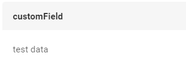
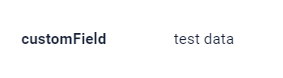
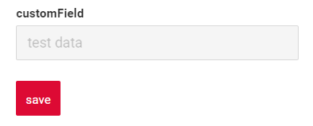
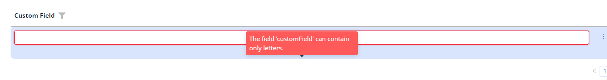
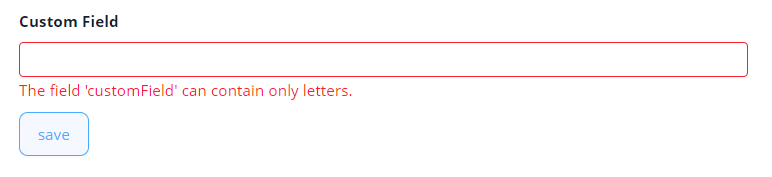

# Input
`Field Input` component is used for text editing. It allows editing and displaying single-line text.
## Basics
[:material-play-circle: Live Sample]({{ external_links.code_samples }}/ui/#/screen/InputBasic){:target="_blank"} ·
[:fontawesome-brands-github: GitHub]({{ external_links.github_ui }}/{{ external_links.github_branch }}/src/main/java/org/demo/documentation/input/basic){:target="_blank"}
### How does it look?

=== "List widget"
    
=== "Info widget"
    
=== "Form widget"
    


### How to add?
??? Example
    **Step1** Add **String** field  to corresponding **DataResponseDTO**.

    ```java
    public class InputDTO extends DataResponseDTO {
    
        @SearchParameter(name = "customField")
        private String customField;
    
        public InputDTO(InputEntity entity) {
        this.customField = entity.getCustomField();
        }
    }
    ```
    **Step2** Add **String** field  to corresponding **BaseEntity**.

    ```java
    public class InputEntity extends BaseEntity {
    
        private String customField;
    }
    ```
    === "List widget"
        **Step3** Add to **_.widget.json_**.

        ```json
        {
          "name": "InputInfo",
          "title": "Info Title",
          "type": "Info",
          "bc": "myBcInput",
          "fields": [
            {
              "label": "custom Field",
              "key": "customField",
              "type": "input"
            }
          ],
          "options": {
            "layout": {
              "rows": [
                {
                  "cols": [
                    {
                      "fieldKey": "customField",
                      "span": 12
                    }
                  ]
                }
              ]
            }
          }
        }
        ```


    === "Info widget"
        **Step3** Add to **_.widget.json_**.

        ```json
        {
          "name": "InputList",
          "title": "List Title",
          "type": "List",
          "bc": "myBcInput",
          "fields": [
            {
              "title": "custom Field",
              "key": "customField",
              "type": "input"
            }
          ]
        }
        ```

    === "Form widget"
        **Step3** Add to **_.widget.json_**.

        ```json
        {
          "name": "InputForm",
          "title": "Form Title",
          "type": "Form",
          "bc": "myBcInput",
          "fields": [
            {
              "label": "custom Field",
              "key": "customField", 
              "type": "input"
            }
          ],
          "options": {
            "layout": {
              "rows": [
                {
                  "cols": [
                    {
                      "fieldKey": "customField",
                      "span": 12
                    }
                  ]
                }
              ]
            }
          }
        }
        ```

## Placeholder
[:material-play-circle: Live Sample]({{ external_links.code_samples }}/ui/#/screen/InputPlaceholder){:target="_blank"} ·
[:fontawesome-brands-github: GitHub]({{ external_links.github_ui }}/{{ external_links.github_branch }}/src/main/java/org/demo/documentation/input/placeholder){:target="_blank"}


`Placeholder` allows you to provide a concise hint, guiding users on the expected value. This hint is displayed before any user input. It can be calculated based on business logic of application.
### How does it look?
=== "List widget"
    
=== "Info widget"
    _not applicable_
=== "Form widget"
    
### How to add?
??? Example

    Add **fields.setPlaceholder** to corresponding **FieldMetaBuilder**.
    
    ```java
    
    public class InputMeta extends FieldMetaBuilder<InputDTO> {
    
      @Override
      public void buildRowDependentMeta(RowDependentFieldsMeta<InputDTO> fields, InnerBcDescription bcDescription,
        Long id, Long parentId) {
        fields.setPlaceholder(InputDTO_.customField, "placeholder text");
      }
    ```
    === "List widget"
        **Works for List.**
    === "Info widget"
        **_not applicable_**
    === "Form widget"
        **Works for Form.**

## Color
`Color` allows you to specify a field color. It can be calculated based on business logic of application

`Calculated color`:
[:material-play-circle: Live Sample]({{ external_links.code_samples }}/ui/#/screen/InputColor){:target="_blank"} ·
[:fontawesome-brands-github: GitHub]({{ external_links.github_ui }}/{{ external_links.github_branch }}/src/main/java/org/demo/documentation/input/color){:target="_blank"}

`Constant color`:
[:material-play-circle: Live Sample]({{ external_links.code_samples }}/ui/#/screen/MoneyColorConst){:target="_blank"} ·
[:fontawesome-brands-github: GitHub]({{ external_links.github_ui }}/{{ external_links.github_branch }}/src/main/java/org/demo/documentation/input/colorconst){:target="_blank"}
 
### How does it look?
=== "List widget"
    
=== "Info widget"
    
=== "Form widget"
    _not applicable_


### How to add?
??? Example
    === "Calculated color"
        **Step 1**   Add `custom field for color` to corresponding **DataResponseDTO**. The field can contain a HEX color or be null.                    
        ```java
        public class InputDTO extends DataResponseDTO {
        
                  private String customField;    
                  private String customFieldColor;
                
                  public InputDTO(Input entity) {
                    this.customField = entity.getCustomField();
                    this.customFieldColor = "#eda6a6";
                  }        
                }
        ```
        === "List widget"
            **Step 2** Add **"bgColorKey"** :  `custom field for color`  to .widget.json.
            ```json
            {
              "name": "InputInfo",
              "title": "Info Title",
              "type": "Info",
              "bc": "myBcInput",
              "fields": [
                {
                  "label": "custom Field",
                  "key": "customField",
                  "type": "input",
                  "bgColorKey": "customFieldColor"
                }
              ],
              "options": {
                "layout": {
                  "rows": [
                    {
                      "cols": [
                        {
                          "fieldKey": "customField",
                          "span": 12
                        }
                      ]
                    }
                  ]
                }
              }
            }
            ```
        === "Info widget"
            **Step 2** Add **"bgColorKey"** :  `custom field for color`  to .widget.json.
            ```json
            {
              "name": "InputInfo",
              "title": "Info Title",
              "type": "Info",
              "bc": "myBcInput",
              "fields": [
                {
                  "label": "custom Field",
                  "key": "customField",
                  "type": "input",
                  "bgColorKey": "customFieldColor"
                }
              ],
              "options": {
                "layout": {
                  "rows": [
                    {
                      "cols": [
                        {
                          "fieldKey": "customField",
                          "span": 12
                        }
                      ]
                    }
                  ]
                }
              }
            }
            ```
        === "Form widget"
            _not applicable_    
    
    === "Constant color"
        === "List widget"
            Add **"bgColor"** :  `HEX color`  to .widget.json.
            ```json
            {
              "name": "InputInfo",
              "title": "Info Title",
              "type": "Info",
              "bc": "myBcInput",
              "fields": [
                {
                  "label": "custom Field",
                  "key": "customField",
                  "type": "input",
                  "bgColor": "#eda6a6"
                }
              ],
              "options": {
                "layout": {
                  "rows": [
                    {
                      "cols": [
                        {
                          "fieldKey": "customField",
                          "span": 12
                        }
                      ]
                    }
                  ]
                }
              }
            }
            ```
        === "Info widget"
            Add **"bgColor"** :  `HEX color`  to .widget.json.
            ```json
            {
              "name": "InputInfo",
              "title": "Info Title",
              "type": "Info",
              "bc": "myBcInput",
              "fields": [
                {
                  "label": "custom Field",
                  "key": "customField",
                  "type": "input",
                  "bgColor": "#eda6a6"
                }
              ],
              "options": {
                "layout": {
                  "rows": [
                    {
                      "cols": [
                        {
                          "fieldKey": "customField",
                          "span": 12
                        }
                      ]
                    }
                  ]
                }
              }
            }
            ```
        === "Form widget"
            _not applicable_        

## Readonly/Editable
`Readonly/Editable` indicates whether the field can be edited or not. It can be calculated based on business logic of application

`Editable`
[:material-play-circle: Live Sample]({{ external_links.code_samples }}/ui/#/screen/InputBasic){:target="_blank"} ·
[:fontawesome-brands-github: GitHub]({{ external_links.github_ui }}/{{ external_links.github_branch }}/src/main/java/org/demo/documentation/input/basic){:target="_blank"}

`Readonly`
[:material-play-circle: Live Sample]({{ external_links.code_samples }}/ui/#/screen/InputCreateEdit){:target="_blank"} ·
[:fontawesome-brands-github: GitHub]({{ external_links.github_ui }}/{{ external_links.github_branch }}/src/main/java/org/demo/documentation/input/ro){:target="_blank"}

### How does it look?
=== "Editable"
    === "List widget"
        
    === "Info widget"
        _not applicable_
    === "Form widget"
        
=== "Readonly"
    === "List widget"
        
    === "Info widget"
        
    === "Form widget"
        
### How to add?
??? Example
    === "Editable"
          **Step1** Add mapping DTO->entity to corresponding **VersionAwareResponseService**.
            ```java
            
            public class InputService extends VersionAwareResponseService<InputDTO, Input> {
     
                @Override
                protected ActionResultDTO<InputDTO> doUpdateEntity(Input entity, InputDTO data, BusinessComponent bc) {
                    if (data.isFieldChanged(InputDTO_.customField)) {
                        entity.setCustomField(data.getCustomField());
                    }
                    return new ActionResultDTO<>(entityToDto(bc, entity));
                }
          
            ```
        **Step3** Add **fields.setEnabled** to corresponding **FieldMetaBuilder**.

        ```java
        public class InputMeta extends FieldMetaBuilder<InputDTO> {
          @Override
          public void buildRowDependentMeta(RowDependentFieldsMeta<InputDTO> fields, InnerBcDescription bcDescription,
                                            Long id, Long parentId) {
            fields.setEnabled(InputDTO_.customField);
          }
        }
        ```
        === "List widget"
            **Works for List.**
        === "Info widget"
            **_not applicable_**
        === "Form widget"
            **Works for Form.**

    === "Readonly"

        **Option 1** Enabled by default.

        ```java
        public class InputMeta extends FieldMetaBuilder<InputDTO> {
          @Override
          public void buildRowDependentMeta(RowDependentFieldsMeta<InputDTO> fields, InnerBcDescription bcDescription,
                                            Long id, Long parentId) {
        
          }
        }
        ```

        **Option 2** `Not recommended.` Property fields.setDisabled() overrides the enabled field if you use after property fields.setEnabled.

        === "List widget"
            **Works for List.**
        === "Info widget"
            **_not applicable_**
        === "Form widget"
            **Works for Form.**

## Filtering
[:material-play-circle: Live Sample]({{ external_links.code_samples }}/ui/#/screen/InputFiltration){:target="_blank"} ·
[:fontawesome-brands-github: GitHub]({{ external_links.github_ui }}/{{ external_links.github_branch }}/src/main/java/org/demo/documentation/input/filtration){:target="_blank"}

`Filtering` allows you to search data based on criteria.
For `Input field` filtering is case-insensitive and retrieves records containing the specified value at any position (similar to SQL ```Like %value%``` ). 
### How does it look?
=== "List widget"
    
=== "Info widget"
    _not applicable_
=== "Form widget"
    _not applicable_

### How to add?
??? Example
    === "List widget"
        **Step 1** Add **@SearchParameter** to corresponding **DataResponseDTO**. (Advanced customization [SearchParameter](/advancedCustomization/element/searchparameter/searchparameter))

        ```java
        public class InputDTO extends DataResponseDTO {
        
          @SearchParameter(name = "customField")
          private String customField;
        ```

        **Step 2**  Add **fields.enableFilter** to corresponding **FieldMetaBuilder**.

        ```java
 
        public class InputMeta extends FieldMetaBuilder<InputDTO> {
        
          @Override
          public void buildIndependentMeta(FieldsMeta<InputDTO> fields, InnerBcDescription bcDescription, Long parentId) {
            fields.enableFilter(InputDTO_.customField);
          }
        
        }
        ```

    === "Info widget"
        _not applicable_
    === "Form widget"
        _not applicable_

## Drilldown
[:material-play-circle: Live Sample]({{ external_links.code_samples }}/ui/#/screen/InputDrilldown){:target="_blank"} ·
[:fontawesome-brands-github: GitHub]({{ external_links.github_ui }}/{{ external_links.github_branch }}/src/main/java/org/demo/documentation/input/drilldown){:target="_blank"}

`DrillDown` allows you to navigate to another view by simply tapping on it. Target view and other drill-down parts can be calculated based on business logic of application

Also, it optionally allows you to filter data on target view before it will be opened `see more` [DrillDown](/features/element/drillDown/drillDown)

### How does it look?
=== "List widget"
    
=== "Info widget"
    
=== "Form widget"
    Сlick on clip 

    
### How to add?
??? Example
    **Option 1**
    
    
    `Step 1` Add [fields.setDrilldown](/features/element/drillDown/drillDown) to corresponding **FieldMetaBuilder**.
    ```java
    public class InputMeta extends FieldMetaBuilder<InputDTO> {
    
      @Override
      public void buildRowDependentMeta(RowDependentFieldsMeta<InputDTO> fields, InnerBcDescription bcDescription,
        Long id, Long parentId) {
       
        fields.setDrilldown(
          InputDTO_.customField,
          DrillDownType.INNER,
          "/screen/input/view/inputform/" + PlatformInputController.myBcInput + "/" + id
        );
      }            
    }
    ```
    === "List widget"
        `Step 2` Add **"drillDown": "true"**  to .widget.json.
            ```json
            {
              "name": "InputList",
              "title": "List Title",
              "type": "List",
              "bc": "myBcInput",
              "fields": [
                {
                  "title": "custom Field",
                  "key": "customField",
                  "type": "input",
                  "drillDown": "true"
                }
              ]
            }
            ```
        **Option 2**
           Add **"drillDownKey"** :  `custom field`  to .widget.json. See more [Drilldown](/advancedCustomization_drillDown) 

    === "Info widget"
        `Step 2` Add **"drillDown": "true"**  to .widget.json.
        
        ```json
        {
          "name": "InputInfo",
          "title": "Info Title",
          "type": "Info",
          "bc": "myBcInput",
          "fields": [
            {
              "label": "custom Field",
              "key": "customField",
              "type": "input",
              "drillDown": "true"
            }
          ],
          "options": {
            "layout": {
              "rows": [
                {
                  "cols": [
                    {
                      "fieldKey": "customField",
                      "span": 12
                    }
                  ]
                }
              ]
            }
          }
        }
        ```
        **Option 2**
           Add **"drillDownKey"** :  `custom field`  to .widget.json. See more [Drilldown](/advancedCustomization_drillDown) 

    === "Form widget"
        `Step 2` Add **"drillDown": "true"**  to .widget.json.
            ```json
            {
              "name": "InputForm",
              "title": "Form Title",
              "type": "Form",
              "bc": "myBcInput",
              "fields": [
                {
                  "label": "custom Field",
                  "key": "customField",
                  "type": "input",
                  "drillDown": "true"
                }
              ],
              "options": {
                "layout": {
                  "rows": [
                    {
                      "cols": [
                        {
                          "fieldKey": "customField",
                          "span": 12
                        }
                      ]
                    }
                  ]
                }
              }
            }
            ```
        **Option 2**
           Add **"drillDownKey"** :  `custom field`  to .widget.json. See more [Drilldown](/advancedCustomization_drillDown) 

[Advanced customization](/advancedCustomization_drillDown)

## Validation
`Validation` allows you to check any business rules for user-entered value. There are types of validation:

1) Exception:Displays a message to notify users about technical or business errors.

   `Business Exception`:
   [:material-play-circle: Live Sample]({{ external_links.code_samples }}/ui/#/screen/myexample67/view/InputValidationBusinessException){:target="_blank"} ·
   [:fontawesome-brands-github: GitHub]({{ external_links.github_ui }}/{{ external_links.github_branch }}/src/main/java/org/demo/documentation/input/validationbusinessex){:target="_blank"}

   `Runtime Exception`:
   [:material-play-circle: Live Sample]({{ external_links.code_samples }}/ui/#/screen/InputValidationRuntimeException){:target="_blank"} ·
   [:fontawesome-brands-github: GitHub]({{ external_links.github_ui }}/{{ external_links.github_branch }}/src/main/java/org/demo/documentation/input/validationruntimeex){:target="_blank"}
   
2) Confirm: Presents a dialog with an optional message, requiring user confirmation or cancellation before proceeding.

   [:material-play-circle: Live Sample]({{ external_links.code_samples }}/ui/#/screen/InputValidation){:target="_blank"} ·
   [:fontawesome-brands-github: GitHub]({{ external_links.github_ui }}/{{ external_links.github_branch }}/src/main/java/org/demo/documentation/input/validationconfirm){:target="_blank"}

3) Field level validation: shows error next to all fields, that validation failed for

   `Option 1`:
   [:material-play-circle: Live Sample]({{ external_links.code_samples }}/ui/#/screen/myexample163){:target="_blank"} ·
   [:fontawesome-brands-github: GitHub]({{ external_links.github_ui }}/{{ external_links.github_branch }}/src/main/java/org/demo/documentation/input/validationannotation){:target="_blank"}

   `Option 2`:
   [:material-play-circle: Live Sample]({{ external_links.code_samples }}/ui/#/screen/myexample326){:target="_blank"} ·
   [:fontawesome-brands-github: GitHub]({{ external_links.github_ui }}/{{ external_links.github_branch }}/src/main/java/org/demo/documentation/input/validationdynamic){:target="_blank"}


### How does it look?
=== "List widget"
    === "BusinessException"
        
    === "RuntimeException"
        
    === "Confirm"
        
    === "Field level validation"
        

=== "Info widget"
    _not applicable_ 
=== "Form widget"
    === "BusinessException"
        
    === "RuntimeException"
        
    === "Confirm"
        
    === "Field level validation"
        
### How to add?
??? Example
    === "BusinessException"
        `BusinessException` describes an error  within a business process.

        Add **BusinessException** to corresponding **VersionAwareResponseService**.

        ```java
        public class InputService extends VersionAwareResponseService<InputDTO, Input> {
 
            @Override
            protected ActionResultDTO<InputDTO> doUpdateEntity(Input entity, InputDTO data, BusinessComponent bc) {
                if (data.isFieldChanged(InputDTO_.customField)) {
                    if (StringUtils.isNotEmpty(data.getCustomField())
                            && !String.valueOf(data.getCustomField()).matches("[A-Za-z]+")
                    ) {
                        throw new BusinessException().addPopup("The field 'customField' can contain only letters.");
                    }
                    entity.setCustomField(data.getCustomField());
                }
                return new ActionResultDTO<>(entityToDto(bc, entity));
            }              
        ```
        === "List widget"
            **Works for List.**
        === "Info widget"
            **_not applicable_**
        === "Form widget"
            **Works for Form.**
    === "RuntimeException"

        `RuntimeException` describes technical error  within a business process.
        
        Add **RuntimeException** to corresponding **VersionAwareResponseService**.
        
        ```java
            @Override
            protected ActionResultDTO<InputDTO> doUpdateEntity(Input entity, InputDTO data, BusinessComponent bc) {
                if (data.isFieldChanged(InputDTO_.customField)) {
                   try {
                       //call custom function
                   }
                   catch(Exception e){
                        throw new RuntimeException("An unexpected error has occurred.");
                    }
                }
                return new ActionResultDTO<>(entityToDto(bc, entity));
            }
        ```    
        === "List widget"
            **Works for List.**
        === "Info widget"
            **_not applicable_**
        === "Form widget"
            **Works for Form.**
    === "Confirm"
        Add [PreAction.confirm](/advancedCustomization_validation) to corresponding **VersionAwareResponseService**.
        ```java
     
            public class InputService extends VersionAwareResponseService<InputDTO, Input> {

                @Override
                public Actions<InputDTO> getActions() {
                    return Actions.<InputDTO>builder()
                    .newAction()
                    .action("save", "save")
                    .withPreAction(PreAction.confirm("You want to save the value 'customField'?"))
                    .add()
                    .build();
                }
            }
        ```
        === "List widget"
            **Works for List.**
        === "Info widget"
            **_not applicable_**
        === "Form widget"
            **Works for Form.**
    === "Field level validation"
        === "Option 1"
            Add javax.validation to corresponding **DataResponseDTO**.

            Use if:

            Requires a simple fields check (javax validation)

            ```java
         
                public class MyExampleDTO extends DataResponseDTO {
                    @Pattern(regexp="[A-Za-z]+", message = "The field 'customField' can contain only letters.")
                    private String customField;
                }
            ```
            === "List widget"
                **Works for List.**
            === "Info widget"
                **_not applicable_**
            === "Form widget"
                **Works for Form.**
        === "Option 2"
            Create сustom service for business logic check.

            Use if:

            Business logic check required for fields

            `Step 1`  Create сustom method for check.
            ```java
            private void validate(BusinessComponent bc, MyExampleDTO dto) {
                BusinessError.Entity entity = new BusinessError.Entity(bc);
                if (!String.valueOf(dto.getCustomField()).matches("[A-Za-z]+")) {
                    entity.addField(MyExampleDTO_.customField.getName(), "The field 'customField' can contain only letters.");
                }
                if (!String.valueOf(dto.getCustomFieldAdditional()).matches("[A-Za-z]+")) {
                    entity.addField(MyExampleDTO_.customFieldAdditional.getName(), "The field 'CustomFieldAdditional' can contain only letters.");
                }
                if (entity.getFields().size() > 0) {
                    throw new BusinessException().setEntity(entity);
                }
            }
            ```
            `Step 2` Add сustom method for check to corresponding **VersionAwareResponseService**..
            ```java
                protected ActionResultDTO<MyExampleDTO> doUpdateEntity(MyEntity entity, MyExampleDTO data, BusinessComponent bc) {
                    validateFields(bc, data);
            ```
            === "List widget"
                Add custom action check to **_.widget.json_**.
                ```json
                {
                  "name": "MyExampleList",
                  "title": "List title",
                  "type": "List",
                  "bc": "myExampleBc",
                  "fields": [
                    {
                      "title": "Custom Field",
                      "key": "customField",
                      "type": "input"
                    },
                    {
                      "title": "Custom Field Additional",
                      "key": "customFieldAdditional",
                      "type": "input"
                    }
                  ]
                }
                ```               
            === "Info widget"
                ```json
                {
                  "name": "MyExampleInfo",
                  "title": "Info title",
                  "type": "Info",
                  "bc": "myExampleBc",
                  "fields": [
                    {
                      "label": "Custom Field",
                      "key": "customField",
                      "type": "input"
                    },
                    {
                      "label": "Custom Field Additional",
                      "key": "customFieldAdditional",
                      "type": "input"
                    }
                  ],
                  "options": {
                    "layout": {
                      "rows": [
                        {
                          "cols": [
                            {
                              "fieldKey": "customFieldAdditional",
                              "span": 12
                            }
                          ]
                        },
                        {
                          "cols": [
                            {
                              "fieldKey": "customField",
                              "span": 12
                            }
                          ]
                        }
                      ]
                    }
                  }
                }
                ```   
            === "Form widget"
                ```json
                {
                  "name": "MyExampleForm",
                  "title": "Form title",
                  "type": "Form",
                  "bc": "myExampleBc",
                  "fields": [
                    {
                      "label": "Custom Field",
                      "key": "customField",
                      "type": "input"
                    },
                    {
                      "label": "Custom Field Additional",
                      "key": "customFieldAdditional",
                      "type": "input"
                    }
                  ],
                  "options": {
                    "layout": {
                      "rows": [
                        {
                          "cols": [
                            {
                              "fieldKey": "customFieldAdditional",
                              "span": 12
                            }
                          ]
                        },
                        {
                          "cols": [
                            {
                              "fieldKey": "customField",
                              "span": 12
                            }
                          ]
                        }
                      ]
                    }
                  }
                }
                ```
 
## Sorting
[:material-play-circle: Live Sample]({{ external_links.code_samples }}/ui/#/screen/InputSort){:target="_blank"} ·
[:fontawesome-brands-github: GitHub]({{ external_links.github_ui }}/{{ external_links.github_branch }}/src/main/java/org/demo/documentation/input/sorting){:target="_blank"}

`Sorting` allows you to sort data in ascending or descending order.
`Input field` is a text field, so lexicographic sorting is used for it

### How does it look?
=== "List widget"
    
=== "Info widget"
    _not applicable_
=== "Form widget"
    _not applicable_
### How to add?
??? Example
    === "List widget"
        Enabled by default.
    === "Info widget"
        _not applicable_
    === "Form widget"
        _not applicable_

## Required
[:material-play-circle: Live Sample]({{ external_links.code_samples }}/ui/#/screen/InputRequired){:target="_blank"} ·
[:fontawesome-brands-github: GitHub]({{ external_links.github_ui }}/{{ external_links.github_branch }}/src/main/java/org/demo/documentation/input/required){:target="_blank"}

`Required` allows you to denote, that this field must have a value provided. By default, `Input field` is not required

### How does it look?
=== "List widget"
    
=== "Info widget"
    _not applicable_
=== "Form widget"
    
### How to add?
??? Example
     Add **fields.setRequired** to corresponding **FieldMetaBuilder**.

    ```java

    public class InputMeta extends FieldMetaBuilder<InputDTO> {
    
      @Override
      public void buildRowDependentMeta(RowDependentFieldsMeta<InputDTO> fields, InnerBcDescription bcDescription,
        Long id, Long parentId) {
        fields.setEnabled(InputDTO_.customField);
        fields.setRequired(InputDTO_.customField);
      }
    ```
    === "List widget"
        **Works for List.**
    === "Info widget"
        **_not applicable_**
    === "Form widget"
        **Works for Form.**

## Additional properties
### <a id="maxInput">maxInput</a>
[:material-play-circle: Live Sample]({{ external_links.code_samples }}/ui/#/screen/MaxInput){:target="_blank"} ·
[:fontawesome-brands-github: GitHub]({{ external_links.github_ui }}/{{ external_links.github_branch }}/src/main/java/org/demo/documentation/input/additionalproperties){:target="_blank"}
Specifies the maximum number of characters to enter

### How does it look?
=== "List widget"
    
=== "Info widget"
    _not applicable_
=== "Form widget"
    

### How to add?
??? Example
    === "List widget"
        Add **maxInput** to **_.widget.json_**.
        ```json
            {
              "name": "InputList",
              "title": "List title",
              "type": "List",
              "bc": "myBcInput",
              "fields": [
                {
                  "title": "custom Field",
                  "key": "customField",
                  "type": "input",
                  "maxInput" : 2
                }
              ]
            }
        ```  
    === "Info widget"
        **_not applicable_**
    === "Form widget"
        Add **maxInput** to **_.widget.json_**.
        ```json
        {
          "name": "MaxInputForm",
          "title": "Form title",
          "type": "Form",
          "bc": "maxInput",
          "fields": [
            {
              "label": "custom Field",
              "key": "customField",
              "type": "input",
              "maxInput" : 2
            }
          ],
          "options": {
            "layout": {
              "rows": [
                {
                  "cols": [
                    {
                      "fieldKey": "customField",
                      "span": 12
                    }
                  ]
                }
              ]
            }
          }
        }
        ``` 