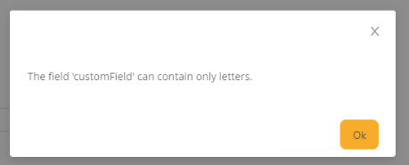

# Input

`Field Input` is a component for text editing. It can be used for editing and displaying single line text.
## Basics
### How does it look?

=== "List widget"
    
=== "Info widget"
    
=== "Form widget"
    


### How to add?
??? Example
    **Step1** Add field **String** to corresponding **DataResponseDTO**.

    ```java
    public class InputDTO extends DataResponseDTO {
    
    private String customField;
    
        public InputDTO(InputEntity entity) {
        this.customField = entity.getCustomField();
        }
    }
    ```
    **Step2** Add field **String** to corresponding **BaseEntity**.

    ```java
    public class InputEntity extends BaseEntity {
    
        private String customField;
    }
    ```
    === "List widget"
        **Step3** Add to **_.widget.json_**.

        ```json
        {
          "name": "InputInfo",
          "title": "Info Title",
          "type": "Info",
          "bc": "input",
          "fields": [
            {
              "label": "custom Field",
              "key": "customField",
              "type": "input"
            }
          ],
          "options": {
            "layout": {
              "rows": [
                {
                  "cols": [
                    {
                      "fieldKey": "customField",
                      "span": 12
                    }
                  ]
                }
              ]
            }
          }
        }
        ```


    === "Info widget"
        **Step3** Add to **_.widget.json_**.

        ```json
        {
          "name": "InputList",
          "title": "List Title",
          "type": "List",
          "bc": "input",
          "fields": [
            {
              "title": "custom Field",
              "key": "customField",
              "type": "input"
            }
          ],
          "options": {
            "actionGroups": {
            }
          }
        }
        ```

    === "Form widget"
        **Step3** Add to **_.widget.json_**.

        ```json
        {
          "name": "InputForm",
          "title": "Form Title",
          "type": "Form",
          "bc": "input",
          "fields": [
            {
              "label": "custom Field",
              "key": "customField", 
              "type": "input"
            }
          ],
          "options": {
            "layout": {
              "rows": [
                {
                  "cols": [
                    {
                      "fieldKey": "customField",
                      "span": 12
                    }
                  ]
                }
              ]
            }
          }
        }
        ```

## Placeholder
`The placeholder` specifies a short hint that describes the expected value of an input field. The hint is displayed in the input field before the user enters a value.
### How does it look?
=== "List widget"
    _not applicable_
=== "Info widget"
    _not applicable_
=== "Form widget"
    
### How to add?
??? Example
    === "List widget"
        _not applicable_
    === "Info widget"
        _not applicable_
    === "Form widget"
        Add **fields.setPlaceholder** to corresponding **FieldMetaBuilder**.

        ```java
 
        public class InputMeta extends FieldMetaBuilder<InputDTO> {
        
          @Override
          public void buildRowDependentMeta(RowDependentFieldsMeta<InputDTO> fields, InnerBcDescription bcDescription,
            Long id, Long parentId) {
            fields.setPlaceholder(InputDTO_.customField, "placeholder text");
          }
        ```
## Color
`Color`  is an element of user interface that lets an user to specify a field color. 
It can be calculated.
 
### How does it look?
=== "List widget"
    

=== "Info widget"
    

=== "Form widget"
    _not applicable_


### How to add?
??? Example
    === "List widget"
        === "Calculated color"
            It can be calculated.

            **Step 1**   Add `custom field` for color to corresponding **DataResponseDTO**.                    
            ```java
            public class InputDTO extends DataResponseDTO {
            
                      private String customField;    
                      private String customFieldColor;
                    
                      public InputDTO(Input entity) {
                        this.customField = entity.getCustomField();
                        this.customFieldColor = "#eda6a6";
                      }        
                    }
            ```
    
            **Step 2** Add **"bgColorKey"** :  `custom field for color`  to .widget.json.
            ```json
            {
              "name": "InputInfo",
              "title": "Info Title",
              "type": "Info",
              "bc": "input",
              "fields": [
                {
                  "label": "custom Field",
                  "key": "customField",
                  "type": "input",
                  "bgColorKey": "customFieldColor"
                }
              ],
              "options": {
                "layout": {
                  "rows": [
                    {
                      "cols": [
                        {
                          "fieldKey": "customField",
                          "span": 12
                        }
                      ]
                    }
                  ]
                }
              }
            }
            ```
        === "Constant color"
            Add **"bgColor"** :  `custom color`  to .widget.json.
            ```json
            {
              "name": "InputInfo",
              "title": "Info Title",
              "type": "Info",
              "bc": "input",
              "fields": [
                {
                  "label": "custom Field",
                  "key": "customField",
                  "type": "input",
                  "bgColor": "#eda6a6"
                }
              ],
              "options": {
                "layout": {
                  "rows": [
                    {
                      "cols": [
                        {
                          "fieldKey": "customField",
                          "span": 12
                        }
                      ]
                    }
                  ]
                }
              }
            }
            ```

    === "Info widget"
        === "Calculated color"
            It can be calculated.

            **Step 1**   Add `custom field` for color to corresponding **DataResponseDTO**.                    
            ```java
            public class InputDTO extends DataResponseDTO {
    
              private String customField;    
              private String customFieldColor;
            
              public InputDTO(Input entity) {
                this.customField = entity.getCustomField();
                this.customFieldColor = "#eda6a6";
              }        
            }
            ```
            **Step 2** Add **"bgColorKey"** :  `custom field for color`  to .widget.json.
            ```json
            {
              "name": "InputInfo",
              "title": "Info Title",
              "type": "Info",
              "bc": "input",
              "fields": [
                {
                  "label": "custom Field",
                  "key": "customField",
                  "type": "input",
                  "bgColorKey": "customFieldColor"
                }
              ],
              "options": {
                "layout": {
                  "rows": [
                    {
                      "cols": [
                        {
                          "fieldKey": "customField",
                          "span": 12
                        }
                      ]
                    }
                  ]
                }
              }
            }
            ```
        === "Constant color"
            Add **"bgColor"** :  `custom color`  to .widget.json.
            ```json
            {
              "name": "InputInfo",
              "title": "Info Title",
              "type": "Info",
              "bc": "input",
              "fields": [
                {
                  "label": "custom Field",
                  "key": "customField",
                  "type": "input",
                  "bgColor": "#eda6a6"
                }
              ],
              "options": {
                "layout": {
                  "rows": [
                    {
                      "cols": [
                        {
                          "fieldKey": "customField",
                          "span": 12
                        }
                      ]
                    }
                  ]
                }
              }
            }
            ```

    === "Form widget"
        _not applicable_    
      

## Readonly/Editable
`Readonly/Editable` indicates that the field can be edited or not.It can be calculated.

### How to add?
??? Example
    === "List widget"
        === "Editable"
            **Step1** Add mapping entity->DTO to corresponding **DataResponseDTO**.
            ```java
            public class InputDTO extends DataResponseDTO {
            
                private String customField;
            
                public InputDTO(Input entity) {
                    this.customField = entity.getCustomField();
                }
            }
            ```

            **Step2** Add mapping DTO->entity to corresponding **VersionAwareResponseService**.
                ```java
                
                public class InputService extends VersionAwareResponseService<InputDTO, Input> {
         
                    @Override
                    protected ActionResultDTO<InputDTO> doUpdateEntity(Input entity, InputDTO data, BusinessComponent bc) {
                        if (data.isFieldChanged(InputDTO_.customField)) {
                            entity.setCustomField(data.getCustomField());
                        }
                        return new ActionResultDTO<>(entityToDto(bc, entity));
                    }
              
                ```
            **Step3** Add **fields.setEnabled** to corresponding **FieldMetaBuilder**.

            ```java
            public class InputMeta extends FieldMetaBuilder<InputDTO> {
              @Override
              public void buildRowDependentMeta(RowDependentFieldsMeta<InputDTO> fields, InnerBcDescription bcDescription,
                                                Long id, Long parentId) {
                fields.setEnabled(
                  InputDTO_.customField
                );
              }
            }
            ```
        === "Readonly"

            **Option 1** Enabled by default.

            ```java
            public class InputMeta extends FieldMetaBuilder<InputDTO> {
              @Override
              public void buildRowDependentMeta(RowDependentFieldsMeta<InputDTO> fields, InnerBcDescription bcDescription,
                                                Long id, Long parentId) {
            
              }
            }
            ```

            **Option 2** `Not recommended.` Property fields.setDisabled() overrides the enable field if you use after property fields.setEnabled.

    === "Info widget"
        _not applicable_
    === "Form widget"
        === "Editable"
        
            **Step1** Add mapping entity->DTO to corresponding **DataResponseDTO**.
            ```java
            public class InputDTO extends DataResponseDTO {
            
                private String customField;
            
                public InputDTO(Input entity) {
                    this.customField = entity.getCustomField();
                }
            }
            ```

            **Step2** Add mapping DTO->entity to corresponding **VersionAwareResponseService**.
            ```java
            
            public class InputService extends VersionAwareResponseService<InputDTO, Input> {
     
                @Override
                protected ActionResultDTO<InputDTO> doUpdateEntity(Input entity, InputDTO data, BusinessComponent bc) {
                    if (data.isFieldChanged(InputDTO_.customField)) {
                        entity.setCustomField(data.getCustomField());
                    }
                    return new ActionResultDTO<>(entityToDto(bc, entity));
                }
          
            ```
            **Step3** Add **fields.setEnabled** to corresponding **FieldMetaBuilder**.

            ```java
            public class InputMeta extends FieldMetaBuilder<InputDTO> {
              @Override
              public void buildRowDependentMeta(RowDependentFieldsMeta<InputDTO> fields, InnerBcDescription bcDescription,
                                                Long id, Long parentId) {
                fields.setEnabled(
                  InputDTO_.customField
                );
              }
            }
            ```
        === "Readonly"

            **Option 1** Enabled by default.

            ```java
            public class InputMeta extends FieldMetaBuilder<InputDTO> {
              @Override
              public void buildRowDependentMeta(RowDependentFieldsMeta<InputDTO> fields, InnerBcDescription bcDescription,
                                                Long id, Long parentId) {
            
              }
            }
            ```

            **Option 2** `Not recommended.` Property fields.setDisabled() overrides the enable field if you use after property fields.setEnabled.

## Filtration
`Filtration` is used to filter data according to specified criteria.
It retrieves all records where the value contains "value from filter" at any position(e.g. %Like%). Filtration function is not case-sensitive.
### How does it look?
=== "List widget"
    
=== "Info widget"
    _not applicable_
=== "Form widget"
    _not applicable_

### How to add?
??? Example
    === "List widget"
        **Step 1** Add **@SearchParameter** to corresponding **DataResponseDTO**. (Advanced customization [SearchParameter](/advancedCustomization_filtration)

        ```java
        public class InputDTO extends DataResponseDTO {
        
          @SearchParameter(name = "customField")
          private String customField;
        ```

        **Step 2**  Add **fields.enableFilter** to corresponding **FieldMetaBuilder**.

        ```java
 
        public class InputMeta extends FieldMetaBuilder<InputDTO> {
        
          @Override
          public void buildIndependentMeta(FieldsMeta<InputDTO> fields, InnerBcDescription bcDescription, Long parentId) {
            fields.enableFilter(InputDTO_.customField);
          }
        
        }
        ```

    === "Info widget"
        _not applicable_
    === "Form widget"
        _not applicable_

## Drilldown
`DrillDown` lets the user to navigate to another view by tapping it.

`see more` [DrillDown](/features/element/drillDown/drillDown)

### How does it look?
=== "List widget"
    
=== "Info widget"
    
=== "Form widget"
    Сlick on clip 

    
### How to add?
??? Example
    === "List widget"
        **Option 1**

        `Step 1` For visual add **"drillDown": "true"**  to .widget.json.
            ```json
            {
              "name": "InputList",
              "title": "List Title",
              "type": "List",
              "bc": "input",
              "fields": [
                {
                  "title": "custom Field",
                  "key": "customField",
                  "type": "input",
                  "drillDown": "true"
                }
              ],
              "options": {
                "actionGroups": {
                }
              }
            }
            ```

        `Step 2` Add [fields.setDrilldown](/features/element/drillDown/drillDown) to corresponding **FieldMetaBuilder**.
            ```java
            public class InputMeta extends FieldMetaBuilder<InputDTO> {
            
              @Override
              public void buildRowDependentMeta(RowDependentFieldsMeta<InputDTO> fields, InnerBcDescription bcDescription,
                Long id, Long parentId) {
               
                fields.setDrilldown(
                  InputDTO_.customField,
                  DrillDownType.INNER,
                  "/screen/input/view/inputinfo/" + PlatformInputController.Input + "/" + id
                );
              }            
            }
            ```

        **Option 2**
           Add **"drillDownKey"** :  `custom field`  to .widget.json. see more [Drilldown](/advancedCustomization_drillDown) 
 
    === "Info widget"

        **Option 1**

        `Step 1` For visual add **"drillDown": "true"**  to .widget.json.
        
        ```json
        {
          "name": "InputInfo",
          "title": "Info Title",
          "type": "Info",
          "bc": "input",
          "fields": [
            {
              "label": "custom Field",
              "key": "customField",
              "type": "input",
              "drillDown": "true"
            }
          ],
          "options": {
            "layout": {
              "rows": [
                {
                  "cols": [
                    {
                      "fieldKey": "customField",
                      "span": 12
                    }
                  ]
                }
              ]
            }
          }
        }
        ```
        `Step 2`Add [fields.setDrilldown](/features/element/drillDown/drillDown) to corresponding **FieldMetaBuilder**. 

        ```java
        public class InputMeta extends FieldMetaBuilder<InputDTO> {
        
          @Override
          public void buildRowDependentMeta(RowDependentFieldsMeta<InputDTO> fields, InnerBcDescription bcDescription,
            Long id, Long parentId) {
           
            fields.setDrilldown(
              InputDTO_.customField,
              DrillDownType.INNER,
                  "/screen/input/view/inputinfo/" + PlatformInputController.Input + "/" + id
            );
          }            
        }
        ```
        **Option 2**
           Add **"drillDownKey"** :  `custom field`  to .widget.json. see more [Drilldown](/advancedCustomization_drillDown) 
 
    === "Form widget"

        **Option 1**

        `Step 1` For visual add **"drillDown": "true"**  to .widget.json.
            ```json
            {
              "name": "InputForm",
              "title": "Form Title",
              "type": "Form",
              "bc": "input",
              "fields": [
                {
                  "label": "custom Field",
                  "key": "customField",
                  "type": "input",
                  "drillDown": "true"
                }
              ],
              "options": {
                "layout": {
                  "rows": [
                    {
                      "cols": [
                        {
                          "fieldKey": "customField",
                          "span": 12
                        }
                      ]
                    }
                  ]
                }
              }
            }
            ```
        `Step 2`Add [fields.setDrilldown](/features/element/drillDown/drillDown) to corresponding **FieldMetaBuilder**. 

        ```java
        public class InputMeta extends FieldMetaBuilder<InputDTO> {
        
          @Override
          public void buildRowDependentMeta(RowDependentFieldsMeta<InputDTO> fields, InnerBcDescription bcDescription,
            Long id, Long parentId) {
           
            fields.setDrilldown(
              InputDTO_.customField,
              DrillDownType.INNER,
                  "/screen/input/view/inputinfo/" + PlatformInputController.Input + "/" + id
            );
          }            
        }
        ```

        **Option 2**
           Add **"drillDownKey"** :  `custom field`  to .widget.json. see more [Drilldown](/advancedCustomization_drillDown) 

[Advanced customization](/advancedCustomization_drillDown)
## Validation
`Validation` is designed to check values entered into visual components.
Validation can be of two types:

1) Exception is message about technical or business errors.

2) Confirm  is designed to display a dialog with an optional message, and to wait until the user either confirms or cancels the dialog.
### How does it look?
=== "List widget"
    === "BusinessException"
        
    === "RuntimeException"
        
    === "Confirm"
        
=== "Info widget"
    _not applicable_ 
=== "Form widget"
    === "BusinessException"
        
    === "RuntimeException"
        
    === "Confirm"
        

### How to add?
??? Example
    === "List widget"
        === "BusinessException"
            `BusinessException` describes an error  within a business process.
    
            Add **BusinessException** to corresponding **VersionAwareResponseService**.
    
            ```java
            public class InputService extends VersionAwareResponseService<InputDTO, Input> {
     
                @Override
                protected ActionResultDTO<InputDTO> doUpdateEntity(Input entity, InputDTO data, BusinessComponent bc) {
                    if (data.isFieldChanged(InputDTO_.customField)) {
                        entity.setCustomField(data.getCustomField());
                        if (StringUtils.isNotEmpty(data.getCustomField())
                                && !String.valueOf(data.getCustomField()).matches("[A-Za-z]+")
                        ) {
                            throw new BusinessException().addPopup("The field 'customField' can contain only letters.");
                        }
                    }
                    return new ActionResultDTO<>(entityToDto(bc, entity));
                }              
            ```

        === "RuntimeException"

            `RuntimeException` describes an error  within a business process.
            
            Add **RuntimeException** to corresponding **VersionAwareResponseService**.
            
            ```java
                @Override
                protected ActionResultDTO<InputDTO> doUpdateEntity(Input entity, InputDTO data, BusinessComponent bc) {
                    if (data.isFieldChanged(InputDTO_.customField)) {
                        entity.setCustomField(data.getCustomField());
                       try {
                           //call custom function
                       }
                       catch(Exception e){
                            throw new RuntimeException("An unexpected error has occurred.");
                        }
                    }
                    return new ActionResultDTO<>(entityToDto(bc, entity));
                }
            ```                   
        === "Confirm"
            Add [PreAction.confirm](/advancedCustomization_validation) to corresponding **VersionAwareResponseService**.
            ```java
         
                public class InputService extends VersionAwareResponseService<InputDTO, Input> {

                    @Override
                    public Actions<InputDTO> getActions() {
                        return Actions.<InputDTO>builder()
                        .newAction()
                        .action("save", "save")
                        .withPreAction(PreAction.confirm("You want to save the value 'customField'?"))
                        .add()
                        .build();
                    }
                }
            ```

    === "Info widget"
        _not applicable_ 
    === "Form widget"
        === "BusinessException"
            `BusinessException` describes an error  within a business process.

            Add **BusinessException** to corresponding **VersionAwareResponseService**.

            ```java
            public class InputService extends VersionAwareResponseService<InputDTO, Input> {
        
                @Override
                protected ActionResultDTO<InputDTO> doUpdateEntity(Input entity, InputDTO data, BusinessComponent bc) {
                    if (data.isFieldChanged(InputDTO_.customField)) {
                        entity.setCustomField(data.getCustomField());
                        if (StringUtils.isNotEmpty(data.getCustomField())
                                && !String.valueOf(data.getCustomField()).matches("[A-Za-z]+")
                        ) {
                            throw new BusinessException().addPopup("The field 'customField' can contain only letters.");
                        }
                    }
                    return new ActionResultDTO<>(entityToDto(bc, entity));
                }              
            ```

        === "RuntimeException"
            `RuntimeException` describes an error  within a business process.
            
            Add **RuntimeException** to corresponding **VersionAwareResponseService**.
            
            ```java
            @Override
            protected ActionResultDTO<InputDTO> doUpdateEntity(Input entity, InputDTO data, BusinessComponent bc) {
                if (data.isFieldChanged(InputDTO_.customField)) {
                    entity.setCustomField(data.getCustomField());
                   try {
                       //call custom function
                   }
                   catch(Exception e){
                        throw new RuntimeException("An unexpected error has occurred.");
                    }
                }
                return new ActionResultDTO<>(entityToDto(bc, entity));
            }
            ```    

        === "Confirm"
            Add [PreAction.confirm](/advancedCustomization_validation) to corresponding **VersionAwareResponseService**.
            ```java
         
                public class InputService extends VersionAwareResponseService<InputDTO, Input> {

                    @Override
                    public Actions<InputDTO> getActions() {
                        return Actions.<InputDTO>builder()
                        .newAction()
                        .action("save", "save")
                        .withPreAction(PreAction.confirm("You want to save the value 'customField'?"))
                        .add()
                        .build();
                    }
                }
            ```
## Sorting
`Sorting` function allows to sort in ascending or descending order. 
The records in descending order by default. It orders by value numbers, then by alphabet.

### How does it look?
=== "List widget"
    
=== "Info widget"
    _not applicable_
=== "Form widget"
    _not applicable_
### How to add?
=== "List widget"
    Enabled on default.
=== "Info widget"
    _not applicable_
=== "Form widget"
    _not applicable_

## Required
`Required` indicates that this field requires a value.

### How does it look?
=== "List widget"
    
=== "Info widget"
    _not applicable_
=== "Form widget"
    
### How to add?
=== "List widget"
     Add **fields.setRequired** to corresponding **FieldMetaBuilder**.

    ```java

    public class InputMeta extends FieldMetaBuilder<InputDTO> {
    
      @Override
      public void buildRowDependentMeta(RowDependentFieldsMeta<InputDTO> fields, InnerBcDescription bcDescription,
        Long id, Long parentId) {
        fields.setEnabled(InputDTO_.customField);
        fields.setRequired(InputDTO_.customField);
      }
    ```
=== "Info widget"
    _not applicable_
=== "Form widget"
     Add **fields.setRequired** to corresponding **FieldMetaBuilder**.

    ```java
    public class InputMeta extends FieldMetaBuilder<InputDTO> {
    
      @Override
      public void buildRowDependentMeta(RowDependentFieldsMeta<InputDTO> fields, InnerBcDescription bcDescription,
        Long id, Long parentId) {
        fields.setEnabled(InputDTO_.customField);
        fields.setRequired(InputDTO_.customField);
      }
    ```
