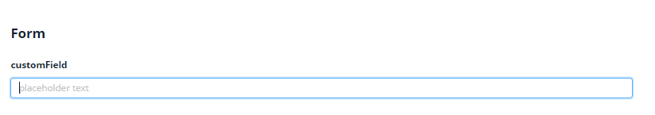
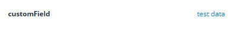
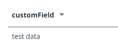

# Input
`Field Input` component is used for text editing. It allows editing and displaying single-line text.
## Basics
[:material-play-circle: Live Sample]({{ external_links.code_samples }}/ui/#/screen/InputBasic){:target="_blank"} ·
[:fontawesome-brands-github: GitHub]({{ external_links.github_ui }}/{{ external_links.github_branch }}/src/main/java/org/demo/documentation/input/basic){:target="_blank"}
### How does it look?

=== "List widget"
    
=== "Info widget"
    
=== "Form widget"
    


### How to add?
??? Example
    **Step1**  Add **String** field  to corresponding **BaseEntity**.
    ```java
    --8<--
    {{ external_links.github_raw_doc }}/input/basic/InputBasic.java
    --8<--
    ```

    **Step2** Add **String** field  to corresponding **DataResponseDTO**.
    ```java
    --8<--
    {{ external_links.github_raw_doc }}/input/basic/InputBasicDTO.java
    --8<--
    ```

    === "List widget"
        **Step3** Add to **_.widget.json_**.

        ```json
        --8<--
        {{ external_links.github_raw_doc }}/input/basic/InputBasicList.widget.json
        --8<--
        ```
    === "Info widget"
        **Step3** Add to **_.widget.json_**.
        
        ```json
        --8<--
        {{ external_links.github_raw_doc }}/input/basic/InputBasicInfo.widget.json
        --8<--
        ```

    === "Form widget"

        **Step3** Add to **_.widget.json_**.

        ```json
        --8<--
        {{ external_links.github_raw_doc }}/input/basic/InputBasicForm.widget.json
        --8<--
        ```    

## Placeholder
[:material-play-circle: Live Sample]({{ external_links.code_samples }}/ui/#/screen/InputPlaceholder){:target="_blank"} ·
[:fontawesome-brands-github: GitHub]({{ external_links.github_ui }}/{{ external_links.github_branch }}/src/main/java/org/demo/documentation/input/placeholder){:target="_blank"}


`Placeholder` allows you to provide a concise hint, guiding users on the expected value. This hint is displayed before any user input. It can be calculated based on business logic of application.
### How does it look?
=== "List widget"
    
=== "Info widget"
    _not applicable_
=== "Form widget"
    
### How to add?
??? Example

    Add **fields.setPlaceholder** to corresponding **FieldMetaBuilder**.
    ```java
    --8<--
    {{ external_links.github_raw_doc }}/input/placeholder/InputPlaceholderMeta.java:buildRowDependentMeta
    --8<--
    ```
    === "List widget"
        **Works for List.**
    === "Info widget"
        **_not applicable_**
    === "Form widget"
        **Works for Form.**

## Color
`Color` allows you to specify a field color. It can be calculated based on business logic of application

`Calculated color`:
[:material-play-circle: Live Sample]({{ external_links.code_samples }}/ui/#/screen/InputColor){:target="_blank"} ·
[:fontawesome-brands-github: GitHub]({{ external_links.github_ui }}/{{ external_links.github_branch }}/src/main/java/org/demo/documentation/input/color){:target="_blank"}

`Constant color`:
[:material-play-circle: Live Sample]({{ external_links.code_samples }}/ui/#/screen/MoneyColorConst){:target="_blank"} ·
[:fontawesome-brands-github: GitHub]({{ external_links.github_ui }}/{{ external_links.github_branch }}/src/main/java/org/demo/documentation/input/colorconst){:target="_blank"}
 
### How does it look?
=== "List widget"
    
=== "Info widget"
    
=== "Form widget"
    _not applicable_


### How to add?
??? Example
    === "Calculated color"
        **Step 1**   Add `custom field for color` to corresponding **DataResponseDTO**. The field can contain a HEX color or be null.   
        ```java
        --8<--
        {{ external_links.github_raw_doc }}/input/color/InputColorDTO.java
        --8<--
        ```

        === "List widget"
            **Step 2** Add **"bgColorKey"** :  `custom field for color`  to .widget.json.
            ```json
            --8<--
            {{ external_links.github_raw_doc }}/input/color/InputColorList.widget.json
            --8<--
            ```
        === "Info widget"
            **Step 2** Add **"bgColorKey"** :  `custom field for color`  to .widget.json.
            ```json
            --8<--
            {{ external_links.github_raw_doc }}/input/color/InputColorInfo.widget.json
            --8<--
            ```
        === "Form widget"
            _not applicable_    
    
    === "Constant color"
        === "List widget"
            Add **"bgColor"** :  `HEX color`  to .widget.json.
            ```json
            --8<--
            {{ external_links.github_raw_doc }}/input/colorconst/InputColorConstList.widget.json
            --8<--
            ```
        === "Info widget"
            Add **"bgColor"** :  `HEX color`  to .widget.json.
            ```json
            --8<--
            {{ external_links.github_raw_doc }}/input/colorconst/InputColorConstInfo.widget.json
            --8<--
            ```
        === "Form widget"
            _not applicable_        

## Readonly/Editable
`Readonly/Editable` indicates whether the field can be edited or not. It can be calculated based on business logic of application

`Editable`
[:material-play-circle: Live Sample]({{ external_links.code_samples }}/ui/#/screen/InputBasic){:target="_blank"} ·
[:fontawesome-brands-github: GitHub]({{ external_links.github_ui }}/{{ external_links.github_branch }}/src/main/java/org/demo/documentation/input/basic){:target="_blank"}

`Readonly`
[:material-play-circle: Live Sample]({{ external_links.code_samples }}/ui/#/screen/InputCreateEdit){:target="_blank"} ·
[:fontawesome-brands-github: GitHub]({{ external_links.github_ui }}/{{ external_links.github_branch }}/src/main/java/org/demo/documentation/input/ro){:target="_blank"}

### How does it look?
=== "Editable"
    === "List widget"
        
    === "Info widget"
        _not applicable_
    === "Form widget"
        
=== "Readonly"
    === "List widget"
        
    === "Info widget"
        
    === "Form widget"
        
### How to add?
??? Example
    === "Editable"
        **Step1** Add mapping DTO->entity to corresponding **VersionAwareResponseService**.

        ```java
        --8<--
        {{ external_links.github_raw_doc }}/input/basic/InputBasicService.java:doUpdateEntity
        --8<--
        ```
 
        **Step2** Add **fields.setEnabled** to corresponding **FieldMetaBuilder**.

        ```java
        --8<--
        {{ external_links.github_raw_doc }}/input/basic/InputBasicMeta.java:buildRowDependentMeta
        --8<--
        ```

        === "List widget"
            **Works for List.**
        === "Info widget"
            **_not applicable_**
        === "Form widget"
            **Works for Form.**

    === "Readonly"

        **Option 1** Enabled by default.
        ```java
        --8<--
        {{ external_links.github_raw_doc }}/input/ro/InputCreateEditMeta.java:buildRowDependentMeta
        --8<--
        ```

        **Option 2** `Not recommended.` Property fields.setDisabled() overrides the enabled field if you use after property fields.setEnabled.

        === "List widget"
            **Works for List.**
        === "Info widget"
            **_not applicable_**
        === "Form widget"
            **Works for Form.**

## Filtering
[:material-play-circle: Live Sample]({{ external_links.code_samples }}/ui/#/screen/InputFiltration){:target="_blank"} ·
[:fontawesome-brands-github: GitHub]({{ external_links.github_ui }}/{{ external_links.github_branch }}/src/main/java/org/demo/documentation/input/filtration){:target="_blank"}

`Filtering` allows you to search data based on criteria.
For `Input field` filtering is case-insensitive and retrieves records containing the specified value at any position (similar to SQL ```Like %value%``` ). 
### How does it look?
=== "List widget"
    
=== "Info widget"
    _not applicable_
=== "Form widget"
    _not applicable_

### How to add?
??? Example
    === "List widget"
        **Step 1** Add **@SearchParameter** to corresponding **DataResponseDTO**. (Advanced customization [SearchParameter](/advancedCustomization/element/searchparameter/searchparameter))
        ```java
        --8<--
        {{ external_links.github_raw_doc }}/input/filtration/InputFiltrationDTO.java
        --8<--
        ```

        **Step 2**  Add **fields.enableFilter** to corresponding **FieldMetaBuilder**.
        ```java
        --8<--
        {{ external_links.github_raw_doc }}/input/filtration/InputFiltrationMeta.java:buildIndependentMeta   
        --8<--
        ```

    === "Info widget"
        _not applicable_
    === "Form widget"
        _not applicable_

## Drilldown
[:material-play-circle: Live Sample]({{ external_links.code_samples }}/ui/#/screen/InputDrilldown){:target="_blank"} ·
[:fontawesome-brands-github: GitHub]({{ external_links.github_ui }}/{{ external_links.github_branch }}/src/main/java/org/demo/documentation/input/drilldown){:target="_blank"}

`DrillDown` allows you to navigate to another view by simply tapping on it. Target view and other drill-down parts can be calculated based on business logic of application

Also, it optionally allows you to filter data on target view before it will be opened `see more` [DrillDown](/features/element/drilldown/drillDown)

### How does it look?
=== "List widget"
    
=== "Info widget"
    
=== "Form widget"
    Сlick on clip 

    
### How to add?
??? Example
    **Option 1**
    
    
    `Step 1` Add [fields.setDrilldown](/features/element/drilldown/drillDown) to corresponding **FieldMetaBuilder**.
    ```java
    --8<--
    {{ external_links.github_raw_doc }}/input/drilldown/InputDrilldownMeta.java:buildRowDependentMeta
    --8<--
    ```

    === "List widget"
        `Step 2` Add **"drillDown": "true"**  to .widget.json.
        ```json
        --8<--
        {{ external_links.github_raw_doc }}/input/drilldown/InputDrilldownList.widget.json
        --8<--
        ```
 
        **Option 2**
           Add **"drillDownKey"** :  `custom field`  to .widget.json. See more [Drilldown](/advancedCustomization_drillDown) 

    === "Info widget"
        `Step 2` Add **"drillDown": "true"**  to .widget.json.
        
        ```json
        --8<--
        {{ external_links.github_raw_doc }}/input/drilldown/InputDrilldownInfo.widget.json
        --8<--
        ```
        **Option 2**
           Add **"drillDownKey"** :  `custom field`  to .widget.json. See more [Drilldown](/advancedCustomization_drillDown) 

    === "Form widget"
        `Step 2` Add **"drillDown": "true"**  to .widget.json.
        ```json
        --8<--
        {{ external_links.github_raw_doc }}/input/drilldown/InputDrilldownForm.widget.json
        --8<--
        ```
        **Option 2**
           Add **"drillDownKey"** :  `custom field`  to .widget.json. See more [Drilldown](/advancedCustomization_drillDown) 

[Advanced customization](/advancedCustomization_drillDown)

## Validation
`Validation` allows you to check any business rules for user-entered value. There are types of validation:

1) Exception:Displays a message to notify users about technical or business errors.

   `Business Exception`:
   [:material-play-circle: Live Sample]({{ external_links.code_samples }}/ui/#/screen/myexample67/view/InputValidationBusinessException){:target="_blank"} ·
   [:fontawesome-brands-github: GitHub]({{ external_links.github_ui }}/{{ external_links.github_branch }}/src/main/java/org/demo/documentation/input/validationbusinessex){:target="_blank"}

   `Runtime Exception`:
   [:material-play-circle: Live Sample]({{ external_links.code_samples }}/ui/#/screen/InputValidationRuntimeException){:target="_blank"} ·
   [:fontawesome-brands-github: GitHub]({{ external_links.github_ui }}/{{ external_links.github_branch }}/src/main/java/org/demo/documentation/input/validationruntimeex){:target="_blank"}
   
2) Confirm: Presents a dialog with an optional message, requiring user confirmation or cancellation before proceeding.

   [:material-play-circle: Live Sample]({{ external_links.code_samples }}/ui/#/screen/InputValidation){:target="_blank"} ·
   [:fontawesome-brands-github: GitHub]({{ external_links.github_ui }}/{{ external_links.github_branch }}/src/main/java/org/demo/documentation/input/validationconfirm){:target="_blank"}

3) Field level validation: shows error next to all fields, that validation failed for

   `Option 1`:
   [:material-play-circle: Live Sample]({{ external_links.code_samples }}/ui/#/screen/myexample163){:target="_blank"} ·
   [:fontawesome-brands-github: GitHub]({{ external_links.github_ui }}/{{ external_links.github_branch }}/src/main/java/org/demo/documentation/input/validationannotation){:target="_blank"}

   `Option 2`:
   [:material-play-circle: Live Sample]({{ external_links.code_samples }}/ui/#/screen/myexample326){:target="_blank"} ·
   [:fontawesome-brands-github: GitHub]({{ external_links.github_ui }}/{{ external_links.github_branch }}/src/main/java/org/demo/documentation/input/validationdynamic){:target="_blank"}


### How does it look?
=== "List widget"
    === "BusinessException"
        
    === "RuntimeException"
        
    === "Confirm"
        
    === "Field level validation"
        

=== "Info widget"
    _not applicable_ 
=== "Form widget"
    === "BusinessException"
        
    === "RuntimeException"
        
    === "Confirm"
        
    === "Field level validation"
        
### How to add?
??? Example
    === "BusinessException"
        `BusinessException` describes an error  within a business process.

        Add **BusinessException** to corresponding **VersionAwareResponseService**.
        ```java
        --8<--
        {{ external_links.github_raw_doc }}/input/validationbusinessex/InputValidationBusinessExceptionService.java:doUpdateEntity
        --8<--
        ```
        === "List widget"
            **Works for List.**
        === "Info widget"
            **_not applicable_**
        === "Form widget"
            **Works for Form.**
    === "RuntimeException"

        `RuntimeException` describes technical error  within a business process.
        
        Add **RuntimeException** to corresponding **VersionAwareResponseService**.
        ```java
        --8<--
        {{ external_links.github_raw_doc }}/input/validationruntimeex/InputValidationRuntimeExceptionService.java:doUpdateEntity
        --8<--
        ```
  
        === "List widget"
            **Works for List.**
        === "Info widget"
            **_not applicable_**
        === "Form widget"
            **Works for Form.**
    === "Confirm"
        Add [PreAction.confirm](/advancedCustomization_validation) to corresponding **VersionAwareResponseService**.
        ```java
        --8<--
        {{ external_links.github_raw_doc }}/input/validationconfirm/InputValidationService.java:getActions
        --8<--
        ```
 
        === "List widget"
            **Works for List.**
        === "Info widget"
            **_not applicable_**
        === "Form widget"
            **Works for Form.**
    === "Field level validation"
        === "Option 1"
            Add javax.validation to corresponding **DataResponseDTO**.

            Use if:

            Requires a simple fields check (javax validation)
            ```java
            --8<--
            {{ external_links.github_raw_doc }}/input/validationannotation/MyExample163DTO.java
            --8<--
            ```
 
            === "List widget"
                **Works for List.**
            === "Info widget"
                **_not applicable_**
            === "Form widget"
                **Works for Form.**
        === "Option 2"
            Create сustom service for business logic check.

            Use if:

            Business logic check required for fields

            `Step 1`  Create сustom method for check.
            ```java
            --8<--
            {{ external_links.github_raw_doc }}/input/validationdynamic/MyExample326Service.java:validateFields
            --8<--
            ```
 
            `Step 2` Add сustom method for check to corresponding **VersionAwareResponseService**.
            ```java
            --8<--
            {{ external_links.github_raw_doc }}/input/validationdynamic/MyExample326Service.java:doUpdateEntity
            --8<--
            ```
 

## Sorting
[:material-play-circle: Live Sample]({{ external_links.code_samples }}/ui/#/screen/InputSort){:target="_blank"} ·
[:fontawesome-brands-github: GitHub]({{ external_links.github_ui }}/{{ external_links.github_branch }}/src/main/java/org/demo/documentation/input/sorting){:target="_blank"}

`Sorting` allows you to sort data in ascending or descending order.
`Input field` is a text field, so lexicographic sorting is used for it

### How does it look?
=== "List widget"
    
=== "Info widget"
    _not applicable_
=== "Form widget"
    _not applicable_
### How to add?
??? Example
    === "List widget"
        Enabled by default.
    === "Info widget"
        _not applicable_
    === "Form widget"
        _not applicable_

## Required
[:material-play-circle: Live Sample]({{ external_links.code_samples }}/ui/#/screen/InputRequired){:target="_blank"} ·
[:fontawesome-brands-github: GitHub]({{ external_links.github_ui }}/{{ external_links.github_branch }}/src/main/java/org/demo/documentation/input/required){:target="_blank"}

`Required` allows you to denote, that this field must have a value provided. By default, `Input field` is not required

### How does it look?
=== "List widget"
    
=== "Info widget"
    _not applicable_
=== "Form widget"
    
### How to add?
??? Example
    Add **fields.setRequired** to corresponding **FieldMetaBuilder**.
    ```java
    --8<--
    {{ external_links.github_raw_doc }}/input/required/InputRequiredMeta.java:buildRowDependentMeta
    --8<--
    ```
 
    === "List widget"
        **Works for List.**
    === "Info widget"
        **_not applicable_**
    === "Form widget"
        **Works for Form.**

## Additional properties
### <a id="maxInput">maxInput</a>
[:material-play-circle: Live Sample]({{ external_links.code_samples }}/ui/#/screen/MaxInput){:target="_blank"} ·
[:fontawesome-brands-github: GitHub]({{ external_links.github_ui }}/{{ external_links.github_branch }}/src/main/java/org/demo/documentation/input/additionalproperties){:target="_blank"}
Specifies the maximum number of characters to enter

#### How does it look?
=== "List widget"
    
=== "Info widget"
    _not applicable_
=== "Form widget"
    

#### How to add?
??? Example
    === "List widget"
        Add **maxInput** to **_.widget.json_**.
        ```json
        --8<--
        {{ external_links.github_raw_doc }}/input/additionalproperties/MaxInputList.widget.json
        --8<--
        ```
  
    === "Info widget"
        **_not applicable_**
    === "Form widget"
        Add **maxInput** to **_.widget.json_**.
        ```json
        --8<--
        {{ external_links.github_raw_doc }}/input/additionalproperties/MaxInputForm.widget.json
        --8<--
        ```