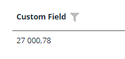
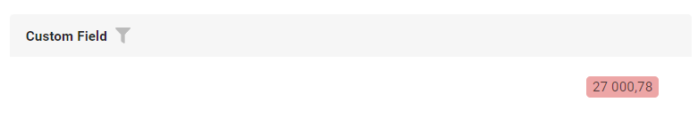
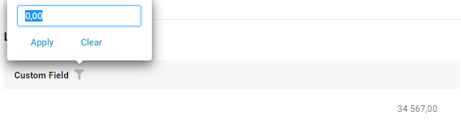
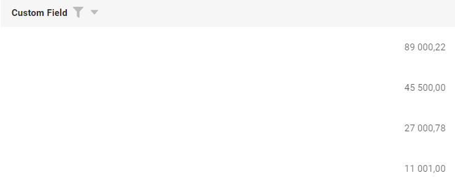
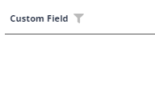
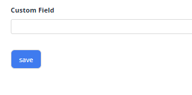

# Money

`Money` is a component for showing and editing fields containing money

## Basics
### How does it look?

=== "List widget"
    
=== "Info widget"
    
=== "Form widget"
    


### How to add?

??? Example
    **Option1**
    **Step1** Add field **Double** to corresponding **DataResponseDTO**.

    ```java
    public class MyExampleDTO extends DataResponseDTO {
    
        @SearchParameter(name = "customField", provider = BigDecimalValueProvider.class)
        private Double customField;
    
        public MyExampleDTO(MyEntity entity) {
            this.customField = entity.getCustomField();
        }
    }
    ```

    **Step2** Add field **Double** to corresponding **BaseEntity**.

    ```java
    public class MyExampleEntity extends BaseEntity {
   
        @Column
        private Double customField;
    }
    ```
    === "List widget"
        **Step3** Add to **_.widget.json_**.

        ```json
        {
          "name": "MyExampleList",
          "title": "List title",
          "type": "List",
          "bc": "myExampleBc",
          "fields": [
            {
              "title": "custom Field",
              "key": "customField",
              "type": "money",
              "digits": 2
            }
          ],
          "options": {
            "actionGroups": {
            }
          }
        }
        ```
    === "Info widget"
        **Step3** Add to **_.widget.json_**.
        
        ```json
        {
          "name": "MyExampleInfo",
          "title": "Info title",
          "type": "Info",
          "bc": "myExampleBc",
          "fields": [
            {
              "label": "custom Field",
              "key": "customField",
              "type": "money",
              "digits": 2
            }
          ],
          "options": {
            "layout": {
              "rows": [
                {
                  "cols": [
                    {
                      "fieldKey": "customField",
                      "span": 12
                    }
                  ]
                },
                {
                  "cols": [
                  ]
                }
              ]
            }
          }
        }
        ```

    === "Form widget"

        **Step3** Add to **_.widget.json_**.

        ```json
        {
          "name": "MyExampleForm",
          "title": "Form title",
          "type": "Form",
          "bc": "myExampleBc",
          "fields": [
            {
              "label": "custom Field",
              "key": "customField",
              "type": "money",
              "digits": 2
            }
          ],
          "options": {
            "layout": {
              "rows": [
                {
                  "cols": [
                    {
                      "fieldKey": "customField",
                      "span": 12
                    }
                  ]
                },
                {
                  "cols": [
                  ]
                }
              ]
            }
          }
        }
        ```

## Placeholder
`Placeholder` allows you to provide a concise hint, guiding users on the expected value. This hint is displayed before any user input. It can be calculated based on business logic of application
### How does it look?
=== "List widget"
     
=== "Info widget"
    _not applicable_
=== "Form widget"
    
### How to add?
??? Example
    Add **fields.setPlaceholder** to corresponding **FieldMetaBuilder**.

    ```java

    public class MyExampleMeta extends FieldMetaBuilder<MyExampleDTO> {
    
      @Override
      public void buildRowDependentMeta(RowDependentFieldsMeta<MyExampleDTO> fields, InnerBcDescription bcDescription,
        Long id, Long parentId) {
        fields.setPlaceholder(MyExampleDTO_.customField, "100000.00"));
      }
    ```
    === "List widget"
        **Works for List.**
    === "Info widget"
        **_not applicable_**
    === "Form widget"
        **Works for Form.**

## Color
`Color` allows you to specify a field color. It can be calculated based on business logic of application

### How does it look?
=== "List widget"
    
=== "Info widget"
    
=== "Form widget"
    


### How to add?
??? Example
    === "Calculated color"
        
    
        **Step 1**   Add `custom field` for color to corresponding **DataResponseDTO**. 
    
        ```java
        public class MyExampleDTO extends DataResponseDTO {
        
            @SearchParameter(name = "customField", provider = BigDecimalValueProvider.class)
            private Double customField;
            private String customFieldColor;
        
            public MyExampleDTO(MyExampleEntity entity) {
                this.customField = entity.getCustomField();
                this.customFieldColor = "#eda6a6";
            }
        ```
        === "List widget"   
            **Step 2** Add **"bgColorKey"** :  `custom field for color`  to .widget.json.
            ```json
            {
              "name": "MyExampleList",
              "title": "List title",
              "type": "List",
              "bc": "myExampleBc",
              "fields": [
                {
                  "title": "custom Field",
                  "key": "customField",
                  "type": "money",
                  "bgColorKey": "customFieldColor"
                }
              ],
              "options": {
                "actionGroups": {
                }
              }
            }
            ```
        === "Info widget"
            **Step 2** Add **"bgColorKey"** :  `custom field for color`  to .widget.json.
            ```json
            {
              "name": "MyExampleInfo",
              "title": "Info title",
              "type": "Info",
              "bc": "myExampleBc",
              "fields": [
                {
                  "label": "custom Field",
                  "key": "customField",
                  "type": "money",
                  "bgColorKey": "customFieldColor"
                }
              ],
              "options": {
                "layout": {
                  "rows": [
                    {
                      "cols": [
                        {
                          "fieldKey": "customField",
                          "span": 12
                        }
                      ]
                    },
                    {
                      "cols": [
                      ]
                    }
                  ]
                }
              }
            }       
            ```
        === "Form widget"
            **Step 2** Add **"bgColorKey"** :  `custom field for color`  to .widget.json.
            ```json
            {
              "name": "MyExampleForm",
              "title": "Form title",
              "type": "Form",
              "bc": "myExampleBc",
              "fields": [
                {
                  "label": "custom Field",
                  "key": "customField",
                  "type": "money",
                  "bgColorKey": "customFieldColor"
                }
              ],
              "options": {
                "layout": {
                  "rows": [
                    {
                      "cols": [
                        {
                          "fieldKey": "customField",
                          "span": 12
                        }
                      ]
                    },
                    {
                      "cols": [
                      ]
                    }
                  ]
                }
              }
            }
            ```
    === "Constant color"
        === "List widget" 
            Add **"bgColor"** :  `custom color`  to .widget.json.
            ```json
            {
              "name": "MyExampleList",
              "title": "List title",
              "type": "List",
              "bc": "myExampleBc",
              "fields": [
                {
                  "title": "custom Field",
                  "key": "customField",
                  "type": "money",
                  "bgColor": "#eda6a6"
                }
              ],
              "options": {
                "actionGroups": {
                }
              }
            }
            ```

        === "Info widget"

            Add **"bgColor"** :  `custom color`  to .widget.json.
            ```json
            {
              "name": "MyExampleInfo",
              "title": "Info title",
              "type": "Info",
              "bc": "myExampleBc",
              "fields": [
                {
                  "label": "custom Field",
                  "key": "customField",
                  "type": "money",
                  "bgColor": "#eda6a6"
                }
              ],
              "options": {
                "layout": {
                  "rows": [
                    {
                      "cols": [
                        {
                          "fieldKey": "customField",
                          "span": 12
                        }
                      ]
                    },
                    {
                      "cols": [
                      ]
                    }
                  ]
                }
              }
            }
            ```

        === "Form widget"
            Add **"bgColor"** :  `custom color`  to .widget.json.  
            ```json
            {
              "name": "MyExampleForm",
              "title": "Form title",
              "type": "Form",
              "bc": "myExampleBc",
              "fields": [
                {
                  "label": "custom Field",
                  "key": "customField",
                  "type": "money",
                  "bgColor": "#eda6a6"
                }
              ],
              "options": {
                "layout": {
                  "rows": [
                    {
                      "cols": [
                        {
                          "fieldKey": "customField",
                          "span": 12
                        }
                      ]
                    },
                    {
                      "cols": [
                      ]
                    }
                  ]
                }
              }
            }
            ```
## Readonly/Editable
`Readonly/Editable` indicates whether the field can be edited or not. It can be calculated based on business logic of application

### How does it look?
=== "Editable List widget"
    
=== "Editable Info widget"
    _not applicable_
=== "Editable Form widget"
    


### How to add?
??? Example
    === "Editable" 
        **Step1** Add mapping DTO->entity to corresponding **VersionAwareResponseService**.
            ```java
            protected ActionResultDTO<MyExampleDTO> doUpdateEntity(MyExampleEntity entity, MyExampleDTO data, BusinessComponent bc) {
                if (data.isFieldChanged(MyExampleDTO_.customField)) {
                    entity.setCustomField(data.getCustomField());
                }
            return new ActionResultDTO<>(entityToDto(bc, entity));
            ```

        **Step2** Add **fields.setEnabled** to corresponding **FieldMetaBuilder**.
    
        ```java
        public class MyExampleMeta extends FieldMetaBuilder<MyExampleDTO> {
            public void buildRowDependentMeta(RowDependentFieldsMeta<MyExampleDTO> fields, InnerBcDescription bcDescription, Long id, Long parentId) {
                fields.setEnabled(MyExampleDTO_.customField);
            }
        }
        ```
        === "List widget"
            **Works for List.**
        === "Info widget"
            **_not applicable_**
        === "Form widget"
            **Works for Form.**
   
    === "Readonly"
    
        **Option 1** Enabled by default.
    
        ```java
        public class MyExampleMeta extends FieldMetaBuilder<MyExampleDTO> {
            public void buildRowDependentMeta(RowDependentFieldsMeta<MyExampleDTO> fields, InnerBcDescription bcDescription, Long id, Long parentId) {
            }
        }
        ```
    
        **Option 2** `Not recommended.` Property fields.setDisabled() overrides the enable field if you use after property fields.setEnabled.
        === "List widget"
            **Works for List.**
        === "Info widget"
            **_not applicable_**
        === "Form widget"
            **Works for Form.**
## Filtration
`Filtering` allows you to search data based on criteria.Search by range current day . 
### How does it look?
=== "List widget"
    
=== "Info widget"
    _not applicable_
=== "Form widget"
    _not applicable_

### How to add?
??? Example
    === "List widget"
        **Step 1** Add **@SearchParameter** to corresponding **DataResponseDTO**. (Advanced customization [SearchParameter](/advancedCustomization_filtration)

        ```java
        public class MyExampleDTO extends DataResponseDTO {
        
            @SearchParameter(name = "customField", provider = BigDecimalValueProvider.class)
            private Double customField;
        
            public MyExampleDTO(MyExampleEntity entity) {
                this.customField = entity.getCustomField();
            }
        }
        ```
        **Step 2**  Add **fields.enableFilter** to corresponding **FieldMetaBuilder**.

        ```java 
        public class MyExampleMeta extends FieldMetaBuilder<MyExample>  {
        
            public void buildIndependentMeta(FieldsMeta<MyExample> fields, InnerBcDescription bcDescription, Long parentId) {
                fields.enableFilter(MyExample_.customField);
            }
        
        }
        ```

    === "Info widget"
        _not applicable_
    === "Form widget"
        _not applicable_

## Drilldown
`DrillDown` allows you to navigate to another view by simply tapping on it. Target view and other drill-down parts can be calculated based on business logic of application

Also, it optionally allows you to filter data on target view before it will be opened `see more` [DrillDown](/features/element/drillDown/drillDown)


### How does it look?
=== "List widget"
    
=== "Info widget"
    
=== "Form widget"
    _not applicable_

### How to add?
??? Example

    **Option 1**

    `Step 1` Add [fields.setDrilldown](/features/element/drillDown/drillDown) to corresponding **FieldMetaBuilder**.
    ```java
    public class MyExampleMeta extends FieldMetaBuilder<MyExampleDTO> {
    
        @Override
        public void buildRowDependentMeta(RowDependentFieldsMeta<MyExampleDTO> fields, InnerBcDescription bcDescription,
                                          Long id, Long parentId) {
            fields.setDrilldown(
                    MyExampleDTO_.customField,
                    DrillDownType.INNER,
                    "/screen/myexample/view/myexampleinfo/" + PlatformMyExampleController.myBcMyExample + "/" + id
            );
    ```
    === "List widget"
        `Step 2` For visual add **"drillDown": "true"**  to .widget.json.
        ```json
        {
          "name": "MyExampleList",
          "title": "List title",
          "type": "List",
          "bc": "myBcMyExample",
          "fields": [
            {
              "title": "custom Field",
              "key": "customField",
              "type": "money",
              "digits": 2,
              "drillDown": "true"
            }
          ],
          "options": {
            "actionGroups": {
            }
          }
        }
        ```


        **Option 2**
           Add **"drillDownKey"** :  `custom field`  to .widget.json. see more [Drilldown](/advancedCustomization/element/drillDown/drillDown) 
 
    === "Info widget"

        `Step 2` For visual add **"drillDown": "true"**  to .widget.json.

        ```json
        {
          "name": "MyExampleInfo",
          "title": "Info title",
          "type": "Info",
          "bc": "myBcMyExample",
          "fields": [
            {
              "label": "custom Field",
              "key": "customField",
              "type": "money",
              "digits": 2,
              "drillDown": "true"
            }
          ],
          "options": {
            "layout": {
              "rows": [
                {
                  "cols": [
                    {
                      "fieldKey": "customField",
                      "span": 12
                    }
                  ]
                },
                {
                  "cols": [
                  ]
                }
              ]
            }
          }
        }
        ```
        **Option 2**
           Add **"drillDownKey"** :  `custom field`  to .widget.json. see more [Drilldown](/advancedCustomization/element/drillDown/drillDown) 
 
    === "Form widget"
        _not applicable_
[Advanced customization](/advancedCustomization/element/drillDown/drillDown)

## Validation
`Validation` allows you to check any business rules for user-entered value. There are two types of validation:

1) Exception: Displays a message to notify users about technical or business errors.

2) Confirm: Presents a dialog with an optional message, requiring user confirmation or cancellation before proceeding.

### How does it look?
=== "List widget"
    === "BusinessException"
        
    === "RuntimeException"
        
    === "Confirm"
        
    === "Javax static"
        
=== "Info widget"
    _not applicable_
=== "Form widget"
    === "BusinessException"
        
    === "RuntimeException"
        
    === "Confirm"
        
    === "Javax static"
        
### How to add?
??? Example
    === "BusinessException"
        `BusinessException` describes an error  within a business process.

        Add **BusinessException** to corresponding **VersionAwareResponseService**.

        ```java
        public class MyExampleService extends VersionAwareResponseService<MyExampleDTO, MyExample> {
 
            @Override
            protected ActionResultDTO<MyExampleDTO> doUpdateEntity(MyExampleEntity entity, MyExampleDTO data, BusinessComponent bc) {
                if (data.isFieldChanged(MyExampleDTO_.customField)) {
                    entity.setCustomField(data.getCustomField());
                    if (data.getCustomField() < 100000) {
                        throw new BusinessException().addPopup("The field 'customField' cannot be less than 100 000.00.");
                    }
                }
                return new ActionResultDTO<>(entityToDto(bc, entity));
            }              
        ```
        === "List widget"
            **Works for List.**
        === "Info widget"
            **_not applicable_**
        === "Form widget"
            **Works for Form.**
    === "RuntimeException"

        `RuntimeException` describes an error  within a business process.
        
        Add **RuntimeException** to corresponding **VersionAwareResponseService**.
        
        ```java
            @Override
            protected ActionResultDTO<MyExampleDTO> doUpdateEntity(MyExampleEntity entity, MyExampleDTO data, BusinessComponent bc) {
                if (data.isFieldChanged(MyExampleDTO_.customField)) {
                    entity.setCustomField(data.getCustomField());
                   try {
                       //call custom function
                   }
                   catch(Exception e){
                        throw new RuntimeException("An unexpected error has occurred.");
                    }
                }
                return new ActionResultDTO<>(entityToDto(bc, entity));
            }
        ```    
        === "List widget"
            **Works for List.**
        === "Info widget"
            **_not applicable_**
        === "Form widget"
            **Works for Form.**
    === "Confirm"
        Add [PreAction.confirm](/advancedCustomization_validation) to corresponding **VersionAwareResponseService**.
        ```java
     
            public class MyExampleService extends VersionAwareResponseService<MyExampleDTO, MyExample> {

                @Override
                public Actions<MyExampleDTO> getActions() {
                    return Actions.<MyExampleDTO>builder()
                    .newAction()
                    .action("save", "save")
                    .withPreAction(PreAction.confirm("You want to save the value 'customField'?"))
                    .add()
                    .build();
                }
            }
        ```
        === "List widget"
            **Works for List.**
        === "Info widget"
            **_not applicable_**
        === "Form widget"
            **Works for Form.**
    === "Javax static"
        Add javax.validation to corresponding **DataResponseDTO**.
        ```java
     
            public class MyExampleDTO extends DataResponseDTO {
                @DecimalMin(value = "100000.00", message = "The field 'customField' cannot be less than 100 000.00.")
                private Double customField;
            }
        ```
        === "List widget"
            **Works for List.**
        === "Info widget"
            **_not applicable_**
        === "Form widget"
            **Works for Form.**
## Sorting
`Sorting` allows you to sort data in ascending or descending order.

### How does it look?
=== "List widget"
    
=== "Info widget"
    _not applicable_
=== "Form widget"
    _not applicable_
### How to add?
??? Example
    === "List widget"
        Enabled on default.
    === "Info widget"
        _not applicable_
    === "Form widget"
        _not applicable_

## Required
`Required` allows you to denote, that this field must have a value provided. By default, `Money` is 0.
But can use `nullable`. see more `Additional properties-nullable`

### How does it look?
=== "List widget"
    
=== "Info widget"
    _not applicable_
=== "Form widget"
    
### How to add?
??? Example
    Add **fields.setRequired** to corresponding **FieldMetaBuilder**.

    ```java

    public class MyExampleMeta extends FieldMetaBuilder<MyExample> {
    
      @Override
      public void buildRowDependentMeta(RowDependentFieldsMeta<MyExample> fields, InnerBcDescription bcDescription,
        Long id, Long parentId) {
        fields.setEnabled(MyExample_.customField);
        fields.setRequired(MyExample_.customField);
      }
    ```
    === "List widget"
        **Works for List.**
    === "Info widget"
        **_not applicable_**
    === "Form widget"
        **Works for Form.**

## Additional properties

`nullable`

### How does it look?
=== "List widget"
    
=== "Info widget"
    _not applicable_
=== "Form widget"
    

### How to add?
??? Example
    === "List widget"
        Add **nullable** to **_.widget.json_**.
        ```json
        {
          "name": "MyExampleList",
          "title": "List title",
          "type": "List",
          "bc": "myExampleBc",
          "fields": [
            {
              "title": "Custom Field",
              "key": "customField",
              "type": "money",
              "digits": 2,
              "nullable": true
            }
          ],
          "options": {
            "actionGroups": {
            }
          }
        } 
        ```
    === "Info widget"
        _not applicable_  

    === "Form widget"
        Add **nullable** to **_.widget.json_**.
        ```json
        {
          "bc": "myExampleBc",
          "fields": [
            {
              "label": "Custom Field",
              "key": "customField",
              "type": "money",
              "digits": 2,
              "nullable": true
            }
          ],
          "name": "MyExampleForm",
          "options": {
            "layout": {
              "rows": [
                {
                  "cols": [
                    {
                      "fieldKey": "customField",
                      "span": 12
                    }
                  ]
                },
                {
                  "cols": [
                  ]
                }
              ]
            }
          },
          "title": "Form title",
          "type": "Form"
        }
        ```


