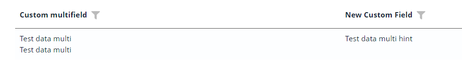
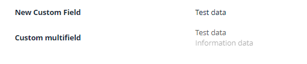
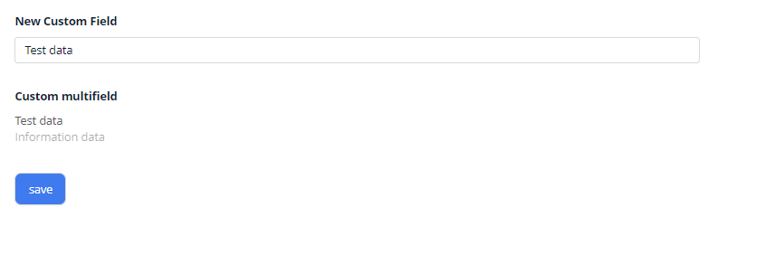
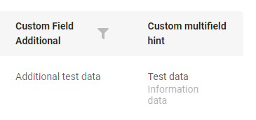
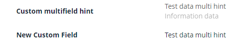
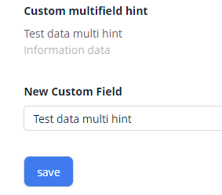
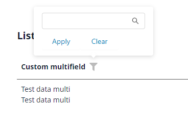

# Multifield

`Multifield` is a logical block containing any number of other field types. All fields in a logical block are readonly.
The typical scenario involves using a common field type (e.g., input, date) for 'main' data and a hint field type for 'secondary' data

## Basics
[:material-play-circle: Live Sample]({{ external_links.code_samples }}/ui/#/screen/myexample160/view/myexample160list){:target="_blank"} ·
[:fontawesome-brands-github: GitHub]({{ external_links.github_ui }}/{{ external_links.github_branch }}/src/main/java/org/demo/documentation/multifield/basic){:target="_blank"}
### How does it look?

Logical blocks can be shown in different styles

1) Style 'list' is displaying each entry on its own line

2) Style 'inline' is displaying all data on the same line

=== "List widget"
    
=== "Info widget"
    
=== "Form widget"
    

Block containing with field type hint. `see more` [hint](/widget/fields/field/hint/hint)
=== "List widget"
    
=== "Info widget"
    
=== "Form widget"
    


### How to add?

??? Example
    
    === "List widget"
        Add `fields` and `style` to **_.widget.json_**.
        ```json
        --8<--
        {{ external_links.github_raw }}/multifield/basic/MyExample160List.widget.json
        --8<--
        ```     

    === "Info widget"
        Add `fields` and `style` to **_.widget.json_**.

        Multifield key use for to determine the order in which fields are displayed in the interface("options.layout").

        ```json
        --8<--
        {{ external_links.github_raw }}/multifield/basic/MyExample160Info.widget.json
        --8<--
        ```

    === "Form widget"

        Add `fields` and `style` to **_.widget.json_**.

        Multifield key use for to determine the order in which fields are displayed in the interface("options.layout").

        ```json
        --8<--
        {{ external_links.github_raw }}/multifield/basic/MyExample160Form.widget.json
        --8<--
        ```

## Placeholder
_not applicable_

## Color
_not applicable_

## Readonly/Editable
All fields in a logical block are readonly.


## Filtering
[:material-play-circle: Live Sample]({{ external_links.code_samples }}/ui/#/screen/myexample360){:target="_blank"} ·
[:fontawesome-brands-github: GitHub]({{ external_links.github_ui }}/{{ external_links.github_branch }}/src/main/java/org/demo/documentation/multifield/filtration){:target="_blank"}

`Filtering` allows you to search data based on criteria. Search by =
### How does it look?
 
=== "List widget"
    
=== "Info widget"
    _not applicable_
=== "Form widget"
    _not applicable_

Filter not working with field type hint. `see more` [hint](/features/element/hint/hint)

### How to add?
??? Example
    === "List widget"

        **Step 1** Add **@SearchParameter** to corresponding **DataResponseDTO**. (Advanced customization [SearchParameter](/advancedCustomization/element/searchparameter/searchparameter))
        ```java
        --8<--
        {{ external_links.github_raw }}/multifield/filtration/MyExample360DTO.java
        --8<--
        ```
 
        **Step 2**  Add **fields.enableFilter** to corresponding **FieldMetaBuilder**.
        ```java
        --8<--
        {{ external_links.github_raw }}/multifield/filtration/MyExample360Meta.java
        --8<--
        ```
 
        **Step 3**  Add field for block filter in parameter `key`. 
        
        For example, for filtering on field  "customFieldAdditionalMulti" -  "key" = "customFieldAdditionalMulti"
        
        ```json
        {
          "title": "Custom multifield",
          "key": "customFieldAdditionalMulti",
          "type": "multifield",
          "style": "list",
          "fields": [
            {
              "title": "Custom Field Multi",
              "key": "customFieldMulti",
              "type": "input"
            },
            {
              "title": "New Custom Field Multi",
              "key": "customFieldAdditionalMulti",
              "type": "input"
            }
          ]
        }
        ```
    === "Info widget"
        _not applicable_
    === "Form widget"
        _not applicable_


## Drilldown
_not applicable_

## Validation
_not applicable_

## Sorting
_not applicable_

## Required
_not applicable_