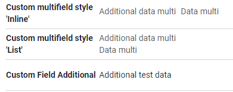

# Multifield

`Multifield` is a logical block containing any number of other field types
All Fields is readonly in  block containing.

## Basics
### How does it look?

=== "List widget"
    
=== "Info widget"
    
=== "Form widget"
    


### How to add?

??? Example

    === "List widget"
        Add `fields` and `style` to **_.widget.json_**.

        ```json
        {
          "name": "MyExampleList",
          "title": "List title",
          "type": "List",
          "bc": "myExampleBc",
          "fields": [
            {
              "title": "Custom multifield",
              "key": "customField",
              "type": "multifield",
              "style": "list",
              "fields": [
                {
                  "key": "customField",
                  "type": "input"
                },
                {
                  "title": "Information Field",
                  "key": "informationField",
                  "type": "hint",
                  "showLength": 100
                }
              ]
            },
            {
              "title": "New Custom Field",
              "key": "newCustomField",
              "type": "input"
            }
          ],
          "options": {
            "actionGroups": {
            }
          }
        }
        ```
    === "Info widget"
        Add to **_.widget.json_**.

        ```json
        {
          "name": "MyExampleInfo",
          "title": "Info title",
          "type": "Info",
          "bc": "myExampleBc",
          "fields": [
            {
              "label": "Custom multifield",
              "key": "customField",
              "type": "multifield",
              "style": "list",
              "fields": [
                {
                  "key": "customField",
                  "type": "input"
                },
                {
                  "key": "informationField",
                  "type": "hint",
                  "showLength": 100
                }
              ]
            },
            {
              "label": "New Custom Field",
              "key": "newCustomField",
              "type": "input"
            }
          ],
          "options": {
            "layout": {
              "rows": [
                {
                  "cols": [
                    {
                      "fieldKey": "newCustomField",
                      "span": 12
                    }
                  ]
                },
                {
                  "cols": [
                    {
                      "fieldKey": "customField",
                      "span": 12
                    }
                  ]
                },
                {
                  "cols": [
                  ]
                }
              ]
            }
          }
        }
        ```

    === "Form widget"

        Add `fields` and `style` to **_.widget.json_**.

        ```json
        {
          "name": "MyExample160Form",
          "title": "Form title",
          "type": "Form",
          "bc": "myExampleBc160",
          "fields": [
            {
              "label": "Custom multifield",
              "key": "customField",
              "type": "multifield",
              "style": "list",
              "fields": [
                {
                  "key": "customField",
                  "type": "input"
                },
                {
                  "key": "informationField",
                  "type": "hint",
                  "showLength": 100
                }
              ]
            },
            {
              "label": "New Custom Field",
              "key": "newCustomField",
              "type": "input"
            }
          ],
          "options": {
            "layout": {
              "rows": [
                {
                  "cols": [
                    {
                      "fieldKey": "newCustomField",
                      "span": 12
                    }
                  ]
                },
                {
                  "cols": [
                    {
                      "fieldKey": "customField",
                      "span": 12
                    }
                  ]
                },
                {
                  "cols": [
                  ]
                }
              ]
            }
          }
        }
        ```

## Placeholder
_not applicable_

## Color
_not applicable_

## Readonly/Editable
_not applicable_

## Filtration
_not applicable_

## Drilldown
_not applicable_

## Validation
_not applicable_

## Sorting
_not applicable_

## Required
_not applicable_