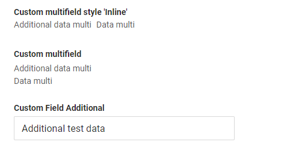
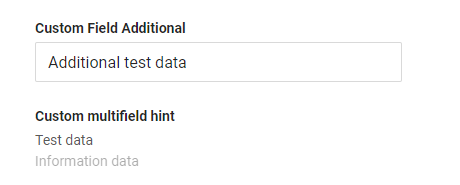

# Multifield

`Multifield` is a logical block containing any number of other field types. All fields in a logical block is readonly.
The typical scenario involves using a common field type (e.g., input, date) for 'main' data and a hint field type for 'secondary' data
## Basics
[:material-play-circle: Live Sample]({{ external_links.code_samples }}/ui/#/screen/myexample160){:target="_blank"} ·
[:fontawesome-brands-github: GitHub]({{ external_links.github_ui }}/{{ external_links.github_branch }}/src/main/java/org/demo/documentation/multifield/basic){:target="_blank"}
### How does it look?

Block containing 
=== "List widget"
    
=== "Info widget"
    
=== "Form widget"
    

Block containing with field type hint. `see more` [hint](/widget/fields/field/hint/hint)
=== "List widget"
    
=== "Info widget"
    
=== "Form widget"
    


### How to add?

??? Example
    
    === "List widget"
        Add `fields` and `style` to **_.widget.json_**.
        ```json
        {
          "name": "MyExampleList",
          "title": "List title",
          "type": "List",
          "bc": "myExampleBc",
          "fields": [
            {
              "title": "Custom multifield",
              "key": "customField",
              "type": "multifield",
              "style": "list",
              "fields": [
                {
                  "key": "customField",
                  "type": "input"
                },
                {
                  "title": "Information Field",
                  "key": "informationField",
                  "type": "hint",
                  "showLength": 100
                }
              ]
            },
            {
              "title": "New Custom Field",
              "key": "newCustomField",
              "type": "input"
            }
          ]
        }
        ```

    === "Info widget"
        Add `fields` and `style` to **_.widget.json_**.
        Multifield key use for to determine the order in which fields are displayed in the interface("options.layout").

        ```json
        {
          "name": "MyExampleInfo",
          "title": "Info title",
          "type": "Info",
          "bc": "myExampleBc",
          "fields": [
            {
              "label": "Custom multifield",
              "key": "customField",
              "type": "multifield",
              "style": "list",
              "fields": [
                {
                  "key": "customField",
                  "type": "input"
                },
                {
                  "key": "informationField",
                  "type": "hint",
                  "showLength": 100
                }
              ]
            },
            {
              "label": "New Custom Field",
              "key": "newCustomField",
              "type": "input"
            }
          ],
          "options": {
            "layout": {
              "rows": [
                {
                  "cols": [
                    {
                      "fieldKey": "newCustomField",
                      "span": 12
                    }
                  ]
                },
                {
                  "cols": [
                    {
                      "fieldKey": "customField",
                      "span": 12
                    }
                  ]
                }
              ]
            }
          }
        }
        ```

    === "Form widget"

        Add `fields` and `style` to **_.widget.json_**.
        Multifield key use for to determine the order in which fields are displayed in the interface("options.layout").

        ```json
        {
          "name": "MyExampleForm",
          "title": "Form title",
          "type": "Form",
          "bc": "myExampleBc",
          "fields": [
            {
              "label": "Custom multifield",
              "key": "customField",
              "type": "multifield",
              "style": "list",
              "fields": [
                {
                  "key": "customField",
                  "type": "input"
                },
                {
                  "key": "informationField",
                  "type": "hint",
                  "showLength": 100
                }
              ]
            },
            {
              "label": "New Custom Field",
              "key": "newCustomField",
              "type": "input"
            }
          ],
          "options": {
            "layout": {
              "rows": [
                {
                  "cols": [
                    {
                      "fieldKey": "newCustomField",
                      "span": 12
                    }
                  ]
                },
                {
                  "cols": [
                    {
                      "fieldKey": "customField",
                      "span": 12
                    }
                  ]
                }
              ]
            }
          }
        }
        ```

## Placeholder
_not applicable_

## Color
_not applicable_

## Readonly/Editable
_not applicable_

## Filtering
[:material-play-circle: Live Sample]({{ external_links.code_samples }}/ui/#/screen/myexample160){:target="_blank"} ·
[:fontawesome-brands-github: GitHub]({{ external_links.github_ui }}/{{ external_links.github_branch }}/src/main/java/org/demo/documentation/multifield/filtration){:target="_blank"}

`Filtering` allows you to search data based on criteria. Search ???.
### How does it look?
Block containing
=== "List widget"
    
=== "Info widget"
    _not applicable_
=== "Form widget"
    _not applicable_

Filter not working with field type hint. `see more` [hint](/features/element/hint/hint)
 
### How to add?
??? Example
    === "List widget"
        **Step 1** Add **@SearchParameter** to corresponding **DataResponseDTO**. (Advanced customization [SearchParameter](/advancedCustomization_filtration))


        ```java
        public class MyExampleDTO extends DataResponseDTO {
        
            @SearchParameter(name = "customField", provider = BigDecimalValueProvider.class)
            private Long customField;
        
            public MyExampleDTO(MyEntity entity) {
                this.customField = entity.getCustomField();
            }
        }
        ```
        **Step 2**  Add **fields.enableFilter** to corresponding **FieldMetaBuilder**.

        ```java 
        public class MyExampleMeta extends FieldMetaBuilder<MyExampleDTO>  {
        
            public void buildIndependentMeta(FieldsMeta<MyExampleDTO> fields, InnerBcDescription bcDescription, Long parentId) {
                fields.enableFilter(MyExampleDTO_.customField);
            }
        
        }
        ```

    === "Info widget"
        _not applicable_
    === "Form widget"
        _not applicable_


## Drilldown
_not applicable_

## Validation
_not applicable_

## Sorting
_not applicable_

## Required
_not applicable_