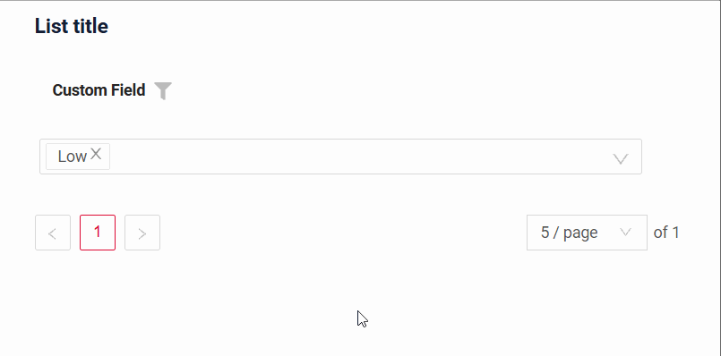
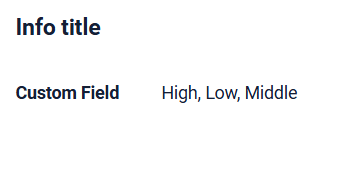
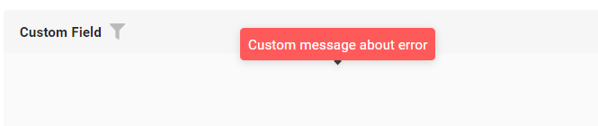

# MultipleSelect

`MultipleSelect` is a component that allows to select multiple values from dropdown list of predefined values

## Basics
### How does it look?

=== "List widget"
    
=== "Info widget"
    
=== "Form widget"
    

### How to add?

??? Example
    **Step1** Create Enum. Recommend that use const key value and dynamic value for visual display.
        ```java
        public enum CustomFieldEnum {
            HIGH("High"),
            MIDDLE("Middle"),
            LOW("Low");
        
            @JsonValue
            private final String value;
        
            public static CustomFieldEnum getByValue(@NonNull String value) {
                return Arrays.stream(CustomFieldEnum.values())
                        .filter(enm -> Objects.equals(enm.getValue(), value))
                        .findFirst()
                        .orElse(null);
            }
        }
        ```
    **Step2** Add field **Custom Field** to corresponding **DataResponseDTO**.

    ```java
    public class MyExampleDTO extends DataResponseDTO {
    
        @SearchParameter(name = "customField.value", multiFieldKey = StringValueProvider.class)
        private MultivalueField customField;
    
        public MyExampleDTO(MyEntity entity) {
           this.customField = entity.getCustomField().stream().collect(MultivalueField.toMultivalueField(Enum::name, CustomFieldEnum::getValue));
        }
    }
    ```

    **Step3** Add field **Custom Field** to corresponding **BaseEntity**.

    ```java
    public class MyEntity extends BaseEntity {
   
            @Enumerated(value = EnumType.STRING)
            @CollectionTable(name = "CUSTOM_FIELD", joinColumns = @JoinColumn(name = "MyEntity_ID"))
            @ElementCollection(targetClass = CustomFieldEnum.class)
            @Column(name = "VALUE", nullable = false)
            private Set<CustomFieldEnum> customField = new HashSet<>();
    }
    ```
    **Step4** Add **fields.setEnumValues** to corresponding **FieldMetaBuilder**.

    ```java
    public void buildRowDependentMeta(RowDependentFieldsMeta<MyExampleDTO> fields, InnerBcDescription bcDescription,
                                      Long id, Long parentId) {
            fields.setDictionaryTypeWithCustomValues(MyExampleDTO_.customField, Arrays.stream(CustomFieldEnum.values())
            .map(CustomFieldEnum::getValue)
            .toArray(String[]::new));
    }
    ```

    === "List widget"
        **Step5** Add to **_.widget.json_**.
        ```json
        {
          "name": "MyExampleList",
          "title": "List title",
          "type": "List",
          "bc": "myExampleBc",
          "fields": [
            {
              "title": "Custom Field",
              "key": "customField",
              "type": "multipleSelect"
            }
          ]
        }
        ```

    === "Info widget"
        **Step5** Add to **_.widget.json_**.

        ```json
        {
          "name": "MyExampleInfo",
          "title": "Info title",
          "type": "Info",
          "bc": "myExampleBc",
          "fields": [
            {
              "label": "Custom Field",
              "key": "customField",
              "type": "multipleSelect"
            }
          ],
          "options": {
            "layout": {
              "rows": [
                {
                  "cols": [
                    {
                      "fieldKey": "customField",
                      "span": 12
                    }
                  ]
                }
              ]
            }
          }
        }       
        ```

    === "Form widget"

        **Step5** Add to **_.widget.json_**.

        ```json
        {
          "name": "MyExampleForm",
          "title": "Form title",
          "type": "Form",
          "bc": "myExampleBc",
          "fields": [
            {
              "label": "Custom Field",
              "key": "customField",
              "type": "multipleSelect"
            }
          ],
          "options": {
            "layout": {
              "rows": [
                {
                  "cols": [
                    {
                      "fieldKey": "customField",
                      "span": 12
                    }
                  ]
                }
              ]
            }
          }
        }
        ```
## Placeholder
`Placeholder` allows you to provide a concise hint, guiding users on the expected value. This hint is displayed before any user input. It can be calculated based on business logic of application
### How does it look?
=== "List widget"
    
=== "Info widget"
    _not applicable_
=== "Form widget"
    
### How to add?
??? Example
    Add **fields.setPlaceholder** to corresponding **FieldMetaBuilder**.

    ```java

    public class MyExampleMeta extends FieldMetaBuilder<MyExampleDTO> {
    
      @Override
      public void buildRowDependentMeta(RowDependentFieldsMeta<MyExampleDTO> fields, InnerBcDescription bcDescription,
        Long id, Long parentId) {
        fields.setDictionaryTypeWithCustomValues(MyExampleDTO_.customField, Arrays.stream(CustomFieldEnum.values())
                .map(CustomFieldEnum::getValue)
                .toArray(String[]::new));
        fields.setEnabled(MyExampleDTO_.customField);
        fields.setPlaceholder(MyExampleDTO_.customField, "Placeholder text"));
      }
    ```
    === "List widget"
        **Works for List.**
    === "Info widget"
        **_not applicable_**
    === "Form widget"
        **Works for Form.**


## Color
_not applicable_

## Readonly/Editable
`Readonly/Editable` indicates whether the field can be edited or not. It can be calculated based on business logic of application

### How does it look?
=== "Editable"
    === "List widget"
        
    === "Info widget"
        _not applicable_
    === "Form widget"
        
=== "Readonly"
    === "List widget"
        
    === "Info widget"
        
    === "Form widget"
        
     
### How to add?
??? Example
    === "Editable" 
        **Step1** Add mapping DTO->entity to corresponding **VersionAwareResponseService**.
            ```java
            protected ActionResultDTO<MyExampleDTO> doUpdateEntity(MyEntity entity, MyExampleDTO data, BusinessComponent bc) {
                if (data.isFieldChanged(MyExampleDTO_.customField)) {
                    entity.setCustomField(
                    data.getCustomField().getValues()
                    .stream()
                    .map(v -> CustomFieldEnum.getByValue(v.getValue()))
                    .collect(Collectors.toSet()));
                }
            return new ActionResultDTO<>(entityToDto(bc, entity));
            ```

        **Step2** Add **fields.setEnabled** to corresponding **FieldMetaBuilder**.
    
        ```java
        public class MyExampleMeta extends FieldMetaBuilder<MyExampleDTO> {
        
            @Override
            public void buildRowDependentMeta(RowDependentFieldsMeta<MyExampleDTO> fields, InnerBcDescription bcDescription,
                                              Long id, Long parentId) {
                fields.setDictionaryTypeWithCustomValues(MyExampleDTO_.customField, Arrays.stream(CustomFieldEnum.values())
                .map(CustomFieldEnum::getValue)
                .toArray(String[]::new));
                fields.setEnabled(MyExampleDTO_.customField);
            }
        ```
        === "List widget"
            **Works for List.**
        === "Info widget"
            **_not applicable_**
        === "Form widget"
            **Works for Form.**
   
    === "Readonly"
    
        **Option 1** Enabled by default.
    
        ```java
        public class MyExampleMeta extends FieldMetaBuilder<MyExampleDTO> {
            public void buildRowDependentMeta(RowDependentFieldsMeta<MyExampleDTO> fields, InnerBcDescription bcDescription, Long id, Long parentId) {
            }
        }
        ```
    
        **Option 2** `Not recommended.` Property fields.setDisabled() overrides the enabled field if you use after property fields.setEnabled.
        === "List widget"
            **Works for List.**
        === "Info widget"
            **Works for Info.**
        === "Form widget"
            **Works for Form.**

## Filtration
`Filtering` allows you to search data based on criteria. Search uses equals (=) operator.
### How does it look?
=== "List widget"
    
=== "Info widget"
    _not applicable_
=== "Form widget"
    _not applicable_

### How to add?
??? Example
    === "List widget"
        **Step 1** Add **@SearchParameter** to corresponding **DataResponseDTO**. (Advanced customization [SearchParameter](/advancedCustomization_filtration))

        ```java
            @SearchParameter(name = "customFieldEntity.customField")
            private String customField;
        
            @SearchParameter(name = "customFieldEntity.id", provider = LongValueProvider.class)
            private Long customFieldId;
        
            public MyExampleDTO(MyEntity entity) {
                
                this.customFieldId = Optional.ofNullable(entity.getCustomFieldEntity())
                        .map(e -> e.getId())
                        .orElse(null);
                this.customField = Optional.ofNullable(entity.getCustomFieldEntity())
                        .map(e -> e.getCustomField())
                        .orElse(null);
            }
        }
        ```

        **Step 2**  Add **fields.enableFilter** and **fields.setConcreteFilterValues** to corresponding **FieldMetaBuilder**.

        ```java 
        public class MyExampleMeta extends FieldMetaBuilder<MyExampleDTO>  {
        
            public void buildIndependentMeta(FieldsMeta<MyExampleDTO> fields, InnerBcDescription bcDescription, Long parentId) {
                fields.enableFilter(MyExampleDTO_.customField);
                fields.setConcreteFilterValues(MyExampleDTO_.customField, Arrays
                        .stream(CustomFieldEnum.values())
                        .map(en -> new SimpleDictionary(en.name(), en.getValue()))
                        .collect(Collectors.toList())
                );
            }
        
        }
        ```
    === "Info widget"
        _not applicable_
    === "Form widget"
        _not applicable_

## Drilldown
**_not applicable_**


## Validation
`Validation` allows you to check any business rules for user-entered value. There are two types of validation:

1) Exception: Displays a message to notify users about technical or business errors.

2) Confirm: Presents a dialog with an optional message, requiring user confirmation or cancellation before proceeding.

3) Field level validation: shows error next to all fields, that validation failed for

### How does it look?
=== "List widget"
    === "BusinessException"
        
    === "RuntimeException"
        
    === "Confirm"
        
    === "Field level validation"
        
=== "Info widget"
    _not applicable_
=== "Form widget"
    === "BusinessException"
        
    === "RuntimeException"
        
    === "Confirm"
        
    === "Field level validation"
        

### How to add?
??? Example
    === "BusinessException"
        `BusinessException` describes an error  within a business process.

        Add **BusinessException** to corresponding **VersionAwareResponseService**.

        ```java
        public class MyExampleService extends VersionAwareResponseService<MyExampleDTO, MyEntity> {
 
            @Override
            protected ActionResultDTO<MyExampleDTO> doUpdateEntity(MyEntity entity, MyExampleDTO data, BusinessComponent bc) {
            if (data.isFieldChanged(MyExampleDTO_.customField)) {

               data.getCustomField().getValues()
                .stream()
                .filter(val->val.getValue().equals(CustomFieldEnum.HIGH.getValue()))
                .findFirst()
                .orElseThrow( () -> new BusinessException().addPopup("The field 'customField' can contain 'High'"));

                entity.setCustomField(data.getCustomField().getValues()
                                .stream()
                                .map(v -> CustomFieldEnum.getByValue(v.getValue()))
                                .collect(Collectors.toSet()));  
             }             
        ```
        === "List widget"
            **Works for List.**
        === "Info widget"
            **_not applicable_**
        === "Form widget"
            **Works for Form.**
    === "RuntimeException"

        `RuntimeException` describes technical error  within a business process.
        
        Add **RuntimeException** to corresponding **VersionAwareResponseService**.
        
        ```java
            @Override
            protected ActionResultDTO<MyExampleDTO> doUpdateEntity(MyEntity entity, MyExampleDTO data, BusinessComponent bc) {
                if (data.isFieldChanged(MyExampleDTO_.customField)) {
                    try {
                        //call custom function
                        throw new Exception("Error");
                    }
                    catch(Exception e){
                        throw new RuntimeException("An unexpected error has occurred.");
                    }
                }

        ```    
        === "List widget"
            **Works for List.**
        === "Info widget"
            **_not applicable_**
        === "Form widget"
            **Works for Form.**
    === "Confirm"
        Add [PreAction.confirm](/advancedCustomization_validation) to corresponding **VersionAwareResponseService**.
        ```java
     
            public class MyExampleService extends VersionAwareResponseService<MyExampleDTO, MyEntity> {

                @Override
                public Actions<MyExampleDTO> getActions() {
                    return Actions.<MyExampleDTO>builder()
                    .newAction()
                    .action("save", "save")
                    .withPreAction(PreAction.confirm("You want to save the value 'customField'?"))
                    .add()
                    .build();
                }
            }
        ```
        === "List widget"
            **Works for List.**
        === "Info widget"
            **_not applicable_**
        === "Form widget"
            **Works for Form.**
    === "Field level validation"
        === "Option 1"
            Add javax.validation to corresponding **DataResponseDTO**.

            Use if:

            Requires a simple fields check (javax validation)
            ```java
         
                public class MyExampleDTO extends DataResponseDTO {
                    @NotNull(message = "Custom message about error")
                    @SearchParameter(name = "customField.value", multiFieldKey = StringValueProvider.class)
                    private MultivalueField customField;
                }
            ```
            === "List widget"
                **Works for List.**
            === "Info widget"
                **_not applicable_**
            === "Form widget"
                **Works for Form.**
        === "Option 2"
            Create сustom service for business logic check.

            Use if:

            Business logic check required for fields

            `Step 1`  Create сustom method for check.
            ```java
            private void validate(BusinessComponent bc, MyExampleDTO dto) {
                BusinessError.Entity entity = new BusinessError.Entity(bc);
                Boolean castomFieldFlg = dto.getCustomField().getValues()
                        .stream()
                        .anyMatch(val->
                                val.getValue().equals(CustomFieldEnum.HIGH.getValue()));
                Boolean castomFieldAdditionalFlg = dto.getCustomFieldAdditional().getValues()
                        .stream()
                        .anyMatch(val->
                                val.getValue().equals(CustomFieldEnum.HIGH.getValue()));
                if (castomFieldFlg)  {
                    entity.addField(MyExampleDTO_.customField.getName(),
                           "Custom message about error");
                }
                if (castomFieldAdditionalFlg)  {
                    entity.addField(MyExampleDTO_.customFieldAdditional.getName(),
                            "Custom message about error");
                }
                if (entity.getFields().size() > 0) {
                    throw new BusinessException().setEntity(entity);
                }
            }
            ```
            `Step 2` Add сustom method for check to corresponding **VersionAwareResponseService**..
            ```java
                protected ActionResultDTO<MyExampleDTO> doUpdateEntity(MyEntity entity, MyExampleDTO data, BusinessComponent bc) {
                    validateFields(bc, data);
            ```
            === "List widget"
                Add custom action check to **_.widget.json_**.
                ```json
                {
                  "name": "MyExampleList",
                  "title": "List title",
                  "type": "List",
                  "bc": "myExampleBc",
                  "fields": [
                    {
                      "title": "Custom Field",
                      "key": "customField",
                      "type": "multipleSelect"
                    },
                    {
                      "title": "Custom Field Additional",
                      "key": "customFieldAdditional",
                      "type": "multipleSelect"
                    }
                  ]
                }
 
                ```               
            === "Info widget"
                **_not applicable_**
            === "Form widget"
                ```json
                {
                  "name": "MyExampleForm",
                  "title": "Form title",
                  "type": "Form",
                  "bc": "myExampleBc",
                  "fields": [
                    {
                      "label": "Custom Field",
                      "key": "customField",
                      "type": "multipleSelect"
                    },
                    {
                      "label": "Custom Field Additional",
                      "key": "customFieldAdditional",
                      "type": "multipleSelect"
                    }
                  ],
                    "layout": {
                      "rows": [
                        {
                          "cols": [
                            {
                              "fieldKey": "customFieldAdditional",
                              "span": 12
                            }
                          ]
                        },
                        {
                          "cols": [
                            {
                              "fieldKey": "customField",
                              "span": 12
                            }
                          ]
                        }
                      ]
                    }
                  }
                }
                ```
## Sorting
**_not applicable_**

## Required
`Required` allows you to denote, that this field must have a value provided.

### How does it look?
=== "List widget"
    
=== "Info widget"
    _not applicable_
=== "Form widget"
    
### How to add?
??? Example
    Add **fields.setRequired** to corresponding **FieldMetaBuilder**.

    ```java

    public class MyExampleMeta extends FieldMetaBuilder<MyExampleDTO> {
    
      @Override
      public void buildRowDependentMeta(RowDependentFieldsMeta<MyExampleDTO> fields, InnerBcDescription bcDescription,
        Long id, Long parentId) {
        fields.setDictionaryTypeWithCustomValues(MyExampleDTO_.customField, Arrays.stream(CustomFieldEnum.values())
                .map(CustomFieldEnum::getValue)
                .toArray(String[]::new));
        fields.setEnabled(MyExampleDTO_.customField);
        fields.setRequired(MyExampleDTO_.customField);
    ```
    === "List widget"
        **Works for List.**
    === "Info widget"
        **_not applicable_**
    === "Form widget"
        **Works for Form.**
