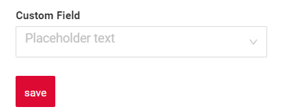
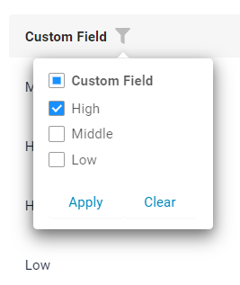
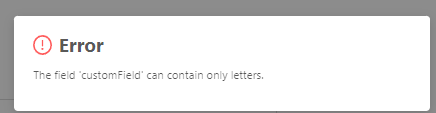

# MultipleSelect

`MultipleSelect` is a component that allows to select multiple values from dropdown list of predefined values

!!! tips
    For this field type let's talk about number of rows in popup and number of selected rows.Number of rows in popup: Use for dictionaries or slowly-growing entities, e.g. no more than 1000 values (all values are loaded in memory). Otherwise, use multivalue.Number of selected rows: same limits as for 'Number of rows in popup'

## Basics
[:material-play-circle: Live Sample]({{ external_links.code_samples }}/ui/#/screen/myexample251){:target="_blank"} ·
[:fontawesome-brands-github: GitHub]({{ external_links.github_ui }}/{{ external_links.github_branch }}/src/main/java/org/demo/documentation/fields/multipleselect/basic){:target="_blank"}

### How does it look?

=== "List widget"
    
=== "Info widget"
    
=== "Form widget"
    

### How to add?

??? Example
    **Step1** Create Enum. Recommend that use const key value and dynamic value for visual display.
    ```java
    --8<--
    {{ external_links.github_raw_doc }}/fields/multipleselect/basic/enums/CustomFieldEnum.java
    --8<--
    ```
    **Step2** Add field **Custom Field** to corresponding **BaseEntity**.

    ```java
    --8<--
    {{ external_links.github_raw_doc }}/fields/multipleselect/basic/MyEntity251.java
    --8<--
    ```

    **Step3**  Add field **Custom Field** to corresponding **DataResponseDTO**.

    ```java
    --8<--
    {{ external_links.github_raw_doc }}/fields/multipleselect/basic/MyExample251DTO.java
    --8<--
    ```

    **Step4** Add **fields.setConcreteValues** to corresponding **FieldMetaBuilder**.

    ```java
    --8<--
    {{ external_links.github_raw_doc }}/fields/multipleselect/basic/MyExample251Meta.java:buildRowDependentMeta
    --8<--
    ```

    === "List widget"
        **Step5** Add to **_.widget.json_**.

        ```json
        --8<--
        {{ external_links.github_raw_doc }}/fields/multipleselect/basic/MyExample251List.widget.json
        --8<--
        ```

    === "Info widget"
        **Step5** Add to **_.widget.json_**.
        ```json
        --8<--
        {{ external_links.github_raw_doc }}/fields/multipleselect/basic/MyExample251Info.widget.json
        --8<--
        ```
    === "Form widget"
        **Step5** Add to **_.widget.json_**.
        ```json
        --8<--
        {{ external_links.github_raw_doc }}/fields/multipleselect/basic/MyExample251Form.widget.json
        --8<--
        ```

    [:material-play-circle: Live Sample]({{ external_links.code_samples }}/ui/#/screen/myexample251){:target="_blank"} ·
    [:fontawesome-brands-github: GitHub]({{ external_links.github_ui }}/{{ external_links.github_branch }}/src/main/java/org/demo/documentation/fields/multipleselect/basic){:target="_blank"}

## Placeholder
[:material-play-circle: Live Sample]({{ external_links.code_samples }}/ui/#/screen/myexample257){:target="_blank"} ·
[:fontawesome-brands-github: GitHub]({{ external_links.github_ui }}/{{ external_links.github_branch }}/src/main/java/org/demo/documentation/fields/multipleselect/placeholder){:target="_blank"}

`Placeholder` allows you to provide a concise hint, guiding users on the expected value. This hint is displayed before any user input. It can be calculated based on business logic of application
### How does it look?
=== "List widget"
    
=== "Info widget"
    _not applicable_
=== "Form widget"
    
### How to add?
??? Example
    Add **fields.setPlaceholder** to corresponding **FieldMetaBuilder**.

    ```java
    --8<--
    {{ external_links.github_raw_doc }}/fields/multipleselect/placeholder/MyExample257Meta.java:buildRowDependentMeta
    --8<--
    ```  

    === "List widget"
        **Works for List.**
    === "Info widget"
        **_not applicable_**
    === "Form widget"
        **Works for Form.**

    [:material-play-circle: Live Sample]({{ external_links.code_samples }}/ui/#/screen/myexample257){:target="_blank"} ·
    [:fontawesome-brands-github: GitHub]({{ external_links.github_ui }}/{{ external_links.github_branch }}/src/main/java/org/demo/documentation/fields/multipleselect/placeholder){:target="_blank"}

## Color
_not applicable_

## Readonly/Editable
`Readonly/Editable` indicates whether the field can be edited or not. It can be calculated based on business logic of application

`Editable`
[:material-play-circle: Live Sample]({{ external_links.code_samples }}/ui/#/screen/myexample251){:target="_blank"} ·
[:fontawesome-brands-github: GitHub]({{ external_links.github_ui }}/{{ external_links.github_branch }}/src/main/java/org/demo/documentation/fields/multipleselect/basic){:target="_blank"}

`Readonly`
[:material-play-circle: Live Sample]({{ external_links.code_samples }}/ui/#/screen/myexample253){:target="_blank"} ·
[:fontawesome-brands-github: GitHub]({{ external_links.github_ui }}/{{ external_links.github_branch }}/src/main/java/org/demo/documentation/fields/multipleselect/ro){:target="_blank"}

### How does it look?
=== "Editable"
    === "List widget"
        
    === "Info widget"
        _not applicable_
    === "Form widget"
        
=== "Readonly"
    === "List widget"
        
    === "Info widget"
        
    === "Form widget"
        
     
### How to add?
??? Example
    === "Editable"
        **Step1** Add mapping DTO->entity to corresponding **VersionAwareResponseService**.
        ```java
        --8<--
        {{ external_links.github_raw_doc }}/fields/multipleselect/basic/MyExample251Service.java:doUpdateEntity
        --8<--
        ``` 
         **Step2** Add **fields.setEnabled** to corresponding **FieldMetaBuilder**.
        ```java
        --8<--
        {{ external_links.github_raw_doc }}/fields/multipleselect/basic/MyExample251Meta.java:buildRowDependentMeta
        --8<--
        ```   
 
        === "List widget"
            **Works for List.**
        === "Info widget"
            **_not applicable_**
        === "Form widget"
            **Works for Form.**

        [:material-play-circle: Live Sample]({{ external_links.code_samples }}/ui/#/screen/myexample251){:target="_blank"} ·
        [:fontawesome-brands-github: GitHub]({{ external_links.github_ui }}/{{ external_links.github_branch }}/src/main/java/org/demo/documentation/fields/multipleselect/basic){:target="_blank"}

    === "Readonly"
    
        **Option 1** Enabled by default.
        ```java
        --8<--
        {{ external_links.github_raw_doc }}/fields/multipleselect/ro/MyExample253Meta.java:buildRowDependentMeta
        --8<--
        ```     
    
        **Option 2** `Not recommended.` Property fields.setDisabled() overrides the enabled field if you use after property fields.setEnabled.
        === "List widget"
            **Works for List.**
        === "Info widget"
            **Works for Info.**
        === "Form widget"
            **Works for Form.**

        [:material-play-circle: Live Sample]({{ external_links.code_samples }}/ui/#/screen/myexample253){:target="_blank"} ·
        [:fontawesome-brands-github: GitHub]({{ external_links.github_ui }}/{{ external_links.github_branch }}/src/main/java/org/demo/documentation/fields/multipleselect/ro){:target="_blank"}

## Filtering
[:material-play-circle: Live Sample]({{ external_links.code_samples }}/ui/#/screen/myexample256/view/myexample256list){:target="_blank"} ·
[:fontawesome-brands-github: GitHub]({{ external_links.github_ui }}/{{ external_links.github_branch }}/src/main/java/org/demo/documentation/fields/multipleselect/filtration){:target="_blank"}

`Filtering` allows you to search data based on criteria. Search uses `in` operator.

### How does it look?
=== "List widget"
    
=== "Info widget"
    _not applicable_
=== "Form widget"
    _not applicable_

### How to add?
??? Example
    === "List widget"
        **Step 1** Add **@SearchParameter** to corresponding **DataResponseDTO**. (Advanced customization [SearchParameter](/advancedCustomization/element/searchparameter/searchparameter))
        ```java
        --8<--
        {{ external_links.github_raw_doc }}/fields/multipleselect/filtration/MyExample256DTO.java
        --8<--
        ```
 
        **Step 2**  Add **fields.enableFilter** to corresponding **FieldMetaBuilder**.
        ```java
        --8<--
        {{ external_links.github_raw_doc }}/fields/multipleselect/filtration/MyExample256Meta.java:buildIndependentMeta
        --8<--
        ```
 
    === "Info widget"
        _not applicable_
    === "Form widget"
        _not applicable_

    [:material-play-circle: Live Sample]({{ external_links.code_samples }}/ui/#/screen/myexample256/view/myexample256list){:target="_blank"} ·
    [:fontawesome-brands-github: GitHub]({{ external_links.github_ui }}/{{ external_links.github_branch }}/src/main/java/org/demo/documentation/fields/multipleselect/filtration){:target="_blank"}

## Drilldown
**_not applicable_**


## Validation
`Validation` allows you to check any business rules for user-entered value. There are types of validation:

1) Exception:Displays a message to notify users about technical or business errors.

   `Business Exception`:
   [:material-play-circle: Live Sample]({{ external_links.code_samples }}/ui/#/screen/myexample248){:target="_blank"} ·
   [:fontawesome-brands-github: GitHub]({{ external_links.github_ui }}/{{ external_links.github_branch }}/src/main/java/org/demo/documentation/fields/multipleselect/validationbusinessex){:target="_blank"}

   `Runtime Exception`:
   [:material-play-circle: Live Sample]({{ external_links.code_samples }}/ui/#/screen/myexample249){:target="_blank"} ·
   [:fontawesome-brands-github: GitHub]({{ external_links.github_ui }}/{{ external_links.github_branch }}/src/main/java/org/demo/documentation/fields/multipleselect/validationruntimeex){:target="_blank"}
   
2) Confirm: Presents a dialog with an optional message, requiring user confirmation or cancellation before proceeding.

   [:material-play-circle: Live Sample]({{ external_links.code_samples }}/ui/#/screen/myexample260){:target="_blank"} ·
   [:fontawesome-brands-github: GitHub]({{ external_links.github_ui }}/{{ external_links.github_branch }}/src/main/java/org/demo/documentation/fields/multipleselect/validationconfirm){:target="_blank"}

3) Field level validation: shows error next to all fields, that validation failed for

   `Option 1`:
   [:material-play-circle: Live Sample]({{ external_links.code_samples }}/ui/#/screen/myexample345){:target="_blank"} ·
   [:fontawesome-brands-github: GitHub]({{ external_links.github_ui }}/{{ external_links.github_branch }}/src/main/java/org/demo/documentation/fields/multipleselect/validationannotation){:target="_blank"}

   `Option 2`:
   [:material-play-circle: Live Sample]({{ external_links.code_samples }}/ui/#/screen/myexample334){:target="_blank"} ·
   [:fontawesome-brands-github: GitHub]({{ external_links.github_ui }}/{{ external_links.github_branch }}/src/main/java/org/demo/documentation/fields/multipleselect/validationdynamic){:target="_blank"}

### How does it look?
=== "List widget"
    === "BusinessException"
        
    === "RuntimeException"
        
    === "Confirm"
        
    === "Field level validation"
        
=== "Info widget"
    _not applicable_
=== "Form widget"
    === "BusinessException"
        
    === "RuntimeException"
        
    === "Confirm"
        
    === "Field level validation"
        

### How to add?
??? Example
    === "BusinessException"
        `BusinessException` describes an error  within a business process.

        Add **BusinessException** to corresponding **VersionAwareResponseService**.
        ```java
        --8<--
        {{ external_links.github_raw_doc }}/fields/multipleselect/validationbusinessex/MyExample248Service.java:doUpdateEntity
        --8<--
        ```
 
        === "List widget"
            **Works for List.**
        === "Info widget"
            **_not applicable_**
        === "Form widget"
            **Works for Form.**

        [:material-play-circle: Live Sample]({{ external_links.code_samples }}/ui/#/screen/myexample248){:target="_blank"} ·
        [:fontawesome-brands-github: GitHub]({{ external_links.github_ui }}/{{ external_links.github_branch }}/src/main/java/org/demo/documentation/fields/multipleselect/validationbusinessex){:target="_blank"}

    === "RuntimeException"

        `RuntimeException` describes technical error  within a business process.
        
        Add **RuntimeException** to corresponding **VersionAwareResponseService**.
        ```java
        --8<--
        {{ external_links.github_raw_doc }}/fields/multipleselect/validationruntimeex/MyExample249Service.java:doUpdateEntity
        --8<--
        ```        
   
        === "List widget"
            **Works for List.**
        === "Info widget"
            **_not applicable_**
        === "Form widget"
            **Works for Form.**

        [:material-play-circle: Live Sample]({{ external_links.code_samples }}/ui/#/screen/myexample249){:target="_blank"} ·
        [:fontawesome-brands-github: GitHub]({{ external_links.github_ui }}/{{ external_links.github_branch }}/src/main/java/org/demo/documentation/fields/multipleselect/validationruntimeex){:target="_blank"}

    === "Confirm"
        Add [PreAction.confirm](/advancedCustomization_validation) to corresponding **VersionAwareResponseService**.
        ```java
        --8<--
        {{ external_links.github_raw_doc }}/fields/multipleselect/validationconfirm/MyExample260Service.java:getActions
        --8<--
        ```
 
        === "List widget"
            **Works for List.**
        === "Info widget"
            **_not applicable_**
        === "Form widget"
            **Works for Form.**

        [:material-play-circle: Live Sample]({{ external_links.code_samples }}/ui/#/screen/myexample260){:target="_blank"} ·
        [:fontawesome-brands-github: GitHub]({{ external_links.github_ui }}/{{ external_links.github_branch }}/src/main/java/org/demo/documentation/fields/multipleselect/validationconfirm){:target="_blank"}

    === "Field level validation"
        === "Option 1"
            Add javax.validation to corresponding **DataResponseDTO**.
            
            Use if:
            
            Requires a simple fields check (javax validation)

            ```java
            --8<--
            {{ external_links.github_raw_doc }}/fields/multipleselect/validationannotation/MyExample345DTO.java
            --8<--
            ```
             
            === "List widget"
                **Works for List.**
            === "Info widget"
                **_not applicable_**
            === "Form widget"
                **Works for Form.**

            [:material-play-circle: Live Sample]({{ external_links.code_samples }}/ui/#/screen/myexample345){:target="_blank"} ·
            [:fontawesome-brands-github: GitHub]({{ external_links.github_ui }}/{{ external_links.github_branch }}/src/main/java/org/demo/documentation/fields/multipleselect/validationannotation){:target="_blank"}

        === "Option 2"
            Create сustom service for business logic check.
            
            Use if:
            
            Business logic check required for fields
            
            `Step 1`  Create сustom method for check.
            ```java
            --8<--
            {{ external_links.github_raw_doc }}/fields/multipleselect/validationdynamic/MyExample334Service.java:validateFields
            --8<--
            ```
 
            `Step 2` Add сustom method for check to corresponding **VersionAwareResponseService**.
            ```java
            --8<--
            {{ external_links.github_raw_doc }}/fields/multipleselect/validationdynamic/MyExample334Service.java:doUpdateEntity
            --8<--
            ```

            [:material-play-circle: Live Sample]({{ external_links.code_samples }}/ui/#/screen/myexample334){:target="_blank"} ·
            [:fontawesome-brands-github: GitHub]({{ external_links.github_ui }}/{{ external_links.github_branch }}/src/main/java/org/demo/documentation/fields/multipleselect/validationdynamic){:target="_blank"}

## Sorting
**_not applicable_**

## Required
[:material-play-circle: Live Sample]({{ external_links.code_samples }}/ui/#/screen/myexample247){:target="_blank"} ·
[:fontawesome-brands-github: GitHub]({{ external_links.github_ui }}/{{ external_links.github_branch }}/src/main/java/org/demo/documentation/fields/multipleselect/required){:target="_blank"}

`Required` allows you to denote, that this field must have a value provided.

### How does it look?
=== "List widget"
    
=== "Info widget"
    _not applicable_
=== "Form widget"
    
### How to add?
??? Example
    Add **fields.setRequired** to corresponding **FieldMetaBuilder**.

    ```java
    --8<--
    {{ external_links.github_raw_doc }}/fields/multipleselect/required/MyExample247Meta.java:buildRowDependentMeta
    --8<--
    ```

    === "List widget"
        **Works for List.**
    === "Info widget"
        **_not applicable_**
    === "Form widget"
        **Works for Form.**

    [:material-play-circle: Live Sample]({{ external_links.code_samples }}/ui/#/screen/myexample247){:target="_blank"} ·
    [:fontawesome-brands-github: GitHub]({{ external_links.github_ui }}/{{ external_links.github_branch }}/src/main/java/org/demo/documentation/fields/multipleselect/required){:target="_blank"}
