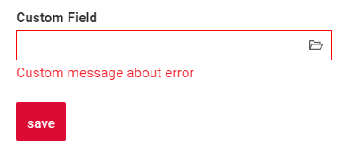

# Multivalue

`Multivalue` is a component that allows to select multiple values from Popup List of entities

!!! tip
    For this field type we need to talk about number of rows in popup and number of selected rows.Number of rows in popup: Feel free to use this field type for large entities of any size (only one page is loaded in memory).Number of selected rows: should be <1000-10000, because selected rows are stored in memory

## Basics
[:material-play-circle: Live Sample]({{ external_links.code_samples }}/ui/#/screen/myexample176){:target="_blank"} ·
[:fontawesome-brands-github: GitHub]({{ external_links.github_ui }}/{{ external_links.github_branch }}/src/main/java/org/demo/documentation/multivalue/basic){:target="_blank"}
### How does it look?

=== "List widget"
    
=== "Info widget"
    
=== "Form widget"
    


### How to add?

??? Example
    - **Step 1. AssocListPopup**

        In the following example, MyEntity entity has a ManyToMany reference to the MyEntityMultivalue entity. 
        Link is made by id in table MyEntity_MyEntityMultivalue, e.g. MyEntity.id = MyEntity_MyEntityMultivalue.MyEntityId, MyEntityMultivalue.id = MyEntity_MyEntityMultivalue.MyEntityMultivalueId.
       
        +  **Step 1.1** Create link table for ManyToMany (MyEntity_MyEntityMultivalue).
        +  **Step 1.2** Create Entity MyEntityMultivalue.
        +  **Step 1.3** Create DTO MyEntityMultivalueDTO.
        +  **Step 1.4** Add **String** `additional field`  to corresponding **BaseEntity**.

            ```java
            --8<--
            {{ external_links.github_raw }}/{{ external_links.github_branch }}/src/main/java/org/demo/documentation/multivalue/basic/MyEntityMultivalue177.java
            --8<--
            ```

        +  **Step 1.5** Add **String** `additional field` to corresponding **DataResponseDTO**.

            ```java
            --8<--
            {{ external_links.github_raw }}/{{ external_links.github_branch }}/src/main/java/org/demo/documentation/multivalue/basic/MyEntity177MultivalueDTO.java
            --8<--
            ```

        +  **Step 1.6.AssocListPopup**  Create AssocListPopup to **_.widget.json_**.
            ```json
            --8<--
            {{ external_links.github_raw }}/{{ external_links.github_branch }}/src/main/java/org/demo/documentation/multivalue/basic/myEntity177AssocListPopup.widget.json
            --8<--
            ```
        +  **Step2** Add **List** field to corresponding **BaseEntity**.

            ```java
            --8<--
            {{ external_links.github_raw }}/{{ external_links.github_branch }}/src/main/java/org/demo/documentation/multivalue/basic/MyEntity176.java
            --8<--
            ```

        +  **Step 3** Add **MultivalueField** field to corresponding **DataResponseDTO**.

            ```java
            --8<--
            {{ external_links.github_raw }}/{{ external_links.github_branch }}/src/main/java/org/demo/documentation/multivalue/basic/MyExample176DTO.java
            --8<--
            ```

        +  **Step4** Add bc **MyEntityMultivalueAssocListPopup** to corresponding **EnumBcIdentifier**.
    
            ```java
            --8<--
            {{ external_links.github_raw }}/{{ external_links.github_branch }}/src/main/java/org/demo/documentation/multivalue/basic/PlatformMyExample176Controller.java:bc
            --8<--
            ```

        +  **Step5** Add AssocListPopup widget to view.

        === "List widget"
            **Step 6** Add popupBcName and assocValueKey to **_.widget.json_**.
    
            `popupBcName` - name bc Step 1.6.AssocListPopup
    
            `assocValueKey` - field for opening AssocListPopup
    
            `displayedKey` - text field usually containing contcatenated values from linked rows on List widget
            
            ```json
            --8<--
            {{ external_links.github_raw }}/{{ external_links.github_branch }}/src/main/java/org/demo/documentation/multivalue/basic/MyExample176List.widget.json
            --8<--
            ```
    
        === "Info widget"
            **Step 6** Add to **_.widget.json_**.
            ```json
            --8<--
            {{ external_links.github_raw }}/{{ external_links.github_branch }}/src/main/java/org/demo/documentation/multivalue/basic/MyExample176Info.widget.json
            --8<--
            ```
        === "Form widget"
            **Step 6** Add popupBcName and assocValueKey to **_.widget.json_**.
    
            `popupBcName` - name bc Step 1.6.AssocListPopup
    
            `assocValueKey' - field for open AssocListPopup
    
            ```json
            --8<--
            {{ external_links.github_raw }}/{{ external_links.github_branch }}/src/main/java/org/demo/documentation/multivalue/basic/MyExample176Form.widget.json
            --8<--
            ```

## Placeholder
[:material-play-circle: Live Sample]({{ external_links.code_samples }}/ui/#/screen/myexample186){:target="_blank"} ·
[:fontawesome-brands-github: GitHub]({{ external_links.github_ui }}/{{ external_links.github_branch }}/src/main/java/org/demo/documentation/multivalue/placeholder){:target="_blank"}

`Placeholder` allows you to provide a concise hint, guiding users on the expected value. This hint is displayed before any user input. It can be calculated based on business logic of application

### How does it look?
=== "List widget"
    _not applicable_
=== "Info widget"
    _not applicable_
=== "Form widget"
    

### How to add?
??? Example
    Add **fields.setPlaceholder** to corresponding **FieldMetaBuilder**.

    ```java
    --8<--
    {{ external_links.github_raw }}/{{ external_links.github_branch }}/src/main/java/org/demo/documentation/multivalue/placeholder/MyExample186Meta.java:buildRowDependentMeta
    --8<--
    ```  
    === "List widget"
        **_not applicable_**
    === "Info widget"
        **_not applicable_**
    === "Form widget"
        **Works for Form.**


## Color
`Color` allows you to specify a field color. It can be calculated based on business logic of application

`Calculated color`:
[:material-play-circle: Live Sample]({{ external_links.code_samples }}/ui/#/screen/myexample174){:target="_blank"} ·
[:fontawesome-brands-github: GitHub]({{ external_links.github_ui }}/{{ external_links.github_branch }}/src/main/java/org/demo/documentation/multivalue/color){:target="_blank"}

`Constant color`:
[:material-play-circle: Live Sample]({{ external_links.code_samples }}/ui/#/screen/myexample178){:target="_blank"} ·
[:fontawesome-brands-github: GitHub]({{ external_links.github_ui }}/{{ external_links.github_branch }}/src/main/java/org/demo/documentation/multivalue/colorconst){:target="_blank"}

### How does it look?
=== "List widget"
    
=== "Info widget"
    _not applicable_
=== "Form widget"
    _not applicable_


### How to add?
??? Example
    === "Calculated color"
        **Step 1**   Add `custom field for color` to corresponding **DataResponseDTO**. The field can contain a HEX color or be null.
        ```java
        --8<--
        {{ external_links.github_raw }}/{{ external_links.github_branch }}/src/main/java/org/demo/documentation/multivalue/color/MyEntity175MultivalueDTO.java
        --8<--
        ```    
 
        === "List widget"   
            **Step 2** Add **"bgColorKey"** :  `custom field for color`  to .widget.json.
            ```json
            --8<--
            {{ external_links.github_raw }}/{{ external_links.github_branch }}/src/main/java/org/demo/documentation/multivalue/color/MyExample174List.widget.json
            --8<--
            ``` 
 
        === "Info widget"
            _not applicable_
        === "Form widget"
            _not applicable_

    === "Constant color"
        === "List widget" 
            Add **"bgColor"** :  `HEX color`  to .widget.json.
            ```json
            --8<--
            {{ external_links.github_raw }}/{{ external_links.github_branch }}/src/main/java/org/demo/documentation/multivalue/colorconst/MyExample178List.widget.json
            --8<--
            ``` 
        === "Info widget"
            _not applicable_
        === "Form widget"
            _not applicable_
## Readonly/Editable
`Readonly/Editable` indicates whether the field can be edited or not. It can be calculated based on business logic of application

`Editable`
[:material-play-circle: Live Sample]({{ external_links.code_samples }}/ui/#/screen/myexample176){:target="_blank"} ·
[:fontawesome-brands-github: GitHub]({{ external_links.github_ui }}/{{ external_links.github_branch }}/src/main/java/org/demo/documentation/multivalue/basic){:target="_blank"}

`Readonly`
[:material-play-circle: Live Sample]({{ external_links.code_samples }}/ui/#/screen/myexample180/view/myexample180form){:target="_blank"} ·
[:fontawesome-brands-github: GitHub]({{ external_links.github_ui }}/{{ external_links.github_branch }}/src/main/java/org/demo/documentation/multivalue/ro){:target="_blank"}


### How does it look?
=== "Editable"
    === "List widget"
        _not applicable_
    === "Info widget"
        _not applicable_
    === "Form widget"
        
=== "Readonly"
    === "List widget"
        
    === "Info widget"
        
    === "Form widget"
        


### How to add?
??? Example
    === "Editable"
        **Step1** Add mapping DTO->entity to corresponding **VersionAwareResponseService**.
        ```java
        --8<--
        {{ external_links.github_raw }}/{{ external_links.github_branch }}/src/main/java/org/demo/documentation/multivalue/basic/MyExample176Service.java:doUpdateEntity
        --8<--
        ```


        **Step2** Add **fields.setEnabled** to corresponding **FieldMetaBuilder**.
        ```java
        --8<--
        {{ external_links.github_raw }}/{{ external_links.github_branch }}/src/main/java/org/demo/documentation/multivalue/basic/MyExample176Meta.java:buildRowDependentMeta
        --8<--
        ```    
 
        === "List widget"
            **_not applicable_**
        === "Info widget"
            **_not applicable_**
        === "Form widget"
            **Works for Form.**
   
    === "Readonly"
    
        **Option 1** Enabled by default.
        ```java
        --8<--
        {{ external_links.github_raw }}/{{ external_links.github_branch }}/src/main/java/org/demo/documentation/multivalue/ro/MyExample180Meta.java:buildRowDependentMeta
        --8<--
        ```    
 
    
        **Option 2** `Not recommended.` Property fields.setDisabled() overrides the enabled field if you use after property fields.setEnabled.
        === "List widget"
            **_not applicable_**
        === "Info widget"
            **_not applicable_**
        === "Form widget"
            **Works for Form.**

## Filtering
[:material-play-circle: Live Sample]({{ external_links.code_samples }}/ui/#/screen/myexample184){:target="_blank"} ·
[:fontawesome-brands-github: GitHub]({{ external_links.github_ui }}/{{ external_links.github_branch }}/src/main/java/org/demo/documentation/multivalue/filtration){:target="_blank"}

`Filtering` allows you to search data based on criteria. Search uses in operator which compares ids in this case.
### How does it look?
=== "List widget"
    
=== "Info widget"
    _not applicable_
=== "Form widget"
    _not applicable_


### How to add?
??? Example
    === "List widget"
        **Step 1** Add **@SearchParameter** to corresponding **DataResponseDTO**. (Advanced customization [SearchParameter](/advancedCustomization/element/searchparameter/searchparameter))
        ```java
        --8<--
        {{ external_links.github_raw }}/{{ external_links.github_branch }}/src/main/java/org/demo/documentation/multivalue/filtration/MyExample184DTO.java
        --8<--
        ```
      
        **Step 2**  Add **fields.enableFilter** to corresponding **FieldMetaBuilder**.
        ```java
        --8<--
        {{ external_links.github_raw }}/{{ external_links.github_branch }}/src/main/java/org/demo/documentation/multivalue/filtration/MyExample184Meta.java:buildIndependentMeta
        --8<--
        ```
 
    === "Info widget"
        _not applicable_
    === "Form widget"
        _not applicable_

## Drilldown
**_not applicable_**

## Validation
`Validation` allows you to check any business rules for user-entered value. There are types of validation:

1) Exception:Displays a message to notify users about technical or business errors.

   `Business Exception`:
   [:material-play-circle: Live Sample]({{ external_links.code_samples }}/ui/#/screen/myexample192){:target="_blank"} ·
   [:fontawesome-brands-github: GitHub]({{ external_links.github_ui }}/{{ external_links.github_branch }}/src/main/java/org/demo/documentation/multivalue/validationbusinessex){:target="_blank"}

   `Runtime Exception`:
   [:material-play-circle: Live Sample]({{ external_links.code_samples }}/ui/#/screen/myexample196){:target="_blank"} ·
   [:fontawesome-brands-github: GitHub]({{ external_links.github_ui }}/{{ external_links.github_branch }}/src/main/java/org/demo/documentation/multivalue/validationruntimeex){:target="_blank"}
   
2) Confirm: Presents a dialog with an optional message, requiring user confirmation or cancellation before proceeding.

   [:material-play-circle: Live Sample]({{ external_links.code_samples }}/ui/#/screen/myexample194){:target="_blank"} ·
   [:fontawesome-brands-github: GitHub]({{ external_links.github_ui }}/{{ external_links.github_branch }}/src/main/java/org/demo/documentation/multivalue/validationconfirm){:target="_blank"}

3) Field level validation: shows error next to all fields, that validation failed for

   `Option 1`:
   [:material-play-circle: Live Sample]({{ external_links.code_samples }}/ui/#/screen/myexample198){:target="_blank"} ·
   [:fontawesome-brands-github: GitHub]({{ external_links.github_ui }}/{{ external_links.github_branch }}/src/main/java/org/demo/documentation/multivalue/validationannotation){:target="_blank"}

   `Option 2`:
   [:material-play-circle: Live Sample]({{ external_links.code_samples }}/ui/#/screen/myexample335){:target="_blank"} ·
   [:fontawesome-brands-github: GitHub]({{ external_links.github_ui }}/{{ external_links.github_branch }}/src/main/java/org/demo/documentation/multivalue/validationdynamic){:target="_blank"}


### How does it look?
=== "List widget"
    === "BusinessException"
        
    === "RuntimeException"
        
    === "Confirm"
        
    === "Field level validation"
        
=== "Info widget"
    _not applicable_
=== "Form widget"
    === "BusinessException"
        
    === "RuntimeException"
        
    === "Confirm"
        
    === "Field level validation"
        
### How to add?
??? Example
    === "BusinessException"

        `BusinessException` describes an error  within a business process.
        
        Add **BusinessException** to corresponding **VersionAwareResponseService**.

        ```java
        --8<--
        {{ external_links.github_raw }}/{{ external_links.github_branch }}/src/main/java/org/demo/documentation/multivalue/validationbusinessex/MyEntity193MultivalueService.java:doUpdateEntity
        --8<--
        ```
        
        === "List widget"
            **Works for List.**
        === "Info widget"
            **_not applicable_**
        === "Form widget"
            **Works for Form.**
    === "RuntimeException"

        `RuntimeException` describes technical error  within a business process.
        
        Add **RuntimeException** to corresponding **VersionAwareResponseService**.
        ```java
        --8<--
        {{ external_links.github_raw }}/{{ external_links.github_branch }}/src/main/java/org/demo/documentation/multivalue/validationruntimeex/MyEntity197MultivalueService.java:doUpdateEntity
        --8<--
        ```     
 
        === "List widget"
            **Works for List.**
        === "Info widget"
            **_not applicable_**
        === "Form widget"
            **Works for Form.**
    === "Confirm"

        Add [PreAction.confirm](/advancedCustomization_validation) to corresponding **VersionAwareResponseService**.

        ```java
        --8<--
        {{ external_links.github_raw }}/{{ external_links.github_branch }}/src/main/java/org/demo/documentation/multivalue/validationconfirm/MyEntity195MultivalueService.java:getActions
        --8<--
        ```
 
        === "List widget"
            **Works for List.**
        === "Info widget"
            **_not applicable_**
        === "Form widget"
            **Works for Form.**
    === "Field level validation"
        === "Option 1"
            Add javax.validation to corresponding **DataResponseDTO**.

            Use if:

            Requires a simple fields check (javax validation)
            ```java
            --8<--
            {{ external_links.github_raw }}/{{ external_links.github_branch }}/src/main/java/org/demo/documentation/multivalue/validationannotation/MyEntity199MultivalueDTO.java
            --8<--
            ```
 
            === "List widget"
                **Works for List.**
            === "Info widget"
                **_not applicable_**
            === "Form widget"
                **Works for Form.**
        === "Option 2"
            Create сustom service for business logic check.

            Use if:

            Business logic check required for fields

            `Step 1`  Create сustom method for check.
            ```java
            --8<--
            {{ external_links.github_raw }}/{{ external_links.github_branch }}/src/main/java/org/demo/documentation/multivalue/validationdynamic/MyExample335Service.java:validateFields
            --8<--
            ```
 
            `Step 2` Add сustom method for check to corresponding **VersionAwareResponseService**.
            ```java
            --8<--
            {{ external_links.github_raw }}/{{ external_links.github_branch }}/src/main/java/org/demo/documentation/multivalue/validationdynamic/MyExample335Service.java:doUpdateEntity
            --8<--
            ```
 
            === "List widget"
                Add custom action check to **_.widget.json_**.
                ```json
                --8<--
                {{ external_links.github_raw }}/{{ external_links.github_branch }}/src/main/java/org/demo/documentation/multivalue/validationdynamic/MyExample335List.widget.json
                --8<--
                ``` 
            === "Info widget"
                **_not applicable_**
            === "Form widget"
                Add custom action check to **_.widget.json_**.
                ```json
                --8<--
                {{ external_links.github_raw }}/{{ external_links.github_branch }}/src/main/java/org/demo/documentation/multivalue/validationdynamic/MyExample335Form.widget.json
                --8<--
                ``` 
## Sorting
**_not applicable_**

## Required
[:material-play-circle: Live Sample]({{ external_links.code_samples }}/ui/#/screen/myexample188){:target="_blank"} ·
[:fontawesome-brands-github: GitHub]({{ external_links.github_ui }}/{{ external_links.github_branch }}/src/main/java/org/demo/documentation/multivalue/required){:target="_blank"}

`Required` allows you to denote, that this field must have a value provided. 

### How does it look?
=== "List widget"
    _not applicable_
=== "Info widget"
    _not applicable_
=== "Form widget"
    
### How to add?
??? Example
    Add **fields.setRequired** to corresponding **FieldMetaBuilder**.

    ```java
    --8<--
    {{ external_links.github_raw }}/{{ external_links.github_branch }}/src/main/java/org/demo/documentation/multivalue/required/MyExample188Service.java:buildRowDependentMeta
    --8<--
    ```
 
    === "List widget"
        **_not applicable_**
    === "Info widget"
        **_not applicable_**
    === "Form widget"
        **Works for Form.**

