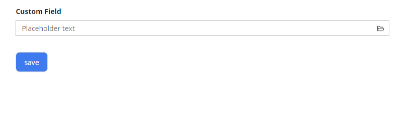

# Multivalue

`Multivalue` is a component that allows to select multiple values from Popup List of entities

!!! tip
    For this field type we need to talk about number of rows in popup and number of selected rows.Number of rows in popup: Feel free to use this field type for large entities of any size (only one page is loaded in memory).Number of selected rows: should be <1000-10000, because selected rows are stored in memory

## Basics
[:material-play-circle: Live Sample]({{ external_links.code_samples }}/ui/#/screen/myexample176){:target="_blank"} ·
[:fontawesome-brands-github: GitHub]({{ external_links.github_ui }}/{{ external_links.github_branch }}/src/main/java/org/demo/documentation/multivalue/basic){:target="_blank"}
### How does it look?

=== "List widget"
    
=== "Info widget"
    
=== "Form widget"
    


### How to add?

??? Example
    - **Step 1. AssocListPopup**

        In the following example, MyEntity entity has a ManyToMany reference to the MyEntityMultivalue entity. 
        Link is made by id in table MyEntity_MyEntityMultivalue, e.g. MyEntity.id = MyEntity_MyEntityMultivalue.MyEntityId, MyEntityMultivalue.id = MyEntity_MyEntityMultivalue.MyEntityMultivalueId.
       
        +  **Step 1.1** Create link table for ManyToMany (MyEntity_MyEntityMultivalue).
        +  **Step 1.2** Create Entity MyEntityMultivalue.
        +  **Step 1.3** Create DTO MyEntityMultivalueDTO.
        +  **Step 1.4** Add **String** `additional field`  to corresponding **BaseEntity**.

           ```java
           public class MyEntityMultivalue extends BaseEntity {
           
               private String customField;
           }
           ```

        +  **Step 1.5** Add **String** `additional field` to corresponding **DataResponseDTO**.

            ```java
            public class MyEntityMultivalueDTO extends DataResponseDTO {
           
                @SearchParameter(name = "customField")
                private String customField;
            
                public MyEntityMultivalueDTO(MyEntityMultivalue entity) {
                this.customField = entity.getCustomField();
                }
            }
            ```

        +  **Step 1.6.AssocListPopup**  Create AssocListPopup to **_.widget.json_**.
            ```json
            {
              "title": "MyEntityMultivalueAssocListPopup title",
              "name": "MyEntityMultivalueAssocListPopup",
              "type": "AssocListPopup",
              "bc": "MyEntityMultivalueAssocListPopup",
              "fields": [
                {
                  "title": "Custom Field",
                  "key": "customField",
                  "type": "input"
                },
                {
                  "title": "id",
                  "key": "id",
                  "type": "input"
                }
              ]
            }
            ```
        +  **Step2** Add **List** field to corresponding **BaseEntity**.

            ```java
            public class MyEntity extends BaseEntity {
           

                @JoinTable(name = "MyEntity_MyEntityMultivalue",
                    joinColumns = @JoinColumn(name = "MyEntity_id"),
                    inverseJoinColumns = @JoinColumn(name = "MyEntityMultivalue_id")
                )
                @ManyToMany(cascade = {CascadeType.PERSIST, CascadeType.MERGE})
                private List<MyEntityMultivalue> customFieldList = new ArrayList<>();
            }
            ```

        +  **Step 3** Add **MultivalueField** field to corresponding **DataResponseDTO**.

        ```java
        public class MyExampleDTO extends DataResponseDTO {
           @SearchParameter(name = "customFieldList.id", provider = LongValueProvider.class)
            private MultivalueField customField;
            private String customFieldCalc;
    
            public MyExampleDTO(MyEntity entity) {
                this.customField = entity.getCustomFieldList().stream().collect(MultivalueField.toMultivalueField(
                        e -> String.valueOf(e.getId()),
                        MyEntityMultivalue::getCustomField
                ));
                this.customFieldCalc =  StringUtils.abbreviate(entity.getCustomFieldList().stream().map(MyEntity::getCustomField
                  ).collect(Collectors.joining(",")), 12);
        }
        ```

        +  **Step4** Add bc **MyEntityMultivalueAssocListPopup** to corresponding **EnumBcIdentifier**.
    
        ```java
        public enum PlatformMyExampleController implements EnumBcIdentifier {
            myExampleBc(MyExampleService.class), 
            myEntityMultivalueAssocListPopup(myExampleBc, MyEntityMultivalueService.class);

        ```

        +  **Step5** Add AssocListPopup widget to view.

        === "List widget"
            **Step 6** Add popupBcName and assocValueKey to **_.widget.json_**.
    
            `popupBcName` - name bc Step 1.6.AssocListPopup
    
            `assocValueKey` - field for opening AssocListPopup
    
            `displayedKey` - text field usually containing contcatenated values from linked rows on List widget
    
            ```json
            {
              "name": "MyExampleList",
              "title": "List title",
              "type": "List",
              "bc": "myExampleBc",
              "fields": [
                {
                  "title": "Custom Field",
                  "key": "customField",
                  "type": "multivalue",
                  "popupBcName": "myEntityMultivalueAssocListPopup",
                  "assocValueKey": "customField",
                  "displayedKey": "customFieldCalc"
                }
              ]
            }      
            ```
    
        === "Info widget"
            **Step 6** Add to **_.widget.json_**.
            ```json
            {
              "name": "MyExampleInfo",
              "title": "Info title",
              "type": "Info",
              "bc": "myExampleBc",
              "fields": [
                {
                  "label": "Custom Field",
                  "key": "customField",
                  "type": "multivalue",
                  "popupBcName": "myEntityAssocListPopup",
                  "assocValueKey": "customField"
                }
              ],
              "options": {
                "layout": {
                  "rows": [
                    {
                      "cols": [
                        {
                          "fieldKey": "customField",
                          "span": 12
                        }
                      ]
                    }
                  ]
                }
              }
            }
            ```
        === "Form widget"
            **Step 6** Add popupBcName and assocValueKey to **_.widget.json_**.
    
            `popupBcName` - name bc Step 1.6.AssocListPopup
    
            `assocValueKey' - field for open AssocListPopup
    
            ```json
            {
              "name": "MyExampleForm",
              "title": "Form title",
              "type": "Form",
              "bc": "myExampleBc",
              "fields": [
                {
                  "label": "Custom Field",
                  "key": "customField",
                  "type": "multivalue",
                  "popupBcName": "myEntityMultivalueAssocListPopup",
                  "assocValueKey": "customField"
                }
              ],
              "options": {
                "layout": {
                  "rows": [
                    {
                      "cols": [
                        {
                          "fieldKey": "customField",
                          "span": 12
                        }
                      ]
                    }
                  ]
                }
              }
            }
            ```
    

## Placeholder
[:material-play-circle: Live Sample]({{ external_links.code_samples }}/ui/#/screen/myexample186){:target="_blank"} ·
[:fontawesome-brands-github: GitHub]({{ external_links.github_ui }}/{{ external_links.github_branch }}/src/main/java/org/demo/documentation/multivalue/placeholder){:target="_blank"}

`Placeholder` allows you to provide a concise hint, guiding users on the expected value. This hint is displayed before any user input. It can be calculated based on business logic of application

### How does it look?
=== "List widget"
    _not applicable_
=== "Info widget"
    _not applicable_
=== "Form widget"
    

### How to add?
??? Example
    Add **fields.setPlaceholder** to corresponding **FieldMetaBuilder**.

    ```java

    public class MyExampleMeta extends FieldMetaBuilder<MyExampleDTO> {
    
      @Override
      public void buildRowDependentMeta(RowDependentFieldsMeta<MyExampleDTO> fields, InnerBcDescription bcDescription,
        Long id, Long parentId) {
        fields.setPlaceholder(MyExampleDTO_.customField, "Placeholder text"));
      }
    ```
    === "List widget"
        **_not applicable_**
    === "Info widget"
        **_not applicable_**
    === "Form widget"
        **Works for Form.**


## Color
`Color` allows you to specify a field color. It can be calculated based on business logic of application

`Calculated color`:
[:material-play-circle: Live Sample]({{ external_links.code_samples }}/ui/#/screen/myexample174){:target="_blank"} ·
[:fontawesome-brands-github: GitHub]({{ external_links.github_ui }}/{{ external_links.github_branch }}/src/main/java/org/demo/documentation/multivalue/color){:target="_blank"}

`Constant color`:
[:material-play-circle: Live Sample]({{ external_links.code_samples }}/ui/#/screen/myexample178){:target="_blank"} ·
[:fontawesome-brands-github: GitHub]({{ external_links.github_ui }}/{{ external_links.github_branch }}/src/main/java/org/demo/documentation/multivalue/colorconst){:target="_blank"}

### How does it look?
=== "List widget"
    
=== "Info widget"
    _not applicable_
=== "Form widget"
    _not applicable_


### How to add?
??? Example
    === "Calculated color"
        **Step 1**   Add `custom field for color` to corresponding **DataResponseDTO**. The field can contain a HEX color or be null. 
    
        ```java
        public class MyExampleDTO extends DataResponseDTO {

           @SearchParameter(name = "customFieldList.id", provider = LongValueProvider.class)
            private MultivalueField customField;
            private String customFieldColor;
            private String customFieldCalc;
            public MyExampleDTO(MyEntity entity) {
                this.customField = entity.getCustomFieldList().stream().collect(MultivalueField.toMultivalueField(
                        e -> String.valueOf(e.getId()),
                        MyEntityMultivalue::getCustomField
                ));
                this.customFieldColor = "#eda6a6";
                this.customFieldCalc =  StringUtils.abbreviate(entity.getCustomFieldList().stream().map(MyEntity::getCustomField
                ).collect(Collectors.joining(",")), 12);
        }

        ```
        === "List widget"   
            **Step 2** Add **"bgColorKey"** :  `custom field for color`  to .widget.json.
            ```json
            {
              "name": "MyExampleList",
              "title": "List title",
              "type": "List",
              "bc": "myExampleBc",
              "fields": [
                {
                  "title": "Custom Field",
                  "key": "customField",
                  "type": "multivalue",
                  "popupBcName": "myEntityAssocListPopup",
                  "assocValueKey": "customField",
                  "displayedKey": "customFieldCalc",
                  "bgColorKey": "customFieldColor"
                }
              ]
            }
            ```
        === "Info widget"
            _not applicable_
        === "Form widget"
            _not applicable_

    === "Constant color"
        === "List widget" 
            Add **"bgColor"** :  `HEX color`  to .widget.json.
            ```json
            {
              "name": "MyExampleList",
              "title": "List title",
              "type": "List",
              "bc": "myExampleBc",
              "fields": [
                {
                  "title": "Custom Field",
                  "key": "customField",
                  "type": "multivalue",
                  "popupBcName": "myEntityAssocListPopup",
                  "assocValueKey": "customField",
                  "bgColor": "#eda6a6",
                  "displayedKey": "customFieldCalc"
                }
              ]
            }
            ```

        === "Info widget"
            _not applicable_
        === "Form widget"
            _not applicable_
## Readonly/Editable
`Readonly/Editable` indicates whether the field can be edited or not. It can be calculated based on business logic of application

`Editable`
[:material-play-circle: Live Sample]({{ external_links.code_samples }}/ui/#/screen/myexample176){:target="_blank"} ·
[:fontawesome-brands-github: GitHub]({{ external_links.github_ui }}/{{ external_links.github_branch }}/src/main/java/org/demo/documentation/multivalue/basic){:target="_blank"}

`Readonly`
[:material-play-circle: Live Sample]({{ external_links.code_samples }}/ui/#/screen/myexample180/view/myexample180form){:target="_blank"} ·
[:fontawesome-brands-github: GitHub]({{ external_links.github_ui }}/{{ external_links.github_branch }}/src/main/java/org/demo/documentation/multivalue/ro){:target="_blank"}


### How does it look?
=== "Editable"
    === "List widget"
        _not applicable_
    === "Info widget"
        _not applicable_
    === "Form widget"
        
=== "Readonly"
    === "List widget"
        
    === "Info widget"
        
    === "Form widget"
        


### How to add?
??? Example
    === "Editable"
        **Step1** Add mapping DTO->entity to corresponding **VersionAwareResponseService**.
            ```java
            protected ActionResultDTO<MyExampleDTO> doUpdateEntity(MyEntity entity, MyExampleDTO data, BusinessComponent bc) {
                if (data.isFieldChanged(MyExampleDTO_.customField)) {
                    entity.getCustomFieldList().clear();
                    entity.getCustomFieldList().addAll(data.getCustomField().getValues().stream()
                    .map(MultivalueFieldSingleValue::getId)
                    .filter(Objects::nonNull)
                    .map(Long::parseLong)
                    .map(e -> entityManager.getReference(MyEntityMultivalue.class, e))
                    .collect(Collectors.toList()));
                }
            return new ActionResultDTO<>(entityToDto(bc, entity));
            ```

        **Step2** Add **fields.setEnabled** to corresponding **FieldMetaBuilder**.
    
        ```java
        public class MyExampleMeta extends FieldMetaBuilder<MyExampleDTO> {
    
        @Override
        public void buildRowDependentMeta(RowDependentFieldsMeta<MyExampleDTO> fields, InnerBcDescription bcDescription,
                                          Long id, Long parentId) {
          fields.setEnabled(MyExampleDTO_.customField);
        }
        ```
        === "List widget"
            **_not applicable_**
        === "Info widget"
            **_not applicable_**
        === "Form widget"
            **Works for Form.**
   
    === "Readonly"
    
        **Option 1** Enabled by default.
    
        ```java
        public class MyExampleMeta extends FieldMetaBuilder<MyExampleDTO> {
            public void buildRowDependentMeta(RowDependentFieldsMeta<MyExampleDTO> fields, InnerBcDescription bcDescription, Long id, Long parentId) {
            }
        }
        ```
    
        **Option 2** `Not recommended.` Property fields.setDisabled() overrides the enabled field if you use after property fields.setEnabled.
        === "List widget"
            **_not applicable_**
        === "Info widget"
            **_not applicable_**
        === "Form widget"
            **Works for Form.**

## Filtering
[:material-play-circle: Live Sample]({{ external_links.code_samples }}/ui/#/screen/myexample184){:target="_blank"} ·
[:fontawesome-brands-github: GitHub]({{ external_links.github_ui }}/{{ external_links.github_branch }}/src/main/java/org/demo/documentation/multivalue/filtration){:target="_blank"}

`Filtering` allows you to search data based on criteria. Search uses in operator which compares ids in this case.
### How does it look?
=== "List widget"
    
=== "Info widget"
    _not applicable_
=== "Form widget"
    _not applicable_


### How to add?
??? Example
    === "List widget"
        **Step 1** Add **@SearchParameter** to corresponding **DataResponseDTO**. (Advanced customization [SearchParameter](/advancedCustomization/element/searchparameter/searchparameter))

        ```java           
        @SearchParameter(name = "customFieldList.id", provider = LongValueProvider.class)
        private MultivalueField customField;
        private String customFieldCalc;
        public MyExampleDTO(MyEntity entity) {
            this.customField = entity.getCustomFieldList().stream().collect(MultivalueField.toMultivalueField(
                    e -> String.valueOf(e.getId()),
                    MyEntityMultivalue::getCustomField
            ));
            this.customFieldCalc =  StringUtils.abbreviate(entity.getCustomFieldList().stream().map(MyEntityMultivalue::getCustomField
            ).collect(Collectors.joining(",")), 12);
        }
        ```

        **Step 2**  Add **fields.enableFilter** to corresponding **FieldMetaBuilder**.

        ```java 
        public class MyExampleMeta extends FieldMetaBuilder<MyExampleDTO>  {
        
            public void buildIndependentMeta(FieldsMeta<MyExampleDTO> fields, InnerBcDescription bcDescription, Long parentId) {
                fields.enableFilter(MyExampleDTO_.customField);
            }
        
        }
        ```
    === "Info widget"
        _not applicable_
    === "Form widget"
        _not applicable_

## Drilldown
**_not applicable_**

## Validation
`Validation` allows you to check any business rules for user-entered value. There are types of validation:

1) Exception:Displays a message to notify users about technical or business errors.

   `Business Exception`:
   [:material-play-circle: Live Sample]({{ external_links.code_samples }}/ui/#/screen/myexample192){:target="_blank"} ·
   [:fontawesome-brands-github: GitHub]({{ external_links.github_ui }}/{{ external_links.github_branch }}/src/main/java/org/demo/documentation/multivalue/validationbusinessex){:target="_blank"}

   `Runtime Exception`:
   [:material-play-circle: Live Sample]({{ external_links.code_samples }}/ui/#/screen/myexample196){:target="_blank"} ·
   [:fontawesome-brands-github: GitHub]({{ external_links.github_ui }}/{{ external_links.github_branch }}/src/main/java/org/demo/documentation/multivalue/validationruntimeex){:target="_blank"}
   
2) Confirm: Presents a dialog with an optional message, requiring user confirmation or cancellation before proceeding.

   [:material-play-circle: Live Sample]({{ external_links.code_samples }}/ui/#/screen/myexample194){:target="_blank"} ·
   [:fontawesome-brands-github: GitHub]({{ external_links.github_ui }}/{{ external_links.github_branch }}/src/main/java/org/demo/documentation/multivalue/validationconfirm){:target="_blank"}

3) Field level validation: shows error next to all fields, that validation failed for

   `Option 1`:
   [:material-play-circle: Live Sample]({{ external_links.code_samples }}/ui/#/screen/myexample198){:target="_blank"} ·
   [:fontawesome-brands-github: GitHub]({{ external_links.github_ui }}/{{ external_links.github_branch }}/src/main/java/org/demo/documentation/multivalue/validationannotation){:target="_blank"}

   `Option 2`:
   [:material-play-circle: Live Sample]({{ external_links.code_samples }}/ui/#/screen/myexample335){:target="_blank"} ·
   [:fontawesome-brands-github: GitHub]({{ external_links.github_ui }}/{{ external_links.github_branch }}/src/main/java/org/demo/documentation/multivalue/validationdynamic){:target="_blank"}


### How does it look?
=== "List widget"
    === "BusinessException"
        
    === "RuntimeException"
        
    === "Confirm"
        
    === "Field level validation"
        
=== "Info widget"
    _not applicable_
=== "Form widget"
    === "BusinessException"
        
    === "RuntimeException"
        
    === "Confirm"
        
    === "Field level validation"
        
### How to add?
??? Example
    === "BusinessException"
        `BusinessException` describes an error  within a business process.

        Add **BusinessException** to corresponding **VersionAwareResponseService**.

        ```java
        public class MyExampleService extends VersionAwareResponseService<MyExampleDTO, MyEntity> {
 
            @Override
            protected ActionResultDTO<MyExampleDTO> doUpdateEntity(MyEntity entity, MyExampleDTO data, BusinessComponent bc) {
                if (data.isFieldChanged(MyExampleDTO_.customFieldId)) {
                data.getCustomField().getValues()
                        .stream()
                        .filter(val-> val.getValue().matches("[A-Za-z]+")==false)
                        .findFirst()
                        .orElseThrow( () -> new BusinessException().addPopup("The field 'customField' can contain only letters."));
                entity.getCustomFieldList().clear();
                entity.getCustomFieldList().addAll(data.getCustomField().getValues().stream()
                        .map(MultivalueFieldSingleValue::getId)
                        .filter(Objects::nonNull)
                        .map(Long::parseLong)
                        .map(e -> entityManager.getReference(MyEntityMultivalue.class, e))
                        .collect(Collectors.toList()));
                    }
                return new ActionResultDTO<>(entityToDto(bc, entity));
            }              
        ```
        === "List widget"
            **Works for List.**
        === "Info widget"
            **_not applicable_**
        === "Form widget"
            **Works for Form.**
    === "RuntimeException"

        `RuntimeException` describes technical error  within a business process.
        
        Add **RuntimeException** to corresponding **VersionAwareResponseService**.
        
        ```java
            @Override
            protected ActionResultDTO<MyExampleDTO> doUpdateEntity(MyEntity entity, MyExampleDTO data, BusinessComponent bc) {
                if (data.isFieldChanged(MyExampleDTO_.customFieldId)) {
                   try {
                       //call custom function
                   }
                   catch(Exception e){
                        throw new RuntimeException("An unexpected error has occurred.");
                    }
                }
                return new ActionResultDTO<>(entityToDto(bc, entity));
            }
        ```    
        === "List widget"
            **Works for List.**
        === "Info widget"
            **_not applicable_**
        === "Form widget"
            **Works for Form.**
    === "Confirm"
        Add [PreAction.confirm](/advancedCustomization_validation) to corresponding **VersionAwareResponseService**.
        ```java
     
            public class MyExampleService extends VersionAwareResponseService<MyExampleDTO, MyEntity> {

                @Override
                public Actions<MyExampleDTO> getActions() {
                    return Actions.<MyExampleDTO>builder()
                    .newAction()
                    .action("save", "save")
                    .withPreAction(PreAction.confirm("You want to save the value 'customField'?"))
                    .add()
                    .build();
                }
            }
        ```
        === "List widget"
            **Works for List.**
        === "Info widget"
            **_not applicable_**
        === "Form widget"
            **Works for Form.**
    === "Field level validation"
        === "Option 1"
            Add javax.validation to corresponding **DataResponseDTO**.

            Use if:

            Requires a simple fields check (javax validation)
            ```java
         
                public class MyExampleDTO extends DataResponseDTO {
                    @NotNull(message = "Custom message about error")
                    @SearchParameter(name = "customFieldList.id", provider = LongValueProvider.class)
                    private MultivalueField customField;
                }
            ```
            === "List widget"
                **Works for List.**
            === "Info widget"
                **_not applicable_**
            === "Form widget"
                **Works for Form.**
        === "Option 2"
            Create сustom service for business logic check.

            Use if:

            Business logic check required for fields

            `Step 1`  Create сustom method for check.
            ```java
            private void validate(BusinessComponent bc, MyExampleDTO dto) {
                BusinessError.Entity entity = new BusinessError.Entity(bc);
                if (String.valueOf(dto.getCustomField()).matches("[A-Za-z]+")) {
                    entity.addField(MyExampleDTO_.customField.getName(), "Custom message about error");
                }
                if (String.valueOf(dto.getCustomFieldAdditional()).matches("[A-Za-z]+"))  {
                    entity.addField(MyExampleDTO_.customFieldAdditional.getName(), "Custom message about error"))
                }
                if (entity.getFields().size() > 0) {
                    throw new BusinessException().setEntity(entity);
                }
            }
            ```
            `Step 2` Add сustom method for check to corresponding **VersionAwareResponseService**..
            ```java
                protected ActionResultDTO<MyExampleDTO> doUpdateEntity(MyEntity entity, MyExampleDTO data, BusinessComponent bc) {
                    validateFields(bc, data);
            ```
            === "List widget"
                Add custom action check to **_.widget.json_**.
                ```json
                {
                  "name": "MyExampleList",
                  "title": "List title",
                  "type": "List",
                  "bc": "myExampleBc",
                  "fields": [
                    {
                      "title": "Custom Field",
                      "key": "customField",
                      "type": "multivalue",
                      "popupBcName": "myEntityAssocListPopup",
                      "assocValueKey": "customField",
                      "displayedKey": "customFieldCalc"
                    },
                    {
                      "title": "Custom Field Additional",
                      "key": "customFieldAdditional",
                      "type": "multivalue",
                      "popupBcName": "myEntityAssocListPopup",
                      "assocValueKey": "customFieldAdditional",
                      "displayedKey": "customFieldCalc"
                    }
                  ]
                }
                ```               
            === "Info widget"
                **_not applicable_**
            === "Form widget"
                ```json
                {
                  "name": "MyExampleForm",
                  "title": "Form title",
                  "type": "Form",
                  "bc": "myExampleBc",
                  "fields": [
                    {
                      "label": "Custom Field",
                      "key": "customField",
                      "type": "multivalue",
                      "popupBcName": "myEntityAssocListPopup",
                      "assocValueKey": "customField",
                      "displayedKey": "customFieldCalc"
                    },
                    {
                      "label": "Custom Field Additional",
                      "key": "customFieldAdditional",
                      "type": "multivalue",
                      "popupBcName": "myEntityAssocListPopup",
                      "assocValueKey": "customField",
                      "displayedKey": "customFieldCalc"
                    }
                  ],
                    "layout": {
                      "rows": [
                        {
                          "cols": [
                            {
                              "fieldKey": "customFieldAdditional",
                              "span": 12
                            }
                          ]
                        },
                        {
                          "cols": [
                            {
                              "fieldKey": "customField",
                              "span": 12
                            }
                          ]
                        }
                      ]
                    }
                  }
                }
                ```
## Sorting
**_not applicable_**

## Required
[:material-play-circle: Live Sample]({{ external_links.code_samples }}/ui/#/screen/myexample188){:target="_blank"} ·
[:fontawesome-brands-github: GitHub]({{ external_links.github_ui }}/{{ external_links.github_branch }}/src/main/java/org/demo/documentation/multivalue/required){:target="_blank"}

`Required` allows you to denote, that this field must have a value provided. 

### How does it look?
=== "List widget"
    _not applicable_
=== "Info widget"
    _not applicable_
=== "Form widget"
    
### How to add?
??? Example
    Add **fields.setRequired** to corresponding **FieldMetaBuilder**.

    ```java

    public class MyExampleMeta extends FieldMetaBuilder<MyExampleDTO> {
    
      @Override
      public void buildRowDependentMeta(RowDependentFieldsMeta<MyExampleDTO> fields, InnerBcDescription bcDescription,
        Long id, Long parentId) {
        fields.setEnabled(MyExampleDTO_.customField);
        fields.setRequired(MyExampleDTO_.customField);
      }
    ```
    === "List widget"
        **_not applicable_**
    === "Info widget"
        **_not applicable_**
    === "Form widget"
        **Works for Form.**

