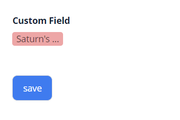

# MultivalueHover

`MultivalueHover` is a component that allows to view multiple values on mouse hover

## Basics
### How does it look?

=== "List widget"
    
=== "Info widget"
    
=== "Form widget"
    


### How to add?

??? Example
   
    **Step1** Add field **List** to corresponding **BaseEntity**.

    ```java
    public class MyExampleEntity extends BaseEntity {
   
        @Column
            @JoinTable(name = "MyEntity_MyEntityMultivalue",
            joinColumns = @JoinColumn(name = "MyEntity_id"),
            inverseJoinColumns = @JoinColumn(name = "MyEntityMultivalue_id")
        )
        @ManyToMany(cascade = {CascadeType.PERSIST, CascadeType.MERGE})
        private List<MyEntityMultivalue> customFieldList = new ArrayList<>();
        }
    ```

    **Step 2** Add field **MultivalueField** to corresponding **DataResponseDTO**.

    ```java
    public class MyExampleDTO extends DataResponseDTO {
        @SearchParameter(name = "customField.customField", multiFieldKey = MultiFieldValueProvider.class)
        private MultivalueField customField;
        private String customFieldCalc;

        public MyExampleDTO(MyEntity entity) {
            this.customField = entity.getCustomFieldList().stream().collect(MultivalueField.toMultivalueField(
                    e -> String.valueOf(e.getId()),
                    MyEntityMultivalue::getCustomField
            ));
            this.customFieldCalc =  StringUtils.abbreviate(entity.getCustomFieldList().stream().map(MyEntity::getCustomField
              ).collect(Collectors.joining(",")), 12);
    }
    ```

    === "List widget"
        **Step 3** Add to **_.widget.json_**.

        `displayedKey` - calculated field for displaing data

        ```json
        {
          "name": "MyExampleList",
          "title": "List title",
          "type": "List",
          "bc": "myExampleBc",
          "fields": [
            {
              "title": "Custom Field",
              "key": "customField",
              "type": "multivalueHover",
              "displayedKey": "customFieldCalc"
            }
          ],
          "options": {
            "actionGroups": {
            }
          }
        }      
        ```

    === "Info widget"
        **Step 3** Add to **_.widget.json_**.

        `displayedKey` - calculated field for displaing data

        ```json
        {
          "name": "MyExampleInfo",
          "title": "Info title",
          "type": "Info",
          "bc": "myExampleBc",
          "fields": [
            {
              "label": "Custom Field",
              "key": "customField",
              "type": "multivalueHover",
              "displayedKey": "customFieldCalc"
            }
          ],
          "options": {
            "layout": {
              "rows": [
                {
                  "cols": [
                    {
                      "fieldKey": "customField",
                      "span": 12
                    }
                  ]
                }
              ]
            }
          }
        }
        ```
    === "Form widget"
        **Step 5** Add to **_.widget.json_**.
 
        `displayedKey` - calculated field for displaing data

        ```json
        {
          "name": "MyExampleForm",
          "title": "Form title",
          "type": "Form",
          "bc": "myExampleBc",
          "fields": [
            {
              "label": "Custom Field",
              "key": "customField",
              "type": "multivalueHover",
              "displayedKey": "customFieldCalc"
            }
          ],
          "options": {
            "layout": {
              "rows": [
                {
                  "cols": [
                    {
                      "fieldKey": "customField",
                      "span": 12
                    }
                  ]
                }
              ]
            }
          }
        }
        ```


## Placeholder
**_not applicable_** 

## Color
`Color` allows you to specify a field color. It can be calculated based on business logic of application

### How does it look?
=== "List widget"
    
=== "Info widget"
    
=== "Form widget"
    


### How to add?
??? Example
    === "Calculated color"


        **Step 1**   Add `custom field` for color to corresponding **DataResponseDTO**. 
    
        ```java
        public class MyExampleDTO extends DataResponseDTO {

            @SearchParameter(name = "customField.customField", multiFieldKey = MultiFieldValueProvider.class)
            private MultivalueField customField;
            private String customFieldColor;
            private String customFieldCalc;
            public MyExampleDTO(MyEntity entity) {
                this.customField = entity.getCustomFieldList().stream().collect(MultivalueField.toMultivalueField(
                        e -> String.valueOf(e.getId()),
                        MyEntityMultivalue::getCustomField
                ));
                this.customFieldColor = "#eda6a6";
                this.customFieldCalc =  StringUtils.abbreviate(entity.getCustomFieldList().stream().map(MyEntity::getCustomField
              ).collect(Collectors.joining(",")), 12);
        }

        ```
        === "List widget"   
            **Step 2** Add **"bgColorKey"** :  `custom field for color`  to .widget.json.
            ```json
            {
              "name": "MyExampleList",
              "title": "List title",
              "type": "List",
              "bc": "myExampleBc",
              "fields": [
                {
                  "title": "Custom Field",
                  "key": "customField",
                  "type": "multivalueHover",
                  "displayedKey": "customFieldCalc"
                }
              ],
              "options": {
                "actionGroups": {
                }
              }
            }
            ```
        === "Info widget"
            **Step 2** Add **"bgColorKey"** :  `custom field for color`  to .widget.json.
            ```json
            {
              "name": "MyExampleInfo",
              "title": "Info title",
              "type": "Info",
              "bc": "myExampleBc",
              "fields": [
                {
                  "label": "Custom Field",
                  "key": "customField",
                  "type": "multivalueHover",
                  "displayedKey": "customFieldCalc",
                  "bgColorKey": "customFieldColor"
                }
              ],
              "options": {
                "layout": {
                  "rows": [
                    {
                      "cols": [
                        {
                          "fieldKey": "customField",
                          "span": 12
                        }
                      ]
                    },
                    {
                      "cols": [
                      ]
                    }
                  ]
                }
              }
            }
            ```
        === "Form widget"
            **Step 2** Add **"bgColorKey"** :  `custom field for color`  to .widget.json.
            ```json
            {
              "name": "MyExampleForm",
              "title": "Form title",
              "type": "Form",
              "bc": "myExampleBc",
              "fields": [
                {
                  "label": "Custom Field",
                  "key": "customField",
                  "type": "multivalueHover",
                  "displayedKey": "customFieldCalc",
                  "bgColorKey": "customFieldColor"
                }
              ],
              "options": {
                "layout": {
                  "rows": [
                    {
                      "cols": [
                        {
                          "fieldKey": "customField",
                          "span": 12
                        }
                      ]
                    },
                    {
                      "cols": [
                      ]
                    }
                  ]
                }
              }
            }
            ```
    === "Constant color"
        === "List widget" 
            Add **"bgColor"** :  `custom color`  to .widget.json.
            ```json
            {
              "name": "MyExampleList",
              "title": "List title",
              "type": "List",
              "bc": "myExampleBc",
              "fields": [
                {
                  "title": "Custom Field",
                  "key": "customField",
                  "type": "multivalueHover",
                  "displayedKey": "customFieldCalc",
                  "bgColor": "#eda6a6"
                }
              ],
              "options": {
                "actionGroups": {
                }
              }
            }
            ```

        === "Info widget"
            Add **"bgColor"** :  `custom color`  to .widget.json.
            ```json
            {
              "name": "MyExampleInfo",
              "title": "Info title",
              "type": "Info",
              "bc": "myExampleBc",
              "fields": [
                {
                  "label": "Custom Field",
                  "key": "customField",
                  "type": "multivalueHover",
                  "displayedKey": "customFieldCalc",
                  "bgColor": "#eda6a6"
                }
              ],
              "options": {
                "layout": {
                  "rows": [
                    {
                      "cols": [
                        {
                          "fieldKey": "customField",
                          "span": 12
                        }
                      ]
                    },
                    {
                      "cols": [
                      ]
                    }
                  ]
                }
              }
            }
            ```
        === "Form widget"
            Add **"bgColor"** :  `custom color`  to .widget.json.
            ```json
            {
              "name": "MyExample227Form",
              "title": "Form title",
              "type": "Form",
              "bc": "myExampleBc227",
              "fields": [
                {
                  "label": "Custom Field",
                  "key": "customField",
                  "type": "multivalueHover",
                  "displayedKey": "customFieldCalc",
                  "bgColor": "#eda6a6"
                }
              ],
              "options": {
                "layout": {
                  "rows": [
                    {
                      "cols": [
                        {
                          "fieldKey": "customField",
                          "span": 12
                        }
                      ]
                    },
                    {
                      "cols": [
                      ]
                    }
                  ]
                }
              }
            }
            ```
## Readonly/Editable
**_not applicable_**

## Filtration
**_not applicable_**

## Drilldown
**_not applicable_**

## Validation
**_not applicable_**

## Sorting
**_not applicable_**

## Required
`**_not applicable_**
