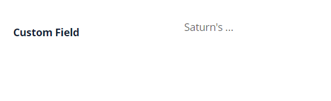

# MultivalueHover

`MultivalueHover` is a component that allows to view multiple values on mouse hover. All fields are readonly.

## Basics
[:material-play-circle: Live Sample]({{ external_links.code_samples }}/ui/#/screen/myexample224){:target="_blank"} ·
[:fontawesome-brands-github: GitHub]({{ external_links.github_ui }}/{{ external_links.github_branch }}/src/main/java/org/demo/documentation/fields/multivaluehover/basic){:target="_blank"}

### How does it look?

=== "List widget"
    
=== "Info widget"
    
=== "Form widget"
    


### How to add?

??? Example
   
    **Step1** Add field **List** to corresponding **BaseEntity**.

    ```java
    --8<--
    {{ external_links.github_raw_doc }}/fields/multivaluehover/basic/MyEntity224.java
    --8<--
    ```

    **Step 2** Add field **MultivalueField** to corresponding **DataResponseDTO**.

    ```java
    --8<--
    {{ external_links.github_raw_doc }}/fields/multivaluehover/basic/MyExample224DTO.java
    --8<--
    ```

    === "List widget"
        **Step 3** Add to **_.widget.json_**.

        `displayedKey` - text field usually containing contcatenated values from linked rows

        ```json
        --8<--
        {{ external_links.github_raw_doc }}/fields/multivaluehover/basic/MyExample224List.widget.json
        --8<--
        ```

    === "Info widget"
        **Step 3** Add to **_.widget.json_**.

        ```json
        --8<--
        {{ external_links.github_raw_doc }}/fields/multivaluehover/basic/MyExample224Info.widget.json
        --8<--
        ```

    === "Form widget"
        **Step 3** Add to **_.widget.json_**.
 
        `displayedKey` - text field usually containing contcatenated values from linked rows

        ```json
        --8<--
        {{ external_links.github_raw_doc }}/fields/multivaluehover/basic/MyExample224Form.widget.json
        --8<--
        ```

    [:material-play-circle: Live Sample]({{ external_links.code_samples }}/ui/#/screen/myexample224){:target="_blank"} ·
    [:fontawesome-brands-github: GitHub]({{ external_links.github_ui }}/{{ external_links.github_branch }}/src/main/java/org/demo/documentation/fields/multivaluehover/basic){:target="_blank"}

## Placeholder
**_not applicable_** 

## Color
`Color` allows you to specify a field color. It can be calculated based on business logic of application

**Calculated color**

[:material-play-circle: Live Sample]({{ external_links.code_samples }}/ui/#/screen/myexample225){:target="_blank"} ·
[:fontawesome-brands-github: GitHub]({{ external_links.github_ui }}/{{ external_links.github_branch }}/src/main/java/org/demo/documentation/fields/multivaluehover/color){:target="_blank"}

**Constant color**

[:material-play-circle: Live Sample]({{ external_links.code_samples }}/ui/#/screen/myexample227){:target="_blank"} ·
[:fontawesome-brands-github: GitHub]({{ external_links.github_ui }}/{{ external_links.github_branch }}/src/main/java/org/demo/documentation/fields/multivaluehover/colorconst){:target="_blank"}

### How does it look?
=== "List widget"
    
=== "Info widget"
    
=== "Form widget"
    


### How to add?
??? Example
    === "Calculated color"
        **Step 1**   Add `custom field for color` to corresponding **DataResponseDTO**. The field can contain a HEX color or be null.
        ```java
        --8<--
        {{ external_links.github_raw_doc }}/fields/multivaluehover/color/MyExample225DTO.java
        --8<--
        ```   
 
        === "List widget"   
            **Step 2** Add **"bgColorKey"** :  `custom field for color`  to .widget.json.
            ```json
            --8<--
            {{ external_links.github_raw_doc }}/fields/multivaluehover/color/MyExample225List.widget.json
            --8<--
            ```
 
        === "Info widget"
            **Step 2** Add **"bgColorKey"** :  `custom field for color`  to .widget.json.
 
            ```json
            --8<--
            {{ external_links.github_raw_doc }}/fields/multivaluehover/color/MyExample225Info.widget.json
            --8<--
            ```
        === "Form widget"
            **Step 2** Add **"bgColorKey"** :  `custom field for color`  to .widget.json.
            ```json
            --8<--
            {{ external_links.github_raw_doc }}/fields/multivaluehover/color/MyExample225Form.widget.json
            --8<--
            ```

        [:material-play-circle: Live Sample]({{ external_links.code_samples }}/ui/#/screen/myexample225){:target="_blank"} ·
        [:fontawesome-brands-github: GitHub]({{ external_links.github_ui }}/{{ external_links.github_branch }}/src/main/java/org/demo/documentation/fields/multivaluehover/color){:target="_blank"}

    === "Constant color"
        === "List widget" 
            Add **"bgColor"** :  `HEX color`  to .widget.json.
            ```json
            --8<--
            {{ external_links.github_raw_doc }}/fields/multivaluehover/colorconst/MyExample227List.widget.json
            --8<--
            ```

        === "Info widget"
            Add **"bgColor"** :  `HEX color`  to .widget.json.
            ```json
            --8<--
            {{ external_links.github_raw_doc }}/fields/multivaluehover/colorconst/MyExample227Info.widget.json
            --8<--
            ```
        === "Form widget"
            Add **"bgColor"** :  `HEX color`  to .widget.json.
            ```json
            --8<--
            {{ external_links.github_raw_doc }}/fields/multivaluehover/colorconst/MyExample227Form.widget.json
            --8<--
            ```

        [:material-play-circle: Live Sample]({{ external_links.code_samples }}/ui/#/screen/myexample227){:target="_blank"} ·
        [:fontawesome-brands-github: GitHub]({{ external_links.github_ui }}/{{ external_links.github_branch }}/src/main/java/org/demo/documentation/fields/multivaluehover/colorconst){:target="_blank"}

## Readonly/Editable
All fields are readonly.

## Filtering
[:material-play-circle: Live Sample]({{ external_links.code_samples }}/ui/#/screen/myexample233){:target="_blank"} ·
[:fontawesome-brands-github: GitHub]({{ external_links.github_ui }}/{{ external_links.github_branch }}/src/main/java/org/demo/documentation/fields/multivaluehover/filtration){:target="_blank"}

`Filtering` allows you to search data based on criteria. Search uses in operator which compares ids in this case.

### How does it look?
=== "List widget"
    
=== "Info widget"
    _not applicable_
=== "Form widget"
    _not applicable_

### How to add?
??? Example
    === "With plugin(recommended)"
        **Step 1** Download plugin
        [download Intellij Plugin](https://document.cxbox.org/plugin/plugininstalling)

        **Step 2** Add existing field to an existing form widget

        

    === "Example of writing code"
        === "List widget"
            **Step 1** Add **@SearchParameter** to corresponding **DataResponseDTO**. (Advanced customization [SearchParameter](/advancedCustomization/element/searchparameter/searchparameter))
            ```java
            --8<--
            {{ external_links.github_raw_doc }}/fields/multivaluehover/filtration/MyEntity234DTO.java
            --8<--
            ```
     
            **Step 2**  Add **fields.enableFilter** to corresponding **FieldMetaBuilder**.
            ```java
            --8<--
            {{ external_links.github_raw_doc }}/fields/multivaluehover/filtration/MyExample233Meta.java:buildIndependentMeta
            --8<--
            ```
      
            **Step 3**  Add **popupBcName** on current BC to corresponding **widget,json**.
     
            ```json
            --8<--
            {{ external_links.github_raw_doc }}/fields/multivaluehover/filtration/MyExample233List.widget.json
            --8<--
            ```
            **Step 4**  Add **popup** to corresponding **view.json**.
     
            ```json
            --8<--
            {{ external_links.github_raw_doc }}/fields/multivaluehover/filtration/myexample233list.view.json
            --8<--
            ```
        === "Info widget"
            _not applicable_
        === "Form widget"
            _not applicable_
    
        [:material-play-circle: Live Sample]({{ external_links.code_samples }}/ui/#/screen/myexample233){:target="_blank"} ·
        [:fontawesome-brands-github: GitHub]({{ external_links.github_ui }}/{{ external_links.github_branch }}/src/main/java/org/demo/documentation/fields/multivaluehover/filtration){:target="_blank"}

## Drilldown
**_not applicable_**

## Validation
**_not applicable_**

## Sorting
**_not applicable_**

## Required
`**_not applicable_**
