# Multivalue

`Multivalue` is a component that allows to select multiple values from Popup List of entities

!!! tips
    For this field type we need to talk about number of rows in popup and number of selected rows.Number of rows in popup: Feel free to use this field type for large entities of any size (only one page is loaded in memory).Number of selected rows: should be <1000-10000, because selected rows are stored in memory

## Basics
[:material-play-circle: Live Sample]({{ external_links.code_samples }}/ui/#/screen/myexample3314){:target="_blank"} ·
[:fontawesome-brands-github: GitHub]({{ external_links.github_ui }}/{{ external_links.github_branch }}/src/main/java/org/demo/documentation/fields/multivaluetree/basic){:target="_blank"}

### How does it look?

=== "List widget"
    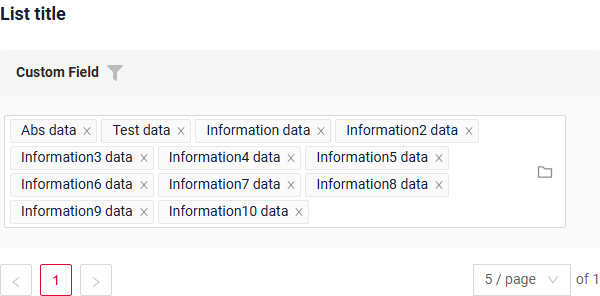
=== "Info widget"
    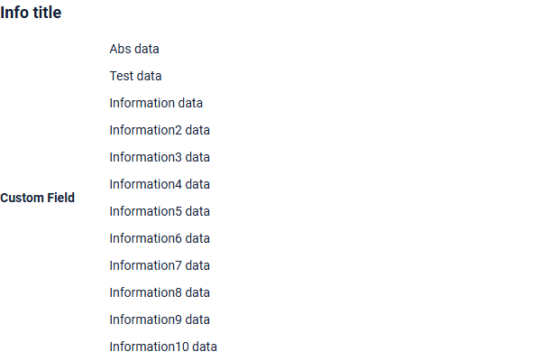
=== "Form widget"
    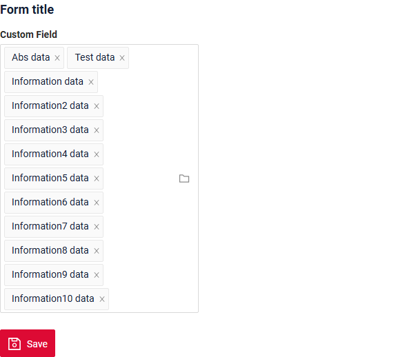


### How to add?
!!! info
    The popup is a tree: the business component of the popup must return `parentId` (filterable, `null` for the roots) and `isLeaf`, both declared as **hidden** fields of the popup widget. The tree settings are described in [options.tree](/widget/type/tree/tree/#optionstree).


??? Example
    - **Step 1. AssocTreePopup**

        In the following example, MyEntity entity has a ManyToMany reference to the MyEntityMultivalue entity. 
        Link is made by id in table MyEntity_MyEntityMultivalue, e.g. MyEntity.id = MyEntity_MyEntityMultivalue.MyEntityId, MyEntityMultivalue.id = MyEntity_MyEntityMultivalue.MyEntityMultivalueId.
       
        +  **Step 1.1** Create link table for ManyToMany (MyEntity_MyEntityMultivalue).
        +  **Step 1.2** Create Entity MyEntityMultivalue.
        +  **Step 1.3** Create DTO MyEntityMultivalueDTO.
        +  **Step 1.4** Add **String** `additional field`  to corresponding **BaseEntity**.

            ```java
            --8<--
            {{ external_links.github_raw_doc }}/fields/multivaluetree/basic/MyEntity3314Multivalue.java
            --8<--
            ```

        +  **Step 1.5** Add **String** `additional field` to corresponding **DataResponseDTO**.

            ```java
            --8<--
            {{ external_links.github_raw_doc }}/fields/multivaluetree/basic/MyEntity3314MultivalueDTO.java
            --8<--
            ```

        +  **Step 1.6.AssocTreePopup**  Create AssocTreePopup to **_.widget.json_**.
            ```json
            --8<--
            {{ external_links.github_raw_doc }}/fields/multivaluetree/basic/myEntity3314MultivalueAssocTreePopup.widget.json
            --8<--
            ```
        +  **Step2** Add **List** field to corresponding **BaseEntity**.

            ```java
            --8<--
            {{ external_links.github_raw_doc }}/fields/multivaluetree/basic/MyEntity3314.java
            --8<--
            ```

        +  **Step 3** Add **MultivalueField** field to corresponding **DataResponseDTO**.

            ```java
            --8<--
            {{ external_links.github_raw_doc }}/fields/multivaluetree/basic/MyExample3314DTO.java
            --8<--
            ```

        +  **Step4** Add bc **MyEntityMultivalueAssocTreePopup** to corresponding **EnumBcIdentifier**.
    
            ```java
            --8<--
            {{ external_links.github_raw_doc }}/fields/multivaluetree/basic/PlatformMyExample3314Controller.java:bc
            --8<--
            ```

        +  **Step5** Add AssocTreePopup widget to view.

        === "List widget"
            **Step 6** Add popupBcName and assocValueKey to **_.widget.json_**.
    
            `popupBcName` - name bc Step 1.6.AssocTreePopup
    
            `assocValueKey` - field for opening AssocTreePopup
    
            `displayedKey` - text field usually containing contcatenated values from linked rows on List widget
            
            ```json
            --8<--
            {{ external_links.github_raw_doc }}/fields/multivaluetree/basic/MyExample3314List.widget.json
            --8<--
            ```
    
        === "Info widget"
            **Step 6** Add to **_.widget.json_**.
            ```json
            --8<--
            {{ external_links.github_raw_doc }}/fields/multivaluetree/basic/MyExample3314Info.widget.json
            --8<--
            ```
        === "Form widget"
            **Step 6** Add popupBcName and assocValueKey to **_.widget.json_**.
    
            `popupBcName` - name bc Step 1.6.AssocTreePopup
    
            `assocValueKey' - field for open AssocTreePopup
    
            ```json
            --8<--
            {{ external_links.github_raw_doc }}/fields/multivaluetree/basic/MyExample3314Form.widget.json
            --8<--
            ```

        [:material-play-circle: Live Sample]({{ external_links.code_samples }}/ui/#/screen/myexample3314){:target="_blank"} ·
        [:fontawesome-brands-github: GitHub]({{ external_links.github_ui }}/{{ external_links.github_branch }}/src/main/java/org/demo/documentation/fields/multivaluetree/basic){:target="_blank"}

## Placeholder
[:material-play-circle: Live Sample]({{ external_links.code_samples }}/ui/#/screen/myexample3319){:target="_blank"} ·
[:fontawesome-brands-github: GitHub]({{ external_links.github_ui }}/{{ external_links.github_branch }}/src/main/java/org/demo/documentation/fields/multivaluetree/placeholder){:target="_blank"}

`Placeholder` allows you to provide a concise hint, guiding users on the expected value. This hint is displayed before any user input. It can be calculated based on business logic of application

### How does it look?
=== "List widget"
    _not applicable_
=== "Info widget"
    _not applicable_
=== "Form widget"
    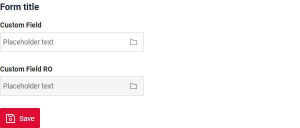

### How to add?
??? Example
    Add **fields.setPlaceholder** to corresponding **FieldMetaBuilder**.

    ```java
    --8<--
    {{ external_links.github_raw_doc }}/fields/multivaluetree/placeholder/MyExample3319Meta.java:buildRowDependentMeta
    --8<--
    ```  
    === "List widget"
        **_not applicable_**
    === "Info widget"
        **_not applicable_**
    === "Form widget"
        **Works for Form.**

    [:material-play-circle: Live Sample]({{ external_links.code_samples }}/ui/#/screen/myexample3319){:target="_blank"} ·
    [:fontawesome-brands-github: GitHub]({{ external_links.github_ui }}/{{ external_links.github_branch }}/src/main/java/org/demo/documentation/fields/multivaluetree/placeholder){:target="_blank"}

## Color
`Color` allows you to specify a field color. It can be calculated based on business logic of application

**Calculated color**

[:material-play-circle: Live Sample]({{ external_links.code_samples }}/ui/#/screen/myexample3315){:target="_blank"} ·
[:fontawesome-brands-github: GitHub]({{ external_links.github_ui }}/{{ external_links.github_branch }}/src/main/java/org/demo/documentation/fields/multivaluetree/color){:target="_blank"}

**Constant color**

[:material-play-circle: Live Sample]({{ external_links.code_samples }}/ui/#/screen/myexample3316){:target="_blank"} ·
[:fontawesome-brands-github: GitHub]({{ external_links.github_ui }}/{{ external_links.github_branch }}/src/main/java/org/demo/documentation/fields/multivaluetree/colorconst){:target="_blank"}

### How does it look?
=== "List widget"
    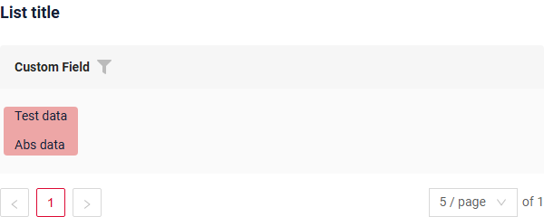
=== "Info widget"
    _not applicable_
=== "Form widget"
    _not applicable_


### How to add?
??? Example
    === "Calculated color"
        **Step 1**   Add `custom field for color` to corresponding **DataResponseDTO**. The field can contain a HEX color or be null.
        ```java
        --8<--
        {{ external_links.github_raw_doc }}/fields/multivaluetree/color/MyEntity3315MultivalueDTO.java
        --8<--
        ```    
 
        === "List widget"   
            **Step 2** Add **"bgColorKey"** :  `custom field for color`  to .widget.json.
            ```json
            --8<--
            {{ external_links.github_raw_doc }}/fields/multivaluetree/color/MyExample3315List.widget.json
            --8<--
            ``` 
 
        === "Info widget"
            _not applicable_
        === "Form widget"
            _not applicable_

        [:material-play-circle: Live Sample]({{ external_links.code_samples }}/ui/#/screen/myexample3315){:target="_blank"} ·
        [:fontawesome-brands-github: GitHub]({{ external_links.github_ui }}/{{ external_links.github_branch }}/src/main/java/org/demo/documentation/fields/multivaluetree/color){:target="_blank"}

    === "Constant color"
        === "List widget" 
            Add **"bgColor"** :  `HEX color`  to .widget.json.
            ```json
            --8<--
            {{ external_links.github_raw_doc }}/fields/multivaluetree/colorconst/MyExample3316List.widget.json
            --8<--
            ``` 
        === "Info widget"
            _not applicable_
        === "Form widget"
            _not applicable_

        [:material-play-circle: Live Sample]({{ external_links.code_samples }}/ui/#/screen/myexample3316){:target="_blank"} ·
        [:fontawesome-brands-github: GitHub]({{ external_links.github_ui }}/{{ external_links.github_branch }}/src/main/java/org/demo/documentation/fields/multivaluetree/colorconst){:target="_blank"}

## Readonly/Editable
`Readonly/Editable` indicates whether the field can be edited or not. It can be calculated based on business logic of application

`Editable`
[:material-play-circle: Live Sample]({{ external_links.code_samples }}/ui/#/screen/myexample3314){:target="_blank"} ·
[:fontawesome-brands-github: GitHub]({{ external_links.github_ui }}/{{ external_links.github_branch }}/src/main/java/org/demo/documentation/fields/multivaluetree/basic){:target="_blank"}

`Readonly`
[:material-play-circle: Live Sample]({{ external_links.code_samples }}/ui/#/screen/myexample3322/view/myexample180form){:target="_blank"} ·
[:fontawesome-brands-github: GitHub]({{ external_links.github_ui }}/{{ external_links.github_branch }}/src/main/java/org/demo/documentation/fields/multivaluetree/ro){:target="_blank"}

### How does it look?
=== "Editable"
    === "List widget"
        _not applicable_
    === "Info widget"
        _not applicable_
    === "Form widget"
        
=== "Readonly"
    === "List widget"
        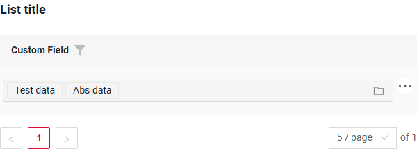
    === "Info widget"
        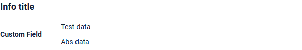
    === "Form widget"
        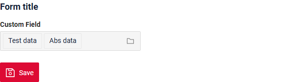

### How to add?
??? Example
    === "Editable"
        **Step1** Add mapping DTO->entity to corresponding **VersionAwareResponseService**.
        ```java
        --8<--
        {{ external_links.github_raw_doc }}/fields/multivaluetree/basic/MyExample3314Service.java:doUpdateEntity
        --8<--
        ```


        **Step2** Add **fields.setEnabled** to corresponding **FieldMetaBuilder**.
        ```java
        --8<--
        {{ external_links.github_raw_doc }}/fields/multivaluetree/basic/MyExample3314Meta.java:buildRowDependentMeta
        --8<--
        ```    
 
        === "List widget"
            **_not applicable_**
        === "Info widget"
            **_not applicable_**
        === "Form widget"
            **Works for Form.**

        [:material-play-circle: Live Sample]({{ external_links.code_samples }}/ui/#/screen/myexample3314){:target="_blank"} ·
        [:fontawesome-brands-github: GitHub]({{ external_links.github_ui }}/{{ external_links.github_branch }}/src/main/java/org/demo/documentation/fields/multivaluetree/basic){:target="_blank"}

    === "Readonly"
    
        **Option 1** Enabled by default.
        ```java
        --8<--
        {{ external_links.github_raw_doc }}/fields/multivaluetree/ro/MyExample3322Meta.java:buildRowDependentMeta
        --8<--
        ```    
 
    
        **Option 2** `Not recommended.` Property fields.setDisabled() overrides the enabled field if you use after property fields.setEnabled.
        === "List widget"
            **_not applicable_**
        === "Info widget"
            **_not applicable_**
        === "Form widget"
            **Works for Form.**

        [:material-play-circle: Live Sample]({{ external_links.code_samples }}/ui/#/screen/myexample3322/view/myexample180form){:target="_blank"} ·
        [:fontawesome-brands-github: GitHub]({{ external_links.github_ui }}/{{ external_links.github_branch }}/src/main/java/org/demo/documentation/fields/multivaluetree/ro){:target="_blank"}

## Filtering
[:material-play-circle: Live Sample]({{ external_links.code_samples }}/ui/#/screen/myexample3318){:target="_blank"} ·
[:fontawesome-brands-github: GitHub]({{ external_links.github_ui }}/{{ external_links.github_branch }}/src/main/java/org/demo/documentation/fields/multivaluetree/filtration){:target="_blank"}

`Filtering` allows you to search data based on criteria. Search uses in operator which compares ids in this case.
### How does it look?
=== "List widget"
    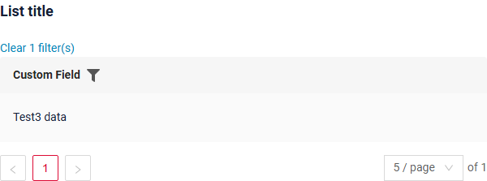
=== "Info widget"
    _not applicable_
=== "Form widget"
    _not applicable_


### How to add?
??? Example
    === "List widget"
        **Step 1** Add **@SearchParameter** to corresponding **DataResponseDTO**. (Advanced customization [SearchParameter](/advancedCustomization/element/searchparameter/searchparameter))
        ```java
        --8<--
        {{ external_links.github_raw_doc }}/fields/multivaluetree/filtration/MyExample3318DTO.java
        --8<--
        ```
      
        **Step 2**  Add **fields.enableFilter** to corresponding **FieldMetaBuilder**.
        ```java
        --8<--
        {{ external_links.github_raw_doc }}/fields/multivaluetree/filtration/MyExample3318Meta.java:buildIndependentMeta
        --8<--
        ```

        **Step 3**  Add popupBcName and assocValueKey to **_.widget.json_**.

        popupBcName - name bc 
        
        assocValueKey - field for opening AssocTreePopup

        ```java
        --8<--
        {{ external_links.github_raw_doc }}/fields/multivaluetree/filtration/MyExample3318List.widget.json
        --8<--
        ```
 
 
    === "Info widget"
        _not applicable_
    === "Form widget"
        _not applicable_

    [:material-play-circle: Live Sample]({{ external_links.code_samples }}/ui/#/screen/myexample3318){:target="_blank"} ·
    [:fontawesome-brands-github: GitHub]({{ external_links.github_ui }}/{{ external_links.github_branch }}/src/main/java/org/demo/documentation/fields/multivaluetree/filtration){:target="_blank"}

## Drilldown
**_not applicable_**

## Validation
`Validation` allows you to check any business rules for user-entered value. There are types of validation:

1) Exception:Displays a message to notify users about technical or business errors.

   `Business Exception`:
   [:material-play-circle: Live Sample]({{ external_links.code_samples }}/ui/#/screen/myexample3325){:target="_blank"} ·
   [:fontawesome-brands-github: GitHub]({{ external_links.github_ui }}/{{ external_links.github_branch }}/src/main/java/org/demo/documentation/fields/multivaluetree/validationbusinessex){:target="_blank"}

   `Runtime Exception`:
   [:material-play-circle: Live Sample]({{ external_links.code_samples }}/ui/#/screen/myexample3328){:target="_blank"} ·
   [:fontawesome-brands-github: GitHub]({{ external_links.github_ui }}/{{ external_links.github_branch }}/src/main/java/org/demo/documentation/fields/multivaluetree/validationruntimeex){:target="_blank"}
   
2) Confirm: Presents a dialog with an optional message, requiring user confirmation or cancellation before proceeding.

   [:material-play-circle: Live Sample]({{ external_links.code_samples }}/ui/#/screen/myexample3326){:target="_blank"} ·
   [:fontawesome-brands-github: GitHub]({{ external_links.github_ui }}/{{ external_links.github_branch }}/src/main/java/org/demo/documentation/fields/multivaluetree/validationconfirm){:target="_blank"}

3) Field level validation: shows error next to all fields, that validation failed for

   `Option 1`:
   [:material-play-circle: Live Sample]({{ external_links.code_samples }}/ui/#/screen/myexample3324){:target="_blank"} ·
   [:fontawesome-brands-github: GitHub]({{ external_links.github_ui }}/{{ external_links.github_branch }}/src/main/java/org/demo/documentation/fields/multivaluetree/validationannotation){:target="_blank"}

   `Option 2`:
   [:material-play-circle: Live Sample]({{ external_links.code_samples }}/ui/#/screen/myexample3327){:target="_blank"} ·
   [:fontawesome-brands-github: GitHub]({{ external_links.github_ui }}/{{ external_links.github_branch }}/src/main/java/org/demo/documentation/fields/multivaluetree/validationdynamic){:target="_blank"}

### How does it look?
=== "List widget"
    === "BusinessException"
        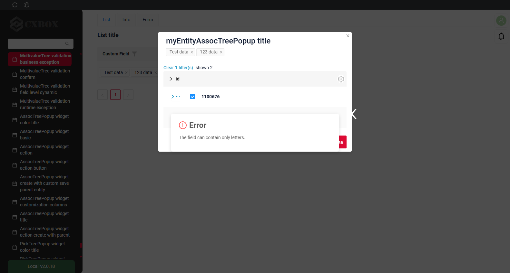
    === "RuntimeException"
        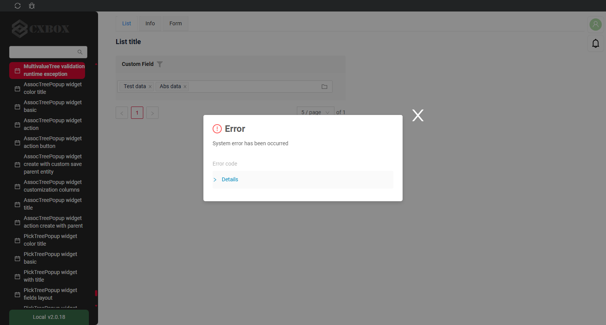
    === "Confirm"
        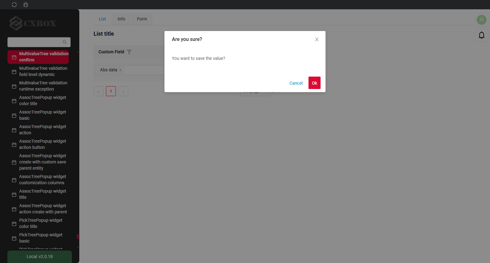
    === "Field level validation"
        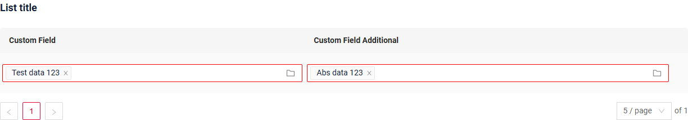
=== "Info widget"
    _not applicable_
=== "Form widget"
    === "BusinessException"
        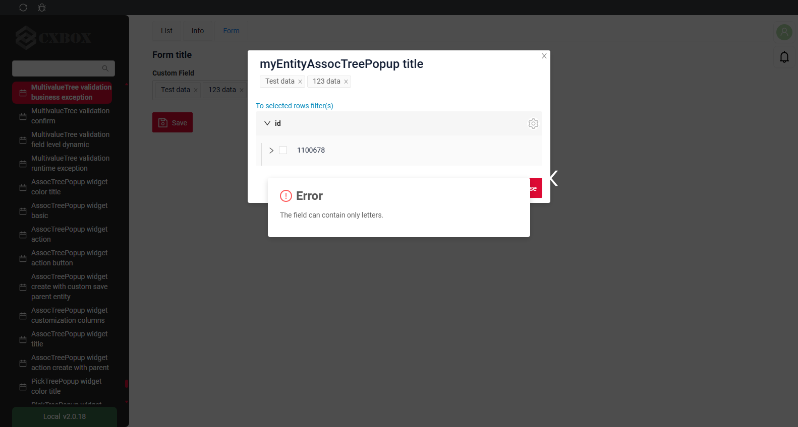
    === "RuntimeException"
        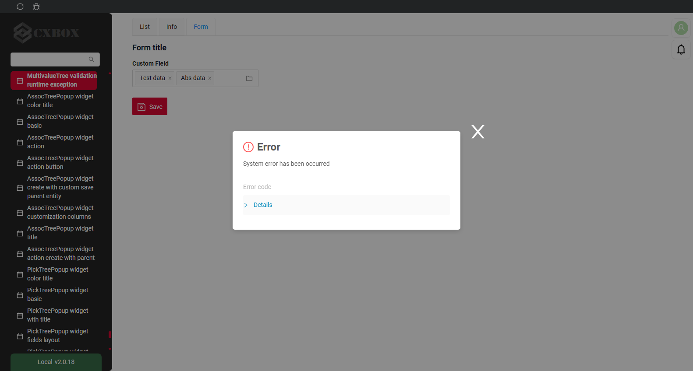
    === "Confirm"
        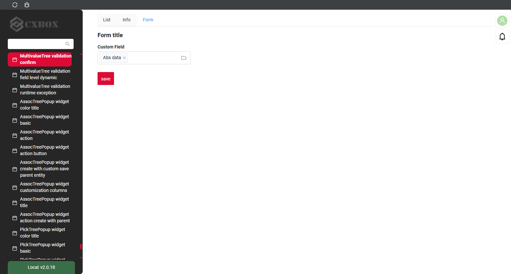
    === "Field level validation"
        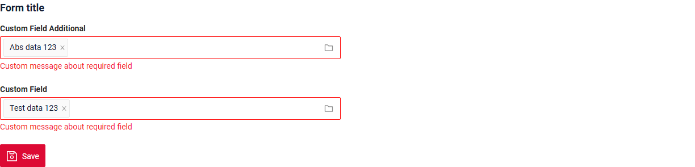
### How to add?
??? Example
    === "BusinessException"

        `BusinessException` describes an error  within a business process.
        
        Add **BusinessException** to corresponding **VersionAwareResponseService**.
        ```java
        --8<--
        {{ external_links.github_raw_doc }}/fields/multivaluetree/validationbusinessex/MyExample3325Service.java:doUpdateEntity
        --8<--
        ```
        
        === "List widget"
            **Works for List.**
        === "Info widget"
            **_not applicable_**
        === "Form widget"
            **Works for Form.**

        [:material-play-circle: Live Sample]({{ external_links.code_samples }}/ui/#/screen/myexample3325){:target="_blank"} ·
        [:fontawesome-brands-github: GitHub]({{ external_links.github_ui }}/{{ external_links.github_branch }}/src/main/java/org/demo/documentation/fields/multivaluetree/validationbusinessex){:target="_blank"}

    === "RuntimeException"

        `RuntimeException` describes technical error  within a business process.
        
        Add **RuntimeException** to corresponding **VersionAwareResponseService**.
        ```java
        --8<--
        {{ external_links.github_raw_doc }}/fields/multivaluetree/validationruntimeex/MyExample3328Service.java:doUpdateEntity
        --8<--
        ```     
 
        === "List widget"
            **Works for List.**
        === "Info widget"
            **_not applicable_**
        === "Form widget"
            **Works for Form.**

        [:material-play-circle: Live Sample]({{ external_links.code_samples }}/ui/#/screen/myexample3328){:target="_blank"} ·
        [:fontawesome-brands-github: GitHub]({{ external_links.github_ui }}/{{ external_links.github_branch }}/src/main/java/org/demo/documentation/fields/multivaluetree/validationruntimeex){:target="_blank"}

    === "Confirm"

        Add [PreAction.confirm](/advancedCustomization_validation) to corresponding **VersionAwareResponseService**.

        ```java
        --8<--
        {{ external_links.github_raw_doc }}/fields/multivaluetree/validationconfirm/MyExample3326Service.java:getActions
        --8<--
        ```
 
        === "List widget"
            **Works for List.**
        === "Info widget"
            **_not applicable_**
        === "Form widget"
            **Works for Form.**

        [:material-play-circle: Live Sample]({{ external_links.code_samples }}/ui/#/screen/myexample3326){:target="_blank"} ·
        [:fontawesome-brands-github: GitHub]({{ external_links.github_ui }}/{{ external_links.github_branch }}/src/main/java/org/demo/documentation/fields/multivaluetree/validationconfirm){:target="_blank"}

    === "Field level validation"
        === "Option 1"
            Add javax.validation to corresponding **DataResponseDTO**.

            Use if:

            Requires a simple fields check (javax validation)
            ```java
            --8<--
            {{ external_links.github_raw_doc }}/fields/multivaluetree/validationannotation/MyEntity3324MultivalueDTO.java
            --8<--
            ```
 
            === "List widget"
                **Works for List.**
            === "Info widget"
                **_not applicable_**
            === "Form widget"
                **Works for Form.**

            [:material-play-circle: Live Sample]({{ external_links.code_samples }}/ui/#/screen/myexample3324){:target="_blank"} ·
            [:fontawesome-brands-github: GitHub]({{ external_links.github_ui }}/{{ external_links.github_branch }}/src/main/java/org/demo/documentation/fields/multivaluetree/validationannotation){:target="_blank"}

        === "Option 2"
            Create сustom service for business logic check.

            Use if:

            Business logic check required for fields

            `Step 1`  Create сustom method for check.
            ```java
            --8<--
            {{ external_links.github_raw_doc }}/fields/multivaluetree/validationdynamic/MyExample3327Service.java:validateFields
            --8<--
            ```
 
            `Step 2` Add сustom method for check to corresponding **VersionAwareResponseService**.
            ```java
            --8<--
            {{ external_links.github_raw_doc }}/fields/multivaluetree/validationdynamic/MyExample3327Service.java:doUpdateEntity
            --8<--
            ```

            [:material-play-circle: Live Sample]({{ external_links.code_samples }}/ui/#/screen/myexample3327){:target="_blank"} ·
            [:fontawesome-brands-github: GitHub]({{ external_links.github_ui }}/{{ external_links.github_branch }}/src/main/java/org/demo/documentation/fields/multivaluetree/validationdynamic){:target="_blank"}

 
## Sorting
**_not applicable_**

## Required
[:material-play-circle: Live Sample]({{ external_links.code_samples }}/ui/#/screen/myexample3321){:target="_blank"} ·
[:fontawesome-brands-github: GitHub]({{ external_links.github_ui }}/{{ external_links.github_branch }}/src/main/java/org/demo/documentation/fields/multivaluetree/required){:target="_blank"}

`Required` allows you to denote, that this field must have a value provided. 

### How does it look?
=== "List widget"
    _not applicable_
=== "Info widget"
    _not applicable_
=== "Form widget"
    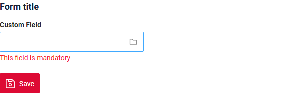
### How to add?
??? Example
    Add **fields.setRequired** to corresponding **FieldMetaBuilder**.

    ```java
    --8<--
    {{ external_links.github_raw_doc }}/fields/multivaluetree/required/MyExample3321Meta.java:buildRowDependentMeta
    --8<--
    ```
 
    === "List widget"
        **_not applicable_**
    === "Info widget"
        **_not applicable_**
    === "Form widget"
        **Works for Form.**

    [:material-play-circle: Live Sample]({{ external_links.code_samples }}/ui/#/screen/myexample3321){:target="_blank"} ·
    [:fontawesome-brands-github: GitHub]({{ external_links.github_ui }}/{{ external_links.github_branch }}/src/main/java/org/demo/documentation/fields/multivaluetree/required){:target="_blank"}

## Additional properties
### <a id="Primary">Primary</a>
Not supported for `multivalueTree`: the `options.primary` setting of the popup is available only for [AssocListPopup](/widget/type/assoclistpopup/assoclistpopup/#primary).

### <a id="SelectionModes">Selection modes</a>
[:material-play-circle: Live Sample]({{ external_links.code_samples }}/ui/#/screen/myexample3261/view/myexample3261list){:target="_blank"} ·
[:fontawesome-brands-github: GitHub]({{ external_links.github_ui }}/{{ external_links.github_branch }}/src/main/java/org/demo/documentation/widgets/tree/base/inner){:target="_blank"}

What the user selects explicitly in the popup is exactly what is sent to the backend.

* If the user picks separate records, those record ids are sent.
* If the user picks a whole group (node), the id of the group is sent, and its children become dimmed - they are covered by the selected group and are not sent separately.
* A selection like "the whole group minus N records" cannot be expressed: either the group is selected, or the required records are selected one by one.

Which rows may be selected at all - nodes, leaves or both - is defined by the `options.tree.selection` property of the popup widget, see [Selection modes](/widget/type/assoctreepopup/assoctreepopup/#selectionmodes).

#### How does it look?
=== "List widget"
    _not applicable_
=== "Info widget"
    _not applicable_
=== "Form widget"
    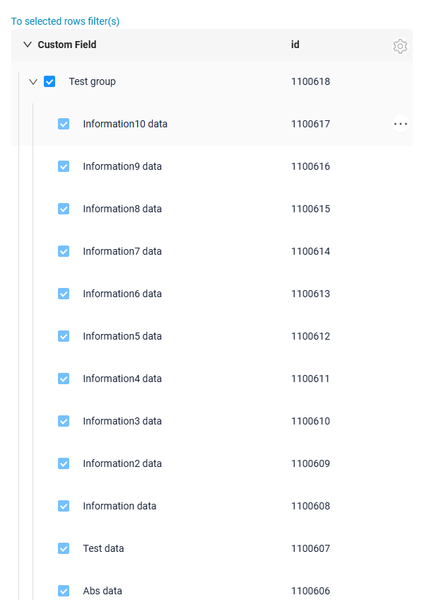

#### How to add?
??? Example
    === "List widget"
        **_not applicable_**
    === "Info widget"
        **_not applicable_**
    === "Form widget"
        Add **tree.selection** to corresponding Assoc **.widget.json**.
        ```json
        --8<--
        {{ external_links.github_raw_doc }}/widgets/tree/base/inner/myexample3261AssocTreePopup.widget.json
        --8<--
        ```

    [:material-play-circle: Live Sample]({{ external_links.code_samples }}/ui/#/screen/myexample3261/view/myexample3261list){:target="_blank"} ·
    [:fontawesome-brands-github: GitHub]({{ external_links.github_ui }}/{{ external_links.github_branch }}/src/main/java/org/demo/documentation/widgets/tree/base/inner){:target="_blank"}
